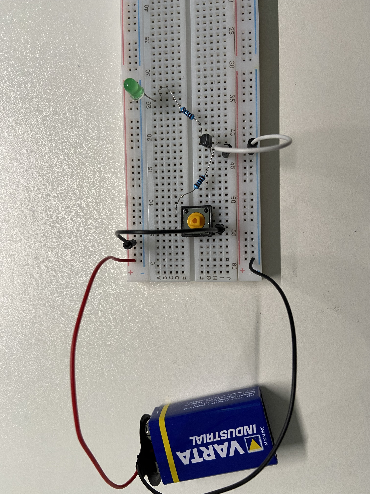
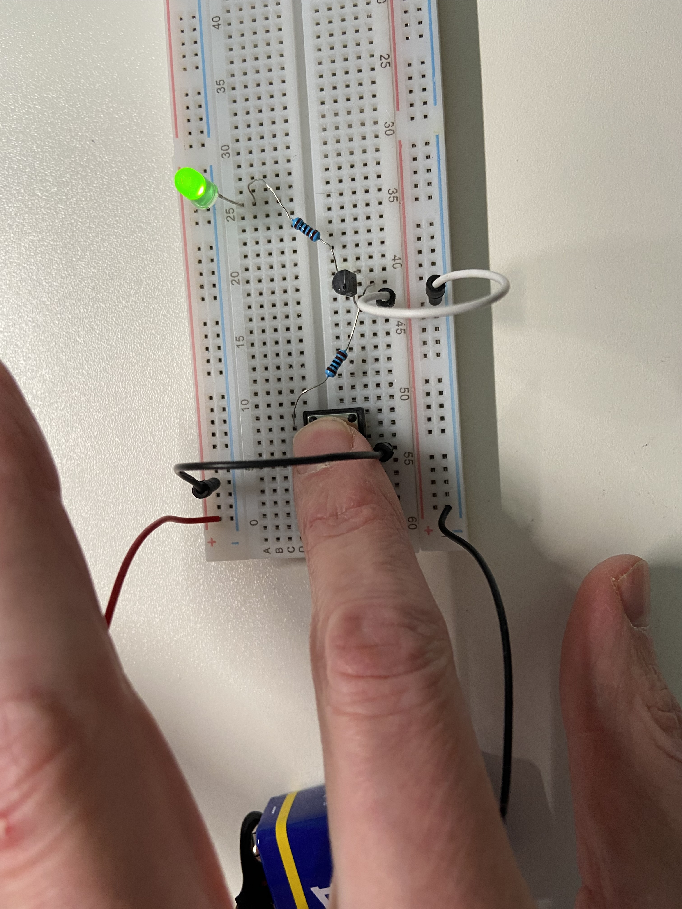
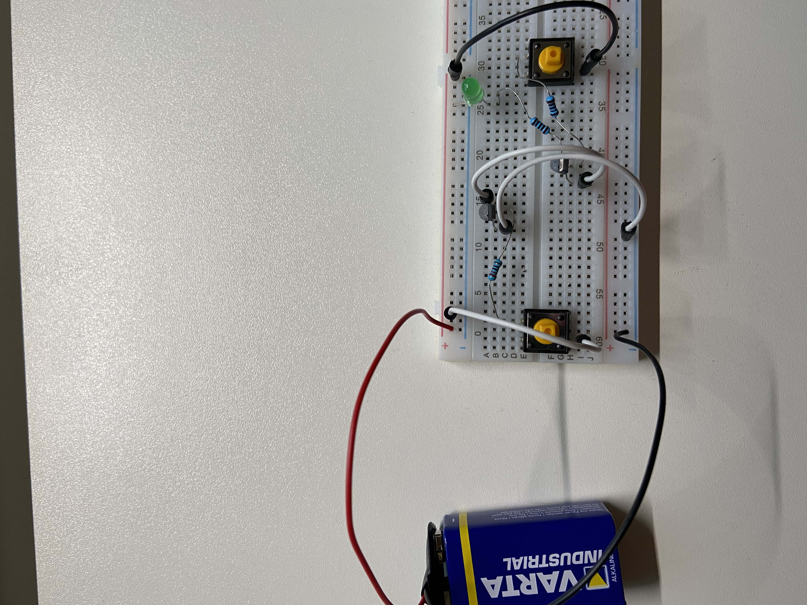
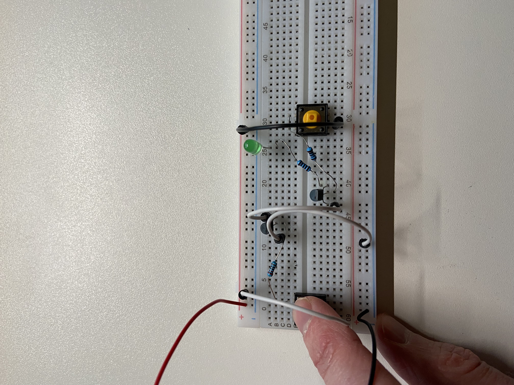
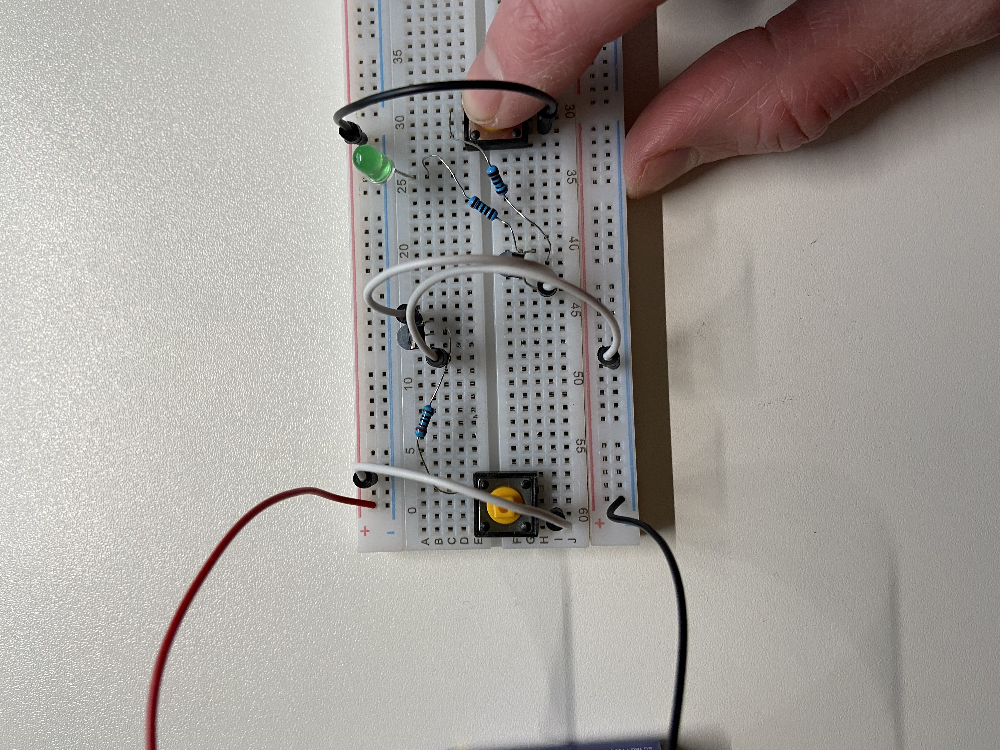
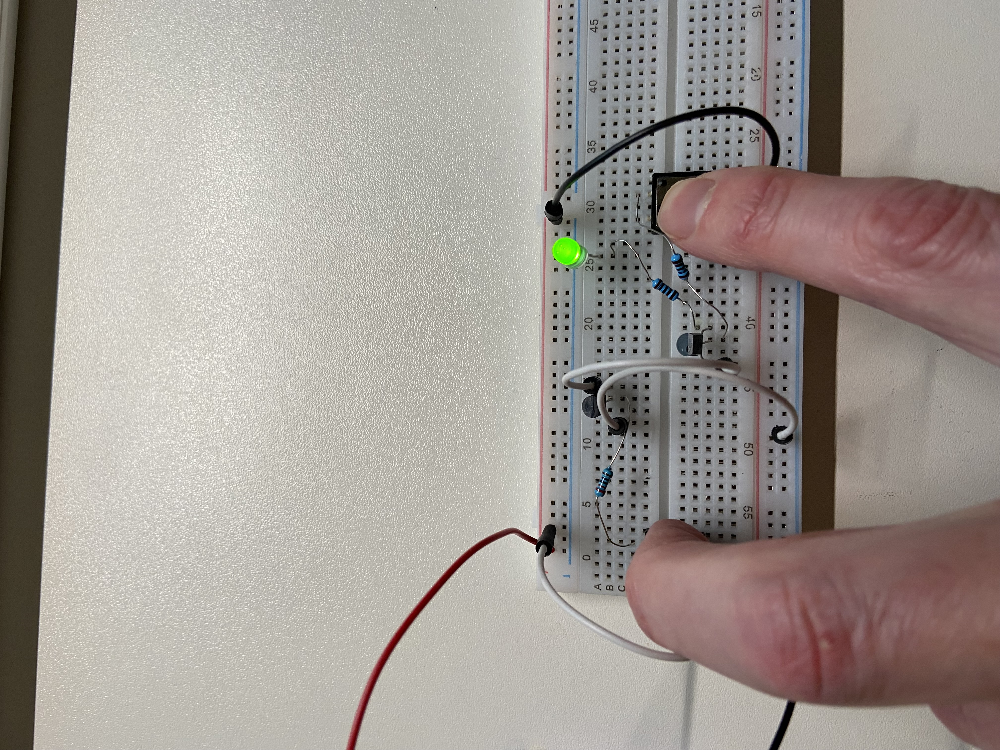
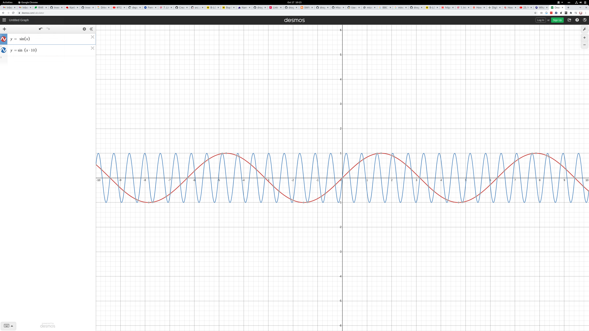

### Learning IoT
The sole purpose of this repository is to store notes and code helping me
learn things related to Internet of Things, but also basic electronics.

### Contents
1. [ESP8266](./doc/esp8266.md)
1. [Microbit v2.0](./doc/microbit.md)


### Microcontroller Unit (MCU)
Is a very small computer system self contained on an integrated circuit (IC).
They normally don't have any external data storage available so everything has
to be able to be stored in memory (or perhaps sent off somewhere to be stored
elsewhere).

Is what actually runs our code. It looks like a small black box and has a
number of small metal pins around it. The pins are connected to tracers that
are like wires connecting components on the board.

### Analog-to-digital conversion (ADC)
Microcontrollers convert analog values (continuous) that arrive on inputs (pins)
into to digital values (descrete) to be processed.


### ARM (Advanced RISC Machines/Acorn RISC Machines)
ARM holding is the company behind Arm based chips do not manufacture chips
but instread they design parts of the chip and they license these designs to
hardware manufactures that use them in their products (sometimes enhancing
them). In contrast Intel both design chips and manufacture them.

Arm has a number of families of chip designs. For example there is the Cortex-M
family which are mostly used in microcontrollers.

Cortex-M0 is designed for low cost/power usage.
Cortex-M4 is a middle ground more features/performance than M0 but less
expensive then M7.

Cortex-M7 is higher cost but has more features and better performance.
Some additional information about Arm version can be found
[here](https://github.com/danbev/learning-assembly/tree/master/arm#arm-versions).


### Controller Area Network (CAN)
TODO:


### Real Time Operating Systems (RTOS)
TODO:

### Serial communication
Is the process of transmitting one bit of data at a time. Thing of this as being
one wire and the bits flow through it.
Only requires one wire which is one reason at it is used often in
microcontroller system design.

Would require only two wires:
```
  +---------+ b0 b1 b2 b3 b4 b5 b6 b7     +---------+
  |      OUT|-----------------------------|IN       |
  |         | p1 p2 p3 p4 p5 p6 p7 p8     |         |
  |      CLK|-----------------------------|CLK      |
  +---------+                             +---------+

p = puls of the clock
```
So this would send one bit per plus of the clock.

### Parallel communication
Is the process of transmitting multiple bits of data at one time. Think of this
as muliple wires connected to the other side and multiple bits can be set and
transmitted at once.
Since it requires more wires it can be more expensive to implement.
Crosstalk is an issue and it is susceptible to clock skew.
```
  +---------+                             +---------+
  |     OUT0|-------------b0--------------|IN0      |
  |     OUT1|-------------b1--------------|IN1      |
  |     OUT2|-------------b2--------------|IN2      |
  |     OUT3|-------------b3--------------|IN3      |
  |     OUT4|-------------b4--------------|IN4      |
  |     OUT5|-------------b5--------------|IN5      |
  |     OUT6|-------------b6--------------|IN6      |
  |     OUT7|-------------b7--------------|IN7      |
            |             p1              |
  |      CLK|-----------------------------|CLK      |
  +---------+                             +---------+

p = puls of the clock
```
So this would send 8 bit per plus of the clock.

### Synchronous transmission
It's called synchronous because the sender and reciever are synchronized. They
both have a clock which use the same rate.

A clock in this case is something that changes between two values, like high/low
or something like that. The sender might send only when the clock is high for
example. This is not much of a problem if both sender and reciever share the
same clock, if they are part of the same circuit for example, but if they are
not it might be difficult as they need someway of sharing the clock.

Fast transmission (when is has been sent).
May have to wait until data can be sent.

Examples are SPI, and I²C.

### Asynchronous transmission
This type of communication is not synced, but instead it uses a start bit and
and stop bit
```
           start bit    stop bit
               ↓ [ data ]       ↓
    +--------+ 0 11101001 1       +--------+
    | Sender | -----------------> |Reciever|
    +--------+                    +--------+
```
The extra processing of the start/stop bit can affect performance making
asynchronous slower. 
Is cheap and easy to implement (no clock sharing).
Can transmit whenever it is ready (does not have to wait for the clock).


### Clock
Is a signal that repeats/oscillates between high and low states:
```      ____   ____  ____
high 1   |   |  |  |  |  |
         |   |  |  |  |  |    
low  0----   ----  ----  ----  ...
```
So it starts out at zero, changes to 1 for the same amount of time and then
repeats like this. The clock tells us when the receiver should read from the
data line. We might say that it should receive when the clock is high but notice
that the line can be hight for a certain period of time. Instead we say that it
should read when transitioning from low to high, and this point is called an 
edge:
```      ____   ____  ____
high 1   |   |  |  |  |  |
         |   |  |  |  |  |    
low  0----   ----  ----  ----  ...
         ^   ^
raising edge +-- fallin edge
     (from low   (from high
      to high)    to low)
```
This is a single point instead of a region.

So lets say we want to send 5 (101). First we have to let the receiver know that
we are going to send by setting a wire to high which is sometimes called slave
select (SS_bar). After this is done we can send bits to the receiver:
```
    Sender                   Receiver
             -
             |
             |
    CLK    --*             > CLK

101 SOUT   --1-------------> RIN  1
```
So above when the first raising edge is encountered, remember that the sender
and receiver share the same clock line so the receiver also knows when this
happens. When this happens SOUT will become high for the binary digit 1 to be
sent. This can then be read by the reciever from RIN above and placed into
a buffer. The next time there is a raising edge encountered (clock tick) another
bit will be placed in SOUT:
```
    Sender                   Receiver
             ----  -
             |  |  |
             |  |  |
    CLK   ----  ---*       > CLK

10  SOUT   --------0-------> RIN  10
```
And so on:
```
    Sender                   Receiver
             ----  ----
             |  |  |  |
             |  |  |  |
    CLK   ----  ----  ---* > CLK

10  SOUT   --------------1-> RIN  101
```
I'm not 100% sure about the above but that is my understanding so far. I'm
still waiting for a real device to try this out and verify.

### Serial Peripheral Interface (SPI) 
Is a synchronous serial communication spec developed by Motorola (1980s) and
used for communicating between microcontrollers and small peripheral devices.
Note that this is a defacto standard but there is no official standard for this
protocol.

```
   +-----------------+           +-----------------+
   | SPI         SCLK|-------+-->|SCLK   SPI       |
   | Controller  COPI|------+--->|COPI   Peripheral|
   |             CIPO|<----+-----|CIPO             |
   |           SS_bar|---------->|SS_bar           |
   +-----------------+     |||   +-----------------+
                 ^         |||
                 |         |||   +-----------------+
                 |         ||+-->|SCLK   SPI       |
                 |         |+--->|COPI   Peripheral|
                 |         +-----|CIPO             |
                 +-------------->|SS_bar           |
                                 +-----------------+

SCLK = SPI Clock
CIPO = Controller Input Peripheral Output
COPI = Controller Output Peripheral Input
SS   = Slave Select (to select among mulitiple connected slaves like above) 
```
* Full Duplex
* Synchronous (it uses the clock to sync)
* 4+ wires (with multiple slaves there will be more than 4 wires)
* 25 Mbps
* No ack
* Low power consumption
* 20 cm distances

### Universal Asynchonous Receiver/Transmitter (UART)
UART is not a communications protocol like SPI and I2C but instead a physical
component/circuit in a microcontroller or a standalone integrated circuit. The
standard it implements is RS-232 protocol.
It is main purpose is to send and receive serial data.

An UART can look something like the following:
```
  Data bus	 +------------+           +------------+      Data bus      
	    ---->|D0  P|S     |           |    P|S   D0|---->
            ---->|D1  A|E     |           |    A|E   D1|---->
            ---->|D2  R|R     |           |    R|R   D2|---->
            ---->|D3  A|I   RX|<----------|TX  A|A   D3|---->
            ---->|D4  L|A   TX|---------->|RX  L|L   D4|---->
            ---->|D5  L|L     |           |    L|    D5|---->
            ---->|D6  E|      |           |    E|    D6|---->
            ---->|D7  L|      |           |    L|    D7|---->
		 |     |      |           |     |      |
		-|R/W  |      |           |     |   R/W|
		-|CLK  |      |           |     |   CLK|
		-|INT  |      |           |     |   INT|
		 +------------+           +------------+
```

An packet on the serial wire (TX->RX) will looks something like this:
```
   +-+ +-+-+-+-+-+ +--+  +--+
   |S| | | | | | | |P |  |ST|
   +-+ +-+-+-+-+-+ +--+  +--+
  Start    Data   Parity Stop
```
The transimission line (TX) is usually held at a high voltage when not
trasmitting. To start sending the trasmitting UART will pull the TX line from
high to low for one clock cycle. When the receiving (RX) UART see this it will
begin reading the bits in the dataframe at the frequency of the baud rate.
Notice that the sender will get the data to be sent from the data bus, and
likewise the reciever will place the received data on the data bus.

So there are only two wires which is a nice property. And there is not clock
signal required between two UARTs. There is also parity checking which is
good for reliable communication.
One thing to note is that the data being sent can be a maxium of 9 bits. 
The is not way to support multiple peripherals.


### Inter Integrated Circuit (I²C)
Only requires two pins.
```
   +------------------+           +-----------------+
   | Controller    SCL|-----------|SCL  Peripheral  |
   |               SDA|-----------|SDA              |
   +------------------+           +-----------------+
 
SCL = Serial Clock Line for the clock signal
SDA = Serial Data line for sending and recieving data
```
So we have the usage of a clock so this is a synchronous protocol like SPI.

Data is transported in messages which have a specific format and an address
is used to identify the destination peripheral:
```
   +-+-+-+-+-+-+-+ +---+ +---+  +-+-+-+-+-+-+-+-+
   | | | | | | | | |R/W| |ACK|  | | | | | | | | |
   +-+-+-+-+-+-+-+ +---+ +---+  +-+-+-+-+-+-+-+-+
    Address Frame                      Data Frame
    (7 or 10 bits)                     (8 bits)
```
Communication starts by the SDA (the data line) switches form high voltage
to low. This is done before the SCL also switches from high to low.

At the end the sending the SDA will switch from low voltage level to high
`after` the SCL line switches from low to high.

In SPI we had a peripheral select wire (SS) which selected the peripheral we
want to talk to. Instread in I2C each peripheral has an address. This is
contained in the address frame which is always first frame after the start bit
has been set. The controller send this message frame onto the SDA which all
peripherals connected will see. Each peripheral will compare this to their
address and do nothing if the address does not match. If the addresses match
that peripheral sends a low voltage ACK bit back to the controller.

The READ/WRITE bit indicates if the controller wants to send or recieve data
from the peripheral. If it wants to send then this bit is low (0) and if it
wants to read it will be a high voltage.

### Current
Is the flow of free electrons

### Concuctors
Take a conductor like a coppar wire which is good at allowing a current to flow
through it. Now, coppar is made up on coppar atoms which like all atoms contain
protons, neutrons, and electrons:
```
Cu
Protons: 29
Neutrons: 35
Electrons: 29
           Shell 1: 2 electrons
           Shell 2: 8 electrons
           Shell 3: 18 electrons
           Shell 4: 1 electrons (free electron)
```
A coppar wire without any current flowing will have electrons randomly moving
from atom to atom but this is not in any perticular direction. If an electron
moves away from its atom that would leave the atom slightly positively charged
and that would attract an electron. How does the electron leave the atom, this
is a little unclear to me. One thing I've read is that it is actually the atom
that overlap the volume of other atoms and exchange the free atom. So there
does not need to be any energy to cause the electron to move. But I've also read
that this could be influence of room-temprature heat energy.

So we have the sea of electrons that are
moving around randomly. Now, if we connect a cell that contains one end with
negative electrons and the otherside with atoms what are positivly charged (
would attract electrons) the electrons will move towards the positiv end.

The conduction band is the band above the valence band. 
```
----------------------- 
                        Conduction band
-----------------------
                        Band gap
-----------------------
                        Valance band 
-----------------------
        ...
----------------------- Electron shell n-1
```
For electrons to be able to move to an outer shell energy needs to be applied.
For conductors the conduction band and the valance band/band gap/conduction band
overlap allowing the free electrons to move in this space. But for insulators
there is a clear band gap and energy is required for this to happen (that is
if there are free electrons in the valance shell), if we are thinking of atoms
where no energy is applied to it.

Bond:
When an atom bonds with another they can share electrons in their valence shell,
this type of bond is called covalent bond.

Take two silicon atoms for example, they would share a pair of electrons:
```
   *     *                * = electron in valance shell
                         ** = paired electrons
*  Si ** Si *

   *      *
```
Many silicon atoms that are bonded like this will allow for each Si atom to be
connected though sharing four electrons:

This is something that can be seen in silicon where each silicon atom is
connected to four other silicon atoms. 

If a conductor (metal) is heated it becomes less conductive. So metals conduct
electricity better at colder temperatures.

### Band theory
```
Energy
 ^
 |                                           +--------------+
 |                                           | Conduction   |
 |                       +--------------+    |              |
 |                       | Conduction   |    +--------------+
 |   +--------------+    |              |
     | Conduction   |    +--------------+
     |--------------|
     |--------------|    +--------------+    +--------------+
     | Valancy      |    | Valancy      |    | Valancy      |
     +--------------+    +--------------+    +--------------+
     Conductors          Semiconductors      Insulators
```
Notice that for conductors the conduction band and the valancy band overlap
which is why the conduct so well. 
For semiconductors there is a gap between these two bands so energy is needed
for electrons to move into the conduction band. This is possible with heat.


### Insulators
High reisistance to the flow of electricity, which means that their valance
shell is full and 


### Semi-conductors
These have properties that are in between conductors and insulators, hence the
name semi-conductors. If a semi-conductor is exposed to head this can improve it
conductivity. But there is another way to improve the conducitivty of a semi-
conductor which is to add impurities to it (called doping).

If we take a look at a silicon cristal:
```
                                          [* *] = covalent bond
 Si  [* *]  Si  [* *]  Si  [* *]

 ⌈*⌉       ⌈*⌉         ⌈*⌉
 ⌊*⌋       ⌊*⌋         ⌊*⌋
       
 Si  [* *]  Si  [* *]  Si  [* *]

 ⌈*⌉       ⌈*⌉         ⌈*⌉
 ⌊*⌋       ⌊*⌋         ⌊*⌋

 Si  [* *]  Si  [* *]  Si  [* *]
```
So we can see that we have these covelent bounds between the atoms and all of
the free electrons in the valance shell are bound. There are not free electrons
of "holes".

If we replace on of these atoms will an atom with only 5 electrons (like fosfor)
in its valance shell what would happen:
```
                                          [* *] = covalent bond
 Si  [* *]  Si  [* *]  Si  [* *]

 ⌈*⌉       ⌈*⌉         ⌈*⌉
 ⌊*⌋       ⌊*⌋         ⌊*⌋
                 *<-------------------- free electron
 Si  [* *]  P  [* *]  Si  [* *]

 ⌈*⌉       ⌈*⌉         ⌈*⌉
 ⌊*⌋       ⌊*⌋         ⌊*⌋

 Si  [* *]  Si  [* *]  Si  [* *]
```
It can still bound with the other 3 atoms around it but also has an additional
electron left over. This free electron can now move in the conduction band. This
makes this silicon cristal more conductive then before. Because we have a free
electron by this process and electrons are negatively charged this is called
an n-type conductor now.
So that is one way we can increase the connectivity of silicon. But how about
replacing an atom with something that only has 3 electrons in its valance shell:

So if we hook up a battery to this the free electron will be attracted to the
positive terminal and the electrons from the negative terminal will be able
to move in their place through the material (in/through the conduction band):
```
                                          
     Si  [* *]  Si  [* *]  Si  [* *]

     ⌈*⌉       ⌈*⌉         ⌈*⌉
     ⌊*⌋       ⌊*⌋         ⌊*⌋
                 *
+--- Si  [* *]  P  [* *]  Si  [* *] <-----------+
|                                               |
|    ⌈*⌉       ⌈*⌉         ⌈*⌉                  |
|    ⌊*⌋       ⌊*⌋         ⌊*⌋                  |
|                                               |
|    Si  [* *]  Si  [* *]  Si  [* *]            |
|                                               |
|                 |                             |
|                 ||                            |
+-------------> + || - -------------------------+
                  |
```
It can still bound with the other 3 atoms around it but also has an additional

So lets try with alunminum (Ai):
```
                                          [* *] = covalent bond
 Si  [* *]  Si  [* *]  Si  [* *]

 ⌈*⌉       ⌈*⌉         ⌈*⌉
 ⌊*⌋       ⌊*⌋         ⌊*⌋
                 
 Si  [* *]  Ai  x  *  Si  [* *]

 ⌈*⌉       ⌈*⌉         ⌈*⌉
 ⌊*⌋       ⌊*⌋         ⌊*⌋

 Si  [* *]  Si  [* *]  Si  [* *]
```
Notice that we have a missing electron so thre is no covalent bond between the
Ai atom the Ai atom to the right. This is called a p-type semi-conductor. This
also conducts electricity better than pure silicon so the conductivity goes up.

In the case of N-type we know that the electrons are free to flow in the
conduction band. This is not what happens for P-type, instead the electrons flow
in the valance band, so if we apply a current electrons will be attracted to
the positive terminal, hence they will move to holes:
```
     Si  [* *]  Si  [* *]  Si  [* *]

     ⌈*⌉       ⌈*⌉         ⌈*⌉
     ⌊*⌋       ⌊*⌋         ⌊*⌋
                 *
+--- Ai  x *   Si  [* *]   Si  [* *] <-----------+
|                                                |
|    ⌈*⌉       ⌈*⌉         ⌈*⌉                   |
|    ⌊*⌋       ⌊*⌋         ⌊*⌋                   |
|                                                |
|    Si  [* *]  Si  [* *]  Si  [* *]             |
|                                                |
|                 |                              |
|                 ||                             |
+-------------- + || - <-------------------------+
                  |
```
The holes are what allow electrons to flow and this happens in the valance band
as opposed to n-type doping where the flow happens in the conduction band.
With a batteri cell attached the electrons will be attracted to the positive
terminal. There for electrons will fill the holes:
```
 x  o  x  x  x
     <-
 x  x  o  x  x
        <-
 x  x  x  o  x
           <-
 x  x  x  x  o
```
Now, what I think will  happen is that one electron will "leave" and and one
will enter:
```
x <- o  x  x  x  o <-x
     o  x  x  x  x 
```
And once again the process of the electrons filling the holes will continue and
a electrons will be transferred/conducted accross the valance band.

Now, lets see what happens if we combine a p-type and an n-type:
```
                                          [* *] = covalent bond
                                              x = hole
                                              * = free electron
         P-type                          N-type

 Si  [* *]  Si  [* *]  Si    |  |  Si  [* *]  Si  [* *]  Si  [* *]
                             |  |
 ⌈*⌉       ⌈*⌉         ⌈*⌉   |  |  ⌈*⌉       ⌈*⌉         ⌈*⌉
 ⌊*⌋       ⌊*⌋         ⌊*⌋   |  |  ⌊*⌋       ⌊*⌋         ⌊*⌋
                             |  |                *
                             |  |                 
 Si  [* *]  Ai  x  *  Si     |  |  Si  [* *]  P  [* *]   Si  [* *]
                             |  |
 ⌈*⌉       ⌈*⌉         ⌈*⌉   |  |  ⌈*⌉       ⌈*⌉         ⌈*⌉
 ⌊*⌋       ⌊*⌋         ⌊*⌋   |  |  ⌊*⌋       ⌊*⌋         ⌊*⌋
                             |  |
 Si  [* *]  Si  [* *]  Si    |  |   Si  [* *]  Si  [* *]  Si  [* *]
```
The free electron would be attracted to fill the hole 
```
 Si  [* *]  Si  [* *]  Si    |  |  Si  [* *]  Si  [* *]  Si  [* *]
                             |  |
 ⌈*⌉       ⌈*⌉         ⌈*⌉   |  |  ⌈*⌉       ⌈*⌉         ⌈*⌉
 ⌊*⌋       ⌊*⌋         ⌊*⌋   |  |  ⌊*⌋       ⌊*⌋         ⌊*⌋
                +-------------------------------- * 
                ↓            |  |
 Si  [* *]  Ai  x  *  Si     |  |  Si  [* *]  P  [* *]   Si  [* *]
                             |  |
 ⌈*⌉       ⌈*⌉         ⌈*⌉   |  |  ⌈*⌉       ⌈*⌉         ⌈*⌉
 ⌊*⌋       ⌊*⌋         ⌊*⌋   |  |  ⌊*⌋       ⌊*⌋         ⌊*⌋
                             |  |
 Si  [* *]  Si  [* *]  Si    |  |   Si  [* *]  Si  [* *]  Si  [* *]
```
One thing that I was missing is that even though there is an extra electron,
the Ai has an additional proton (remember that atoms have the same number of
proton and electrons) so that side is neutral, both sides are to begin with.

And a hole can also move to the n-type side. This will create an area between
these two where there are now extra electrons, or any extra holes, so there
are now charge carriers in this region. This region is called the depletion
region and it like an insulator.
```
                Depletion Region
            N          ↓       P
      +----------------+---------------+
      | * * ** *** * * |  o o oo ooo   |
      | ** * **  * * * | o o o o o  oo |
      | * * ** *** *   |o o o o        |
      | * * ** *** *   |  o   o  o  o o|
      +----------------+---------------+
               Depletion Region
            N          ↓       P
      +--------------+----+-------------+
      | * * ** *** * | Si |o o oo ooo   |
      | ** * **  * * | Si | o o o o  oo |
      | * * ** *** * | Si |o o o        |
      | * * ** *** * | Si |o   o  o  o o|
      +--------------+----+-------------+
```

Now if we hook up a power source we will not get a current flowing initially as
the depletion region prevents the flow. But if the batteri has enough voltage,
like > 0.7v this will overcome the.
```
               Depletion Region
            N          ↓        P
      +--------------+----+-------------+
      | * * ** *** * | Si |o o oo ooo   |
 +--> | ** * **  * * | Si | o o o o  oo |---------+
 |    | * * ** *** * | Si |o o o        |         |
 |    | * * ** *** * | Si |o   o  o  o o|         |
 |    +--------------+----+-------------+         |
 |                                                |
 |                   |                            |
 |              -  | | +                          |
 +-----------------| |<---------------------------+
                   | | 
                     |
```
Electrons will enter the n-region and there will be more electrons in that
region. There will also be electrons (remember there are holes but there are
also electrons in this region. Those electrons will be attracted to the positive
terminal and will exit leaving more holes behind. If the batteri has a voltage
> 0.7 the depletion region will collapse and current can flow.

Now lets hook this up the other way, where the negative terminal is connected
to the p-type region, and the positive terminal to the n-type region:
```
               Depletion Region
            N          ↓        P
      +--------------+----+-------------+
      | * * ** *** * | Si |o o oo ooo   |
 +----| ** * **  * * | Si | o o o o  oo |<--------+
 |    | * * ** *** * | Si |o o o        |         |
 |    | * * ** *** * | Si |o   o  o  o o|         |
 |    +--------------+----+-------------+         |
 |                                                |
 |                 |                              |
 |              +  | | -                          |
 +---------------->| |----------------------------+
                   | | 
                   | 
```
In this case the electrons will fill the holes in the p-region, and electrons
will leave the n-region, causing the depletion region to become larger:
```
               Depletion Region
            N         ↓           P
      +---------------------------------+
      | * * ** **|    Si    |o oo ooo   |
 +----| ** * **  |    Si    | o o o  oo |<--------+
 |    | * * ** * |    Si    |o o        |         |
 |    | * * ** * |    Si    |  o  o  o o|         |
 |    +--------------+----+-------------+         |
 |                                                |
 |                 |                              |
 |              +  | | -                          |
 +---------------->| |----------------------------+
                   | | 
                   | 
```
As the depletion region becomes larger meaning that there are no charge carriers
in this region this component will act like an insulator. So no current will
flow.

If we stick an n-type region next to a p-type and then another n-type we get
the following:
```
                    Depletion Regions
                     |          |
            N        ↓    P     ↓     N
      +-------------+-+--------+-+----------+
      | * * ** *** *| |o o oo o| |* * * * * |
      | ** * **  *  | | o o o o| |  * *  ** |
      | * * ** ***  | |o o o   | | *   * *  |
      | * * ** *** *| |o   o  o| |  * * * * |
      +-------------+-+--------+-+----------+
```
And say we want a current to flow through this thing:
```
                    Depletion Regions
                     |          |
            N        ↓    P     ↓     N
      +-------------+-+--------+-+----------+
      | * * ** *** *| |o o oo o| |* * * * * |
 +--->| ** * **  *  | | o o o o| |  * *  ** |-----+
 |    | * * ** **   | |o o o   | | *   * *  |     |
 |    | * * ** ** * | |o   o  o| |  * * * * |     |
 |    +-------------+-+--------+-+----------+     |
 |                                                |
 |                                                |
 |                                                |
 |                                                |
 |                   |                            |
 |              -  | | +                          |
 +-----------------| |<---------------------------+
                   | | 
                     |
```
Well this will increase number of electrons in the left-most n-type region,
and some electrons will leave the right-most n-type region but there will not
be a current flowing. 

Lets try looking up a second power source like this:
```
                    Depletion Regions
                     |          |
            N        ↓    P     ↓     N
      +-------------+-+--------+-+----------+
      | * * ** *** *| |o o oo -| |+ * * * * |
 +--->| ** * **  *  | | o o o -| |+ * *  ** |-----+
 |    | * * ** **   | |o o o  -| |+*   * *  |     |
 | +--| * * ** **  *| |o   o  -| |+ * * * * |     |
 | |  +-------------+-+--------+-+----------+     |
 | |                 |     |                      |
 | |             - | | +   |                      |
 | +---------------| |-----+                      |
 |                 | | >0.7v                      |
 |                   |                            |
 |                                                |
 |                   |                            |
 |              -  | | +                          |
 +-----------------| |<---------------------------+
                   | | 
                     |
```
Notice that this extra connection between the left-most n-type and the p-type
is the same as we hade above where we saw that current would flow through that
connetion.
Now, we have electrons entering from both battries. When they make these types
of components the first n-type region is very heavyly doped. So once this
second current starts flowing, those extra electrons can now also move through
into the p-type region. Some of these electrons are going to fill in holes in
the p-type region, and some are also going to be attracted to the outgoing plus
terminal of the p-type region. The base is very thin (how they are manufactured)
and these holes are physically close to the left-most n-type's electrons. That
depletion region was created when electrons left the n-type into the depletion
region which caused the n-type region to become positivley charged (remember
that the number of electrons and protons match up when neutral and removing a
electron will make the atom postitive). And those electrions that move into
depletion region cause the p-type region to become negatively charged.
The electrons that have now started flowing through the p-type region will be
attracted to the positive right-most n-type region and therefor be able to
flow through it towards the positive terminal output.

This component is called an NPN bipolar junction transistor:
```
        Emitter(N)      Base(P)  Collector(N)
      +-------------+-+--------+-+----------+
      | * * ** *** *| |o o oo -| |+ * * * * |
 +--->| ** * **  *  | | o o o -| |+ * *  ** |-----+
 |    | * * ** **   | |o o o  -| |+*   * *  |     |
 | +--| * * ** **  *| |o   o  -| |+ * * * * |     |
 | |  +-------------+-+--------+-+----------+     |
 | |                 |     |                      |
 | |             - | | +   |                      |
 | +---------------| |-----+                      |
 |                 | | >0.7v                      |
 |                   |                            |
 |                                                |
 |                   |                            |
 |              -  | | +                          |
 +-----------------| |<---------------------------+
                   | | 
                     |
```
Alright, so that was the theory now lets see how we can create a circuit
with such an NPN transistor:

For this example I used as button switch which is connected to the base of the
transistor:



So with out a current flowing through the base and the emitter there is no
current flowing though the transistor. Pressing the button will cause a current
to flow:




So that is how a NPN Bipolar Junction transistor works and how we can hook it
up physically. We can use two such transistors:



Now, pressing just the left button no current will flow:


And, pressing just the right button no current will flow:


But pressing both and current will flow:


Notice that what we have created here is a AND gate:
```
Left button | Right button   LED
          0 | 0              0 (Off)
          1 | 0              0 (Off)
          0 | 1              0 (Off)
          1 | 1              1 (On)
```


Before any movement has occured we have the following Formal Charge for P
```
     ⌈*⌉
     ⌊*⌋ *
[* *] P [* *]
     ⌈*⌉
     ⌊*⌋

Bounds: 4
FC = valance electrons - (Bonds + dots)
   =                 5 - (4+1) 
   = 0               
```
And for Ai:
```

     ⌈*⌉
     ⌊*⌋ 
[* *]Ai  x *
     ⌈*⌉
     ⌊*⌋
FC = 3 - (3 + O)
FC = 0
```
Now, after the move of the free electron to the hole we have the following
formal charge for P:
```
FC = 5 - (4 + 0)
   = 1
```
This means that it has a positive formal charge.
And for Ai:
```
     ⌈*⌉
     ⌊*⌋ 
[* *]Ai  [* *]
     ⌈*⌉
     ⌊*⌋

FC = 3 - (4 + O)
FC = 3 - 4
FC = -1
```

```
       P                            N
+--------------------+-------------------------+
| o       o     o    | *    *       *        * |
|     o    o    o    |    *     *     *        |
|  o     o         o |            *       *    |
| o    o   o         | *   *  *     *    *     |
+--------------------+-------------------------+
```

The free electrons will drift to fill in the holes:
```
       P                            N
+--------------------+-------------------------+
| o       o     o   <--*    *       *        * |
|     o    o    o   <--   *     *     *        |
|  o     o         o<--           *       *    |
| o    o   o        <--*   *  *     *    *     |
+--------------------+-------------------------+
```

```
       P                            N
+--------------------+-------------------------+
| o       o     o   -|+*    *       *        * |
|     o    o    o   -|+   *     *     *        |
|  o     o         o-|+           *       *    |
| o    o   o        -|+*   *  *     *    *     |
+--------------------+-------------------------+
```
```
       P                            N
+--------------------+-------------------------+
| o       o     o   | |*    *       *        * |
|     o    o    o   | |   *     *     *        |
|  o     o         o| |           *       *    |
| o    o   o        | |*   *  *     *    *     |
+--------------------+-------------------------+
                     ^
                  Electric field accross the PN junction
```
The electric field makes it difficult for new electrons on the N side to cross
the PN junktion now. The free electrons still have a force acting upon them that
wants to move them to the other side, but there is also a force acting in the
opposite direction. When these forces are equal then no electrons will move over
from the right side to the left side.

So applying a current to the N side that overcomes the force of the PN junction
would allow electrons to move through to the P side and beyond if the P-side
is connected to something. Reversing this process, that is connecting a voltage
to the anode (P-side) will not cause any (or vary little current to flow). I'm
taking about electron current here and not convertional current.
So the flow of electrons can only happen in one direction.

```
       P                            N
+--------------------+-------------------------+
| o       o     o   | |*    *       *        * |
|     o    o    o   | |   *     *     *        |
|  o     o         o| |           *       *    |
| o    o   o        | |*   *  *     *    *     |
+--------------------+-------------------------+
   Anode                   Cathode

----->|---
 <-- e⁻
            +----+----+  
  anode-----| P  | N  |-----cathode
            +----+----+
```

### Light Emitting Diod
Notice that this is basically a Diode that can emit light. 
```
    +--+
    |  |
    +--+
    |  |
    |  |
    |  |
    |  
Anode  Cathode
```
When we connect these the electron current must flow through the cathode so it
should be connected to the negative output of the batteri.


### Bipolar Junction Transistors.
There are two (bi) junctions (think of the PN junctions in a diode as explained
above):
```
  +-----+-----+-----+
  |  N  |  P  |  N  |
  +-----+-----+------
        ^     ^  
   junction  junction
       1        2
```
The N is for N-Type, and P for P-Type which are the same as in the diode example
above.
```
      +-----+-----+-----+
E-----|  N  |  P  |  N  |-----C
      +-----+-----+------
               |
               |
               B
E = emitter
C = collector
B = base
```
So we would have free electrons in the left and right boxes, and holes in the
middle box. And notice if we removed the first box we would be left with a
normal diode:
```
            +-----+-----+
            |  P  |  N  |-----C (cathode)
            +-----+------
               |
               |
               B (anode)
```
And the addition of the first N box is basically the reversal of a diode

### Metal Oxide Semiconductor Field Effect Transistor (MOSFET)

```
   +----------------------+
   |                      |
   |   P-Type Substrate   |
   |                      |
   |                      |
   |                      |
   +----------------------+

   +----------------------+
   |+---+          +---+  |
   || N |          | N |  |
   ||   |          |   |  |     S = Source
   || S |          | D |  |     D = Drain
   ||   |          |   |  |
   |+---+          +---+  |
   +----------------------+
```
So at this stage we have a PN junction between the substrate and the two N-type
regions.
Next an oxide insulator is added between the two N-types. 
And on top of that a metal later is added.
And this is the origin of the first part of the name, Metal for the metal plate,
oxide for the insulator, and semiconductor for the PN.

```        
  ----+              |           +----
      |              |           |
      |       ----------------   |
      |       ----------------   |
   +----------------------------------+
   || N        |            |    N   ||
   |+----------+            +--------+|
   |    ^                        ^    |
   |    +----  pn junction  -----+    |
   |                                  |
   +----------------------------------+

```

### Formal Charge
```
FC = Valance electrons - (Bonds + dots)
```

### ARM Vector table
Contains functions pointers to handlers of exceptions (and perhaps the
ResetHandler in entry 0 but that is not clear to me yet).

### ARM Exceptions
This is a condition that changes the normal flow of control in a program.

Exceptions have a number associated with them and this is used as an index into
the Vector Table which contains function pointer to Exception Handlers or
Interrupt Service Routine (IRS). The ARM hardware will look up and call the
function when an exception is triggered.
```
1  Reset
2  NMI
3  HardFault
4  MemoryManagement
5  BusFault
6  UsageFault
7  Reserved
8  Reserved
9  Reserved
10 Reserved
11 SVCall
12 DebugMonitor
13 Reserved
14 PendSV
15 SysTick
16 External interrupt 0
...
```

Each Exception also has a priority number.

All Cortex-M variants support 6 exceptions:
1. Reset
This is the function called when the chip comes out of reset, like power on, or
the reset button is pressed (can this be called programatically also?).

2. Non Maskable Interrupt (NMI)
If an error happens in another exception handler this function will be called
to handle it. It cannot be masked to be be ignore.

3. HardFault
This is used for various system failures. There are also more fine grained
exceptions handlers for MemoryManagement, BusFault, UsageFault.

4. SVCall
This is the exception handler that will take care of supervisor call (svc)
instruction is called.

5. PendSV/SysTick
System level interrupts triggered by software and seem to be used mostly for
RTOS.

If we take a look at the symbols we should be able to see the above handlers:
```console
$ cargo objdump --release -- -t
    Finished release [optimized] target(s) in 0.05s

app:	file format elf32-littlearm

SYMBOL TABLE:
...
0000055a g     F .text	00000000 DefaultHandler
00000040 g     O .vector_table	000003c0 __INTERRUPTS
0000055a g     F .text	00000000 BusFault
0000055a g     F .text	00000000 DebugMonitor
0000055a g     F .text	00000002 DefaultHandler_
0000055c g     F .text	00000002 DefaultPreInit
0000068e g     F .text	00000002 HardFault_
0000055a g     F .text	00000000 MemoryManagement
0000055a g     F .text	00000000 NonMaskableInt
0000055a g     F .text	00000000 PendSV
00000400 g     F .text	0000007c Reset
0000055a g     F .text	00000000 SVCall
0000055a g     F .text	00000000 SysTick
0000055a g     F .text	00000000 UsageFault
0000047c g     F .text	0000000a main
0000068e g     F .text	00000000 HardFault
```

### LoRaWAN 
Is a Low Power Wide Area Network (LPWAN)


### Drogue Device

The following example code is from device/examples/std/hello:
```rust
pub struct MyDevice {
    counter: AtomicU32,
    a: ActorContext<'static, MyActor>,
    b: ActorContext<'static, MyActor>,
    p: MyPack,
}

static DEVICE: DeviceContext<MyDevice> = DeviceContext::new();
```
So in this case we are creating a new instance of DeviceContext with a specific
type of MyDevice.

```rust
pub struct DeviceContext<D: 'static> {
    device: Forever<D>,
    state: AtomicU8,
```
Forever is struct from Embassy and has a static lifetime and can only be
written to once so it is good for initialization of things.
```rust
pub struct Forever<T> {
    used: AtomicBool,
    t: UnsafeCell<MaybeUninit<T>>,
}
```
We can configure, mount, and drop a DeviceContext. When we configure we
are giving the Forever a value:
```rust
    DEVICE.configure(MyDevice {
        counter: AtomicU32::new(0),
        a: ActorContext::new(MyActor::new("a")),
        b: ActorContext::new(MyActor::new("b")),
        p: MyPack::new(),
    });
```
This is done by calling `put` which gives the Forever a value:
```rust
    pub fn configure(&'static self, device: D) {
        match self.state.fetch_add(1, Ordering::Relaxed) {
            NEW => {
                self.device.put(device);
            }
            _ => {
                panic!("Context already configured");
            }
        }
    }
```
Note that `self` is an instance of `DeviceContext<hello::MyDevice`:
```console
(lldb) expr self
(drogue_device::kernel::device::DeviceContext<hello::MyDevice> *) $5 = 0x00005555558a90c0
```
And we can see that `state` is of type AtomicU8 which means that it can be
safely shared between threads. We can see that we have multiple threads:
```console
(lldb) thread list
Process 775026 stopped
* thread #1: tid = 775026, 0x00005555555b0308 hello`hello::mypack::MyPack::new::h37a13cbcb2b29e39 at mypack.rs:14:9, name = 'hello', stop reason = breakpoint 1.1
  thread #2: tid = 775029, 0x00007ffff7c8ca8a libpthread.so.0`__futex_abstimed_wait_common64 + 202, name = 'hello'
```

`fetch_add` adds to the current value of this atomic integer and returns the
previous state.
This is in match so if the previous/current state state is NEW, we will call
`put` on the Forever giving it a value. And remember that it will also increment
the value so it will now be 1 which is `CONFIGURED`.

Next we have:
```rust
let (a_addr, b_addr, c_addr) = DEVICE                                          
        .mount(|device| async move {                                               
            let a_addr = device.a.mount(&device.counter, spawner);              
            let b_addr = device.b.mount(&device.counter, spawner);              
            let c_addr = device.p.mount((), spawner);                              
            (a_addr, b_addr, c_addr)                                               
        })                                                                         
        .await;         
```
Notice that we are calling `mount` on our DeviceContext instance which is
typed over MyDevice.

```rust
pub async fn mount<FUT: Future<Output = R>, F: FnOnce(&'static D) -> FUT, R>(  
        &'static self,                                                             
        f: F,                                                                   
    ) -> R {                                                                    
        match self.state.fetch_add(1, Ordering::Relaxed) {                         
            CONFIGURED => {                                                        
                let device = unsafe { self.device.steal() };                       
                let r = f(device).await;                                           
                                                                                   
                r                                                                  
            }                                                                      
            NEW => {                                                               
                panic!("Context must be configured before mounted");               
            }                                                                   
            MOUNTED => {                                                        
                panic!("Context already mounted");                              
            }                                                                   
            val => {                                                            
                panic!("Unexpected state: {}", val);                            
            }                                                                   
        }                                                                       
    }                         
```
Notice that this method takes a closure. Remember that we incremented the state
previously so it is currently CONFIGURED, and we now increment it again using
`fetch_add` which as before will return the current value so we will enter
the CONFIGURED branch of the match statement: 
```console
(lldb) expr self->state.v.value
(unsigned char) $11 = '\x01'
```
We then get the value of the device and pass that to the closer (so we will
be back in main.rs in the closure:
```console
  38  	    let (a_addr, b_addr, c_addr) = DEVICE
   39  	        .mount(|device| async move {
-> 40  	            let a_addr = device.a.mount(&device.counter, spawner);
   41  	            let b_addr = device.b.mount(&device.counter, spawner);
   42  	            let c_addr = device.p.mount((), spawner);
   43  	            (a_addr, b_addr, c_addr)
   44  	        })
   45  	        .await;
```
Next we will call each of the MyDevice struct members `mount` methods.


### drogue-tls logging
Logging can be enabled using
```console
$ RUST_LOG=info cargo test --verbose --  --nocapture
```


### Electrons
An atom is composed of a necleus which consists of a core of tightly bound 
subatomic particles called protons (positive charge) and neutrons (neither 
positive of negative). Rotating around the necleus are electrons. These have orbits
that are referred to rings or shells and an electron has a negative charge.
The number of electrons in orbit equal the number of protons in the necleus and
the atom is electrically balanced.
Electrons can be manipulated, like storing or moving, and be used to produce 
electricity.

### Static electricity
This is where one object has an excess of electrons and the other objects has a 
shortage of electrons. The object with the excess is negatively charge as it now
has more negative electrons that positivly charged protons.
There is an invisible force field called an electric field between two charged
objects. The object with a shortage of electrons attracts the object with the 
excess electrons.
When we have such a situation, where we have two objects with opposite charge
we say there is an electrical potential, or a difference of potential between 
them. This difference is called voltage.
If these two charged objects come to close to one another the electrons jump
the gap between them and create a spark. This is how lightning occurs for example.
The earth is positively charged and the clouds negatively 

### Electricity
This is the flow of electrons. The electrons flowing from one place to another
is called current flow. Voltage, the difference in the charge between to object
is what causes the flow.
Electronics is about controlling the electrons with special components and
circuits.


### Electric charge
This is movement of electrons. 

### Voltage
Voltage is what pushes electrons arounda a circuit. Without Voltage the
electrons will move randomly in any direction.

(Spänning in Swedish) is the difference in charge between two points. This is 
measured in volt (V) and the symbol used is `U` from the German word unterschied
that means difference.
Electrons flow from the netative terminal of a voltage source around the curcuit
as they are attracted by the positive terminal.

### Current
Is the rate at which charge is flowing. Is measured in ampere (A) and the symbol
used is `I` which comes from the French word intensite de courant which means
current strength.
The number of electrons that move past a point in a conductor during a specific
period of time is measured in coulombs (C). One coulomb of charge is equal to
1 Coulomb = 6.242x10^18 electrons

If 1 coulomb moves past a point in 1s, we say that the current is 1 ampere (A)
1 Ampere = 1 coulomb/s


### Resistance
Is a materials tendency to resist the flow of charge (current). Is measured in
ohm using the symbol used is capital omega Ω and resistance uses the symbol R.

### Ground
In a ciruit with one battery we refer to the negative terminal as ground. It is
the point that has the lowest potential in a circuit. This type of ground is
sometimes called reference ground, common ground, or floating ground.

Floating ground is a type of ground in which the ground doesn't have a physical
connection to the earth; it simply serves as a type of 0V reference line that
serves as a return path for current back to the negative side of the power
supply.

Floating ground really means a 0V reference line. 
What is meant by a reference point is similar to when we measure our own hight,
we measure from a certain point, most often the ground or floor. Same with
voltage, we measure a voltage at a point in a circuit from the ground reference.


And in schematics instead of drawing lines that should be connected to the
negative terminal we simply use the ground symbol. For example:

```
  +----------/\/\/--------+
  |                       |
+ |                       |
-----                     |
 ---                      |
  |                       |
  |                       |
 ---                    ---
  =                      -
  .                      .
```
Which is the same as writing:
```
  +----------/\/\/--------+
  |                       |
+ |                       |
-----                     |
 ---                      |
  |                       |
  |                       |
  +-----------------------+
```
Ground is a place in a circuit that has 0V and is used as a reference point
when talking about other voltages in the circuit.

```
  +--------------(A)
  |
+ | 9V
-----
 ---
  |
  |
  +--------------(B)
  |
  |
+ | 9V
-----
 ---
  |
  |
  +--------------(C)
```
So anyone of the points A, B, or C could be selected to be ground, yes even A
which I found strange at first as it not connected to the negative terminal but
in this case if A is ground then B is -9V and C is -18V.
And if we choose B to be ground the A will be 9V and C -9V. 
And if we choose C to be ground the A will be 18V and B 9V. 

Protective earth, on the other hand, is used in high-voltage AC circuits to
provide a safe path for unexpected current, protecting people and property from
electrocution, failure, and fire.
Earth ground is where there is a physical connection to the earth. This will
cause electrons to pass through. Only devices that are connected to AC mains
have an earth ground. 

### Ohm's Law
voltage = Resistance * Current
U = R * I
I = U/R
R = U/I


### Power
Is the rate, per unit time, at which electrical energy is transferred by an 
electric circuit. The unit of power is watt which is one joule per second.

### Joule 

### Watt


### General Purpose Input Output (GPIO)

### Normally Open (NO)
Is open (broken) by default so no current flows

### Normally Closed (NC)
The opposite of normally open.

### Batteries
All batteries have a voltage of 1.5 V. 9V batteries are simply 6 such batteries
that are connected in a series.

### Pulse Width Modulation


### Radio waves
Are just another form of light (electro matnetic waves) just like light. 
They travel at the speed of light 300 000 000 meters per second.

Now, electrons in a wire flow with the help of atoms, in the conduction band.
But radio waves/light waves or electro magnetic waves don't have a wire but
Electromagnetic waves differ from mechanical waves in that they do not require
a medium to propagate. 
This means that electromagnetic waves can travel not only through air and solid
materials, but also through the vacuum of space.

### Radio bands
```
Name                             Frequency Range       Wavelength Range

ELF (Extremely Low Frequency)    3–30 Hz               100,000–10,000 km
SLF (Super Low Frequency)        30–300 Hz             10,000–1,000 km
ULF (Ultra Low Frequency)        300–3000 Hz           1,000–100 km
VLF (Very Low Frequency)         3–30 kHz              100–10 km
LF (Low Frequency)               30–300 kHz            10–1 km
MF (Medium Frequency)            300 kHz–3 MHz         1,000–100 m
HF (High Frequency)              3–30 MHz              100–10 m
VHF (Very High Frequency)        30 MHz–300 MHz        10–1 m
UHF (Ultra High Frequency)       300 MHz–3 GHz         1–0.1 m
SHF (Super High Frequency)       3 GHz–30 GHz          10–1 cm
EHF (Extremely High Frequency)   30–300 GHz            10–1 mm
THF (Tremendously High Frequency)0.3 THz–30 THz        1–0.1 mm
```
Radio waves with long wavelengths such as in the bands LF, MF, and HF can
exploit interesting effects of the Earth’s atmosphere to travel extremely long
distances. It is possible to reflect waves in these bands off various layers in
the atmosphere and ionosphere, making intercontinental communications possible. 

Notice that the lower frequency which also means longer wavelengths. When
sending data this data needs to travel over a signal that oscilates over with
a wave length. With the modulation techniques discussed later in this doc we
will see that most of these, if not all, will use the frequency to interpret
the original signal. If the wavelenght is longer less information is availaible
for processing during the same time period compared to a higher frequency. So
more information can be sent with higher frequencies in the same amount of time.

The general line-of-sight propagation mode can be more thought of as allowing
one to communicate with something that one could see in the absence of any
obstacles, that is, something not blocked by the curvature of the Earth or large
geographic features like mountains.

### Diffraction
Like light rays from the sun diffract in the atmosphere so can other types of
EM waves. This enables them to when they hit the peak of a hill diffract
(spread) out into the vallly. This can also happen with walls in ones home
which happens for 2.4GHz and 5GHz radiation which is what our WiFi routes emit.

### Reflection
In general, good conductors (such as metal) reflect most of an electromagnetic
wave’s energy. Other materials like rock reflect some energy, and many
insulators such as plastics reflect little energy. Areas covered in metal are
well shielded from electromagnetic radiation, because the metal will reflect
much of the incoming energy back.

### Absorption
The energy not reflected by a medium will pass into the medium. Some materials
allow electromagnetic radiation to pass through them without attenuation (
gradual loss) better than others. 
Many materials do not allow visible light to pass at all but do pass
lower-frequency radio waves. Radio waves can travel through most nonconductive
materials,


### Modulated Signal
This example is of a computer sending data over a telephone, like when we used
modems in the good old days.
First thing is that a byte will be broken down into separate bits and sent one
after the other. After that the will be partity bits and perhaps sync bits but
that is not important to this section.

The problem is that the telefon line cannot transmit logic levels which might
use 3.3V for High and 0V for low. We need to change these bits into something
that can be trasmitted on the frequence of the telefon wire (300-4000Hz) which
is a periodic wave that oscilates.

There are three properties of a sine wave that we can manipulate:
```
y(t) = A(t)     * sin(2π f(t)     + ψ(t))
     
       amplitude         frequency  phase
```
So amplitude is the max distance of the trough/crest. And frequency is the
number of cycles per second. Notice that the phase is added so this would be
the hight of the y axis.

### Amplitude Modulation (AM)
We start with an input signal which is what we want to send to the reciever.
The reciever knows the frequency that this signal will be sent. The signal
is then modulated into a carrier signal where the amplitude will proportional
to the original signal. For example where the original signal has a higher
value the amplitude of the carrier signal will be greater, and where the
original signal value is lower the amplitude will be lower. On the receiving
side the demodulator will interpret the amplitudes to transform the carrier
signal into the original senders signal.

Just remember that we start with some signal on a wire and for this to be
transported as a radio wave it has to be modulated into 30Hz-300GHz frequency
without loosing the information that the orignal signal represents.


### Frequency Modulation (FM)
The goal here is similar to AM where we have a signal that we want to send and
instead of changing the amplitude we change the frequency. For exampl 0 might be 
represented by a higher frequency (shorter wave lengths), and a 1 by a lower
frequency (longer frequency).


### Phase Modulation
This this case a change in phase could be used to indicate 1 and no change could
be 0. Visually this would look like break in the curve and it starting over in
the down instead of up or vice virca.

### Digial signals and frequency
A digital signal is in a specific state as high or low, 1 or 0. This state is
represented by a constant non-changing voltage on the wire. Like 0V or 3.3V.

If instead this voltate varies over time we have a signal.

If the voltage is changing is a regular way, periodically way, over time we have
a frequency.

### Wave length                                                                 
```                                                                             
     c                c = speed of light                                        
λ =  -                f = frequency                                             
     f                                                                          
```
Lets say we have a signal that frequency of 200Hz. And recall that frequency
is the number of waves that pass a fixed place in a given amount of time (in
Hertz this is per second.



So the more waves that complete the higher the frequency. These waves are
shorter and the lower frequency waves are longer.

So if we have a wave of 200Hz, that means 200 cycle per second can
calculate the wave lenght using the formula above:
```
     3 * 10⁸ m/s
λ =  ----------- = 1.5 * 10⁶ m = 1500 km
        200Hz
```
Now, a wave length is the length of one cycle, as in starting from zero going
up to the amplitude, down to zero, down to the amplitude and back to zero. This
distance is 1500km?  
So would an antennna that is build to receive such a signal then have to be
1500km long to receive the complete wave. This does not work and in reality we
have small devices that have antennas which are much must shorter. What is
needed is to take this low level fequency and transform it into a higher
frequency but still retain the same information, and on the other side we take
this high frequency and transform it back into the lower frequency.


And lets take a higher frequency of 3000Hz:
```
     3 * 10⁸ m/s
λ =  ----------- = 10⁵m = 100 km
        3000Hz
```

How does frequency and data rate relate to each other. The way I'm thinking
about this at the moment is that we have a carrier wave that is of a certain
frequency, but there is no change in the wave, like no change to the amplitude
phase or anything like that so it does not really transport any information, or
perhaps it transports the same information all the time. But if we can decide
that a change in amplitute means a logical 1 and another change means logical 0
then we can send on bit of information per cycle/period. So if we have a 10Hz
communication channel that would mean 10 bits of information per second?

### Frequency bands
Take the FM band which is the range of frequencies from 88MHz to 108MHz:
```
88MHz         108MHz
 |-------------|------
 

FM broadcast band 88 MHz  (frequency of the electrical current)
88 miljon cycles per second, 88 000 000Hz

220V       -                -           60Hz (60 cycles per second) 
         -   -            -   -
       -      -         -       -
0V    -------------------------------              
                -      -          -
                  -   -             -
                    -
```

### What is bandwidth
TODO:

### Electro magnetic waves


Lets say you have two wires with a current running in opposite directions, this
magnetic fields will cancel each other out so there will be now propagation
of EM waves.

### Antennas
Antennas are the interface between the world of electronics and the world of
electromagnetic radiation. 
An antenna can transform an alternating current (AC) into a radio wave and vice
versa.

https://www.youtube.com/watch?v=FWCN_uI5ygY


The below notes were take while watching https://www.youtube.com/watch?v=bwreHReBH2A.

Lets say we have a positive charge (+) and a negative charge (-) and we are
going to move them vertically (but I guess without them being attracted to
each other):
```
     +               -               +
     |   +       -   ↑   -       +   |
E    |   |   +   ↑   |   ↑   -   |   |
     |   ↓   -   |   |   |   +   ↓   |
     ↓   -       +   |   +       -   ↓
     -               +               -

-------------------------------------------------------> time

Electro field = vertial arrow
```
So the electric field is pointing from the positive to the negative. Notice how
the electric field goes from negative to 0 to positive. So the value of the
electricfield starts off negative, then goes up to zero, then changes direction
and becomes positive instead, and then goes back down to zero etc.

If you look at the diagram above and visualize a curve looking something like
this:
```
                     -                
                 -       -            
              -              -        
     ------------------------------------->
         -                       -    
     -                               -
```
```
             Wire with electric current
     +         +-+ 
     |         |||
E    |         |||
     |         |||
     ↓         |↓|
     -         +-+
```
Recall that when we have a current there is also an magnetic field generated.
Remember the right hand rule here, the current is flowing downards so your
right thumb points in that direction, and you other fingers wrap around the wire
and that is direction of the magnetic field. So the magnetic field goes around
the wire in a circle from right to left above, coming out towards us and then
back behing the wire. We can name this magnetic field B.

Now, in the same way we moved the positive and negative charges up and down, we
can change the direction of the current, and we can also stop the current flow:
```
             Wire with electric current
               +-+       +-+
               |||       |↑|
               |||  +-+  |||
               |||  +-+  |||
               |↓|       |||
               +-+       +-+
```
The middle box is supposed to represent zero current. 

```
                     
                - -             - -
              -     -         -     -
     ------------------------------------->
      -     -         -     -        -     -
        - -             - -            - -
    
```
So have the electric field which is doing up and down, and we have the magnetic
field which is coming out towards us and back into the screen. So try to
visualize this as the electric field going up and down and the magnetic field
is on a plane orthogonal to it.

Changing E generates B, and chaging B generates E. This makse the wave and
causes the continuation of this intraction causing this "wave" to propagate.
The speed it propagates is the speed of light, 3 * 10⁸m/s.

```
                                                Metal wire
                                                  ↓  
                                                  |  ↑
                     -                         -  |  |
                 -       -                  -     |  | I
              -              -           -        |  |
     ------------------------------------------>  |  |
         -                       -     -          |  |
     -                               -            |  
```
So the above is just showing when E is positive but it will soon go down to
zero and then to negative:
```
                                                 Metal wire
                                                   ↓  
                                                   |  |
                               -                   |  |
       -                   -       -               |  | I
          -             -              -           |  |
      -------------------------------------------> |  |
             -     -                       -       |  ↓
               -  -                               -  
```
Notice that the current (I) switches direction. 

```
c = 3*10⁸m/s
```
But there is a relation ship between c and the frequence and the wavelenght:
```
c = frequence * wave length
c = f * λ
m   1
- = - * m
s   s
```
Since c is constant if we increase the frequence then the wave length must
decrease. And if the wave length increases the frequence must decrease.

The frequency of E is the same as the frequency of B.
```
E = cB
```

### EM Energy
Do electro magnetic waves carry energy?  
Yes, think about what happens when you sit in the sun, you get warm and if you
are like me your skin will become red and burn. We absorb that energy from the
sun.

### LoRa
Is short for "long range" and provides low power consumption and long range,
a low data rate, and secure transmission.
Is used in small battery driven sensor devices that connect to a gateway which
may be between 1km to 10km form them. These devices are expected to run on the
same battery for about 2 years.

Has a greater range than celluar networks which have a range from a few 100m to
1km.

In Europe the frequencies for LoRa are 433MHz and 868MHz. Be carful when
configuring this as it could be illegal to use 915MHz which is allowed in other
places in the world.

LoRa is the physical layer that enables a long-range communication link.
LoRaWAN is the communication protocol and system architecture for the network.

### LoRaWAN                                                                         
Is a Low power Wide Area Network (LPWAN)  
```
Nodes:         Gateways           Network Server  Application servers
*------------->+-------+           +-----+         +-----+
  * *--+------>|       | --------> |     | ------> |     |
       |       +-------+           |     |         +-----+
*------+------>+-------+           |     | ------> +-----+
               |       | --------> |     |         |     |
               +-------+           +-----+         +-----+
      (LoRa)             (TCP/IP, TLS)    (TCP/IP, TLS)
                          
```


Protocol stack:
```


+---------------------------------------------------------------+
| Class A  Baseline | Class B baseline     | Class C baseline   | 
+---------------------------------------------------------------+
|           LoRa Modulation
+---------------------------------------------------------------+
|         Reginal ISM band                                      |
+---------------------------------------------------------------+
| EU 868  | EU 433 | US 915 | AS 430 |                          |
+---------------------------------------------------------------+
```

### BlueTooth
Peer-to-peer connection over relatively short ranges. These devices normally
do not require much power so fairly low power consumption.

### BlueTooth Low Energy (BLE)
TODO:

### WiFi Direct
Is  a peer-to-peer connection and and does not need a wifi access point. It uses
the same frequency and similar bandwidth and speed as normal WiFi.

### Near-Field Communication (NFC)
Other wireless devices emit radio signals but NFC communicate with an EM field
(not a wave that is) between two coils. So these two coils need to be very
close to each other for this to work.
There can be passive tags don't have any power source of their own and instead
get their power from the reader over the EM field.

### Low-Power, Short-Range, Low-Data, Mesh technologies
Mesh means many-to-many so with these technologies we can send a message to a
destination device without being directly connected to that device:
```
 A ---> B --> C
```
In this case A want to send a message to device C but is only sending to B which
migth be closer. A might be too far away to even be able to send to C. There
can be many hops here and they can be spread out over fairly long distance and
still have low power consuption for the devices.

Examples: BlueTooth Low-Energy, ZigBee, Z-Wave, and 6LoWPAN.


### RS-232
Recommended Standard 232.

### JTAG (Joint Test Action Group)
Is a protocol for inspecting/testing microcontrollers. This is a standard that
goes back to the 1980 where manufacturues ran into problems when components were
becomming smaller and it was not as each to access pins on their devices for
testing. What was used was a bed of nails test system which I think were pins
that needed to be in contact with the CI for testing. This is the reason for
the Test in the name JTAG, it was for testing pins on a chip that has JTAG built
into it.

There was also an issue with the higher performace of signals which I
think lead to issues where having test test probes which disturbed the signals
on the device. So these companies came together to come up with a standard piece
of hardware embedded on the chips to enable this kind of testing. This is called
the JTAG Port which is the test access port.

```
   +---+                        +-----------------------------------------+
   |TMS |----------------------→| [Boundry scan                       ]←+ |
   |TCK |----------------------→|+----+                                [B |
   |TDI |---------------------->||JTAG|         +----------------+      o |
   |TDO |<----------------------||CTRL|←-------→|Flash Controller|      u |
   |TRST|                       ||    |         +----------------+      n |
   +----+                       ||    |←---+                            d |
                                |+----+    |    +----------------+      r |
                                ||         +---→|Debug Controller|      y |
                                ||              +----------------+        |
                                ||                                      s |
                                ||                                      c |
                                ||                                      a |
                                ||                                      n |
                                ||                                      n |
                                ||                                       ]|     
                                ||                                       ↑|     
                                |+→[Boundry scan                       ]-+|
                                +-----------------------------------------+
```
Notice that the JTAG can talk to the flash controller which enables writing
to flash storage memory.
The connection to the Debug Controller was not part of the original standard
but something that was added afterwards. This enables us to monitor and debug
the internals of the processor.

#### Boundry scan
This is additional circuitry that is in between the I/O pins and connects all
the pins. By default these cells do nothing and just pass the signal on the pin
through. 
This allows the the pins to be read/written. So we can read all the values from
the pins and send it out, or we can write a value to the pins. This can be used
for checking the that the pins are connected(soldered?) properly.


```

   +---+
   |TMS |------------------+-----------+
   |TCK |----------------+-|---------+ |
   |TDI |-------------->+-----+     +-----+
   |TDO |<----+         |TMS  |     |TMS  |
   |TRST|     |         |TCK  |     |TSK  |
   +----+     |         |TDI  |---->|TDI  |-----+
              |         +-----+     +-----+     |
              +---------------------------------+

TMS = Test Mode Select
TCK = Test Clock
TDI = Test Data Input
TDO = Test Data Output
TRST = Test Reset (optional)
```
Notice that there can be multiple microprocessors connected and debugged.

### SWD (Serial Wire Debug)
Is a protocol for inspecting microcontrollers and is propriatary to ARM.
```
   +-----+       +-----+
   |SWDIO|<----->|SWDIO|
   |SWCLK|       |SWCLK|
   +-----+       +-----+
```
In this case we can only debug a single microcontroller.

Notice that SWD only requires two pins where as JTAG required 4 pins.
Another difference is that while both support programming and debugging only
JTAG supports Boundry scanning.
SWD like I mentioned above is only for ARM, where as JTAG is supported for
other devices as well. But also remember that ARM uses a licening model and
there are a lot of implementations out there so it wil be available on a lot
of devices.

### Debug adapters
Are small hardware modules which provide the right kind of signaling (JTAG
and/or SWD like discussed above). So this would be connected to the device/board
with a USB to the host computer doing the debugging.

### Debug probes

####  Common Microcontroller Software Interface Standard Debug Access Port (CMSIS-DAP)
This is a protocol spec and an implemenation firmware that supports access to
Debug Access Port.
So you connect an USB to the board and can then use a debugger with the device.
TODO:

#### ST-Link
```console
$ git clone https://github.com/stlink-org/stlink
$ cd stlink
$ cmake .
$ make
```

### Harward Architecture
Is a computer arch where there are separate buses for data and instructions.
This is in contrast to a Von Neumann arch which uses the same bus for both
instruction and data.


### Clocks
All microprocessors have clocks in them or use one that is outside of the
microcontroller itself. The microprocessor needs the clock to execute our
program, to the rythm of the clock. So the microprocessor could execute one
instruction for every tick of the clock. We also have timers and counters in the
system.

A counter is a device that records the number of occurences of a particular
event. A timer is used to generate a delay.

But we know that the microprocessor is capable of a huge number of clock ticks
per second, so if we have a counter based on that it would generate a very
large number. For this reason the microcontrolller provides a feature called
prescaling which is a way for the counter to skip a certain number of
microcontroller clock ticks. So one could set the prescaler value to something
like 256 and that could cause the counter to only count/increment every time
the clock ticks 256 times. So if we have a clock that tick 1000000 times per
second we would have 1000000/256 = 3906 counts of the counter per second. So if
we used this counter in a program and checked that it was 3906 then we could
perform an action every second.

A timer most often has a control register, and a register for the count number
itself.


### Register files
Registers are temporary storage locations inside the CPU that hold data and
and addresses and I know how they are used. But what is not clear to me is how
they are actually implemented. This section attempts to explain this.

Now, the registers are contains in what is called a register file which is
something that always confused my, like what is mean by a file in this case?  

Tri-state buffer:
```
                  a
                  |
                +\↓
                | \
[0 1 1 0 ]  --->|  > ----> y 
                | /
                +/

a = 0 do nothing
a = 1 pass through the vector of binary values
y = binary values or the binary values will not flow through (unchanged)
```

### GPIO Pin
A GPIO pin looks something like this:
``
enable line
-----------------+--------+
                 |      |\↓(inverter)
Output buffer    |      | \              +------+
-----------------|------| /-------+------| pin  |
                 ↓/|    |/        |      +------+
input buffer     / |              |
-----------------\ |--------------+
                  \|
```
The enable line controlls if this pin will acts as an output of input buffer.

### Tristate logic
This is used in many circuites where so that the same output line can be shared.

A GPIO pin can assume one of three values:
* Logical 0 (connected to ground (0 volatage, on))
* Logical 1 (connected to VCC (positive voltage, off)) 
* High-impedance (floating, Hi-Z, or 'tri-stated' (disconnected)


```
          * (enable)
        |\↓   
        | \
   *----| /------* (output)
(input) |/

```
This acts as a switch where is "enable" is on then the switch is closed, and if
"enable" is off it is open. Notice that when the switch is closed the input
is not affecting the output so this removes this input from the output. If we
mave multiple inputs connected to the same output we can have it such that only
one of the inputs affects the output at a time.

### Floating signal
When a signal floats is means that it is neither connected to ground or to VCC,
and the signals volatage is indeterminate. For example, say we have a pin on a
microcontroller which we hook up with a button. When we press the button lets
say we have set things up so that the pin will go low (0V). So when we press it
will be 0V and we can read the voltage from our program and act when the pin
is 0V. But what is the value when we are not pressing. It is actually going to
be random 0 or 1. This is a bad thing.


### Pull-up resistor
Is really just a resistor but it is the way it is used that give it its name:
```
     5V
     |
     \ 
     / R
     \
     |           +------+
     |           |  MCU |
+- \------------*|      |
|                +------+
Gnd
```
So when is circuit is open the pin will be read as 5V (on). When it is closed
it will be read as Gnd (off). But it will not be random on/off.

### Pull-down resistor
Is pretty much the inverse of a pull-up resistor:
```
                 +-------+
                 |  MCU  |                
5V -----/ ---*---|       |
             |   +-------+
             \
             /
             \
             /
             ↓
             Gnd
```
In this case when the ciruit is open the pin will be read as Gnd (off) and when
it is closed it will be read as 5V(on).  So again it wil not be random on/off.

Pull-up and pull-down are mostly used in interfaces that have unidirectional
lines like SPI and UART (there is a one-to-one connection, compare this with
I²C which can one controller can be connected to multiple peripherals).

### pull-push
When the output goes low, the signal is actively `pulled` to ground, and when
the output goes high it is actively `pushed` to VCC.

### Open Drain
In this case we the pin only has two states GND or floating which does not sound
very useful, but it can be compined with a pull-resistor. So I think this allows
for multiple components connected to the same line, like in I²C.
TODO: explain this properly.

In the stm32 we have the GPIOx_OTYPER register which allow us to configure pins:
```
Bits 31:16 Reserved, must be kept at reset value.
Bits 15:0 OTy: Port x configuration bits (y = 0..15)
These bits are written by software to configure the I/O output type.
  0: Output push-pull (reset state)
  1: Output open-drain
```
So by default the pins will be in push-pull state and perhaps we will need to
set it to open-drain when using I²C.

If we chose `push-pull` the pin can be further configured using GPIOx_PUPDR:
```
Bits 2y+1:2y PUPDRy[1:0]: Port x configuration bits (y = 0..15)
These bits are written by software to configure the I/O pull-up or pull-down
  00: No pull-up, pull-down
  01: Pull-up
  10: Pull-down
  11: Reserved
```
Does this mean that if we don't configure our pin in GPIOx-OTYPER and don't
configure it in GPIOx-PUPDR that it will floating?


### GPIO speed
This is the rate at which a signal can change between high and low.
In the stm32 we have GPIOx_OSPEEDR which has the following configuration
options:
```
Bits 2y+1:2y OSPEEDRy[1:0]: Port x configuration bits (y = 0..15)
These bits are written by software to configure the I/O output speed.
x0: Low speed
01: Medium speed
11: High speed
```

