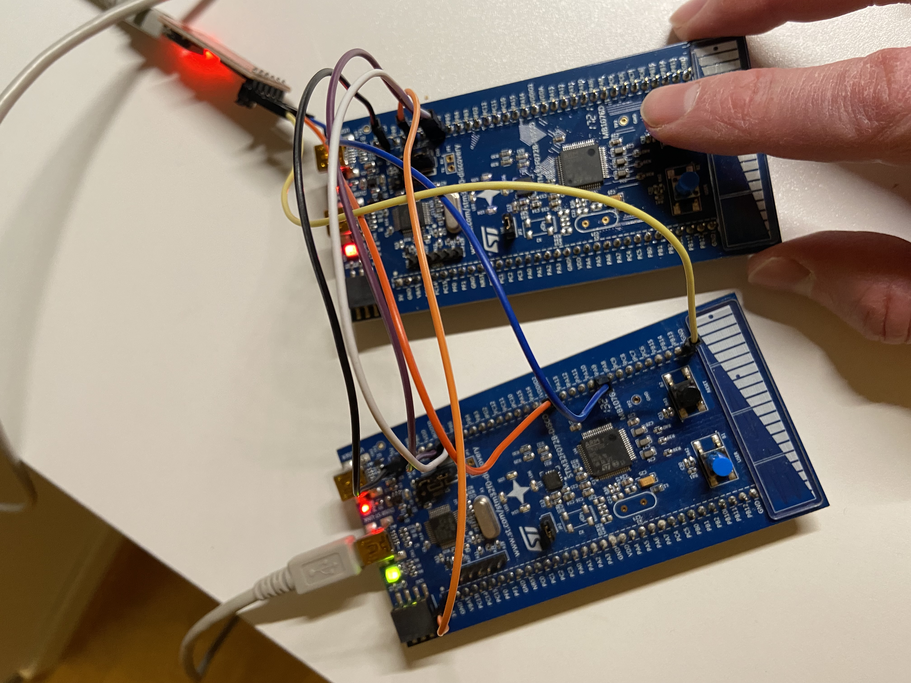
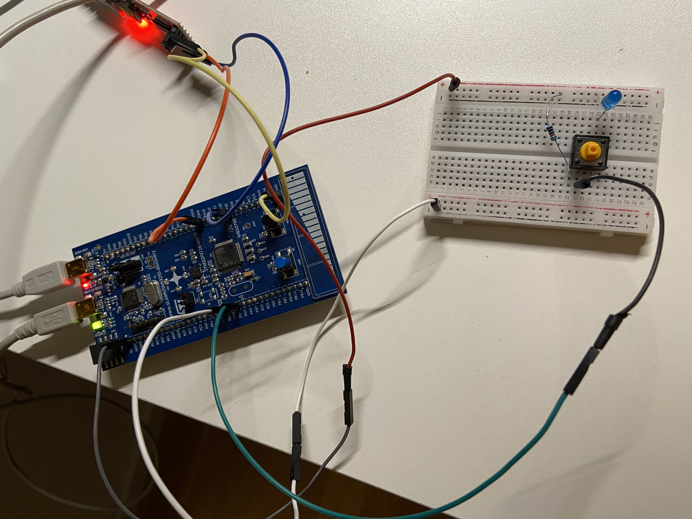
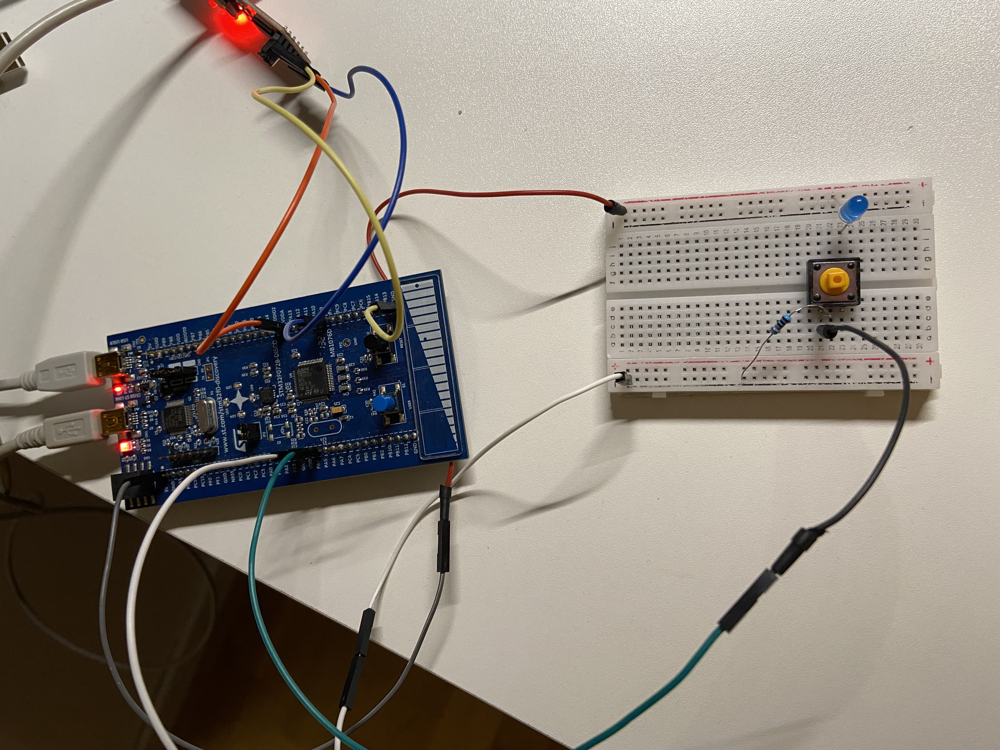

### Learning IoT
The sole purpose of this repository is to store notes and code helping me
learn things related to Internet of Things, but also basic electronics.

### Contents
1. [STM32F0-Discovery](./stm32f0-discovery/README.md)
1. [ESP8266](./doc/esp8266.md)
1. [Microbit v2.0](./doc/microbit.md)


### Microcontroller Unit (MCU)
Is a very small computer system self contained on an integrated circuit (IC).
They normally don't have any external data storage available so everything has
to be able to be stored in memory (or perhaps sent off somewhere to be stored
elsewhere).

Is what actually runs our code. It looks like a small black box and has a
number of small metal pins around it. The pins are connected to tracers that
are like wires connecting components on the board.

### Analog-to-digital conversion (ADC)
Microcontrollers convert analog values (continuous) that arrive on inputs (pins)
into to digital values (descrete) to be processed.


### ARM (Advanced RISC Machines/Acorn RISC Machines)
ARM holding is the company behind Arm based chips do not manufacture chips
but instread they design parts of the chip and they license these designs to
hardware manufactures that use them in their products (sometimes enhancing
them). In contrast to Intel both design chips and manufacture them.

Arm has a number of families of chip designs. For example there is the Cortex-M
family which are mostly used in microcontrollers.

Cortex-M0 is designed for low cost/power usage.
Cortex-M4 is a middle ground more features/performance than M0 but less
expensive then M7.

Cortex-M7 is higher cost but has more features and better performance.
Some additional information about Arm version can be found
[here](https://github.com/danbev/learning-assembly/tree/master/arm#arm-versions).


### Controller Area Network (CAN)
TODO:


### Real Time Operating Systems (RTOS)
TODO:

### Serial communication
Is the process of transmitting one bit of data at a time. Think of this as being
one wire and the bits flow through it.
Only requires one wire which is one reason at it is used often in
microcontroller system design.

Would require only two wires:
```
  +---------+ b0 b1 b2 b3 b4 b5 b6 b7     +---------+
  |      OUT|-----------------------------|IN       |
  |         | p1 p2 p3 p4 p5 p6 p7 p8     |         |
  |      CLK|-----------------------------|CLK      |
  +---------+                             +---------+

p = puls of the clock
```
So this would send one bit per plus of the clock.

### Parallel communication
Is the process of transmitting multiple bits of data at one time. Think of this
as muliple wires connected to the other side and multiple bits can be set and
transmitted at once.
Since it requires more wires it can be more expensive to implement.
Crosstalk is an issue and it is susceptible to clock skew.
```
  +---------+                             +---------+
  |     OUT0|-------------b0--------------|IN0      |
  |     OUT1|-------------b1--------------|IN1      |
  |     OUT2|-------------b2--------------|IN2      |
  |     OUT3|-------------b3--------------|IN3      |
  |     OUT4|-------------b4--------------|IN4      |
  |     OUT5|-------------b5--------------|IN5      |
  |     OUT6|-------------b6--------------|IN6      |
  |     OUT7|-------------b7--------------|IN7      |
  |         |             p1              |         |
  |      CLK|-----------------------------|CLK      |
  +---------+                             +---------+

p = pulse of the clock
```
So this would send 8 bit per pluse of the clock.

### Synchronous transmission
It's called synchronous because the sender and reciever are synchronized. They
both have a clock which use the same rate.

A clock in this case is something that changes between two values, like high/low
or something like that. The sender might send only when the clock is high for
example. This is not much of a problem if both sender and reciever share the
same clock, if they are part of the same circuit for example, but if they are
not it might be difficult as they need someway of sharing the clock.

Fast transmission (when is has been sent).
May have to wait until data can be sent.

Examples are SPI, and I²C.

### Asynchronous transmission
This type of communication is not synced, but instead it uses a start bit and
and stop bit
```
           start bit    stop bit
               ↓ [ data ]       ↓
    +--------+ 0 11101001 1       +--------+
    | Sender | -----------------> |Reciever|
    +--------+                    +--------+
```
The extra processing of the start/stop bit can affect performance making
asynchronous slower. 
Is cheap and easy to implement (no clock sharing).
Can transmit whenever it is ready (does not have to wait for the clock).


### Clock
Is a signal that repeats/oscillates between high and low states:
```      ____   ____  ____
high 1   |   |  |  |  |  |
         |   |  |  |  |  |    
low  0----   ----  ----  ----  ...
```
So it starts out at zero, changes to 1 for the same amount of time and then
repeats like this. The clock tells us when the receiver should read from the
data line. We might say that it should receive when the clock is high but notice
that the line can be high for a certain period of time. Instead we say that it
should read when transitioning from low to high, and this point is called an 
edge:
```      ____   ____  ____
high 1   |   |  |  |  |  |
         |   |  |  |  |  |    
low  0----   ----  ----  ----  ...
         ^   ^
raising edge +-- fallin edge
     (from low   (from high
      to high)    to low)
```
This is a single point instead of a region.

So lets say we want to send 5 (101). First we have to let the receiver know that
we are going to send by setting a wire to low which is sometimes called slave
select (SS_bar). After this is done we can send bits to the receiver:
```
    Sender                   Receiver
             -
             |
             |
    CLK    --*             > CLK

101 SOUT   --1-------------> RIN  1
```
So above when the first raising edge is encountered, remember that the sender
and receiver share the same clock line so the receiver also knows when this
happens. When this happens SOUT will become high for the binary digit 1 to be
sent. This can then be read by the reciever from RIN above and placed into
a buffer. The next time there is a raising edge encountered (clock tick) another
bit will be placed in SOUT:
```
    Sender                   Receiver
             ----  -
             |  |  |
             |  |  |
    CLK   ----  ---*       > CLK

10  SOUT   --------0-------> RIN  10
```
And so on:
```
    Sender                   Receiver
             ----  ----
             |  |  |  |
             |  |  |  |
    CLK   ----  ----  ---* > CLK

10  SOUT   --------------1-> RIN  101
```

### Serial Peripheral Interface (SPI) 
Is a synchronous serial communication spec developed by Motorola (1980s) and
used for communicating between microcontrollers and small peripheral devices.
Note that this is a defacto standard but there is no official standard for this
protocol.

```
   +-----------------+           +-----------------+
   | SPI         SCLK|-------+-->|SCLK   SPI       |
   | Controller  COPI|------+--->|COPI   Peripheral|
   |             CIPO|<----+-----|CIPO             |
   |               CS|---------->|CS               |
   +-----------------+     |||   +-----------------+
                 ^         |||
                 |         |||   +-----------------+
                 |         ||+-->|SCLK   SPI       |
                 |         |+--->|COPI   Peripheral|
                 |         +-----|CIPO             |
                 +-------------->|CS               |
                                 +-----------------+

SCLK = SPI Clock
CIPO = Controller Input Peripheral Output
COPI = Controller Output Peripheral Input
CS   = Chip Select (to select among mulitiple connected peripherals like above) 
```
* Full Duplex
* Synchronous (it uses the clock to sync)
* 4+ wires (with multiple slaves there will be more than 4 wires)
* 25 Mbps
* No ack
* Low power consumption
* 20 cm distances

#### Clock polarity (CPOL)
If the CPOL bit is 0, then the SCK pin has a low-level idle state:
```
    ---
    |
    |
----
```
So the clock in the idle state will be low.


If the CPOL bit is 1, then the SCK pin has a high-level idle state:
```
----
    |
    |
    ----
```
And in this case the clock in the idle state will be high.

#### Clock phase (CPHA)
CPAH detrmines when data will go out, or when data will sampled during the
clock cycle phase. If the communication should be writing data on the falling
edge of the cycle or on the raising edge of the clock cycle.

```
CPOL = 0 (remember this means the clock is low when idle)
CPAH = 0

    ----  ----
    |  |  |  |
    |  |  |  |
----   ----  ----
    ↑
    |
  raising edge


CPOL = 0 (remember this means the clock is low when idle)
CPAH = 1

     falling edge
       |
       ↓
    ----  ----
    |  |  |  |
    |  |  |  |
----   ----  ----


CPOL = 1 (remember this means the clock is high when idle)
CPAH = 0

 falling edge
    |
    ↓ 
----   ----  -----
    |  |  |  |
    |  |  |  |
    ----  ---- 

CPOL = 1 (remember this means the clock is high when idle)
CPAH = 1

----   ----  -----
    |  |  |  |
    |  |  |  |
    ----  ---- 
       ↑
       |
    raising edge

```
Now, clock polarity and clock phase can be combined as we might be able to tell
from above. We can have {CPOL=0, CPHA=0}, {CPOL=1, CPAH=0}, {CPOL=0, CPAH=1}, 
and {CPOL=1, CPAH=1}.

One thing to note is that we always want to sample data in the middle of a clock
cycle and never close to the edges as that means that data i changing and
sampling then migth cause corruption to data.

### Universal Asynchonous Receiver/Transmitter (UART)
UART is not a communications protocol like SPI and I2C but instead a physical
component/circuit in a microcontroller or a standalone integrated circuit. The
standard it implements is RS-232 protocol.
It is main purpose is to send and receive serial data.

An UART can look something like the following:
```
  Data bus	 +------------+           +------------+      Data bus      
	    ---->|D0  P|S     |           |    P|S   D0|---->
            ---->|D1  A|E     |           |    A|E   D1|---->
            ---->|D2  R|R     |           |    R|R   D2|---->
            ---->|D3  A|I   RX|<----------|TX  A|A   D3|---->
            ---->|D4  L|A   TX|---------->|RX  L|L   D4|---->
            ---->|D5  L|L     |           |    L|    D5|---->
            ---->|D6  E|      |           |    E|    D6|---->
            ---->|D7  L|      |           |    L|    D7|---->
		 |     |      |           |     |      |
		-|R/W  |      |           |     |   R/W|
		-|CLK  |      |           |     |   CLK|
		-|INT  |      |           |     |   INT|
		 +------------+           +------------+
```

An packet on the serial wire (TX->RX) will looks something like this:
```
   +-+ +-+-+-+-+-+ +--+  +--+
   |S| | | | | | | |P |  |ST|
   +-+ +-+-+-+-+-+ +--+  +--+
  Start    Data   Parity Stop
```
The transimission line (TX) is usually held at a high voltage when not
trasmitting. To start sending the trasmitting UART will pull the TX line from
high to low for one clock cycle. When the receiving (RX) UART see this it will
begin reading the bits in the dataframe at the frequency of the baud rate.
Notice that the sender will get the data to be sent from the data bus, and
likewise the reciever will place the received data on the data bus.

So there are only two wires which is a nice property. And there is not clock
signal required between two UARTs. There is also parity checking which is
good for reliable communication.
One thing to note is that the data being sent can be a maxium of 9 bits. 
The is not way to support multiple peripherals.


### Inter-IC (Integrated Circuit) (I²C/I2C)
Was first developed in 1982 by Phillips Semiconductors (which is now NXP
semiconductors) and a public
[specification](https://www.nxp.com/docs/en/user-guide/UM10204.pdf) came out in
1992 which allowed speeds of 400kHz and an address of 10-bits.

There are three additional modes:
* fast-mode plus, 1MHz
* high-speed mode, 3.4MHz
* ultra-fast mode, 5MHz

Intel introduced a variant of I²C in 1995 called System Management Bus (SMBus)
intended to improve communiciation predictability between ICs on PC
motherboards. SMBus limits the speed of communication to 10kHz to 100kHz.

Only requires two pins/wires:
```
   +------------------+           +-----------------+
   | Controller 1  SCL|<--+------>|SCL  Peripheral 1|
   |               SDA|-------+-->|SDA              |
   +------------------+   |   |   +-----------------+
   +------------------+   |   |   +-----------------+
   | Controller 2  SCL|<--+------>|SCL  Peripheral 2|
   |               SDA|-------+-->|SDA              |
   +------------------+           +-----------------+
 
SCL = Serial Clock Line for the clock signal
SDA = Serial Data line for sending and recieving data
```
So we have the usage of a clock so this is a synchronous protocol like SPI.
Each I²C consists of two signals/lines, the clock signal and the data signal.
The clock signal is always generated by the current bus controller
And notice that we have a single wire to both transmit and recieve.

The format of data send on the bus is done in 8-bit frames. Each frame also
includes an ACK bit. The acknowledgment takes place after every bytes.

Data is transported in messages which have a specific format, and an address
is used to identify the destination peripheral:
```
   +-+-+-+-+-+-+-+ +---+ +---+  +-+-+-+-+-+-+-+-+
   | | | | | | | | |R/W| |ACK|  | | | | | | | | |
   +-+-+-+-+-+-+-+ +---+ +---+  +-+-+-+-+-+-+-+-+
    Address Frame                      Data Frame
    (7 or 10 bits)                     (8 bits)

R/W = 1 Controller is requesting to read
R/W = 0 Controller is requesting to write
ACK = Is used by the peripheral that matches the address, which is pulled low
so there should be a 0 in the ACK bit if the address maches. If this is not
pulled low this is interpreted as a NACK by the controller.
```
Try to remember that this communication is one clock cycle at a time, so a
peripheral can check each bit of the addess and if it matches it can pull its
signal low. The other peripherals do nothing.

I²C uses open collector circuit for it's bus:
```
          +Vcc
          ----
            |
            /
            \  R
            /
    Signal->|-------------+-----------+----------+
            |             |           |          |
       S   /             /           /          /
            |             |           |          |
           --- GND       ---         ---        ---
            -             -           -          -
            .             .           .          .
           C1             C2         P1          P2
```
It is always the controller that initiates the communication. Also, controllers
cannot communicate with each other, they can only communicate with peripherals.

The controller begins by pulling SDA low (remember that when all switches are
open the signal is a logic one) while SCL is high:
```
        Address Frame   
         
SDA -+  +--+     +--+  +--+--+--+   +-
     |  |A6|A5|A4|A3|A2|A1|A0|RW|ACK|
     +--+  +--+--+  +--+        +---+
         1  0  0  1  0  1  1  1   0
```
And this is followed by pulling SCL low, this is referred to the START condition
in the spec I think and I think this is what is meant when other documents say
the start bit.

The clock is what enables the peripheral when to reads these bits
```
        Address Frame   
         1  0  0  1  0  1  1  1   0
SDA -+  +--+     +--+  +--+--+--+   +-------+                                 --------
     |  |A6|A5|A4|A3|A2|A1|A0|RW|ACK|       |  |D7|D6|D5|D4|D3|D2|D1|D0|ACK|
     +--+  +--+--+  +--+        +---+       +--+

SCL -+    +  +  +  +  +  +  +  +  +             +  +  +  +  +  +  +  +  +  +-------
     |    |  |  |  |  |  |  |  |  |             |  |  |  |  |  |  |  |  |  |
     +----+--+--+--+--+--+--+--+--+-------------+--+--+--+--+--+--+--+--+--+
                                        ↑
                                   (between frame the clock is low)
```
The clock pulses are supposed to show that they are in the middle of each bit
and that the peripheral should read at the point to get the most accurate
reading/sampling.

Now, each peripheral will detect this pulling low of SDA and read the address
frame.

If none of the peripherals match the address, that is SDA has not been pulled
low,  then they all leave the SDA unchanged and the master will consider this
an NACK and the controller will send the stop bit.

After data has be acknowledged then a STOP condition is sent which is the
opposite of the start conditions where SCL is pulled high, while SCL is high.
Instead of the STOP condition an new START condition can be sent instead which
is called a repeated start.

#### Clock streching
Is a way for the peripheral to signal that it needs a little more time to
gather data it is going to send.

This is performed by the peripheral by pulling the clock low.
```
         1  0  0  1  0  1  1  
SDA -+  +--+     +--+  +--+--+    +
     |  |D7|D6|D5|D4|D3|D2|D0|    |ACK|
     +--+  +--+--+  +--+     +----+---+
SCL -+    +  +  +  +  +  +  +     +
     |    |  |  |  |  |  |  |     |
     +----+--+--+--+--+--+--+--+--+
```

#### I2C Example
[i2c-c.s](stm32f0-discovery/i2c-c.s) is the controller which currently
send an single `A` to the peripheral [i2c-p.s](stm32f0-discovery/i2c-p.s).
Both of these programs are flashed onto STM32F072B-Discovery boards and
connected using PB6 (SCL) and PB7(SDA).




```console
$ minicom --baudrate 115200 --device /dev/ttyUSB0
Welcome to minicom 2.7.1

OPTIONS: I18n 
Compiled on Jan 26 2021, 00:00:00.
Port /dev/ttyUSB0, 18:49:45

Press CTRL-A Z for help on special keys

A
```
Currently the controller only sends on byte so to see more `A`s being sent
we have to press the reset button. TODO: change this so that it just
continues sending bytes.

#### Collisions 
We mentioned earlier that we can have more than one controller. So what happens
if two controllers start sending data at the same time. I turns out that the
controllers not only send out data on the SDA but also read from it. So if
a controller sends out a bit pattern it will check that that bit pattern is
also on the wire. If another controller wrote the exact same bits then nothing
happens but if the bits differ then a collision is detected and the controller
who did not read the same bit pattern that is sent will back off.

In SPI we had a peripheral select wire (SS) which selected the peripheral we
want to talk to. Instead in I2C each peripheral has an address. This is
contained in the address frame which is always first frame after the start bit
has been set. The controller sends this message frame onto the SDA which all
peripherals connected will see. Each peripheral will compare this to their own
address and do nothing if the address does not match. If the address matches
a peripheral it sends a low voltage ACK bit back to the controller.

The READ/WRITE bit indicates if the controller wants to send or recieve data
from the peripheral. If it wants to send then this bit is low (0) and if it
wants to read it will be a high voltage.

We've already talked about USART and SPI previously so why do we need another
option for communication. USART is asynchonous, there is not clock but instead
start/stop bits (which reduces the data rate somewhat), and it also a little
more complex with regards to the hardware implementation. USART is usually used
for communicating between to components and note multiple connected to a bus
like SPI.
SPI requires four pins/wires to connect two components, and adding additional
ones requires another wire for the chip select pin. The hardware is usually a
simple shift register at either end.

Compared to SPI there is one additional bit of data being sent which can affect
the data rate.

### Current
Is the flow of free electrons.

### Conductors
Take a conductor like a coppar wire which is good at allowing a current to flow
through it. Now, coppar is made up of coppar atoms which like all atoms contain
protons, neutrons, and electrons:
```
Cu
Protons: 29
Neutrons: 35
Electrons: 29
           Shell 1: 2 electrons
           Shell 2: 8 electrons
           Shell 3: 18 electrons
           Shell 4: 1 electrons (free electron)
```
A coppar wire without any current flowing will have electrons randomly moving
from atom to atom, but this is not in any perticular direction. If an electron
moves away from its atom that will leave the atom slightly positively charged
and that would attract an electron. 

So we have the sea of electrons that are moving around randomly. Now, if we
connect a cell that contains one end with negative electrons and the otherside
with atoms what are positivly charged (would attract electrons) the electrons
will move towards the positiv end.

The conduction band is the band above the valence band. 
```
----------------------- 
                        Conduction band
-----------------------
                        Band gap
-----------------------
                        Valance band 
-----------------------
        ...
----------------------- Electron shell n-1
```
For electrons to be able to move to an outer shell energy needs to be applied.
For conductors the conduction band and the valance band/band gap/conduction band
overlap allowing the free electrons to move in this space. But for insulators
there is a clear band gap and energy is required for this to happen (that is
if there are free electrons in the valance shell), if we are thinking of atoms
where no energy is applied to it.

Bond:
When an atom bonds with another they can share electrons in their valence shell,
this type of bond is called covalent bond.

Take two silicon atoms for example, they would share a pair of electrons:
```
   *     *                * = electron in valance shell
                         ** = paired electrons
*  Si ** Si *

   *      *
```
Many silicon atoms that are bonded like this will allow for each Si atom to be
connected though sharing four electrons:

This is something that can be seen in silicon where each silicon atom is
connected to four other silicon atoms. 

If a conductor (metal) is heated it becomes less conductive. So metals conduct
electricity better at colder temperatures.

### Band theory
```
Energy
 ^
 |                                           +--------------+
 |                                           | Conduction   |
 |                       +--------------+    |              |
 |                       | Conduction   |    +--------------+
 |   +--------------+    |              |
     | Conduction   |    +--------------+
     |--------------|
     |--------------|    +--------------+    +--------------+
     | Valancy      |    | Valancy      |    | Valancy      |
     +--------------+    +--------------+    +--------------+
     Conductors          Semiconductors      Insulators
```
Notice that for conductors the conduction band and the valancy band overlap
which is why the conduct so well. 
For semiconductors there is a gap between these two bands so energy is needed
for electrons to move into the conduction band. This is possible with heat.


### Insulators
High reisistance to the flow of electricity, which means that their valance
shell is full and also there is a large gap between the valancy and conduction
bands.


### Semi-conductors
These have properties that are in between conductors and insulators, hence the
name semi-conductors. If a semi-conductor is exposed to heat this can improve
its conductivity. But there is another way to improve the conductivity of a
semi-conductor which is to add impurities to it (called doping).

If we take a look at a silicon cristal:
```
                                          [* *] = covalent bond
 Si  [* *]  Si  [* *]  Si  [* *]

 ⌈*⌉       ⌈*⌉         ⌈*⌉
 ⌊*⌋       ⌊*⌋         ⌊*⌋
       
 Si  [* *]  Si  [* *]  Si  [* *]

 ⌈*⌉       ⌈*⌉         ⌈*⌉
 ⌊*⌋       ⌊*⌋         ⌊*⌋

 Si  [* *]  Si  [* *]  Si  [* *]
```
So we can see that we have these covelent bounds between the atoms and all of
the free electrons in the valance shell are bound. There are no free electrons
or "holes" (which is an atom which is slightly positively charge and it lacks
an electron).

If we replace one of these atoms with an atom with only 5 electrons
(like fosfor) in its valance shell what would happen:
```
                                          [* *] = covalent bond
 Si  [* *]  Si  [* *]  Si  [* *]

 ⌈*⌉       ⌈*⌉         ⌈*⌉
 ⌊*⌋       ⌊*⌋         ⌊*⌋
                 *<-------------------- free electron
 Si  [* *]  P  [* *]  Si  [* *]

 ⌈*⌉       ⌈*⌉         ⌈*⌉
 ⌊*⌋       ⌊*⌋         ⌊*⌋

 Si  [* *]  Si  [* *]  Si  [* *]
```
It can still bond with the other 3 atoms around it but also has an additional
electron left over. This free electron can now move in the conduction band. This
makes this silicon cristal more conductive then before. Because we have a free
electron by this process this is called an n-type (for negative) conductor now.
But also notice that there is still a balance of protons and electrons sinse
the introduced atom has 5 protons. 

So if we hook up a battery this the free electron will be attracted to the
positive terminal and the electrons from the negative terminal will be able
to move in their place through the material (in/through the conduction band):
```
                                          
     Si  [* *]  Si  [* *]  Si  [* *]

     ⌈*⌉       ⌈*⌉         ⌈*⌉
     ⌊*⌋       ⌊*⌋         ⌊*⌋
                 * <------------------ free electron moved
+--- Si  [* *]  P  [* *]  Si  [* *] <-----------+
|                                               |
|    ⌈*⌉       ⌈*⌉         ⌈*⌉                  |
|    ⌊*⌋       ⌊*⌋         ⌊*⌋                  |
|                                               |
|    Si  [* *]  Si  [* *]  Si  [* *]            |
|                                               |
|                 |                             |
|                 ||                            |
+-------------> + || - -------------------------+
                  |
```

So lets try with alunminum (Ai):
```
                                          [* *] = covalent bond
                                              x = hole/missing electron
 Si  [* *]  Si  [* *]  Si  [* *]

 ⌈*⌉       ⌈*⌉         ⌈*⌉
 ⌊*⌋       ⌊*⌋         ⌊*⌋
                 
 Si  [* *]  Ai  x  *  Si  [* *]

 ⌈*⌉       ⌈*⌉         ⌈*⌉
 ⌊*⌋       ⌊*⌋         ⌊*⌋

 Si  [* *]  Si  [* *]  Si  [* *]
```
Notice that we have a missing electron so there is no covalent bond between the
Ai atom in the middle and the Si atom to the right of it. This is called a
p-type semi-conductor. This also conducts electricity better than pure silicon
so the conductivity goes up.

In the case of N-type we know that the electrons are free to flow in the
conduction band. This is not what happens for P-type, instead the electrons flow
in the valance band, so if we apply a current electrons will be attracted to
the positive terminal, hence they will move to holes:
```
     Si  [* *]  Si  [* *]  Si  [* *]

     ⌈*⌉       ⌈*⌉         ⌈*⌉
     ⌊*⌋       ⌊*⌋         ⌊*⌋
                 *
+--- Ai  x *   Si  [* *]   Si  [* *] <-----------+
|                                                |
|    ⌈*⌉       ⌈*⌉         ⌈*⌉                   |
|    ⌊*⌋       ⌊*⌋         ⌊*⌋                   |
|                                                |
|    Si  [* *]  Si  [* *]  Si  [* *]             |
|                                                |
|                 |                              |
|                 ||                             |
+-------------- + || - <-------------------------+
                  |
```
The holes are what allow electrons to flow and this happens in the valance band
as opposed to n-type doping where the flow happens in the conduction band.

With a batteri cell attached the electrons will be attracted to the positive
terminal. Therefor electrons will fill the holes:
```
 x  o  x  x  x
     <-
 x  x  o  x  x
        <-
 x  x  x  o  x
           <-
 x  x  x  x  o
```
Now, what I think will happen is that one electron will "leave" and and one
will enter:
```
x <- o  x  x  x  o <-x
     o  x  x  x  x 
```
And once again the process of the electrons filling the holes will continue and
a electrons will be transferred/conducted accross the valance band.

Now, lets see what happens if we combine a p-type and an n-type:
```
                                          [* *] = covalent bond
                                              x = hole
                                              * = free electron
         P-type                          N-type

 Si  [* *]  Si  [* *]  Si    |  |  Si  [* *]  Si  [* *]  Si  [* *]
                             |  |
 ⌈*⌉       ⌈*⌉         ⌈*⌉   |  |  ⌈*⌉       ⌈*⌉         ⌈*⌉
 ⌊*⌋       ⌊*⌋         ⌊*⌋   |  |  ⌊*⌋       ⌊*⌋         ⌊*⌋
                             |  |                *
                             |  |                 
 Si  [* *]  Ai  x  *  Si     |  |  Si  [* *]  P  [* *]   Si  [* *]
                             |  |
 ⌈*⌉       ⌈*⌉         ⌈*⌉   |  |  ⌈*⌉       ⌈*⌉         ⌈*⌉
 ⌊*⌋       ⌊*⌋         ⌊*⌋   |  |  ⌊*⌋       ⌊*⌋         ⌊*⌋
                             |  |
 Si  [* *]  Si  [* *]  Si    |  |   Si  [* *]  Si  [* *]  Si  [* *]
```
The free electron would be attracted to fill the hole 
```
 Si  [* *]  Si  [* *]  Si    |  |  Si  [* *]  Si  [* *]  Si  [* *]
                             |  |
 ⌈*⌉       ⌈*⌉         ⌈*⌉   |  |  ⌈*⌉       ⌈*⌉         ⌈*⌉
 ⌊*⌋       ⌊*⌋         ⌊*⌋   |  |  ⌊*⌋       ⌊*⌋         ⌊*⌋
                +-------------------------------- * 
                ↓            |  |
 Si  [* *]  Ai  x  *  Si     |  |  Si  [* *]  P  [* *]   Si  [* *]
                             |  |
 ⌈*⌉       ⌈*⌉         ⌈*⌉   |  |  ⌈*⌉       ⌈*⌉         ⌈*⌉
 ⌊*⌋       ⌊*⌋         ⌊*⌋   |  |  ⌊*⌋       ⌊*⌋         ⌊*⌋
                             |  |
 Si  [* *]  Si  [* *]  Si    |  |   Si  [* *]  Si  [* *]  Si  [* *]
```
If an electron moves from the n-type to the p-type this will cause an imbalance
where the n-type size now has a mismatch of the P atom, there is not one proton
more that there are electrons (remember that this was not the case when the
free electron was in the n-type side). So the n-type side will now become
slightly positively charged.

A hole can also move to the n-type side in which case the p-type area will not
be imbalanced, the Ai atom will not have one more electron compared to protons
and become slightly negatively charged. And remember that a charge will create
an electric field. This electric field will prevent electrons and holes to move
between these to areas. This process will create an area between these two
reqions where there are now extra electrons, or any extra holes, so there are
now charge carriers in this region. This region is called the depletion region
and it like an insulator.
```
                Depletion Region
            N          ↓       P
      +----------------+---------------+
      | * * ** *** * * |  o o oo ooo   |
      | ** * **  * * * | o o o o o  oo |
      | * * ** *** *   |o o o o        |
      | * * ** *** *   |  o   o  o  o o|
      +----------------+---------------+
               Depletion Region
            N          ↓       P
      +--------------+----+-------------+
      | * * ** *** * |    |o o oo ooo   |
      | ** * **  * * |    | o o o o  oo |
      | * * ** *** * |    |o o o        |
      | * * ** *** * |    |o   o  o  o o|
      +--------------+----+-------------+
```

Now if we hook up a power source we will not get a current flowing initially as
the depletion region prevents the flow. But if the batteri has enough voltage,
like > 0.7v this will overcome the barrier.
```
               Depletion Region
            N          ↓        P
      +--------------+----+-------------+
      | * * ** *** * |    |o o oo ooo   |
 +--> | ** * **  * * |    | o o o o  oo |---------+
 |    | * * ** *** * |    |o o o        |         |
 |    | * * ** *** * |    |o   o  o  o o|         |
 |    +--------------+----+-------------+         |
 |                                                |
 |                   |                            |
 |              -  | | +                          |
 +-----------------| |<---------------------------+
                   | | 
                     |
```
Electrons will enter the n-region and there will be more electrons in that
region. There will also be electrons (remember there are holes but there are
also electrons in this region. Those electrons will be attracted to the positive
terminal and will exit leaving more holes behind. If the batteri has a voltage
> 0.7 the depletion region will collapse and current can flow.

Now lets hook this up the other way, where the negative terminal is connected
to the p-type region, and the positive terminal to the n-type region:
```
               Depletion Region
            N          ↓        P
      +--------------+----+-------------+
      | * * ** *** * |    |o o oo ooo   |
 +----| ** * **  * * |    | o o o o  oo |<--------+
 |    | * * ** *** * |    |o o o        |         |
 |    | * * ** *** * |    |o   o  o  o o|         |
 |    +--------------+----+-------------+         |
 |                                                |
 |                 |                              |
 |              +  | | -                          |
 +---------------->| |----------------------------+
                   | | 
                   | 
```
In this case the electrons will fill the holes in the p-region, and electrons
will leave the n-region, causing the depletion region to become larger:
```
               Depletion Region
            N         ↓           P
      +---------------------------------+
      | * * ** **|          |o oo ooo   |
 +----| ** * **  |          | o o o  oo |<--------+
 |    | * * ** * |          |o o        |         |
 |    | * * ** * |          |  o  o  o o|         |
 |    +--------------+----+-------------+         |
 |                                                |
 |                 |                              |
 |              +  | | -                          |
 +---------------->| |----------------------------+
                   | | 
                   | 
```
As the depletion region becomes larger, meaning that there are no charge
carriers in this region, this component will act like an insulator. So no
current will flow.

If we stick an n-type region next to a p-type, and then another n-type we get
the following:
```
                    Depletion Regions
                     |          |
            N        ↓    P     ↓     N
      +-------------+-+--------+-+----------+
      | * * ** *** *| |o o oo o| |* * * * * |
      | ** * **  *  | | o o o o| |  * *  ** |
      | * * ** ***  | |o o o   | | *   * *  |
      | * * ** *** *| |o   o  o| |  * * * * |
      +-------------+-+--------+-+----------+
```
And say we want a current to flow through this thing:
```
                    Depletion Regions
                     |          |
            N        ↓    P     ↓     N
      +-------------+-+--------+-+----------+
      | * * ** *** *| |o o oo o| |* * * * * |
 +--->| ** * **  *  | | o o o o| |  * *  ** |-----+
 |    | * * ** **   | |o o o   | | *   * *  |     |
 |    | * * ** ** * | |o   o  o| |  * * * * |     |
 |    +-------------+-+--------+-+----------+     |
 |                                                |
 |                                                |
 |                                                |
 |                                                |
 |                   |                            |
 |              -  | | +                          |
 +-----------------| |<---------------------------+
                   | | 
                     |
```
Well this will increase number of electrons in the left-most n-type region,
and some electrons will leave the right-most n-type region but there will not
be a current flowing. 

Lets try hooking up a second power source like this:
```
                    Depletion Regions
                     |          |
            N        ↓    P     ↓     N
      +-------------+-+--------+-+----------+
      | * * ** *** *| |o o oo -| |+ * * * * |
 +--->| ** * **  *  | | o o o -| |+ * *  ** |-----+
 |    | * * ** **   | |o o o  -| |+*   * *  |     |
 | +--| * * ** **  *| |o   o  -| |+ * * * * |     |
 | |  +-------------+-+--------+-+----------+     |
 | |                 |     |                      |
 | |             - | | +   |                      |
 | +---------------| |-----+                      |
 |                 | | >0.7v                      |
 |                   |                            |
 |                                                |
 |                   |                            |
 |              -  | | +                          |
 +-----------------| |<---------------------------+
                   | | 
                     |
```
Notice that this extra connection between the left-most n-type and the p-type
is the same as we hade above where we saw that current would flow through that
connetion.

Now, we have electrons entering from both battries. When they make these types
of components the first n-type region is very heavyly doped. So once this
second current starts flowing, those extra electrons can now also move through
into the p-type region. Some of these electrons are going to fill in holes in
the p-type region, and some are also going to be attracted to the outgoing plus
terminal of the p-type region. The base is very thin (how they are manufactured)
and these holes are physically close to the left-most n-type's electrons. That
depletion region was created when electrons left the n-type into the depletion
region which caused the n-type region to become positivley charged (remember
that the number of electrons and protons match up when neutral and removing a
electron will make the atom postitive). And those electrons that move into
depletion region cause the p-type region to become negatively charged.
The electrons that have now started flowing through the p-type region will be
attracted to the positive right-most n-type region and therefor be able to
flow through it towards the positive terminal output.

This component is called an NPN Bipolar Junction Transistor:
```
        Emitter(N)      Base(P)  Collector(N)
      +-------------+-+--------+-+----------+
      | * * ** *** *| |o o oo -| |+ * * * * |
 +--->| ** * **  *  | | o o o -| |+ * *  ** |-----+
 |    | * * ** **   | |o o o  -| |+*   * *  |     |
 | +--| * * ** **  *| |o   o  -| |+ * * * * |     |
 | |  +-------------+-+--------+-+----------+     |
 | |                 |     |                      |
 | |             - | | +   |                      |
 | +---------------| |-----+                      |
 |                 | | >0.7v                      |
 |                   |                            |
 |                                                |
 |                   |                            |
 |              -  | | +                          |
 +-----------------| |<---------------------------+
                   | | 
                     |
```
Alright, so that was the theory now lets see how we can create a circuit
with such an NPN transistor:

For this example I used as button switch which is connected to the base of the
transistor:


So without a current flowing through the base and the emitter there is no
current flowing though the transistor. Pressing the button will cause a current
to flow:


So that is how a NPN Bipolar Junction transistor works and how we can hook it
up physically. We can use two such transistors:


Now, pressing just the left button no current will flow:


And, pressing just the right button no current will flow:


But pressing both and current will flow:


Notice that what we have created here is a AND gate:
```
Left button | Right button   LED
          0 | 0              0 (Off)
          1 | 0              0 (Off)
          0 | 1              0 (Off)
          1 | 1              1 (On)
```


Before any movement has occured we have the following Formal Charge for P:
```
     ⌈*⌉
     ⌊*⌋ *
[* *] P [* *]
     ⌈*⌉
     ⌊*⌋

Bounds: 4
FC = valance electrons - (Bonds + dots)
FC =                 5 - (4+1) 
FC = 0               
```
This is important and we can note that the charge/voltage is neutral because
the phosphorus atom has 15 protons and 15 electrons, and 5 of those electrons
are in its valance shell. The extra free electron does not cause an inbalance
here, there are still 15 protons and 15 electrons and the other (not shown) Si
atmos are also neutral.

And for Ai:
```

     ⌈*⌉
     ⌊*⌋ 
[* *]Ai  x *
     ⌈*⌉
     ⌊*⌋
FC = 3 - (3 + O)
FC = 0
```
Ai has 13 protons and 3 electrons, and three of those electons are in its
valance shell. So even though there is a hole it does not cause an imbalance
at this point.

But if/when a free electron from from one side moves over to the other side
things change. When the free electron from moves from the P atom to the Ai atom
the P atom is now imbalanced, it now has one more proton than it has electrons
and is now positively charged. A similar thing happens on the Ai side where the
hole is filled with the electron. The Ai atom now has one more electron than it
has protons and is therefor negatively charged. 

Now, after the move of the free electron to the hole we have the following
formal charge for P:
```
FC = 5 - (4 + 0)
   = 1
```
This means that it has a positive formal charge.

And for Ai:
```
     ⌈*⌉
     ⌊*⌋ 
[* *]Ai  [* *]
     ⌈*⌉
     ⌊*⌋

FC = 3 - (4 + O)
FC = 3 - 4
FC = -1
```
This means that it has a negative formal charge.

```
       P                            N
+--------------------+-------------------------+
| o       o     o    | *    *       *        * |
|     o    o    o    |    *     *     *        |
|  o     o         o |            *       *    |
| o    o   o         | *   *  *     *    *     |
+--------------------+-------------------------+
```

The free electrons will drift to fill in the holes:
```
       P                            N
+--------------------+-------------------------+
| o       o     o   <--*    *       *        * |
|     o    o    o   <--   *     *     *        |
|  o     o         o<--           *       *    |
| o    o   o        <--*   *  *     *    *     |
+--------------------+-------------------------+
```

And this will cause the sides to positively and negatively charged:
```
       P                            N
+--------------------+-------------------------+
| o       o     o   -|+*    *       *        * |
|     o    o    o   -|+   *     *     *        |
|  o     o         o-|+           *       *    |
| o    o   o        -|+*   *  *     *    *     |
+--------------------+-------------------------+
```
When we have a charge(voltage difference) we also have the generation of an
electric field. So for electrons to move through this electric field more
energy is required (up until now we have only been thinking in terms of thermal
energy like the head of room temperature).

```
       P                            N
+--------------------+-------------------------+
| o       o     o   | |*    *       *        * |
|     o    o    o   | |   *     *     *        |
|  o     o         o| |           *       *    |
| o    o   o        | |*   *  *     *    *     |
+--------------------+-------------------------+
                     ^
                  Electric field accross the PN junction
```
The electric field makes it difficult for new electrons on the N side to cross
the PN junction now. The free electrons still have a force acting upon them that
wants to move them to the other side, but there is also a force acting in the
opposite direction. 
```
                  |       ↑
          P       ↓       |         N
      o o      -->-<--|<--+-->   *  *
       o    o  -->-<--|<--+-->      *  *
       o    o  -->-<--|<--+-->      *
                  ↑       |
                  |       ↓
```
Notice that the electric field is a vector, which has a magnitude and a
direction and the direction is different, the opposite for the negative side.


When these forces are equal then no electrons will move over
from the right side to the left side.

So applying a current to the N side that overcomes the force of the PN junction
would allow electrons to move through to the P side and beyond if the P-side
is connected to something. Reversing this process, that is connecting a voltage
to the anode (P-side) will not cause any (or vary little current to flow). I'm
taking about electron current here and not convertional current.
So the flow of electrons can only happen in one direction.

```
       P                            N
+--------------------+-------------------------+
| o       o     o   | |*    *       *        * |
|     o    o    o   | |   *     *     *        |
|  o     o         o| |           *       *    |
| o    o   o        | |*   *  *     *    *     |
+--------------------+-------------------------+
   Anode                   Cathode

----->|---
 <-- e⁻
            +----+----+  
  anode-----| P  | N  |-----cathode
            +----+----+
```
This is how a Diode is made.

So current will flow when electrons can flow from the n-type region to the
p-type region provided that the voltage applied can over come the depletion
regions electric field:
```
            +----+----+  
  +---<-----| P  | N  |-----<----+
  |         +----+----+          |
  |        +-----------+         |
  +--->----|+         -|---->----+
           +-----------+

```
But no current will flow if we connect it the diode in the other way:
```
            +----+----+  
  +---------| N  | P  |----------+
  |         +----+----+          |
  |        +-----------+         |
  +--------|+         -|---------+
           +-----------+
```

### Light Emitting Diode
Notice that this is basically a Diode that can emit light. 
```
    +--+
    |  |
    +--+
    |  |
    |  |
    |  |
    |  
Anode  Cathode
```
When we connect these the electron current must flow through the cathode so it
should be connected to the negative output of the batteri.


### Bipolar Junction Transistors.
There are two (bi) junctions (think of the PN junctions in a diode as explained
above):
```
  +-----+-----+-----+
  |  N  |  P  |  N  |
  +-----+-----+------
        ^     ^  
   junction  junction
       1        2
```
The N is for N-Type, and P for P-Type which are the same as in the diode example
above.
```
      +-----+-----+-----+
E-----|  N  |  P  |  N  |-----C
      +-----+-----+------
               |
               |
               B

E = emitter
C = collector
B = base
```
So we would have free electrons in the left and right boxes, and holes in the
middle box. And notice if we removed the first box we would be left with a
normal diode:
```
            +-----+-----+
            |  P  |  N  |-----C (cathode)
            +-----+------
               |
               |
               B (anode)
```
And the addition of the first N box is basically the reversal of a diode


### Field Effect Transistor
```
               Drain +-----------------------+   
                     |                       |
           +------------------+              |
           |      N           |              |
           |                  |             --- + Vds
           |--+     C      +--|              -  -
           |P |     H      |P |              |
           |  |     A      |  |              |
Gate -+--+-|  |     N      |  |---+          |
      |  | |  |     N      |  |   |          |
      |  | |  |     E      |  |   |          |
Vgs  --- | |--+     L      +--|   |          |
      -  | |                  |   |          |
      |  | |                  |   |          |
      |  | +------------------+   |          |
      |  +-----------|------------+          |
      |       Source |                       |
      +--------------+-----------------------+

N = N-Type material
P = P-Type material
Vds = Voltage drain/source
Vgs = Voltagae gate/source
```
Source is the source of electros and drain the output of electrons.
By increasing the voltage of Vgs we can cause a depletion zone between the
two P-type materials which will cause the channel to become smaller, there
will be more resistance between the source and the drain. One can think of this
as havin a gardan hose (the channel) where water if flowing through the source
to the drain and the gate is like a wheel that can be turned to pinch the hose
which reduces the flow or water. How much pinching is done is determined by
the voltage beween the gate and the source voltage.

```
                      FET
     +-----------------+------------------------+
     |                                          |
 Junction FET (JFET)                    Metal Oxide FET (MOSFET)
     |                                   |                |
  Depletion Mode                   Depletion Mode    Enhancement Mode
     |                                   |                |
 +-----------------+           +----------            +-----------+    
 |                 |           |                      |           |
N-Channel      P-Channel    N-Channel              N-Channel  P-Channel

                                  D                 D             D
     D              D             |                 |             |
     |              |           |-+               |-+           |-+
   |-+            |-+          ||                ||            ||
G->|           G-<|         G--||<+           G--||<+       G--||>+
   |-+            |-+          || |              || |          || |
     |              |           |-+               |-+           |-+
     S              S             |                 |             |
                                  S                 S             S
```
Depletion mode requires the Gate-Source (Vgs) voltage to switch OFF the current.
Enhancement mode requires the Gate-Source (Vgs) voltage to switch ON the
current.


### Metal Oxide Semiconductor Field Effect Transistor (MOSFET)

```
   +----------------------+
   |                      |
   |   P-Type Substrate   |
   |                      |
   |                      |
   |                      |
   +----------------------+

   +----------------------+
   |+---+          +---+  |
   || N |          | N |  |
   ||   |          |   |  |     S = Source
   || S |          | D |  |     D = Drain
   ||   |          |   |  |
   |+---+          +---+  |
   +----------------------+
```
So at this stage we have a PN junction between the substrate and the two N-type
regions.
Next an oxide insulator is added between the two N-types. 
And on top of that a metal layer is added.
And this is the origin of the first part of the name, Metal for the metal plate,
oxide for the insulator, and semiconductor for the PN.

```        
  ----+              |           +----
      |              |           |
      |       ----------------   |
      |       ----------------   |
   +----------------------------------+
   || N        |            |    N   ||
   |+----------+            +--------+|
   |    ^                        ^    |
   |    +----  pn junction  -----+    |
   |                                  |
   +----------------------------------+

```

### Formal Charge
```
FC = Valance electrons - (Bonds + dots)
```

### ARM Vector table
Contains functions pointers to handlers of exceptions (and perhaps the
ResetHandler in entry 0 but that is not clear to me yet).

### ARM Exceptions
This is a condition that changes the normal flow of control in a program.

Exceptions have a number associated with them and this is used as an index into
the Vector Table which contains function pointer to Exception Handlers or
Interrupt Service Routine (IRS). The ARM hardware will look up and call the
function when an exception is triggered.
```
1  Reset
2  NMI
3  HardFault
4  MemoryManagement
5  BusFault
6  UsageFault
7  Reserved
8  Reserved
9  Reserved
10 Reserved
11 SVCall
12 DebugMonitor
13 Reserved
14 PendSV
15 SysTick
16 External interrupt 0
...
```

Each Exception also has a priority number.

All Cortex-M variants support 6 exceptions:
1. Reset
This is the function called when the chip comes out of reset, like power on, or
the reset button is pressed (can this be called programatically also?).

2. Non Maskable Interrupt (NMI)
If an error happens in another exception handler this function will be called
to handle it. It cannot be masked to be be ignore.

3. HardFault
This is used for various system failures. There are also more fine grained
exceptions handlers for MemoryManagement, BusFault, UsageFault.

4. SVCall
This is the exception handler that will take care of supervisor call (svc)
instruction is called.

5. PendSV/SysTick
System level interrupts triggered by software and seem to be used mostly for
RTOS.

If we take a look at the symbols we should be able to see the above handlers:
```console
$ cargo objdump --release -- -t
    Finished release [optimized] target(s) in 0.05s

app:	file format elf32-littlearm

SYMBOL TABLE:
...
0000055a g     F .text	00000000 DefaultHandler
00000040 g     O .vector_table	000003c0 __INTERRUPTS
0000055a g     F .text	00000000 BusFault
0000055a g     F .text	00000000 DebugMonitor
0000055a g     F .text	00000002 DefaultHandler_
0000055c g     F .text	00000002 DefaultPreInit
0000068e g     F .text	00000002 HardFault_
0000055a g     F .text	00000000 MemoryManagement
0000055a g     F .text	00000000 NonMaskableInt
0000055a g     F .text	00000000 PendSV
00000400 g     F .text	0000007c Reset
0000055a g     F .text	00000000 SVCall
0000055a g     F .text	00000000 SysTick
0000055a g     F .text	00000000 UsageFault
0000047c g     F .text	0000000a main
0000068e g     F .text	00000000 HardFault
```

### LoRaWAN 
Is a Low Power Wide Area Network (LPWAN)


### Electrons
An atom is composed of a necleus which consists of a core of tightly bound 
subatomic particles called protons (positive charge) and neutrons (neither 
positive of negative). Rotating around the necleus are electrons. These have orbits
that are referred to rings or shells and an electron has a negative charge.
The number of electrons in orbit equal the number of protons in the necleus and
the atom is electrically balanced.
Electrons can be manipulated, like storing or moving, and be used to produce 
electricity.

### Static electricity
This is where one object has an excess of electrons and the other objects has a 
shortage of electrons. The object with the excess is negatively charge as it now
has more negative electrons that positivly charged protons.
There is an invisible force field called an electric field between two charged
objects. The object with a shortage of electrons attracts the object with the 
excess electrons.
When we have such a situation, where we have two objects with opposite charge
we say there is an electrical potential, or a difference of potential between 
them. This difference is called voltage.
If these two charged objects come to close to one another the electrons jump
the gap between them and create a spark. This is how lightning occurs for example.
The earth is positively charged and the clouds negatively 

### Electricity
This is the flow of electrons. The electrons flowing from one place to another
is called current flow. Voltage, the difference in the charge between to object
is what causes the flow.
Electronics is about controlling the electrons with special components and
circuits.


### Electric charge
This is movement of electrons. 

### Voltage
Voltage is what pushes electrons arounda a circuit. Without Voltage the
electrons will move randomly in any direction.

(Spänning in Swedish) is the difference in charge between two points. This is 
measured in volt (V) and the symbol used is `U` from the German word unterschied
that means difference.
Electrons flow from the netative terminal of a voltage source around the curcuit
as they are attracted by the positive terminal.
In the beginning voltage was known as Electromotive Force (EMF) and is the
reason for using the Ohm's lay uses `E` as the symbol for voltage.

### Current
Is the rate at which charge is flowing. Is measured in ampere (A) and the symbol
used is `I` which comes from the French word intensite de courant which means
current strength.

The number of electrons that move past a point in a conductor during a specific
period of time is measured in coulombs (C). One coulomb of charge is equal to
1 Coulomb = 6.242x10^18 electrons

If 1 coulomb moves past a point in 1s, we say that the current is 1 ampere (A)
1 Ampere = 1 coulomb/s

### Resistance
Is a materials tendency to resist the flow of charge (current). Is measured in
ohm using the symbol used is capital omega Ω and resistance uses the symbol R.

### Electron flow misconception
One thing that I got wrong initially was that if we look at the following
circuit:
```
        (Resistor)
   +------/\/\/\\-------+
   |                    |
+  |                    |
 -----                 ---
-  --                  \ /      (LED)
   |                   _v_
   |                    |
   +--------------------+
```
Now, my understanding was that electrons flow out of the negative terminal of
the voltage source through the LED where they cause the LED to shine. So the
resistor would not be of any use in that case, it would have to be placed before
the LED in my way of thinking. This is not how electricity works. Instead what
happens is it is the voltage difference that pushes the electrons through the
LED. To find out the current (I) that flows through this circuit we use
current = voltage/resistence. So the pressure, the pushing of electrons,
through the circuit will be limited by the resistor. Think of this like a pipe
that is narrower than the pipe of the circuit, this causes the flow of water
to slow down. It does not matter if the resistor comes before or after the LED.

Ohm's lay is more important that I initially thought when thinking about
current.
```
              voltage
current    = ----------
             resistance

voltage    = current x resistance

              voltage
resistance =  -------
              current
```
Notice that current is the voltage difference divided by the resistance of the
circuit. TODO: expand on this a little more.

### Ground
In a ciruit with one battery we refer to the negative terminal as ground. It is
the point that has the lowest potential in a circuit. This type of ground is
sometimes called reference ground, common ground, or floating ground.

Floating ground is a type of ground in which the ground doesn't have a physical
connection to the earth; it simply serves as a type of 0V reference line that
serves as a return path for current back to the negative side of the power
supply.

Floating ground really means a 0V reference line. 
What is meant by a reference point is similar to when we measure our own hight,
we measure from a certain point, most often the ground or floor. Same with
voltage, we measure a voltage at a point in a circuit from the ground reference.


And in schematics instead of drawing lines that should be connected to the
negative terminal we simply use the ground symbol. For example:

```
  +----------/\/\/--------+
  |                       |
+ |                       |
-----                     |
 ---                      |
  |                       |
  |                       |
 ---                    ---
  -                      -
  .                      .
```
Which is the same as writing:
```
  +----------/\/\/--------+
  |                       |
+ |                       |
-----                     |
 ---                      |
  |                       |
  |                       |
  +-----------------------+
```
Ground is a place in a circuit that has 0V and is used as a reference point
when talking about other voltages in the circuit.

```
  +--------------(A)
  |
+ | 9V
-----
 ---
  |
  |
  +--------------(B)
  |
  |
+ | 9V
-----
 ---
  |
  |
  +--------------(C)
```
So anyone of the points A, B, or C could be selected to be ground, yes even A
which I found strange at first as it not connected to the negative terminal but
in this case if A is ground then B is -9V and C is -18V.
And if we choose B to be ground the A will be 9V and C -9V. 
And if we choose C to be ground the A will be 18V and B 9V. 

Protective earth, on the other hand, is used in high-voltage AC circuits to
provide a safe path for unexpected current, protecting people and property from
electrocution, failure, and fire.
Earth ground is where there is a physical connection to the earth. This will
cause electrons to pass through. Only devices that are connected to AC mains
have an earth ground. 

### Ohm's Law
voltage = Resistance * Current
U = R * I
I = U/R
R = U/I


### Power
Is the rate, per unit time, at which electrical energy is transferred by an 
electric circuit. The unit of power is watt which is one joule per second.

### Joule 

### Watt


### General Purpose Input Output (GPIO)

### Normally Open (NO)
Is open (broken) by default so no current flows

### Normally Closed (NC)
The opposite of normally open.

### Batteries
All batteries have a voltage of 1.5 V. 9V batteries are simply 6 such batteries
that are connected in a series.

### Pulse Width Modulation


### Radio waves
Are just another form of light (electro matnetic waves) just like light. 
They travel at the speed of light 300 000 000 meters per second.

Now, electrons in a wire flow with the help of atoms, in the conduction band.
But radio waves/light waves or electro magnetic waves don't have a wire but
Electromagnetic waves differ from mechanical waves in that they do not require
a medium to propagate. 
This means that electromagnetic waves can travel not only through air and solid
materials, but also through the vacuum of space.

### Radio bands
```
Name                             Frequency Range       Wavelength Range

ELF (Extremely Low Frequency)    3–30 Hz               100,000–10,000 km
SLF (Super Low Frequency)        30–300 Hz             10,000–1,000 km
ULF (Ultra Low Frequency)        300–3000 Hz           1,000–100 km
VLF (Very Low Frequency)         3–30 kHz              100–10 km
LF (Low Frequency)               30–300 kHz            10–1 km
MF (Medium Frequency)            300 kHz–3 MHz         1,000–100 m
HF (High Frequency)              3–30 MHz              100–10 m
VHF (Very High Frequency)        30 MHz–300 MHz        10–1 m
UHF (Ultra High Frequency)       300 MHz–3 GHz         1–0.1 m
SHF (Super High Frequency)       3 GHz–30 GHz          10–1 cm
EHF (Extremely High Frequency)   30–300 GHz            10–1 mm
THF (Tremendously High Frequency)0.3 THz–30 THz        1–0.1 mm
```
Radio waves with long wavelengths such as in the bands LF, MF, and HF can
exploit interesting effects of the Earth’s atmosphere to travel extremely long
distances. It is possible to reflect waves in these bands off various layers in
the atmosphere and ionosphere, making intercontinental communications possible. 

Notice that the lower frequency which also means longer wavelengths. When
sending data this data needs to travel over a signal that oscilates over with
a wave length. With the modulation techniques discussed later in this doc we
will see that most of these, if not all, will use the frequency to interpret
the original signal. If the wavelenght is longer less information is availaible
for processing during the same time period compared to a higher frequency. So
more information can be sent with higher frequencies in the same amount of time.

The general line-of-sight propagation mode can be more thought of as allowing
one to communicate with something that one could see in the absence of any
obstacles, that is, something not blocked by the curvature of the Earth or large
geographic features like mountains.

### Diffraction
Like light rays from the sun diffract in the atmosphere so can other types of
EM waves. This enables them to when they hit the peak of a hill diffract
(spread) out into the vallly. This can also happen with walls in ones home
which happens for 2.4GHz and 5GHz radiation which is what our WiFi routes emit.

### Reflection
In general, good conductors (such as metal) reflect most of an electromagnetic
wave’s energy. Other materials like rock reflect some energy, and many
insulators such as plastics reflect little energy. Areas covered in metal are
well shielded from electromagnetic radiation, because the metal will reflect
much of the incoming energy back.

### Absorption
The energy not reflected by a medium will pass into the medium. Some materials
allow electromagnetic radiation to pass through them without attenuation (
gradual loss) better than others. 
Many materials do not allow visible light to pass at all but do pass
lower-frequency radio waves. Radio waves can travel through most nonconductive
materials,


### Modulated Signal
This example is of a computer sending data over a telephone, like when we used
modems in the good old days.
First thing is that a byte will be broken down into separate bits and sent one
after the other. After that the will be partity bits and perhaps sync bits but
that is not important to this section.

The problem is that the telefon line cannot transmit logic levels which might
use 3.3V for High and 0V for low. We need to change these bits into something
that can be trasmitted on the frequence of the telefon wire (300-4000Hz) which
is a periodic wave that oscilates.

There are three properties of a sine wave that we can manipulate:
```
y(t) = A(t)     * sin(2π f(t)     + ψ(t))
     
       amplitude         frequency  phase
```
So amplitude is the max distance of the trough/crest. And frequency is the
number of cycles per second. Notice that the phase is added so this would be
the hight of the y axis.

### Amplitude Modulation (AM)
We start with an input signal which is what we want to send to the reciever.
The reciever knows the frequency that this signal will be sent. The signal
is then modulated into a carrier signal where the amplitude will proportional
to the original signal. For example where the original signal has a higher
value the amplitude of the carrier signal will be greater, and where the
original signal value is lower the amplitude will be lower. On the receiving
side the demodulator will interpret the amplitudes to transform the carrier
signal into the original senders signal.

Just remember that we start with some signal on a wire and for this to be
transported as a radio wave it has to be modulated into 30Hz-300GHz frequency
without loosing the information that the orignal signal represents.


### Frequency Modulation (FM)
The goal here is similar to AM where we have a signal that we want to send and
instead of changing the amplitude we change the frequency. For exampl 0 might be 
represented by a higher frequency (shorter wave lengths), and a 1 by a lower
frequency (longer frequency).


### Phase Modulation
This this case a change in phase could be used to indicate 1 and no change could
be 0. Visually this would look like break in the curve and it starting over in
the down instead of up or vice virca.

### Digial signals and frequency
A digital signal is in a specific state as high or low, 1 or 0. This state is
represented by a constant non-changing voltage on the wire. Like 0V or 3.3V.

If instead this voltate varies over time we have a signal.

If the voltage is changing is a regular way, periodically way, over time we have
a frequency.

### Wave length                                                                 
```                                                                             
     c                c = speed of light                                        
λ =  -                f = frequency                                             
     f                                                                          
```
Lets say we have a signal that frequency of 200Hz. And recall that frequency
is the number of waves that pass a fixed place in a given amount of time (in
Hertz this is per second.


So the more waves that complete the higher the frequency. These waves are
shorter and the lower frequency waves are longer.

So if we have a wave of 200Hz, that means 200 cycle per second can
calculate the wave lenght using the formula above:
```
     3 * 10⁸ m/s
λ =  ----------- = 1.5 * 10⁶ m = 1500 km
        200Hz
```
Now, a wave length is the length of one cycle, as in starting from zero going
up to the amplitude, down to zero, down to the amplitude and back to zero. This
distance is 1500km?  
So would an antennna that is build to receive such a signal then have to be
1500km long to receive the complete wave. This does not work and in reality we
have small devices that have antennas which are much must shorter. What is
needed is to take this low level fequency and transform it into a higher
frequency but still retain the same information, and on the other side we take
this high frequency and transform it back into the lower frequency.


And lets take a higher frequency of 3000Hz:
```
     3 * 10⁸ m/s
λ =  ----------- = 10⁵m = 100 km
        3000Hz
```

How does frequency and data rate relate to each other. The way I'm thinking
about this at the moment is that we have a carrier wave that is of a certain
frequency, but there is no change in the wave, like no change to the amplitude
phase or anything like that so it does not really transport any information, or
perhaps it transports the same information all the time. But if we can decide
that a change in amplitute means a logical 1 and another change means logical 0
then we can send on bit of information per cycle/period. So if we have a 10Hz
communication channel that would mean 10 bits of information per second?

### Frequency bands
Take the FM band which is the range of frequencies from 88MHz to 108MHz:
```
88MHz         108MHz
 |-------------|------
 

FM broadcast band 88 MHz  (frequency of the electrical current)
88 miljon cycles per second, 88 000 000Hz

220V       -                -           60Hz (60 cycles per second) 
         -   -            -   -
       -      -         -       -
0V    -------------------------------              
                -      -          -
                  -   -             -
                    -
```

### What is bandwidth
TODO:

### Electro magnetic waves


Lets say you have two wires with a current running in opposite directions, this
magnetic fields will cancel each other out so there will be now propagation
of EM waves.

### Antennas
Antennas are the interface between the world of electronics and the world of
electromagnetic radiation. 
An antenna can transform an alternating current (AC) into a radio wave and vice
versa.

https://www.youtube.com/watch?v=FWCN_uI5ygY


The below notes were take while watching https://www.youtube.com/watch?v=bwreHReBH2A.

Lets say we have a positive charge (+) and a negative charge (-) and we are
going to move them vertically (but I guess without them being attracted to
each other):
```
     +               -               +
     |   +       -   ↑   -       +   |
E    |   |   +   ↑   |   ↑   -   |   |
     |   ↓   -   |   |   |   +   ↓   |
     ↓   -       +   |   +       -   ↓
     -               +               -

-------------------------------------------------------> time

Electro field = vertial arrow
```
So the electric field is pointing from the positive to the negative. Notice how
the electric field goes from negative to 0 to positive. So the value of the
electricfield starts off negative, then goes up to zero, then changes direction
and becomes positive instead, and then goes back down to zero etc.

If you look at the diagram above and visualize a curve looking something like
this:
```
                     -                
                 -       -            
              -              -        
     ------------------------------------->
         -                       -    
     -                               -
```
```
             Wire with electric current
     +         +-+ 
     |         |||
E    |         |||
     |         |||
     ↓         |↓|
     -         +-+
```
Recall that when we have a current there is also an magnetic field generated.
Remember the right hand rule here, the current is flowing downards so your
right thumb points in that direction, and you other fingers wrap around the wire
and that is direction of the magnetic field. So the magnetic field goes around
the wire in a circle from right to left above, coming out towards us and then
back behing the wire. We can name this magnetic field B.

Now, in the same way we moved the positive and negative charges up and down, we
can change the direction of the current, and we can also stop the current flow:
```
             Wire with electric current
               +-+       +-+
               |||       |↑|
               |||  +-+  |||
               |||  +-+  |||
               |↓|       |||
               +-+       +-+
```
The middle box is supposed to represent zero current. 

```
                     
                - -             - -
              -     -         -     -
     ------------------------------------->
      -     -         -     -        -     -
        - -             - -            - -
    
```
So have the electric field which is doing up and down, and we have the magnetic
field which is coming out towards us and back into the screen. So try to
visualize this as the electric field going up and down and the magnetic field
is on a plane orthogonal to it.

Changing E generates B, and chaging B generates E. This makse the wave and
causes the continuation of this intraction causing this "wave" to propagate.
The speed it propagates is the speed of light, 3 * 10⁸m/s.

```
                                                Metal wire
                                                  ↓  
                                                  |  ↑
                     -                         -  |  |
                 -       -                  -     |  | I
              -              -           -        |  |
     ------------------------------------------>  |  |
         -                       -     -          |  |
     -                               -            |  
```
So the above is just showing when E is positive but it will soon go down to
zero and then to negative:
```
                                                 Metal wire
                                                   ↓  
                                                   |  |
                               -                   |  |
       -                   -       -               |  | I
          -             -              -           |  |
      -------------------------------------------> |  |
             -     -                       -       |  ↓
               -  -                               -  
```
Notice that the current (I) switches direction. 

```
c = 3*10⁸m/s
```
But there is a relation ship between c and the frequence and the wavelenght:
```
c = frequence * wave length
c = f * λ
m   1
- = - * m
s   s
```
Since c is constant if we increase the frequence then the wave length must
decrease. And if the wave length increases the frequence must decrease.

The frequency of E is the same as the frequency of B.
```
E = cB
```

### EM Energy
Do electro magnetic waves carry energy?  
Yes, think about what happens when you sit in the sun, you get warm and if you
are like me your skin will become red and burn. We absorb that energy from the
sun.

### LoRa
Is short for "long range" and provides low power consumption and long range,
a low data rate, and secure transmission.
Is used in small battery driven sensor devices that connect to a gateway which
may be between 1km to 10km form them. These devices are expected to run on the
same battery for about 2 years.

Has a greater range than celluar networks which have a range from a few 100m to
1km.

In Europe the frequencies for LoRa are 433MHz and 868MHz. Be carful when
configuring this as it could be illegal to use 915MHz which is allowed in other
places in the world.

LoRa is the physical layer that enables a long-range communication link.
LoRaWAN is the communication protocol and system architecture for the network.

### LoRaWAN                                                                         
Is a Low power Wide Area Network (LPWAN)  
```
Nodes:         Gateways           Network Server  Application servers
*------------->+-------+           +-----+         +-----+
  * *--+------>|       | --------> |     | ------> |     |
       |       +-------+           |     |         +-----+
*------+------>+-------+           |     | ------> +-----+
               |       | --------> |     |         |     |
               +-------+           +-----+         +-----+
      (LoRa)             (TCP/IP, TLS)    (TCP/IP, TLS)
                          
```


Protocol stack:
```


+---------------------------------------------------------------+
| Class A  Baseline | Class B baseline     | Class C baseline   | 
+---------------------------------------------------------------+
|           LoRa Modulation
+---------------------------------------------------------------+
|         Reginal ISM band                                      |
+---------------------------------------------------------------+
| EU 868  | EU 433 | US 915 | AS 430 |                          |
+---------------------------------------------------------------+
```

### BlueTooth
Peer-to-peer connection over relatively short ranges. These devices normally
do not require much power so fairly low power consumption.

### BlueTooth Low Energy (BLE)
TODO:

### WiFi Direct
Is  a peer-to-peer connection and and does not need a wifi access point. It uses
the same frequency and similar bandwidth and speed as normal WiFi.

### Near-Field Communication (NFC)
Other wireless devices emit radio signals but NFC communicate with an EM field
(not a wave that is) between two coils. So these two coils need to be very
close to each other for this to work.
There can be passive tags don't have any power source of their own and instead
get their power from the reader over the EM field.

### Low-Power, Short-Range, Low-Data, Mesh technologies
Mesh means many-to-many so with these technologies we can send a message to a
destination device without being directly connected to that device:
```
 A ---> B --> C
```
In this case A want to send a message to device C but is only sending to B which
migth be closer. A might be too far away to even be able to send to C. There
can be many hops here and they can be spread out over fairly long distance and
still have low power consuption for the devices.

Examples: BlueTooth Low-Energy, ZigBee, Z-Wave, and 6LoWPAN.


### RS-232
Recommended Standard 232.

### JTAG (Joint Test Action Group)
Is a protocol for inspecting/testing microcontrollers. This is a standard that
goes back to the 1980 where manufacturues ran into problems when components were
becomming smaller and it was not as each to access pins on their devices for
testing. What was used was a bed of nails test system which I think were pins
that needed to be in contact with the CI for testing. This is the reason for
the Test in the name JTAG, it was for testing pins on a chip that has JTAG built
into it.

There was also an issue with the higher performace of signals which I
think lead to issues where having test test probes which disturbed the signals
on the device. So these companies came together to come up with a standard piece
of hardware embedded on the chips to enable this kind of testing. This is called
the JTAG Port which is the test access port.

```
   +---+                        +-----------------------------------------+
   |TMS |----------------------→| [Boundry scan                       ]←+ |
   |TCK |----------------------→|+----+                                [B |
   |TDI |---------------------->||JTAG|         +----------------+      o |
   |TDO |<----------------------||CTRL|←-------→|Flash Controller|      u |
   |TRST|                       ||    |         +----------------+      n |
   +----+                       ||    |←---+                            d |
                                |+----+    |    +----------------+      r |
                                ||         +---→|Debug Controller|      y |
                                ||              +----------------+        |
                                ||                                      s |
                                ||                                      c |
                                ||                                      a |
                                ||                                      n |
                                ||                                      n |
                                ||                                       ]|     
                                ||                                       ↑|     
                                |+→[Boundry scan                       ]-+|
                                +-----------------------------------------+
```
Notice that the JTAG can talk to the flash controller which enables writing
to flash storage memory.
The connection to the Debug Controller was not part of the original standard
but something that was added afterwards. This enables us to monitor and debug
the internals of the processor.

#### Boundry scan
This is additional circuitry that is in between the I/O pins and connects all
the pins. By default these cells do nothing and just pass the signal on the pin
through. 
This allows the the pins to be read/written. So we can read all the values from
the pins and send it out, or we can write a value to the pins. This can be used
for checking the that the pins are connected(soldered?) properly.


```

   +---+
   |TMS |------------------+-----------+
   |TCK |----------------+-|---------+ |
   |TDI |-------------->+-----+     +-----+
   |TDO |<----+         |TMS  |     |TMS  |
   |TRST|     |         |TCK  |     |TSK  |
   +----+     |         |TDI  |---->|TDI  |-----+
              |         +-----+     +-----+     |
              +---------------------------------+

TMS = Test Mode Select
TCK = Test Clock
TDI = Test Data Input
TDO = Test Data Output
TRST = Test Reset (optional)
```
Notice that there can be multiple microprocessors connected and debugged.

### SWD (Serial Wire Debug)
Is a protocol for inspecting microcontrollers and is propriatary to ARM.
```
   +-----+       +-----+
   |SWDIO|<----->|SWDIO|
   |SWCLK|       |SWCLK|
   +-----+       +-----+
```
In this case we can only debug a single microcontroller.

Notice that SWD only requires two pins where as JTAG required 4 pins.
Another difference is that while both support programming and debugging only
JTAG supports Boundry scanning.
SWD like I mentioned above is only for ARM, where as JTAG is supported for
other devices as well. But also remember that ARM uses a licening model and
there are a lot of implementations out there so it wil be available on a lot
of devices.

### Debug adapters
Are small hardware modules which provide the right kind of signaling (JTAG
and/or SWD like discussed above). So this would be connected to the device/board
with a USB to the host computer doing the debugging.

### Debug probes

####  Common Microcontroller Software Interface Standard Debug Access Port (CMSIS-DAP)
This is a protocol spec and an implemenation firmware that supports access to
Debug Access Port.
So you connect an USB to the board and can then use a debugger with the device.
TODO:

#### ST-Link
```console
$ git clone https://github.com/stlink-org/stlink
$ cd stlink
$ cmake .
$ make
```

### Harward Architecture
Is a computer arch where there are separate buses for data and instructions.
This is in contrast to a Von Neumann arch which uses the same bus for both
instruction and data.


### Clocks
All microprocessors have clocks in them or use one that is outside of the
microcontroller itself. The microprocessor needs the clock to execute our
program, to the rythm of the clock. So the microprocessor could execute one
instruction for every tick of the clock. We also have timers and counters in the
system.

A counter is a device that records the number of occurences of a particular
event. A timer is used to generate a delay.

But we know that the microprocessor is capable of a huge number of clock ticks
per second, so if we have a counter based on that it would generate a very
large number. For this reason the microcontrolller provides a feature called
prescaling which is a way for the counter to skip a certain number of
microcontroller clock ticks. So one could set the prescaler value to something
like 256 and that could cause the counter to only count/increment every time
the clock ticks 256 times. So if we have a clock that tick 1000000 times per
second we would have 1000000/256 = 3906 counts of the counter per second. So if
we used this counter in a program and checked that it was 3906 then we could
perform an action every second.

A timer most often has a control register, and a register for the count number
itself.


### Register files
Registers are temporary storage locations inside the CPU that hold data and
and addresses and I know how they are used. But what is not clear to me is how
they are actually implemented. This section attempts to explain this.

Now, the registers are contains in what is called a register file which is
something that always confused my, like what is mean by a file in this case?  

Tri-state buffer:
```
                  a
                  |
                +\↓
                | \
[0 1 1 0 ]  --->|  > ----> y 
                | /
                +/

a = 0 do nothing
a = 1 pass through the vector of binary values
y = binary values or the binary values will not flow through (unchanged)
```

### GPIO Pin
A GPIO pin looks something like this:
```
enable line
-----------------+--------+
                 |      |\↓(inverter)
Output buffer    |      | \              +------+
-----------------|------| /-------+------| pin  |
                 ↓/|    |/        |      +------+
input buffer     / |              |
-----------------\ |--------------+
                  \|
```
The enable line controlls if this pin will acts as an output of input buffer.

### Tristate logic
This is used in many circuits so that the same output line can be shared.

A GPIO pin can assume one of three values:
* Logical 0 (connected to ground (0 volatage, on))
* Logical 1 (connected to VCC (positive voltage, off)) 
* High-impedance (floating, Hi-Z, or 'tri-stated' (disconnected)


```
          * (enable)
        |\↓   
        | \
   *----| /------* (output)
(input) |/

```
This acts as a switch where is "enable" is on, then the switch is closed, and if
"enable" is off it is open. Notice that when the switch is closed the input
is not affecting the output so this removes this input from the output. If we
have multiple inputs connected to the same output we can have it such that only
one of the inputs affects the output at a time.

### Floating signal
When a signal floats is means that it is neither connected to ground or to VCC,
and the signals volatage is indeterminate. For example, say we have a pin on a
microcontroller which we hook up with a button. When we press the button, lets
say we have set things up so that the pin will go low (0V). So when we press it
will be 0V and we can read the voltage from our program and act when the pin
is 0V. But what is the value when we are not pressing. It is actually going to
be random 0 or 1. This is a bad thing.


### Pull-up resistor
Is really just a resistor, but it is the way it is used that give it its name:
```
     5V
     |
     \ 
     / R
     \
     |           +------+
     |           |  MCU |
+- \------------*|      |
|                +------+
Gnd
```
So when this circuit is open the pin will be read as 5V (on). When it is closed
it will be read as Gnd (off). But it will not be random on/off.

[pull-up.s](stm32f0-discovery/pull-up.s) is an example of what can happen if
we have GPIO pin in input mode and the type as open-drain with out any pull-up
or pull-down resistors
```console
$ minicom --baudrate 115200 --device /dev/ttyUSB0 -H

Welcome to minicom 2.7.1

OPTIONS: I18n 
Compiled on Jan 26 2021, 00:00:00.
Port /dev/ttyUSB0, 11:08:09

Press CTRL-A Z for help on special keys                                                   
                                                                                          
01 01 01 01 01 01 01 01 01 01 00 00 00 00 01 01 ...
```
Notice that we are randomly reading 01/00.

Now if we connect a pull-up resistor:



And run the example we get:
```console
$ minicom --baudrate 115200 --device /dev/ttyUSB0 -H

Welcome to minicom 2.7.1

OPTIONS: I18n 
Compiled on Jan 26 2021, 00:00:00.
Port /dev/ttyUSB0, 11:08:09

Press CTRL-A Z for help on special keys                                                   
                                                                                          
01 01 01 01 01 01 01 01 01 01 01 01 01 01 01 01 01 01 01 01 01 01 01 01 01 01 01 01 01 01
```
Now we are reading 01 consistently.


### Pull-down resistor
Is pretty much the inverse of a pull-up resistor:
```
                 +-------+
                 |  MCU  |                
5V -----/ ---*---|       |
             |   +-------+
             \
             /
             \
             /
             ↓
             Gnd
```
In this case when the ciruit is open the pin will be read as Gnd (off) and when
it is closed it will be read as 5V(on).  So again it will not be random on/off.

Pull-up and pull-down are mostly used in interfaces that have unidirectional
lines like SPI and UART (there is a one-to-one connection, compare this with
I²C which can one controller can be connected to multiple peripherals).

Below is an example which can be used with
[pull-up.s](stm32f0-discovery/pull-up.s) to show what using a pull-down
resistor might look like:



And if we run this example the output will be:
```console
$ minicom --baudrate 115200 --device /dev/ttyUSB0 -H

Welcome to minicom 2.7.1

OPTIONS: I18n 
Compiled on Jan 26 2021, 00:00:00.
Port /dev/ttyUSB0, 11:08:09

Press CTRL-A Z for help on special keys                                                   
                                                                                          
00 00 00 00 00 00 00 00 00 00 00 00 00 00 00 00 00 00 00 00 00 00 00 00 00 00 00 00 00 00
```
Now we are reading 00 consistently.

### pull-push
When the output goes low, the signal is actively `pulled` to ground, and when
the output goes high it is actively `pushed` to VCC.

### Open Drain
In this case the pin only has two states, GND or floating, which does not sound
very useful, but it can be combined with a pull-resistor. So I think this allows
for multiple components connected to the same line, like in I²C.
TODO: explain this properly.

In the stm32 we have the GPIOx_OTYPER register which allow us to configure pins:
```
Bits 31:16 Reserved, must be kept at reset value.
Bits 15:0 OTy: Port x configuration bits (y = 0..15)
These bits are written by software to configure the I/O output type.
  0: Output push-pull (reset state)
  1: Output open-drain
```
So by default the pins will be in push-pull state and perhaps we will need to
set it to open-drain when using I²C.

If we chose `push-pull` the pin can be further configured using GPIOx_PUPDR:
```
Bits 2y+1:2y PUPDRy[1:0]: Port x configuration bits (y = 0..15)
These bits are written by software to configure the I/O pull-up or pull-down
  00: No pull-up, pull-down
  01: Pull-up
  10: Pull-down
  11: Reserved
```
Does this mean that if we don't configure our pin in GPIOx-OTYPER and don't
configure it in GPIOx-PUPDR that it will floating?


### Current sink
Means that current is flowing into the pin. Opposite or current source. Think
kitchen sink.

### Current source
Means that current if flowing out of the pin. Opposite of current sink. Think
kitchen tap.


### GPIO speed
This is the rate at which a signal can change between high and low.
In the stm32 we have GPIOx_OSPEEDR which has the following configuration
options:
```
Bits 2y+1:2y OSPEEDRy[1:0]: Port x configuration bits (y = 0..15)
These bits are written by software to configure the I/O output speed.
x0: Low speed
01: Medium speed
11: High speed
```

### Open collector circuit
Is really just a switch:
```
    VCC                Voltage Collector Collector
    ___
     |
     \
     \                 Resistor
     /
     |
     *-----------------> Binary output signal
     |
    /
   /
     |
     |
     ↓
```
When the switch is open the output signal will be binary 1. And when the switch
is closed it will be zero. 

### Comparators
These are circuits that take two voltages as input and compare them, and output

```
         |\
 Vin     |+\
 --------|  \
         |  / --------> output
 --------|-/
 Vref    |/
```
The comparator will compare Vin against the Vref:
```
Vin > Vref = output 1
Vin < Vref = output 0
```
The output is the same as the output of the open collector switch.

### Sample & Hold circuit
This input to this circuit is an analog signal which is constantly changing.
```
analog signal       +--------------+ fixed analog value
------------------->| Sample/Hold  |--------------------->
                    +--------------+
```
The output is what would be read by another component, for example an analog
to digtial converter which needs to be able to sample the analog signal and that
signal needs to be fixed for that time period.


### Analog to Digital Converter (ADC)
So this is about converting an analog signal, which remember is a continuos
signal into a digital signal (two states off/on/high/low).

```
analog   +-----------+     +-----------+     +----------+ digital
-------->|Sample&Hold|---->|Quantize   |---->| Encoder  |----------->
signal   +-----------+     +-----------+     +----------+ signal
```
The sample stage is about sampling the analog signal at a specific time
interval. So this would be reading the amplitude of the wave at a specific time
and storing it.

The hold block just stores the value read in the sample stage. So the sample
stage has read an amplitude, a voltage level, and this has been stored. This is
now passed/read to the quantize stage.

ADCs are of specific bit sizes which has an impact on the resolution of the
converter. 
If we only have one bit to describe the analog signal as a digital signal
then we would only have two states. Imagine we have a sine wave that has a
maxium amplitude of say 5V and minimum 0V. With just one bit we would get
something like:
```
  |
  |
  |
  |
1 |______     ______
  |     |_____|
0 +------------------
```
We can see the ups and downs but if we wanted to turn this back into the
analog signal it would not represent it very well.

If we have 2-bits instead then:
```
4 |     _
3 |   _| |_
2 | _|     |_
1 |_|        |
  | 
0 +------------------
```
The above diagrams are not really to scale but they help me to visualize
how more bits help to represent the analog wave more closely. Just with two
bits the digital representation of the wave looks more like the original. Adding
more bits will improve this even further.
```
       Resolution
2¹ =   0-1
2² =   0-3
2³ =   0-7
...
2⁸ =   0-255
```

This is called the resolution of the ADC.

Lets say that we have sampled and stored a value of 2.5V, and that we have
a 3-bit resolution:
```
  2.5V
----------------------+  |\ C₇
                      +--| \
 Vref--------  3.5V   |  | /------------------+
 4.0V       |------------|/                   |
         R₁ \         |                       |
            /         +--|\ C₆                |   +-----------+
            \  3.0V   |  | \                  +---|           |
            |------------| /----------------------|  Encoder  |
            |         |  |/                   +---|           |
         R₁ \         |                       |   |           |
            /         +--|\ C₅                |   |           |
            \  2.5V   |  | \                  |   |           |
            |------------| /------------------+   |           |---------b₂
            |         |  |/                   +---|           |
            \         |                       |   |           |
         R₁ /         +--|\ C₄                |   |           |
            \  2.0V   |  | \                  |   |           |---------b₁
            |------------| /------------------+   |           |
            |         |  |/                   +---|           |
            \         |                       |   |           |
         R₁ /         +--|\ C₃                |   |           |---------b₀
            \  1.5V   |  | \                  |   |           |
            |------------| /------------------+   |           |
            |         |  |/                   +---|           |
            \         |                       |   |           |
         R₁ /         +--|\ C₂                |   |           |
            \  1.0V   |  | \                  |   |           |
            |------------| /------------------+   |           |
            |         |  |/                   +---|           |
            \         |                       | +-|           |
         R₁ /         +--|\ C₁                | | |           |
            \  0.5V   |  | \                  | | +-----------+
            |------------| /------------------+ |       |
            |         |  |/                     +-------+
            \                                           |
            /                                           |
            \                                         ------ GND
            |                                          --
      GND -----
           --
```
So our 2.5V analog signal is read or passed in and we have a reference voltage
of 4.0V for ciruit. This is the voltage used for the comparators and it is
divided among the 7 comparators in this circuit. Recall that this is a 3-bit
ADC so we have 0-7 values that can be represented.
The comparators work in this way:
```
Vin > Vref = output 1
Vin < Vref = output 0
C₇ = 2.5 > 3.5 = 0
C₆ = 2.5 > 3.0 = 0
C₅ = 2.5 > 2.5 = 0
C₄ = 2.5 > 2.0 = 1
C₃ = 2.5 > 1.5 = 1
C₂ = 2.5 > 1.0 = 1
C₁ = 2.5 > 0.5 = 1

C₇ C₆ C₅ C₄ C₃ C₂ C₁ 0 (From GND on the Encoder)
0  0  0  1  1  1  1  0
```
I think the encoder will look at the inputs and search for the highest 1 value
and that position will be the output binary number. So above we have C₄ that
contains the first/hightest 1, 4 in binary is 100 so that would be what the
endoder would output for 2.5V.
The above type of ADC is called a Flash ADC.

#### Successive Approximation ADC (SAR)
This type of ADC is not as fast as the Flash ADC but is a lot cheaper. This is
like a binary search used to approximate the target value.

In this case we also have a comparator but only one. Vin is the sampled and
held analog signal to be converted: 
```
  2.5V
----------------------+  |\ 
  CLK                 +->| \
    ↓                    | /------------+
  +------+   +------+ +->|/             |
  |Logic |   | DAC  | |                 |
+>|      |-->|      |-+                 |
| |      |-->|      |                   |
| |      |-->|      |                   |
| +------+   +------+                   |
|                                       |
+---------------------------------------+
```
The digital to analog (DAC) converter will create an analog signal that can be
used as Vref for the comparator. This will be compared with Vin and the output
will be passed by to the logic unit to modify the value of the next output
input value to the DAC. Being a binary search it will either increase or
decrease the value to be checked by half. 

The output of the DAC will initially be 100:
```
                              
                    Vref < Vin = 111
                   /
   Vref < Vin = 110 
   /               \
  /                 Vref > Vin = 101
100
   \                  Vref < Vin = 011
    \                /
     Vref > Vin = 010
                     \
                      Vref > Vin = 001
```
This will take 3 clock pulses to complete and more with more bits. 


### Voltage Collector Collector/Voltage Drain Drain
Vcc and Vdd are the positive supply voltage to an IC or circuit.

### Voltage Source Source/Voltage Emitter Emitter
Vss and Vee are the negative supply voltage to an IC or electronic circuit.


### Transducer
Is a circuit that converts from one form of enery into an electrical signal. The
engery may be heat, light, motion, position, or sound (and perhaps other sources
as well).

A sensor is a transducer that recieves and responds to a signal from a physical
system.

An actuator is a divice responsible for controlling something.


### Hysteresis
Is when an outside force acts on an object, then that object will either
immediately spring back to its orignal state, or it will somehow change. An
example I read about was thinking of a paper clip which if you bend it enough
it will stay in the bent shape, but if you only bend it a little it will snap
back into its original state.


### Surface Charge Transfer Acquisition
TODO:

### Schmitt trigger hysteresis 
TODO:


### Spread spectrum
TODO:

### Capacitors
Is a component that is capable of storing electric charge, like a battery but it
works in an different way and cannot hold the charge for the same amount of time
as a battery. Also where a battery stores charge using chemicals, a capacitator
stores enery in an electric field. The capacitor can be charged quickly and also
release the energy quickly (much faster than a battery).

One can think of the setup where we have a water pipe that has a valve which can
be used to turn off and on the flow of water. If we add a tank to this pipe, the
valve coming before the tank, we can allow the tank to fill, and even if we
close the valve water will still flow out of the tank for a while (until the
tank is empty). If we open the valve before the tank is empty we can make sure
that we have a steady flow of water.

A real capacitor has a container and inside it we have anode foil and a cathode
foil with a separator between them called dielectric insulator.

```
 +----------->------------->--+
 |     +-----------+          |  +---------------+
 ^     | Capacitor |          +->| Battery       |
 |     |*  *  *    |             |               |
 +----<+-----------+             |               |
       | Dielectric|             |               |
 +---->+-----------+          +-<|               |
 ^     | **        |          |  +---------------+
 |     +-----------+          |
 +-----------<-------------<--+

* = electrons
``` 
We have a few properties that are important here and these properties decide
the capacity of the capitor (how much charge it can hold):
```
1) Area of the conductive plates
2) Distance between the plates
3) ε₀ the permittitvity of the free space (vacuum between the plates)
4) εᵣ the dielectric constant (of the insulator material between the plates)

              A
C = ε₀ * εᵣ * -
              d
```
So the size of the plates and the distance between them, and also the type of
insulator material between them affect the amount of charge that a capacitor can
store.
I was not obvious to me what the use of dielectric value was but this is the
ratio of charge that is permitted on the suface of the conductor (where the
electrons and "holes" gather). When a dielectric is present the permittitivity
becomes Kε₀, so we are increasing the capacity by factor kappa. Kappa can be
influenced by "influencing" the electric field in the capacitor. For examples
a fingers interaction with the capacitor's electric field represents an increase
in the dielectric constant and this causes an increase in the amount of charge
that the capacitor can store. This is way of making a touch sensor if we then
have something that monitors the capacity, when it increases something is
influencing the electric field and this could then send a signal to cause and
action to happen.


Notice that there is a non-conductive layer in between the conducive plates 
preventing the flow of electrons. Hooking up a battery will eventually lead to
the capacitor having the same voltage as the battery, the electrons in the lower
compartment in the diagram above and no more current will flow. So we have 
a build up of electrons on one side:
```
 +----------->------------->--+
 |     +-----------+          |  +---------------+
 ^     | Capacitor |          +->| Battery       |
 |     |           | (+)         |               |
 +----<+-----------+             |               |
       | Dielectric|             |               |
 +---->+-----------+          +-<|               |
 ^     |***********| (-)      |  +---------------+
 |     +-----------+          |
 +-----------<-------------<--+

* = electrons
```
We have a difference in potential between the positive and negative which is a
potential voltage. The positively charged particles (electron holes) attract the
negatively charge electrons and it is the electric field that keeps the
electrons in place.
The material used for the dielectric (insulator) has a "dielectric constant" 
k (kappa, that is a symbol no the letter k).

Now if we connect an LED (and it should have a resistor in this but skipping
that for now) electrons will have a way to flow:
```
           +--+----------------------------+
           |  ↓     +-----------+          |
           ^  |     | Capacitor |          \
           |  |     | *     *   | (+)      
+---+-->---+  +---->+-----------+          |
|LED|         +----<+-----------+          | 
+---+--<---+  ↓     |***********| (-)      | 
           |  |     +-----------+          |
           +<-+----------------------------+

* = electrons
```
And they will flow until they fill up the positive side of the capacitor. When
the build up is equalized then no electrons will flow as the voltage is zero.
When we connect the battery again electrons will start to build up in the
negative side of the capacitor and holes will be created in the positive side
as electrons flow out (attracted to the positive terminal of the battery):
```
           +--+------>------------->-------+
           |  ^     +-----------+          |  +----------+
           ^  |     | Capacitor |          +->| Battery  |
           |  |     |***********| (+)         |          |
+---+-->---+  +---->+-----------+             |          |
|LED|         +---->+-----------+          +-<|          |
+---+--<---+  ^     |*          | (-)      |  +----------+
           |  |     +-----------+          |
           +<-+----------------------<-----+

* = electrons
```
This will again charge the capacitator. So the power supply can be interrupted
without effecting the LED (in this example).

### Inductors
Is a component that stores energy in it's magnetic field. Recall that a
capacitor also stores energy but it stores electrons so there differ.

```
       ⌒⌒ ⌒ ⌒ ⌒ ⌒  
-------/\/\/\/\/\-------------
       ⌒ ⌒ ⌒ ⌒ ⌒ ⌒ 

⌒  = magnetic field
/\ = inductor
```
Think of a water pump which pumps water through a pipe. The pipe branches like
this:
```
                      +------------+
                +-----| Water Wheel|---->---+
                ^     +------------+        |
+------+        |                           |
| Pump |--->----+                           ↓
+------+        |                           |
   |            ↓    +--------------+       |
   ^            +----| Reducer      |--->---+
   |                 +--------------+       |
   |                                        ↓
   +-------<---------------<----------------+

Reducer = resistance in an electrical circuit (like an LED)
Wheel   = inductor
```
The water wheel takes a certain amount of pressure to start moving so initially
water will start flowing and it will take the path of the water wheel, but then
as it take alot of pressure to flow that way, water will start to flow through
the reducer path as it ccan flow straight throw this back to the pump to close
the loop (think circuit here). But when the wheel starts to move faster there
will be a point when that path provides no resistance and water will flow only
through that path and not through the reducer path. Now, if we turn off the pump
the water wheel will continue to turn for a while and water can still flow
through and continue to flow in a loop through the reducer until the wheel slows
down (remember that the reducer could be a LED in an electric circuit so it
would continue to shine for this period of time):
```
                      +------------+
                +-----| Water Wheel|---->---+
                ^     +------------+        |
+------+        |                           |
| Pump |---/    |                           ↓
+------+        ^                           |
   |            |    +--------------+       |
   |            +-<--| Reducer      |---<---+
   |                 +--------------+       |
   |                                        |
   +----------------------------------------+

Reducer = resistance in an electrical circuit (like an LED)
Wheel   = inductor
```
So, similar to how we could disconnect the battery of a capacitor and current
would continue to flow, the same is true in the case of an inductor.
```
           +--+------>------------->-------+
           |         \                     |  +----------+
           ^         /                     +->| Battery  |
           |         \                        |          |
+---+-->---+         /                        |          |
|LED|                \                     +-<|          |
+---+--<---+         /                     |  +----------+
           |         \                     |
           +--<----------------------<-----+
```
Initially electrons are going to flow through the circuit (the outer loop) and
turn on the LED as that it is the path of least resistance. But once the
inductors resistance reduces it will be come the path of least resistance and
the electrons will prefer that path (inner loop) meaning that the LED will turn
off.
Now, if we disconnect the battery in some way (using a switch perhaps) the
electrons will no flow in a loop through the inductor to the LED and back until
the inductor disapates the energy (like the water wheel slowing down and
eventually stopping);
```
           +--<------<---------------------+
           |         \                     |  +----------+
           ↓         /                     +--| Battery  |
           |         \                        |          |
+---+--<---+         /                        |          |
|LED|                \                     +--|          |
+---+-->---+         /                     |  +----------+
           |         \                     |
           +-->------↑-------------  \-----+
```
Now the magnatic field that is generated by the inductor will collapse into
electic energy when the current stops flowing. It will reach its max magnatic
field and once the current stops flowing start to collapse which will release
electrons (I think) into the wire which allows current continue to flow.

### Touch sensors
This section will introduce touch sensors and try to explain how they work. 
Recall from the section on [Capacitors](#capacitors) these circuits are made up
of two conductive plates (with a certain area) separated with an
insulating/non-conducting material between them (with a specific distance)
called a dielectric. And the electric field between these plates is what keeps
the electrons in place. 

For touch sensors the amount of charge the capacitor is able to store is not
really important, it is the change in capacitiy that is of interest.

Normally if a capacitor is used one choses it having a fixed amount of charge
that is can hold. This value is determined by the area of two conducting plates,
the distance between the plates, and also the dielectric constant of the
material between the plates. The area and the distance is not something that
can be changes with easy (if possible at all) but we can influence the
dielectric constant. So imaging the electric field between the two plates
which are not just in the region in between them but also above/below. The
dielectric material could then be air for part of this region. And air has a
certain dielectric constant. Now what if we replace the air with something with
a higher dielectric constant. That would increase the capacity of the capacitor!
It turns out that water has a higher dielectric constant than air and the human
body contains water, so a finger move in this area will cause this change to
happen.

A finger is also conductive and while the circuit is insulated there is still
an effect introduced by this. The finger acts like a second conductive plate
(connect to a virtual ground) of an additional capacitor. This capacitor is in
parallel with the first capacitor and they therefor add their capatitance.
So both of these factors play a part, the dielectric constant is increased by
the finger which increases the capacity of the capacitor in the ciruit, and the
finger also acts as a second capacitor plate which also increase the
capacitance.

So we have this change in the amount of charge that the capacitor can store but
we need to be able to detect this change in some way.


#### RC Time constant sensor

```
 +---------+
 |MCU      |
 |I/O Port ---------*-------------+
 |         |        |             |
 |         |   R₀   \           -----  C₁
 |         |        /
 |         |        \           -----
 |         |        |             |
 |         |        +------*------+
 |         |               |
 +---------+             -----
                           -- GND
```
Now if first configure the I/O port as output we can charge the capacitor C₁ to
its logic high voltage. Now, we want the capacitor to discharge through the
resistor R₀. But if we simply set the output pin to 0V that will provide an
output with a low-impedance connection to the ground node, so current would flow
through it instread of through the resistor. This would cause the capacitor to
discharge too quickly and the MCU would not be able to detect it. Instead we
need a high-impedance pin that will force most of the current to discharge
through the resistor. This can be done by configuring the pin as input. Upon
switching this we also start a counter whose purpose is to measure the time to
discharge. A normal discharge will take a certain amount of time, but when the
capacity of in increased there will be slightly more charge to be discharged. 
This will cause the discharge when the sensor is "touched" to take a little more
time. The clock used will be able to show this difference with a different in
the number of clock cycles it takes to discharge.

So we repeatedly charge and discharge the capacitor while monitoring the
discharge time and if that time exceeds a predefined threshold the MCU takes
that as though the sensor has been "pressed".
When the discharging voltage crosses the pins logic-low threshold, for example
0.6V, the timer value will be sent to the pin and stored in a register (not 100
clear how this works yet). If the time saved in this register exceeds a
pre-determined value the microcontroller assumes that the sensor was "pressed".

### Logic Levels
We know about the two states in a digital circuit as ON/OFF and in binary as 1
or 0 and these sometimes called HIGH and LOW as well.

The strenght of a signal is measured by its voltage level. So what voltage is 
a ON/HIGH/1 and what voltage is OFF/LOW/0. Well these are defined by the makers
and we have to refer the specs.


#### 5V Transistor-Transistor Logic levels
```
      5V ----- Vcc
           |
           |
           |
           |
           |
           |
    2.7V ----- Vₒₕ        Min OUTPUT voltage for a HIGH signal
           |
           |
      2V ----- Vᵢₕ        Min INPUT voltage to be considered a HIGH signal
           |
           |
           |
    0.8V ----- Vᵢₗ        Maximum INPUT voltage level to still be considered LOW
           |
    0.4V ----- V₀ₗ        Maximum OUTPUT voltage level to still be considered LOW
           |
      0V ----- GND

INPUT level:         OUTPUT Levels:
HIGH: 5V-2V          HIGH: 5V-2.7V
LOW: 0.8V-0.V        LOW: 0.4V-OV
```
If we have a voltage between 0.8V and 2V we don't know if it is high or low, and
this is called a floating voltage and can be read by a microcontroller as
alternating between 0 and 1.

#### 3.3V CMOS Logic Levels
```
    3.3V ----- Vcc
           |
           |
           |
    2.4V ----- Vₒₕ        Min OUTPUT voltage for a HIGH signal
           |
      2V ----- Vᵢₕ        Min INPUT voltage to be considered a HIGH signal
           |
           |
    0.8V ----- Vᵢₗ        Maximum INPUT voltage level to still be considered LOW
           |
    0.5V ----- V₀ₗ        Maximum OUTPUT voltage level to still be considered LOW
           |
      0V ----- GND

INPUT level:         OUTPUT Levels:
HIGH: 3.3V-2V        HIGH: 3.3V-2.4V
LOW:  0.8V-0.V       LOW:  0.5V-OV
```

### Voltage Divider
Is a component that can take an input voltage and divide it into smaller
voltages. For this two resistors can be used.
```
        +5V
        ---
         |
         /
         \ R₁ 1Ω  ----+
         /            |                 I  = V/R
         |            |
     V₁->*            +---> 1 + 4 = 5Ω  I = 5/5 = 1 Amp
         /            |
         \ R₂ 4Ω  ----+
         /
         |
         |
        --- GND
         -
         .
```
So we have 1 Amp flowing through both resistors.
Now, if we take a look at the voltage a point V₁ compared to ground we use
Ohm's law and get:
```
V₁ = I * R
V₁ = 1Amp * 4Ω
V₁ = 4V
```
If we measure point V₁ and ground we will get a voltage of 4V.
Now, we can use this to figure/divide the voltage range into values. For example
we can say that our min represents all zeros, and our max voltage all ones:
```
  max voltage -> 11111111
                 ...
                 10000000
                 ...
  min voltage -> 00000000
```
This can be used for analog to digital convertes.

```
        +5V
        ---             ---+
         |                 |
0 A  |   /                 | 0V         (V = 0 * 10kΩ)
     |   \ 10kΩ            |
     ↓   /                 |
       V₁*              ---+
        /     (open switch) Reistance of an open switch is infinity
         |              ---+
         |                 | 5V         (V = I * R)
        --- GND         ---+             
         -                               
         .
```
Notice that the resistance of the open switch is not defined as there is no way
for current to actually flow and nothing to resist.
If we think of this circuit as a voltage divider it would be like having only
two states, 0000 and 1111. So the second part will get the full voltage of 5V.

Now, lets look at a closed switch:
```
        +5V
        ---
         |
0.5A |   /
     |   \ 10kΩ
     ↓   / 
       V₁* 
         |     (closed switch) Reistance of a closed switch is 0
         |
         |
        --- GND            
         -                5V/10kΩ = 0.5mA 
         .
```
If we measure the voltage of V₁ we get V₁ = 0.5A * 0 = 0.
So notice that with the resistor we get a fairly low current when the switch is
closed.

### Open Collector Circuit
```
          +Vcc
          ----
            |
            /
            \  R
            /
         V₁ |----
            |
       S   /
            |
           --- GND
            -
            .
```
V₁ is going to be equal to either the voltate of the pull up resistor if the
switch is open, and equal to ground if the switch is closed. So either a logic
one or logic 0. If the switch is open it is called that it is pulled up to the
Vcc, and if it is closed it is pulled down to GND.

Now, take a look at what we can do if we place multiple of these next to each
other in parallel:
```
          +Vcc
          ----
            |
            /
            \  R
            /
    Signal->|-------------+-----------+
            |             |           |
       S   /             /           /
            |             |           |
           --- GND       ---         ---
            -             -           -
            .             .           .
```
So the only way for the signal, which is a voltage, to represent a logic 1 is
if one of the switches is close. We don't know which one is closed just that
one is closed. This acts like AND, if one is closed then the signal is 1 and
if all are 0 then we know they are all open.
This can be used to allow devices/component to communicate in half-duplex, only
one can communicate at a time but the communication can be bidirectional. This
is something that is used by the I²C protocol.


### Controller Area Network
Was designed by Borsch and originally for automobile systems back in 1986.
A single CAN package can move up to 8 bytes of data.

While this is also a bus like SPI and I²C there is no concept of a single
controller (I²C can have multiple controllers but is seems to be a little
messy to set up and CAN is designed for having this).

CAN is not a device to device (or circuit to circuit) communication system like
SPI and I²C are. Instead CAN uses broadscasting so any node on the bus can
read the data.

The CAN bus has two wires and looks something like this:
```
                          CAN Bus

High signal +---------------------------+--------------+
            /                           |              /
      120Ω  \                           |              \ 120Ω
            /                           |              /
Low signal  +---------------------------|---+-----------
                                        |   |
                                     +------------+
                                     |Transciever |
                                     |  Tx   Rx   |
                                     +------------+
                                         |    |
                                     +------------+
                                     |  Tx    Rx  |
                                     |            |
                                     |     MCI    |  
                                     +------------+
```
The resistors at both ends are terminating resistors. To connect a
microcontroller to the bus a transciever is needed. So to connect two boards
we will need two 120Ω resistors and two transceivers. I've ordered two
MCP-2551 CAN modules. 

There is no chip select wire like in SPI, and also there is no address like we
find in I²C.

Signaling:
```
5.0V +
High |        -----            -----  <--- Dominant state (Active)
     |       /     \          /
     |      /       \        /
     |     /         \      /
     |-----           ------          <--- Recessive state (Idle)
2.5V |-----\         /------\
Low  |      \       /        \
     |  1    \  0  /     1    \  0
     |        -----            -----
  0V +--------------------------------------------
```
Dominant state is when the lines are pulled apart, and recessive is when the
lines are pulled together.
Recessive state the state when the bus is idle and notice that the state is
a logic 1 in this case and a dominant state would be logic 0.
This means that only on CAN Mode (transciever + mcu in our case) can force CAN-
HI to 0 by using a logic AND:
```
Node1   Node2    Dominant
    0 & 0        0        (ok, recessive state)
    1 & 0        0        (ok, dominant state)
    0 & 1        0        (ok, dominant state)
    1 & 1        1        (two nodes cannot request the dominant state)
```
Sending a 0 is will always `win" which is why this is called dominant.

Message format:
```
     +---+----------+---+--+----+---+---+---+---+
     |SOF|Identifier|RTR|R₀|Data|CRC|ACK|EOF|IFS|
     +---+----------+---+--+----+---+---+---+---+
Bits:  1      11      1     0-64 16   2   7   7

SOF = Start of Frame, 0 signals a new packet (the dominant state)
Identifier = Priority of the message, lower value = higher priority so
             00000000000 is the highest priority and 11111111111 the lowest.
RTR = Remote Transmission Request.
IDE = Single identifier extension, 1 = standard extension. 
R₀  = Reserved bit.
DLC = Data Length Code contains the number of bytes of data being transmitted.
CRC = Cyclic Redundance Check contains the checksum.
ACK = One bit is the ack and one is the delimiter.
EOF = End Of Frame, marks the end of a CAN frame.
IFS = Inter-Frame Space, is the time required to move a received frame into its
      proper message buffer area.
```
The `Identifier` is more like an tag/topic for the content in the message which
receivers can use to determine if they are interested in those types of
messages. Notice that messages can have a 0 byte payload (`Data` field) which
can act a signaling message.

The STM32 have packet buffers for incoming and outgoing messages which are
called `mailboxes`. There are three for outgoing messages and 6 for incoming.

For incoming messages filters can be configured to specify which messages the
device is interested in and the other messages are ignored. The messages that
match a filter are passed to a FIFO queue.

### Signal-Ended Sampling
Is a way of transmitting an electrical signal from sender to receiver. The
electrical signal is transmitted by a voltage and we can think of this type of
signaling of the circuits discussed so far, we have two conductors

### Differential Signaling
TODO:


