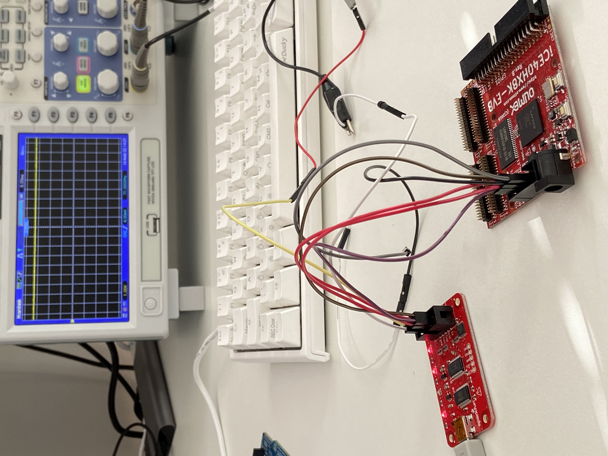

## Bus Pirate

## Configuration
```console
$ cat /etc/udev/rules.d/53-lattice-ftdi.rules
SUBSYSTEM=="tty", ATTRS{idVendor}=="0403", ATTRS{idProduct}=="6001", ATTRS{serial}=="A10KM11W", MODE="0660", SYMLINK+="buspirate"
```

### Usage
After the Bus Pirate (BP) as been connected using the USB cable we should be
able to connect to it usign minicom:
```console
$ minicom -b 115200 -8 -D /dev/buspirate
?
General                                 Protocol interaction
---------------------------------------------------------------------------
?       This help                       (0)     List current macros
=X/|X   Converts X/reverse X            (x)     Macro x
~       Selftest                        [       Start
#       Reset                           ]       Stop
$       Jump to bootloader              {       Start with read
&/%     Delay 1 us/ms                   }       Stop
a/A/@   AUXPIN (low/HI/READ)            "abc"   Send string
b       Set baudrate                    123
c/C     AUX assignment (aux/CS)         0x123
d/D     Measure ADC (once/CONT.)        0b110   Send value
f       Measure frequency               r       Read
g/S     Generate PWM/Servo              /       CLK hi
h       Commandhistory                  \       CLK lo
i       Versioninfo/statusinfo          ^       CLK tick
l/L     Bitorder (msb/LSB)              -       DAT hi
m       Change mode                     _       DAT lo
o       Set output type                 .       DAT read
p/P     Pullup resistors (off/ON)       !       Bit read
s       Script engine                   :       Repeat e.g. r:10
v       Show volts/states               .       Bits to read/write e.g. 0x55.2
w/W     PSU (off/ON)            <x>/<x= >/<0>   Usermacro x/assign x/list all
```
The `?` is a command which is sent to BP. 

We can check the version of BP that I have:
```console
HiZ>i
Bus Pirate v3b
Firmware v5.10 (r559)  Bootloader v4.4
DEVID:0x0447 REVID:0x3046 (24FJ64GA002 B8)
http://dangerousprototypes.com
```
The default baud rate for 3.0 and higher is 2M, and otherwise should be set
to 115200.

When I got this device I wanted to use the 3.3V pin to power an iCE40HZ8K-EVB
but I was not able to get it to work.

After reading through the
[user manual](http://dangerousprototypes.com/docs/Bus_Pirate_101_tutorial) I
noticed that the on-board power supply needs to be activated first:
```
HiZ>m
1. HiZ
2. 1-WIRE
3. UART
4. I2C
5. SPI
6. 2WIRE
7. 3WIRE
8. LCD
9. DIO
x. exit(without change)
Ready
SPI>W
Power supplies ON
SPI>
```
HiZ stands for high impedance mode (HiZ) which is a a safe mode with all outputs
disabled.

After doing that I can see the Mode led is on as is the VREG led is also on, and
with the oscilloscope we can verify the voltage is indeed now 3.3V:




### Probe
```console
$ flashrom -p buspirate_spi:dev=/dev/ttyUSB0
flashrom v1.2 on Linux 5.13.14-200.fc34.x86_64 (x86_64)
flashrom is free software, get the source code at https://flashrom.org

Using clock_gettime for delay loops (clk_id: 1, resolution: 1ns).
Bus Pirate firmware 6.1 and older does not support SPI speeds above 2 MHz. Limiting speed to 2 MHz.
It is recommended to upgrade to firmware 6.2 or newer.
Found Eon flash chip "EN25QH16" (2048 kB, SPI) on buspirate_spi.
```
