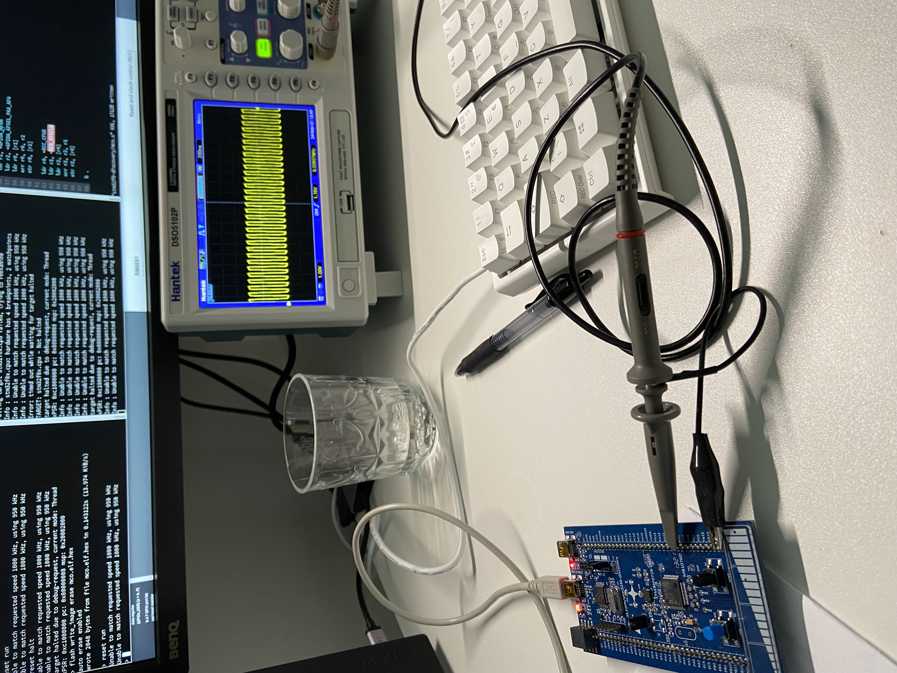
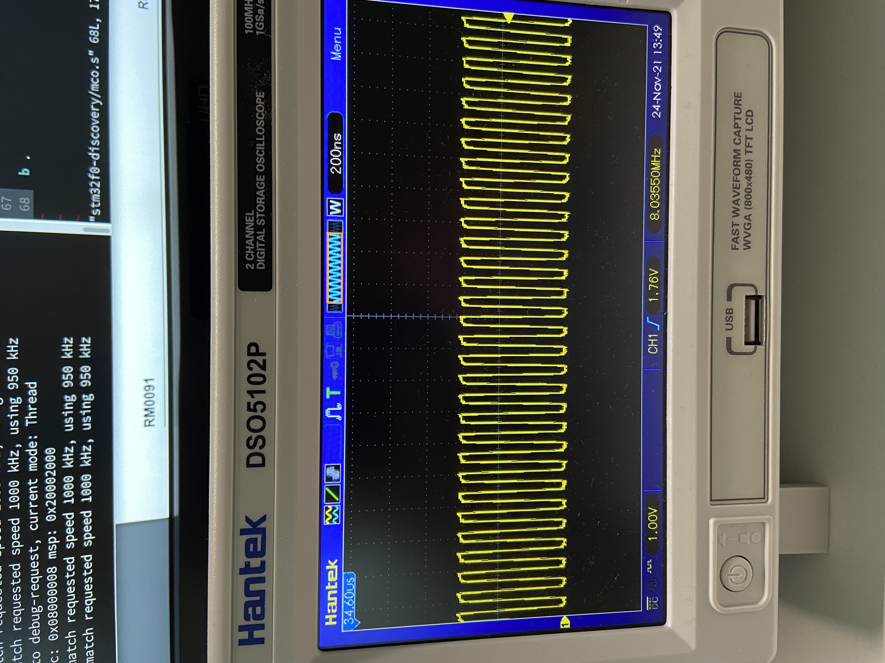
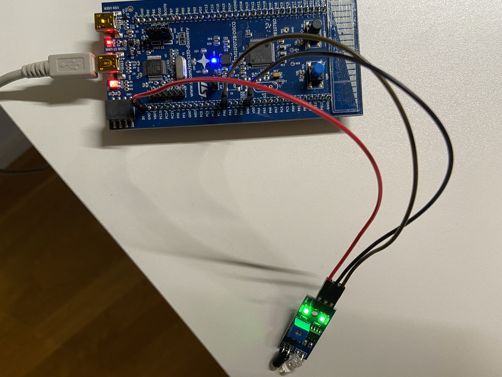
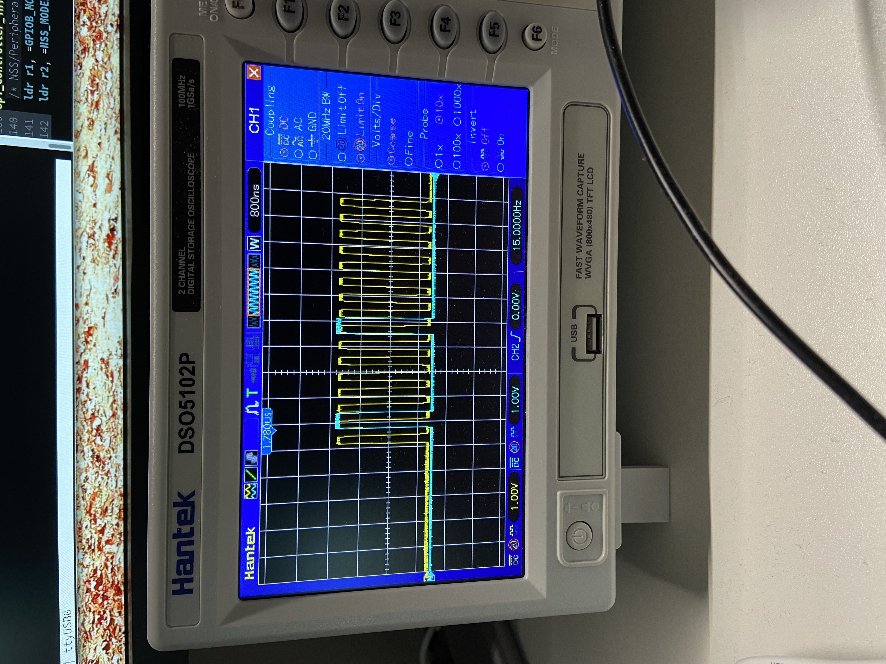
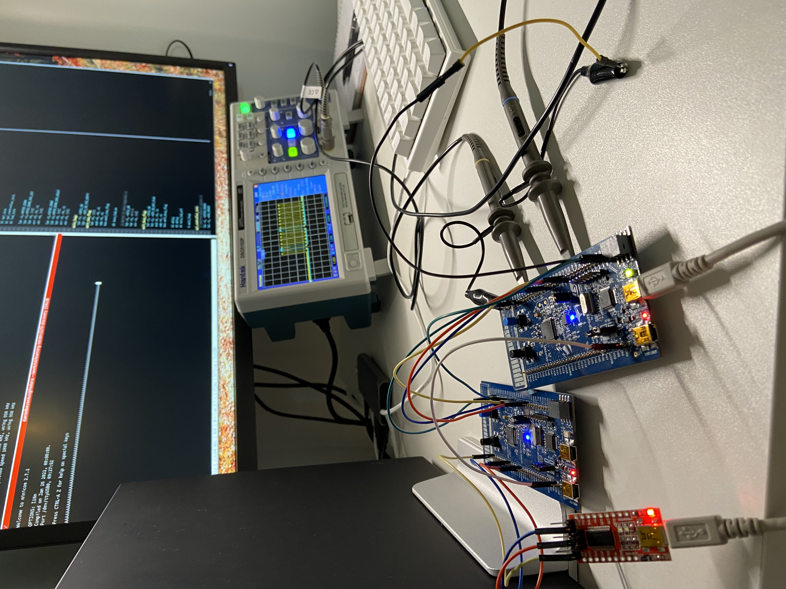

### Cortex-m notes

### General Purpose I/O (GPIO)
These are for things like LED, LCD, KEYPAD, SWITCH etc.
When dealing with GPIO peripheral you have to deal with at least 2 registers,
the data register and the direction register (either input or output).

### Special Purpose I/O
For I²C, S²I, ADC, CAN, PWM, UART, TIMER.

### Ports
In the MCU pins are grouped into ports, like port A, B, C, D, F. When we access
a pin we need to specify the port that the pin belongs to.
For example:
```
PA1 = Pin 1 of Port A
```

### Buses

#### Advanced Peripheral Bus (APB)
Min of 2 clock cycles to access the peripheral
For example, this bus could connect to UART2, SP2/I2S2, SP3/I but you have to
look at the block diagram for the microncontroller that you are working with.

#### Advanced High Performance Bus (AHB)
1 clock cycle to access the peripheral.
For example, this bus could connect to GPIO Ports A, B, C, D, and H but again
you'll have to look at the block diagram for the microcontroller that you are
working with.

### Registers
ARM7TDMI uses banked registers which means that the same register my have
different values depending on the mode of the processor. For ARM7TDMI there
are USER/SYSTEM, Supervisor, Abort, Undefined, Interrupt, and Fast Interrupt
modes (TDMI = Thumb, Debug Extension, Multiplier, Embedded ICE MacroCell).

In cortex-m there are only two modes, Handler mode and Thread mode.
So for example in Supervisor mode the registers r13 and r14 will contain values
different from the other modes if the mode is switched into Supervisor mode even
though the registers are accessed with the same register name.

Cortex-m has 17 general puprose registers, 1 status register, and 3 interrupt
mask registers.
```
r13 is the stack pointer register (SP).
r14 is the link register (LR)
r15 is the program counter (PC)
```


Special registers:
```
APSR/EPSR/IPSR
PRIMASK
FAULTMASK
BASEPRI
CONTROL
```
These registers are accessed using two operations,  MRS, and MSR for reading
and writing to these special registiers.

#### APSR/EPSR/IPSR
Application Program State Register, Execution Program State Regiser, and
Interrupt Program State Register.
```
31                                                                  0
+-------------------------------------------------------------------+
|N|Z|C|V|Q| | | | | | | | | | | | | | | | | | | | | | | | | | | | | |
+-------------------------------------------------------------------+
| | | | | | | | | | | | | | | | | | | | | | | | | | | | | | | | | | |
+-------------------------------------------------------------------+
| | | | | | | | | | | | | | | | | | | | | | | | | | | | | | | | | | |
+-------------------------------------------------------------------+

N = Negation flag
Z = Zero flag
C = Carry flag
V = Overflog flag
Q = Sticky flag
```

### Vector table
```
Exception Type                  Exception No          Vector address
Top of Stack                    -                     0x0000 0000
Reset                           1                     0x0000 0004
NMI                             2                     0x0000 0008
Hard Fault                      3                     0x0000 000C
Memory management fault         4                     0x0000 0010
Bus fault                       5                     0x0000 0014
Usage fault                     6                     0x0000 0018
Svcall                          11                    0x0000 002C
Debug monitor                   12                    0x0000 0030
PendSV                          14                    0x0000 0038
SysTick                         15                    0x0000 003C
Interrups                       16                    0x0000 0040
...                             ...                   ...
```
This would look something like this in assembly:
```assembly
Vector_Table:                        // Vector                     Exception Nr 
  .word     0x20002000               // Initial Stack Pointer value       -
  .word     start + 1                // Reset                             1
  .word     null_handler + 1         // Non Maskable Interrupt            2
  .word     null_handler + 1         // Hard Fault                        3
  .word     null_handler + 1         // Memory Fault                      4
  .word     null_handler + 1         // Bus Fault                         5
  .word     null_handler + 1         // Usage Fault                       6
  .word     null_handler + 1         // Reserved                          7
  .word     null_handler + 1         // Reserved                          8
  .word     null_handler + 1         // Reserved                          9
  .word     null_handler + 1         // Reserved                         10
  .word     null_handler + 1         // SVCall                           11
  .word     null_handler + 1         // Debug Monitor                    12
  .word     null_handler + 1         // Reserved                         13
  .word     null_handler + 1         // Reserved for debug               14
  .word     systick_handler + 1      // SysTick                          15
```


#### Current Process State Register (CPSR)
TODO: move this to an arm7tdmi doc.
```
31                                                      0
+------------------------------------------------------------------+
|N|Z|C|V| | | | | | | | | | | | | | | | | | | |I|F|T|M₄|M₃|M₂|M₁|M₀|
+------------------------------------------------------------------+

N = Negation flag
Z = Zero flag
C = Carry flag
V = Overflog flag

I = Enable/Disable Interrupt
F = Enable/Disable Fast Interrupt
T = Status bit of the system, 1 = Thumb mode, 0 = Not Thumb (32 bit instructions)
M = Mode:
    10000 = User Mode
    10001 = FIQ Mode (Fast Interrupt Mode)
    10010 = IRQ Mode
    10011 = Supervisor Mode
    10111 = Abort Mode
    11011 = Undefined Mode
    11111 = System Mode
```

### Data flow model
```
             Data
             ↑| |          +-------------------+
             || +--------->|Instruction Decoder|
    +--------+|            +-------------------+
    |         ↓
    |      +-----------+
    |      |Sign Extend|
    |      +-----------+
    |         ↓ Read
  +----------------------------+  Rd
+-| Register File R0-R15       |←------+ 
| +----------------------------+       |
|    |A          |B          |         |
|    |         Rm+----------+|         |
|  Rn+-----------|------+   ||         |
|    |           ↓      ↓   ↓↓         |
|    | +----------+    +-------+       |
|    | |Barrel    |    | MAC   |       |
|    | |Shifter   |    +-------+       |
|    | +----------+        |           |
|    ↓    ↓ N              |           |
|  ----------------        |           |
|  \     ALU      /        |           |
|   \            /         |           |
|    ------------          |           |
|          |               ↓           |
|          +---------------------------+
|          |
|          ↓
|  +------------------+
|  | Address Register |←-------+
|  +------------------+        |
|R15       |    |       +-----------+
+-------+  |    +------>|Incrememter|
        ↓  ↓            +-----------+
        Address

MAC = Multiply Accumulate Unit
ALU = Arithmetic Login Unit
```
Sign extend converts 8 and 16 bit numbers to 32 bit numbers.

#### High Speed External (HSE)
This is a crystal oscillator, resonator, clock generating circuits. Usually
4-25MHx (this might be old figures).

#### Low Speed External (LSE)
Similar to HSE but usually very accurate. 32.768 kHz clock crystals are used to
feed the LSE. The Real Time Clock (RTC) modules uses this clock.

#### High Speed Internal (HSI)
Is an internal 8MHz clock source. RC oscillator.

#### Low Speed Internal (LSI)
Simlar to HSI but no very accurate. RC oscillator with a frequency of 40 kHz.

#### Phase Locked Loop (PLL)
Is the frequency doubling output of PLL.
TODO: explain how this works.

### Clock prescalars
The prescalar is used to divide the clock source. For example, with the default
8MHz clock on my board we would get a 8 000 000 counts per second. That is a
large number of counts and we might not require that. We can therefor divide
the clock with a number to bring the number of counts down. For example, we
could divide the clock to bring the number of counts before the under/overflow
of the counter occurs and we either poll or an interrupt is triggered:
```
Clock speed/prescalar = counts
8000000/8     = 1000000
8000000/80    = 10000 
8000000/800   = 10000
8000000/8000  = 1000
8000000/80000 = 100
```

### System clock (SYSCLK) selection
The following can be sources for this clock:
* HSI 8 MHz RC oscillator clock
* HSE oscillator clock
* PPL clock
* HSI48 48 MHz RC oscillator clock

After a system reset, the HSI oscillator is selected as system clock. So in that
case it is a 8 MHz clock.

This is an example in [stm32f0-discovery/mco.s](../stm32f0-discovery/mco.s)
which allow an oscilloscope to be connected to PA8 and see the frequency:


Here we can see that we are running at 8Mhz:


### Timer vs Clock
If the source of the clock is internal, like RC or PLL then it is called a
timer. If the clock source is externally provided to the CPU this is called
a clock.
Both are used to create delays, count events, and for measuring time between
events.

### General purpose timers
Take a look in the data sheet for the timers available, section 3.14 for the
board I'm working on.
```
General purpose:
TIM2   32-bit Up/down
TIM3   16-bit Up/down
TIM14  16-bit Up
TIM15  16-bit Up
TIM16  16-bit Up
TIM17  16-bit Up
```
So if we choose TIM2 we can look that up in the memory map section of the
reference manual:
```
0x40000000 TIM2  Bus: APB1
```
So that will be the base register for TIM2 and we can see in the data sheet that
this peripheral is connect to APB1

```
RCC_APB1ENR      0x1C

Bit 0 TIM2EN: TIM2 timer clock enable
Set and cleared by software.
  0: TIM2 clock disabled
  1: TIM2 clock enabled
```
Then we can find the registers in chapter 18 which cover TIM2 and TIM3.


#### TIM2 Status Register (TIM2_SR)
Address offset:  0x10
```
Bit 0 UIF: Update interrupt flag
This bit is set by hardware on an update event. It is cleared by software.
  0: No update occurred.
  1: Update interrupt pending. 
```

#### TIM2 Control Register 1 (TIM2_CR)
Address offset: 0x00
```
Bit 4 DIR: Direction
  0: Counter used as upcounter
  1: Counter used as downcounter

Bit 0 CEN: Counter enable
  0: Counter disabled
  1: Counter enabled
```

#### TIM2 Counter Register (TIM2_CNT)
Address offset: 0x24

#### TIM2 Prescalar (TIM2_PSC)
Address offset: 0x28

This value is that is placed in the prescalar register and can be though of as
the clock source frequence for this timer. This value will then be used with the
auto-reload value.

#### TIM2 Auto-Reload Register (TIM2_ARR)
Address offset: 0x2C
This value is used to calculate the value to be placed in the CNT register when
a counter under/over flows:
```
prescaled_clock_source / auto-reload value
```

### Timer sizes (bits)
Timers are sometimes give in bit sizes. Like the SysTick timer for example which
can have a maximum value of 2²⁴:
```
2²⁴ = 16777216
```
Now, if our clock has a frequency of 8MHz the we have the following:
```
                1
  16777216 * --------- = 2,097sec
             8000000
(max value)  (one cycle) (timer size in second)
```
So what does "timer size in seconds" mean?  
Well it means that if will take 2,097 seconds to count down from 16777216 to
zero. So we can't create a delay greater than 2,097seconds. So if we wanted to
have a delay of 5 seconds just using this setup would not work (one would have
to call the timer multiple times but it would not be possible to have a delay
of 5 seconds with just one count of the timer).


### System Timer (SysTick)
Can be used to schedule something to happen on a regular basis using an internal
clock. So any Cortex-M microcontroller will provide this. This also means that
information about this timer can be found in the
[Cortex-M User Guide](https://developer.arm.com/documentation/dui0553/latest/)
and not in the board manufactures documentation.

This is a 24 bit count-down timer that counts down from value specified in the
SYST_RVR (SysTick Reload Value Register). The value in that register is copied
into the Current Value Register (CVR). It is the value in CVR that is counted
down and once it reaches zero the value from the RVR registr will be copied
again:
```
                +------------------------+
                | Reload Value Register  |
                +------------------------+
                            ↓ (reload value copied when counter is zero)
  _   _   _     +------------------------+
_| |_| |_| |_-->| Current Value Register |
     ↑          +------------------------+
     |
(clock cycles)
Each cycle will decrement the value in the current value register.
```
So the clock source will play an important role here. The internal clock on my
board is 8MHz, that is 8000000 cycles per second. One clock cycle would the be
1/8000000 which is 12.5nsec.
So if we want to have a timer every second we could use 8000000-1 (starts
counting from zero). And half a second would be 4000000-1. So the unit here is
clock cycles that we are dealing with.

When the counter reaches zero it may raise an exception if that has been enabled
, using `TICKINT` in the CSR, and the `COUNTFLAG` bit in CSR will be set to 1.

#### SysTick Control and Status Register (SYST_CSR)
Address: `0xE000E010`  
This 32 bit register is used to enable the SysTick features.
```
Bit 16 Count Flag 1 = timer counted to 0 since last time it was read.
Bit  2 CLKSource 1 = processor clock, 0 external clock.
Bit  1 TICKINT (Tick interrupt/exception) 0 = when 0 is reached then an
       exception/interrupt will not be raised.
Bit  0 Enable 1 = enable
```


In systick.s there SYST_CSR registry is read into R1 and then we try to clear
it
```console
(gdb) l
173	systick_init:
174	  /* Clear the SysTick Control Register */
175	  ldr r1, =SYST_CSR
176	  mov r2, #0
177	  str r2, [r1]

(gdb) p/t $r1
$1 = 11100000000000001110000000010000
(gdb) si
(gdb) si
(gdb) si
$3 = 0
(gdb) p/t $r1
$4 = 11100000000000001110000000010000
```
But this register is never wrtten to.
If I try to access this memory I get:
```console
(gdb) x/t $r1
0xe000e010:	Cannot access memory at address 0xe000e010
```
So this seems to be an issue with GDB and there is a work around for it:
```console
(gdb) set mem inaccessible-by-default off
```
With that setting I'm able to see that the register is cleared:
```console
(gdb) x/t $r1
0xe000e010:	00000000000000000000000000000000
```

#### SysTick Reload Value Register (SYST_RVR)
Address: `0xE000E014`  
This register specifies the start value for the counter and is loaded into the
SYST_CVR register and the counter reaches zero.
```
Bit 0-23 Reload The value to be loaded into the SYST_CVR registry.
```


#### SysTick Current Value Register (SYST_CVR)
Address: `0xE000E018`
Returns the current value of the SysTick counter.
```
Bit 0-23 Current value.
```

#### SysTick Calibration Value Register (SYST_CVR)
Address: `0xE000E01C`


The default frequency of the clock on my board is 8MHz, so it can complete
8000000 (miljon) clock cycles per second.
So each clock cycle takes 1/8000000.

8000000 / 8 / (1000 * ms)); 


### Interrupt Vector
In the first programs I've written I've included the following:
```assembly
Vector_Table:    
  .word     0x20002000
ResetVector:
  .word     start + 1
```
The first entry is for the stack pointer:
```console
(gdb) i r sp
sp             0x20002000          0x20002000
```
So the first entry is stack pointer value to be loaded in to the SP register.
The second entry in the vector table, which is a table of function pointers,
is the ResetVector. Vector seems to mean address in this context. I think this
label can be named anything, for example ResetHandler might be clearer. So in
our case we have only setup two entries in this table of function pointers.

```
Stack Pointer value                    0x0000 0000
Reset                                  0x0000 0004
NMI (Non maskable Interrupt)           0x0000 0008
Hard Fault                             0x0000 000C
SVCall                                 0x0000 002C
PendSV                                 0x0000 0038
SysTick                                0x0000 003C
```

### Access levels
There are two different execution levels called Privileged and Unprivileged
where the latter does not have access to some system registers.
The `control` register bit 0 `nPRIV` will be 0 if in privileged mode and 1 if
in unprivileged mode.

In a Reset handler this will be zero so we are running in privileged mode:
```console
(gdb) p/t $control
$2 = 0
```

### Analog to Digital Converter (ADC)
So this is about converting an analog signal, which remember can be continuos
into a descrete signal.
The ADC samples the analog input whenever one triggers it to start conversion.
It performs a process called quantization so as to decide on the voltage level
and its binary code that gets pushed in the output register.

There are 16 pins available for ADC which are called channels:
```
PA0  ADC_IN0
PA1  ADC_IN1
PA2  ADC_IN2
...
```

So we need to select a channel, and probably enable it.
The type of scanning can be a single scan or a continuous scan.

If we look at the data sheet we can find that there is one 12-bit ADC which is
connected to the APB (Advanced Peripheral Bus).
We can then look at the memory map in the reference manual to find the address:
```
0x40012400  ADC      APB
```
```
RCC_APB2ENR
Bit 9 ADCEN: ADC interface clock enable
Set and cleared by software.
  0: ADC interface disabled
  1: ADC interface clock enabled
```

#### Interrupt and Status Register (ADC_ISR_OFFSET)
Address offset: 0x00
```
Bit 2 EOC: End of conversion flag
This bit is set by hardware at the end of each conversion of a channel when a
new data result is available in the ADC_DR register. It is cleared by software
writing 1 to it or by reading the ADC_DR register.
  0: Channel conversion not complete (or the flag event was already acknowledged
     and cleared by
software)
  1: Channel conversion complete
```

#### Data Register (ADC_DR)
Address offset:  0x40

So if we enable PA0 as an a general input pin and connect a sensors output pin
to that, in addition to GND and VCC we should be able to read a value from the
sensor:
```
 +-------+
 | O G V |
 | U N C |
 | T D C |
 | | | | |
 +-|-|-|-+
   | | |
```



### Touch Sensing Controller (TSC)
Address: 0x40024000

This works using a feature called charge transfer and two capacitors are used.
One is for the touch sensor itself, Cₓ and one is for a sampling capacitor, Cₛ.
The capacitor Cₓ is charged and the charge accumulated is transferred into
the sampling capacitor Cₛ. This process continues until the charge in Cₛ reached
a predefined limit Vᵢₕ (Input voltage, min high voltage level). This will take
a certain number of clock cycles for a non-touched sensor. When the sensor is
"touched" the charge in Cₓ will be a little higher, and this larger charge will
be transferred into Cₛ. 
```
Threshold: 18

Clock cycles    Cₓ Non-touched Cₛ
1               6              6
2               6              12
3               6              18

Clock cycles    Cₓ Touched     Cₛ
1               9              9
2               9              18
```
The above values are completely made up and are just a way to understant how I
think this works. In this case the theshold is 18 (something, perhaps micro
farads) and without the sensor being touched it would take 3 clock cycles to
reach the threshold. When the sensor it "touched" this capacitiy of Cₓ increases
and it only takes two transferrs to reach the threshold. When this happens it
is detected by TSC.

So if we want to have a touch key using the discovery board that I've got I will
need one GPIO port for the touch key, capacitor Cₓ, and also on GPIO port for
the sampling capacitor Cₛ.

The STM32F072 Discovery board I'm using has a linear touch sensor/touch key.
So this sensor can be used as a 3 position linear sensor or as 4 touch keys.
3 pairs of I/O ports are assigned to the "pad":
```
PA2, PA3 (group 1)
PA6, PA7 (group 2)
PB0, PB1 (group 3)
```
So if I want to use the first section of the "pad" as a touch key I would use
PA2 and PA3 I guess.

The following is from the discovery board data sheet
(3.13 Touch sensing controller):
```
Group              Pin
1     TSC_G1_IO1   PA0
      TSC_G1_IO2   PA1
      TSC_G1_IO3   PA2
      TSC_G1_IO4   PA3

2     TSC_G2_IO1   PA4
      TSC_G2_IO2   PA5
      TSC_G2_IO3   PA6
      TSC_G2_IO4   PA7
...
```
And if we look at the aternative function for PA2 we can see that it is AF3.
```
Pin              Alternat function      GPIOA_AFR
PA0              TSC_G1_IO1             AF3
PA1              TSC_G1_IO2             AF3
PA2              TSC_G1_IO3             AF3
PA3              TSC_G1_IO4             AF3
```
One of the GPIOs is dedicated to the sampling capacitor CS. Only one sampling
capacitor I/O per analog I/O group must be enabled at a time.

Lets start with that enabling Port A pins 2, PA2 as the key touch sensor
, and PA3, as the sampling capacitor. So I think we need to set PA2 and PA3
as the alternative functions as AF3.


Hmm, I think I've mixed things up a little here with regards to the analog to
digital converter and the touch sensing controller. I was focusing on the
sensing here and thinking that I'd be able to read the that value and convert
it to a digital signal. But the touch sensor is more about having a sensor
for an action like a button/movement. I'm going to create an example of using
just the TSC and the ADC example will use an external sensor instread.

[tsc.s](../stm32f0-discovery/tsc.s) is implementation for this section.

We also need to enabled TSC by setting TSCEN in RCC_AHBENR:
```
Bit 24 TSCEN: Touch sensing controller clock enable
Set and cleared by software.
  0: TSC clock disabled
  1: TSC clock enabled
```

#### TSC Base address
Address: 0x40024000

#### TSC I/O Analog Switch Control Register (TSC_IOASCR)
Offset: 0x18

```
These bits are set and cleared by software to enable/disable the Gx_IOy analog switch.
  0: Gx_IOy analog switch disabled (opened)
  1: Gx_IOy analog switch enabled (closed)
Note: These bits control the I/O analog switch whatever the I/O control mode is (even if
controlled by standard GPIO registers).
```
TODO: not sure if this need to be set for this example.

#### TSC I/O Sampling Control Register (TSC_IOSRC)
Offset: 0x20

This register is used to set the sampling capacitor.

```
Bits 31:0 Gx_IOy: Gx_IOy sampling mode
These bits are set and cleared by software to configure the Gx_IOy as a sampling capacitor
I/O. Only one I/O per analog I/O group must be defined as sampling capacitor.
  0: Gx_IOy unused
  1: Gx_IOy used as sampling capacitor
```
Like we mentioned above we are going to be using Group 1 and let PA3 be the
sampling capacitator, so we would set bit 2 which is G1_IO3. 

#### TSC I/O Channel Control Register (TSC_IOCCR)
Offset: 0x28

This register is used to enable a GPIO pin as a channel.
```
Bits 31:0 Gx_IOy: Gx_IOy channel mode
These bits are set and cleared by software to configure the Gx_IOy as a channel I/O.
0: Gx_IOy unused
1: Gx_IOy used as channel
```
In our case we are going to use PA2 as the channel so we need to set G1_IO3
which is bit 3.

#### TSC I/O Group Control Status Register (TSC_IOGCSR)
Offset: 0x30

This register is used to enable the TSC IO group:
```
Bits 23:16 GxS: Analog I/O group x status
These bits are set by hardware when the acquisition on the corresponding enabled analog I/O
group x is complete. They are cleared by hardware when a new acquisition is started.
  0: Acquisition on analog I/O group x is ongoing or not started
  1: Acquisition on analog I/O group x is complete

Bits 7:0 GxE: Analog I/O group x enable
These bits are set and cleared by software to enable/disable the acquisition (counter is
counting) on the corresponding analog I/O group x.
  0: Acquisition on analog I/O group x disabled
  1: Acquisition on analog I/O group x enabled
```
In our case we need to enable Group 1 which is G1E (bit 0);

#### TSC Group x counter register (TSC_IOGxCR) 
Where x can be any of the 1-8 groups.
Address Offset: 0x30 + (0x04 * group nr)
This register is a register per group which holds the count of the charge
transfers from Cₓ to the sampling capacitor Cₛ.

```
Bits 13:0 CNT[13:0]: Counter value
These bits represent the number of charge transfer cycles generated on the
analog I/O group x to complete its acquisition (voltage across CS has reached
the threshold).
```
This offset would be 0x34 for group 1.


#### TSC Control Register (TSC_CR)
Offset:  0x00
```
Bit 1 START: Start a new acquisition
This bit is set by software to start a new acquisition. It is cleared by
hardware as soon as the acquisition is complete or by software to cancel the
ongoing acquisition.
  0: Acquisition not started
  1: Start a new acquisition

Bit 0 TSCE: Touch sensing controller enable
This bit is set and cleared by software to enable/disable the touch sensing
controller.
  0: Touch sensing controller disabled
  1: Touch sensing controller enabled
Note: When the touch sensing controller is disabled, TSC registers settings
have no effect
```

#### TSC Interrupt Status Register (ISR)
Offset: 0x0C
```
Bit 0 EOAF: End of acquisition flag
This bit is set by hardware when the acquisition of all enabled group is
complete (all GxS bits of all enabled analog I/O groups are set or when a max
count error is detected). It is cleared by software writing 1 to the bit EOAIC
of the TSC_ICR register.
  0: Acquisition is ongoing or not started
  1: Acquisition is complete
```

#### TSC I/O Channel Control Register (TSC_IOCCR)
Offset: 0x28
```
```

### Interrupts
In Cortex-m there is a hardward component in the processor named Nested Vector
Interrupt Controller (NVIC) that handles interrups, which are called exceptions
in ARM. So peripherals like UART, Timers can generate interrupts. 

The SYSTICK timer can be set to enable interrupts and have an interrupt handler
called when the interrupt event happens. And example of this can be found in
[systickint.s](../stm32f0-discovery/systickint.s).

One thing to note about the vector table is the addition of 1 to the function
pointer addresses:
```assembly
Vector_Table:                        // Vector                     Exception Nr 
  .word     0x20002000               // Initial Stack Pointer value       -
  .word     start + 1                // Reset                             1
  .word     null_handler + 1         // Non Maskable Interrupt            2
```
The +1 is so that the least significant bit be 1 for Thumb
code. If bit[0] is 0 it seems that will clear the Thumb state and will result
in a fault of lockup:

### Serial Peripheral Interface
Can be used with an interrupt or by polling and requires 4 pins for
communication. The wires uses are the same as described in
[Serial Peripheral Interface (SPI)](../README.md#serial-peripheral-interface-(spi)
but the Chip Select is called NSS instead and can have one of following
functions:
* Chip Select (normal peripheral select)
* Synchronize the data frame
* Detect a conflict between masters

The board I'm working on has two SPIs that are capable of communicating at
18Mbit/s.

SPI base addresses:
```
SPI1 base address: 0x40013000, APB bus
SPI2 base address: 0x40003800, APB bus
```

SPI1 uses RCC_APB2ENR to enable its clock:
```
Bit 12 SPI1EN: SPI1 clock enable
Set and cleared by software.
  0: SPI1 clock disabled
  1: SPI1 clock enabled
```
SPI2 uses RCC_APB1ENR to enable its clock:
```
Bit 14 SPI2EN: SPI2 clock enable
Set and cleared by software.
  0: SPI2 clock disabled
  1: SPI2 clock enabled
```

And we need four pins, one for clock, one for COPI, one for CIPO which are
normal GPIO pins, and one for NSS (Peripheral Select). We need to see where
these pins are on our board.  We can lookup this information in the boards data
sheet in Table 14 "pin definitions" page 38:
```
PA4   SPI1_NSS  (Peripheral select)
PA5   SPI1_SCL  (Clock)
PA6   SPI1_MISO (Master Input Slave Output)
PA7   SPI1_MOSI (Master Output Slave Input)
```
And if we look in Table 15 on page 44 we can see what Alternative Function we
need to configure these pins to enable SPI:
```
PA4  SPI1_NSS  AF0
PA5  SPI1_SCL  AF0
PA6  SPI_MISO  AF0
PA7  SPI_MOSI  AF0
```

For SPI2 we can use:
```
PB12  SPI2_NSS  (Peripheral select)
PB13  SPI2_SCL  (Clock)
PB14  SPI2_MISO (Master Input Slave Output)
PB15  SPI2_MOSI (Master Output Slave Input)

PB12  SPI2_NSS  AF0
PB13  SPI2_SCL  AF0
PB14  SPI2_MISO AF0
PB15  SPI2_MOSI AF0
```
One thing to note is that I ran into an issue when using SPI1 and using the same
code worked when switching to SPI2. The problem I ran into was related to the
Controller Output Peripheral Input (COPI) line. I could see that the data
signal was the same all the time regardless of the data being sent, it almost
looked like a clock signal where it should have been sending the character `A`
so 100001 (high low low low low low high). This is what the signal looks like
when using SPI2.


#### SPI Control Register 1 (SPIx_CR1)
Offset: 0x00
Recall that there are two SPIs on my board and they have different base
addresses which is the reason for the x above.

```
Bit 6 SPE: SPI enable
  0: Peripheral disabled
  1: Peripheral enabled

Bits 5:3 BR[2:0]: Baud rate control
  000: fPCLK/2
  001: fPCLK/4
  010: fPCLK/8
  011: fPCLK/16
  100: fPCLK/32
  101: fPCLK/64
  110: fPCLK/128
  111: fPCLK/256

Bit 2 MSTR: Master selection
  0: Slave configuration
  1: Master configuration

Bit1 CPOL: Clock polarity
  0: CK to 0 when idle
  1: CK to 1 when idle

Bit 0 CPHA: Clock phase
  0: The first clock transition is the first data capture edge
  1: The second clock transition is the first data capture edge
```

#### SPI Control Register 2 (SPIx_CR2)
Offset: 0x04

#### SPI Status Register (SPIx_SR)
Offset: 0x08

```
Bit 1 TXE: Transmit buffer empty
  0: Tx buffer not empty
  1: Tx buffer empty
Bit 0 RXNE: Receive buffer not empty
  0: Rx buffer empty
  1: Rx buffer not empty
```
#### SPI Data Register (SPIxDR)
Offset: 0x08
```
Bits 15:0 DR[15:0]: Data register
Data received or to be transmitted
The data register serves as an interface between the Rx and Tx FIFOs.
```

#### SPI Example
The example for SPI consists of two discovery boards connected to each other,
where [spi-c.s](../stm32f0-discovery/spi-c.s) is the controller which sends
a character (currently `A`) to [spi-p.s](../stm32f0-discovery/spi-p.s) which is
the peripheral. The peripheral then uses UART to send that character out which
can be displayed using minicom.



### Inter-integrated circuit (I²C)
* Standard Mode (Sm) up to 100kHz
* Fast Mode (Fm) up to 400kHz
* Fast Mode plus (Fm+) up to 1MHz

It is also SMBus and PMBus (power management bus) compatible.

My board has two I²C interfaces named I2C1 and IC22:
```
I2C1 base address: 0x40005400   APB
I2C2 base address: 0x40005800   APB
```
The clocks can be enabled by using RCC_APB1ENR:
```
Bit 22 I2C2EN: I2C2 clock enable
Set and cleared by software.
  0: I2C2 clock disabled
  1: I2C2 clock enabled
Bit 21 I2C1EN: I2C1 clock enable
Set and cleared by software.
  0: I2C1 clock disabled
  1: I2C1 clock enabled
```
If I2C1 is used the following GPIO pins are available:
```
PB6  I2C1_SCL    AF1
PB7  I2C1_SDA    AF1

PB8  I2C1_SCL    AF1
PB9  I2C1_SDA    AF1
```
If I2C2 is used the following GPIO pins are available:
```
PB10 I2C2_SCL    AF1
PB11 I2C2_SDA    AF1

PB13 I2C2_SCL    AF1
PB14 I2C2_SDA    AF1
```

The I2CCLK is an independent clock source and can be either `SYSCLK` or `HSI`
which is chosen by setting `RCC_I2C1SW`

#### Clock configuration register 3 (RCC_CFGR3)
Offset (From RCC): 0x30
```
Bit 4 I2C1SW: I2C1 clock source selection
This bit is set and cleared by software to select the I2C1 clock source.
  0: HSI clock selected as I2C1 clock source (default)
  1: System clock (SYSCLK) selected as I2C1 clock
```
So by default we will have 8MHz I2CCLK.

The I2C is clocked by `I2CCLK`. Before enabling the peripheral I2C master clock
must be configured by setting the `SCLH`, and `SCLL` bits in `I2C_TIMINGR`.
These fields are for configuring the SCL (the clock wire) high and low values.
Take the START condition which where the controller will pull SDA low while
SCL is high. Both sides need to know how long the controller will hold SDA low
in order for that to indicate that a start condition is meant (at least this is
what I think these configuration options are).

The I2C spec defines two values named t_f and t_r.

t_f (f for fall) is the time it takes to fall from 70% - 30% on the falling
edge:
```
------
      \ 70 %   ↑
       \       | ←--- t_f
        \ 30 % ↓
         -------
```
t_r (r for raise) is the time it takes to raise from 30% - 70% on the raisning
edge:
```
          ------------
         / 70%  ↑
        /       | ←--- t_r
       / 30%    ↓
-------
```

#### Hold time for Start Condition
As mentioned previously the start condition is when the SDA is pulled low before
SCL is pulled low (so SCL is high) and there is a hold time associated with this
state called Hold Time for Start Condition (t_hd:STA) and this specified the min
time that SDA should be held low before SCL can be pulled low.
t_hd:STA is measured as the time taken from 30% amplitude of the SDA falling
(from high to low) to 70% of the amplitude of SCL falling (from high to low):
```
SDA   ------
            \ 70%   
             \       
              \ 30% 
               -------
              ↑   
              |----------------|
                 t_hd:STA      ↓
SCL   -------------------------
                               \ 70%
                                \  
                                 \ 30%
                                  -------
```

#### Setup time
Is the amount of time data must remain stable before it is sampled.

Start setup time is only taken into account for a repeated start condition.

#### Hold time
Is the time interval after sampling of data has been initiated.
```
              HD:DAT
                |
                ↓
            |-| |----|
         ----      
        /    \
       /      \
SCL ---        -----


SDA ---------------\
                    \
                     -----
               |----|
               HD:DAT
```

Start hold time sets the min time SDA should be low before SCL goes high.

#### Control Register 1 (I2C_CR1)
Offset: 0x00

```
Bit 0 PE: Peripheral enable
0: Peripheral disable
1: Peripheral enable

The I2C can be enabled by setting the PE bit in the I2C_CR1 register.
```

#### Control Register 2 (I2C_CR2)
Offset: 0x04

```
Bit 25 AUTOEND: Automatic end mode (master mode)
This bit is set and cleared by software.
  0: software end mode: TC flag is set when NBYTES data are transferred,
     stretching SCL low.
  1: Automatic end mode: a STOP condition is automatically sent when NBYTES
     data are transferred.

Bits 23:16 NBYTES[7:0]: Number of bytes
The number of bytes to be transmitted/received is programmed there. This field
is don’t care in slave mode with SBC=0.
Note: Changing these bits when the START bit is set is not allowed.

Bit 15 NACK: NACK generation (slave mode)
The bit is set by software, cleared by hardware when the NACK is sent, or when
a STOP condition or an Address matched is received, or when PE=0.
  0: an ACK is sent after current received byte.
  1: a NACK is sent after current received byte.

Bit 14 STOP: Stop generation (master mode)
The bit is set by software, cleared by hardware when a Stop condition is
detected, or when PE = 0.
In Master Mode:
  0: No Stop generation.
  1: Stop generation after current byte transfer.

Bit 13 START: Start generation
This bit is set by software, and cleared by hardware after the Start followed
by the address sequence is sent, by an arbitration loss, by a timeout error
detection, or when PE = 0. It can also be cleared by software by writing ‘1’ to
the ADDRCF bit in the I2C_ICR register.
  0: No Start generation.
  1: Restart/Start generation:
– If the I2C is already in master mode with AUTOEND = 0, setting this bit
generates a Repeated Start condition when RELOAD=0, after the end of the NBYTES
transfer.
– Otherwise setting this bit will generate a START condition once the bus is
free

Bit 11 ADD10: 10-bit addressing mode (master mode)
  0: The master operates in 7-bit addressing mode,
  1: The master operates in 10-bit addressing mode

Bit 10 RD_WRN: Transfer direction (master mode)
  0: Master requests a write transfer.
  1: Master requests a read transfer.

Bits 9:8 SADD[9:8]: Slave address bit 9:8 (master mode)
In 7-bit addressing mode (ADD10 = 0):
These bits are don’t care
In 10-bit addressing mode (ADD10 = 1):
These bits should be written with bits 9:8 of the slave address to be sent
Note: Changing these bits when the START bit is set is not allowed.

Bits 7:1 SADD[7:1]: Slave address bit 7:1 (master mode)
In 7-bit addressing mode (ADD10 = 0):
These bits should be written with the 7-bit slave address to be sent
In 10-bit addressing mode (ADD10 = 1):
These bits should be written with bits 7:1 of the slave address to be sent.
Note: Changing these bits when the START bit is set is not allowed.

Bit 0 SADD0: Slave address bit 0 (master mode)
In 7-bit addressing mode (ADD10 = 0):
This bit is don’t care
In 10-bit addressing mode (ADD10 = 1):
This bit should be written with bit 0 of the slave address to be sent

```

### Own Address 1 Register (I2C_OAR1)
Offset: 0x08

```
Bit 15 OA1EN: Own Address 1 enable
  0: Own address 1 disabled. The received slave address OA1 is NACKed.
  1: Own address 1 enabled. The received slave address OA1 is ACKed.

Bits 7:1 OA1[7:1]: Interface address
7-bit addressing mode: 7-bit address
10-bit addressing mode: bits 7:1 of 10-bit address
```
I'm currenlty now sure about the difference between Own Address 1 and Own
Address 2. TODO: clarify/explain the differences between these.


### Own Address 1 Register (I2C_OAR1)
Offset: 0x0C

```
Bit 15 OA2EN: Own Address 2 enable
  0: Own address 2 disabled. The received slave address OA2 is NACKed.
  1: Own address 2 enabled. The received slave address OA2 is ACKed.

Bits 7:1 OA2[7:1]: Interface address
7-bit addressing mode: 7-bit address
```

### Interrupt and status register (I2C_ISR)
Offset: 0x18

```
Bits 23:17 ADDCODE[6:0]: Address match code (Slave mode)
These bits are updated with the received address when an address match event
occurs (ADDR = 1).


Bit 16 DIR: Transfer direction (Slave mode)
This flag is updated when an address match event occurs (ADDR=1).
  0: Write transfer, slave enters receiver mode.
  1: Read transfer, slave enters transmitter mode

Bit 15 BUSY: Bus busy
This flag indicates that a communication is in progress on the bus. It is set
by hardware when a START condition is detected. It is cleared by hardware when
a Stop condition is detected, or when PE=0

Bit 6 TC: Transfer Complete (master mode)
This flag is set by hardware when RELOAD=0, AUTOEND=0 and NBYTES data have been
transferred. It is cleared by software when START bit or STOP bit is set.

Bit 3 ADDR: Address matched (slave mode)
This bit is set by hardware as soon as the received slave address matched with
one of the enabled slave addresses. It is cleared by software by setting ADDRCF
bit.

Bit 2 RXNE: Receive data register not empty (receivers)
This bit is set by hardware when the received data is copied into the I2C_RXDR
register, and is ready to be read. It is cleared when I2C_RXDR is read. 


Bit 1 TXIS: Transmit interrupt status (transmitters)
This bit is set by hardware when the I2C_TXDR register is empty and the data to
be transmitted must be written in the I2C_TXDR register. It is cleared when the
next data to be sent is written in the I2C_TXDR register. 

Bit 0 TXE: Transmit data register empty (transmitters)
This bit is set by hardware when the I2C_TXDR register is empty. It is cleared
when the next data to be sent is written in the I2C_TXDR register. 
```

### Receive Data Register (I2C_RXDR)
Offset: 0x24

```
Bits 7:0 RXDATA[7:0] 8-bit receive data
Data byte received from the I2C bus
```

### Transmit Data Register (I2C_TXDR)
Offset: 0x28

```
Bits 7:0 TXDATA[7:0] 8-bit transmit data
Data byte to be transmitted to the I2C bus.
Note: These bits can be written only when TXE=1
```

### Timing Register (I2C_TIMINGR)
The controller and the peripherals need to be configured correctly to allow for
the correct data hold times and set up times. 


Offset: 0x10

```
Bits 31:28 PRESC[3:0]: Timing prescaler
This field is used to prescale I2CCLK in order to generate the clock period
tPRESC used for data setup and hold counters and for SCL high and low level
counters.

Bits 23:20 SCLDEL[3:0]: Data setup time
This field is used to generate a delay tSCLDEL between SDA edge and SCL rising
edge. In master mode and in slave mode with NOSTRETCH = 0, the SCL line is
stretched low during tSCLDEL.

tSCLDEL = (SCLDEL+1) x tPRESC

Bits 15:8 SCLH[7:0]: SCL high period (master mode)
This field is used to generate the SCL high period in master mode.

Bits 7:0 SCLL[7:0]: SCL low period (master mode)
This field is used to generate the SCL low period in master mode

```
