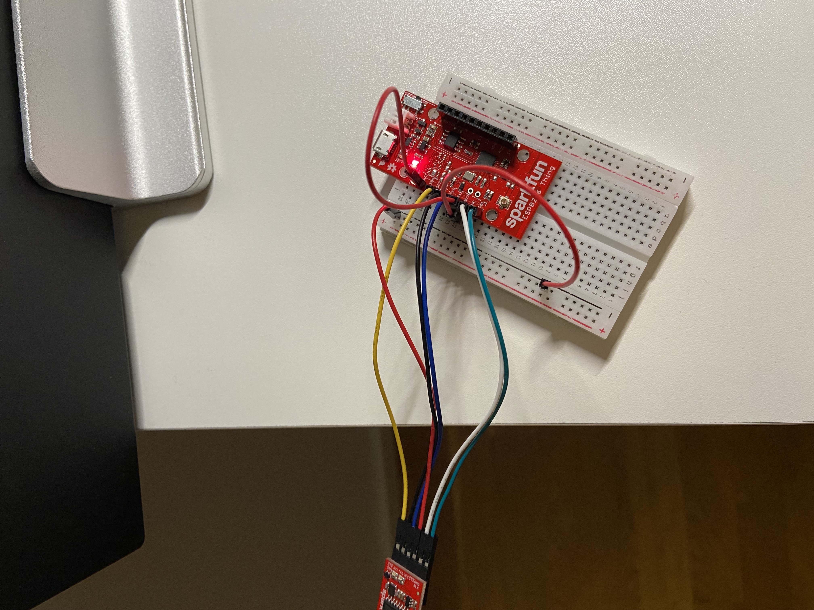

### ESP8266
Is a microcontroller from Espressif Systems and contains WiFi.

ESP32 is a dual core 160MHz-240MHz CPU where as the ESP8266 is a single core
that runs at 80MHz. Both are 32-bits processors. ESP32 is the successor 

The microcontroller unit on these chips are from Xtensa.

I've got a SparkFun development board ESP8266 Thing.


### Connecting the USB to Serial USB board

```
                                       Serial Basic board
    +--------+                           +----------+
    |(I²C)GND|--                       --|GND       |
    |(I²C)3V3|--                       --|CTS       |  
    |(I²C)SDA|--                       --|VCC  +----+  V
    |(I²C)SCL|--                       --|TX0  |USB |
    |     DTR|--                       --|RX1  +----+
    |     TXO|--                       --|DTR       |  
    |     RX0|--                         +----------+
    |     3V3|--
    |      NC|--
    |     GND|--
    +--------+
GND = Ground (I²C)                       GND = Ground
SDA = Serial Data (I²C)                  CTS = Clear to Send (I²C). Clear To Send (the receiver side is ready)
SCL = Serial Clock (I²C)                 VCC = Voltage Common Collector (I²C) . Power input of the device
DTR = Data Terminal Ready                TX0 = Transmit output
TX0 = Transmit output 0                  RX1 = Recieve input
3V3 = 3.3 Volage                         DTR = Data Terminal Ready (device ready to received/initiate communication)
NC  = Not Connected to anything
```
From the serial basic board the connections look like this:
* Ground which is connected to ground.
* CTS is connected to NC (why?)
* VCC is connected to 3V3 which I think makes sense
* TX0 is connected to RX0
* RX1 is connected to TX0
* DTR is connected to DTR  (I guess this means they are connected)?

We can use one USB cable if we connect the 3V3 to the (I²C)3V3 above:




### Serial Basic 
This is a USB to serial board similar to FTDI Basic.
Computers used to have RS-232 9-pin or 25-pin serial ports on the back for
connecting to peripherals. In the late 90's USB began to take over and has the
advantage of supplying power to the attached peripheral and more.
An USB to serial bridge is a way to emulate the software interface of a serial
port via standard drivers and allows the user to treat the USB device as though
it were a standard serial port.


### crosstool-NG
This is a cross compiler toolchain I think.


### xtensa
This is the chips are from Xtensa.


### ESP IoT Development Framework (IDF)


### xtensa toolchain
Download and unpack:
https://dl.espressif.com/dl/xtensa-lx106-elf-gcc8_4_0-esp-2020r3-linux-amd64.tar.gz

This contains compilers/assemblers, linkers and tools like, `as`, `gcc`, `g++`
`nm`, `ld`, `objdump` ets. All are specific used for cross compiling. The
can be found in the `bin` directory:
```console
$ ls bin/
xtensa-lx106-elf-addr2line  xtensa-lx106-elf-cpp           xtensa-lx106-elf-gcc-ar      xtensa-lx106-elf-gdb      xtensa-lx106-elf-objdump
xtensa-lx106-elf-ar         xtensa-lx106-elf-ct-ng.config  xtensa-lx106-elf-gcc-nm      xtensa-lx106-elf-gprof    xtensa-lx106-elf-ranlib
xtensa-lx106-elf-as         xtensa-lx106-elf-elfedit       xtensa-lx106-elf-gcc-ranlib  xtensa-lx106-elf-ld       xtensa-lx106-elf-readelf
xtensa-lx106-elf-c++        xtensa-lx106-elf-g++           xtensa-lx106-elf-gcov        xtensa-lx106-elf-ld.bfd   xtensa-lx106-elf-size
xtensa-lx106-elf-cc         xtensa-lx106-elf-gcc           xtensa-lx106-elf-gcov-dump   xtensa-lx106-elf-nm       xtensa-lx106-elf-strings
xtensa-lx106-elf-c++filt    xtensa-lx106-elf-gcc-8.4.0     xtensa-lx106-elf-gcov-tool   xtensa-lx106-elf-objcopy  xtensa-lx106-elf-strip
```
So this allows us to compiler and link assembler, C, C++ programs into machine
code that can execute on a xtensa processor

We need to add the this bin directory to our PATH. I've done this in a
setenv.sh file.

### SDK
This is a 
```console
$ git clone --recursive https://github.com/espressif/ESP8266_RTOS_SDK.git
`

```console
$ . ./setenv.sh
```

```console
python -m pip install --user -r $IDF_PATH/requirements.txt
```

### Example project
This section will take a closer look at the example project that is part of the
SDK which can be used as a template.

Start by copying the hello_world example:
```console
$ cp -r $IDF_PATH/examples/get-started/hello_world .
$ cd hello_world
$ ls 
CMakeLists.txt  main  Makefile  README.md
```
If we take a closer look at the Makefile it simply includes 
.IDF_PATH)/make/project.mk and simlarliy for the CMake file.

There is a `help` target with some details about the targets available.
```console
$ make help
Toolchain path: /home/danielbevenius/work/iot/esp/xtensa-lx106-elf/bin/xtensa-lx106-elf-gcc
Toolchain version: esp-2020r3-49-gd5524c1
Compiler version: 8.4.0
Python requirements from /home/danielbevenius/work/iot/esp/ESP8266_RTOS_SDK/requirements.txt are satisfied.
Welcome to Espressif IDF build system. Some useful make targets:

make menuconfig - Configure IDF project
make defconfig - Set defaults for all new configuration options

make all - Build app, bootloader, partition table
make flash - Flash app, bootloader, partition table to a chip
make clean - Remove all build output
make size - Display the static memory footprint of the app
make size-components, size-files - Finer-grained memory footprints
make size-symbols - Per symbol memory footprint. Requires COMPONENT=<component>
make erase_flash - Erase entire flash contents
make erase_otadata - Erase ota_data partition; First bootable partition (factory or OTAx) will be used on next boot.
                     This assumes this project's partition table is the one flashed on the device.
make monitor - Run idf_monitor tool to monitor serial output from app
make simple_monitor - Monitor serial output on terminal console
make list-components - List all components in the project

make app - Build just the app
make app-flash - Flash just the app
make app-clean - Clean just the app
make print_flash_cmd - Print the arguments for esptool when flash
make check_python_dependencies - Check that the required python packages are installed

See also 'make bootloader', 'make bootloader-flash', 'make bootloader-clean', 
'make partition_table', etc, etc.
```


### Connecting the device
So we need to connect the device and I'm using USB to do this. This will be
discovered by the system and we can get details about this new device in a few
ways. One is to use `dmesg`.

```console
$ dmesg -w
```
`-w` is the follow flag so we should be able to see the new device showing up
in the console:
```console
[696846.518822] usb 1-2: new full-speed USB device number 43 using xhci_hcd
[696846.646023] usb 1-2: New USB device found, idVendor=1a86, idProduct=7523, bcdDevice= 2.64
[696846.646037] usb 1-2: New USB device strings: Mfr=0, Product=2, SerialNumber=0
[696846.646042] usb 1-2: Product: USB Serial
[696846.694744] usbcore: registered new interface driver ch341
[696846.694755] usbserial: USB Serial support registered for ch341-uart
[696846.694772] ch341 1-2:1.0: ch341-uart converter detected
[696846.695431] usb 1-2: ch341-uart converter now attached to ttyUSB0
```
Notice that we find the device for this and in this case it is `ttyUSB0`.
```console
$ file /dev/ttyUSB0 
/dev/ttyUSB0: character special (188/0)
```
We can find out details about this USB device using the `device number` above
which is in this case is `43`:
```console
$ lsusb -v -s 43

Bus 001 Device 043: ID 1a86:7523 QinHeng Electronics CH340 serial converter
Couldn't open device, some information will be missing
Device Descriptor:
  bLength                18
  bDescriptorType         1
  bcdUSB               1.10
  bDeviceClass          255 Vendor Specific Class
  bDeviceSubClass         0 
  bDeviceProtocol         0 
  bMaxPacketSize0         8
  idVendor           0x1a86 QinHeng Electronics
  idProduct          0x7523 CH340 serial converter
  bcdDevice            2.64
  iManufacturer           0 
  iProduct                2 USB Serial
  iSerial                 0 
  bNumConfigurations      1
  Configuration Descriptor:
    bLength                 9
    bDescriptorType         2
    wTotalLength       0x0027
    bNumInterfaces          1
    bConfigurationValue     1
    iConfiguration          0 
    bmAttributes         0x80
      (Bus Powered)
    MaxPower               98mA
    Interface Descriptor:
      bLength                 9
      bDescriptorType         4
      bInterfaceNumber        0
      bAlternateSetting       0
      bNumEndpoints           3
      bInterfaceClass       255 Vendor Specific Class
      bInterfaceSubClass      1 
      bInterfaceProtocol      2 
      iInterface              0 
      Endpoint Descriptor:
        bLength                 7
        bDescriptorType         5
        bEndpointAddress     0x82  EP 2 IN
        bmAttributes            2
          Transfer Type            Bulk
          Synch Type               None
          Usage Type               Data
        wMaxPacketSize     0x0020  1x 32 bytes
        bInterval               0
      Endpoint Descriptor:
        bLength                 7
        bDescriptorType         5
        bEndpointAddress     0x02  EP 2 OUT
        bmAttributes            2
          Transfer Type            Bulk
          Synch Type               None
          Usage Type               Data
        wMaxPacketSize     0x0020  1x 32 bytes
        bInterval               0
      Endpoint Descriptor:
        bLength                 7
        bDescriptorType         5
        bEndpointAddress     0x81  EP 1 IN
        bmAttributes            3
          Transfer Type            Interrupt
          Synch Type               None
          Usage Type               Data
        wMaxPacketSize     0x0008  1x 8 bytes
        bInterval               1
```

We can update the sdkconfig file and set `CONFIG_ESPTOOLPY` to be
`/dev/ttyUSB0`. This can be done with `make menuconfig`.

Now we should be able to `flash` the device with this projects code:
```consle
$ make flash
...
Python requirements from /home/danielbevenius/work/iot/esp/ESP8266_RTOS_SDK/requirements.txt are satisfied.
Flashing binaries to serial port /dev/ttyUSB0 (app at offset 0x10000)...
esptool.py v2.4.0
Traceback (most recent call last):
  File "/home/danielbevenius/.local/lib/python3.9/site-packages/serial/serialposix.py", line 322, in open
    self.fd = os.open(self.portstr, os.O_RDWR | os.O_NOCTTY | os.O_NONBLOCK)
PermissionError: [Errno 13] Permission denied: '/dev/ttyUSB0'

During handling of the above exception, another exception occurred:

Traceback (most recent call last):
  File "/home/danielbevenius/work/iot/esp/ESP8266_RTOS_SDK/components/esptool_py/esptool/esptool.py", line 3034, in <module>
    _main()
  File "/home/danielbevenius/work/iot/esp/ESP8266_RTOS_SDK/components/esptool_py/esptool/esptool.py", line 3027, in _main
    main()
  File "/home/danielbevenius/work/iot/esp/ESP8266_RTOS_SDK/components/esptool_py/esptool/esptool.py", line 2735, in main
    esp = chip_class(args.port, initial_baud, args.trace)
  File "/home/danielbevenius/work/iot/esp/ESP8266_RTOS_SDK/components/esptool_py/esptool/esptool.py", line 212, in __init__
    self._port = serial.serial_for_url(port)
  File "/home/danielbevenius/.local/lib/python3.9/site-packages/serial/__init__.py", line 90, in serial_for_url
    instance.open()
  File "/home/danielbevenius/.local/lib/python3.9/site-packages/serial/serialposix.py", line 325, in open
    raise SerialException(msg.errno, "could not open port {}: {}".format(self._port, msg))
serial.serialutil.SerialException: [Errno 13] could not open port /dev/ttyUSB0: [Errno 13] Permission denied: '/dev/ttyUSB0'
make: *** [/home/danielbevenius/work/iot/esp/ESP8266_RTOS_SDK/components/esptool_py/Makefile.projbuild:76: flash] Error 1
```
This was because while I added my user to the dailout group I had not restarted
a session. But this can be done using:
```console
$ sudo usermod -a -G dialout $USER
$ su - $USER
```
Don't forget to run the `setenv.sh` script as well. 
```console
$ make flash
Toolchain path: /home/danielbevenius/work/iot/esp/xtensa-lx106-elf/bin/xtensa-lx106-elf-gcc
Toolchain version: esp-2020r3-49-gd5524c1
Compiler version: 8.4.0
Python requirements from /home/danielbevenius/work/iot/esp/ESP8266_RTOS_SDK/requirements.txt are satisfied.
Project is not inside a git repository, or git repository has no commits
will not use 'git describe' to determine PROJECT_VER.
App "hello-world" version: 1
Flashing binaries to serial port /dev/ttyUSB0 (app at offset 0x10000)...
esptool.py v2.4.0
Connecting........_____....._____....._____....._____....._____....._____....._____

A fatal error occurred: Failed to connect to ESP8266: Timed out waiting for packet header
make: *** [/home/danielbevenius/work/iot/esp/ESP8266_RTOS_SDK/components/esptool_py/Makefile.projbuild:76: flash] Error 2
```

To see what flash does we can use the `print_flash_cmd` target:
```console
$ make print_flash_cmd
Toolchain path: /home/danielbevenius/work/iot/esp/xtensa-lx106-elf/bin/xtensa-lx106-elf-gcc
Toolchain version: esp-2020r3-49-gd5524c1
Compiler version: 8.4.0
Python requirements from /home/danielbevenius/work/iot/esp/ESP8266_RTOS_SDK/requirements.txt are satisfied.
--flash_mode dio --flash_freq 40m --flash_size 2MB 0x0 bootloader/bootloader.bin 0x10000 hello-world.bin 0x8000 partitions_singleapp.bin
```

```console
$ make flash
Toolchain path: /home/danielbevenius/work/iot/esp/xtensa-lx106-elf/bin/xtensa-lx106-elf-gcc
Toolchain version: esp-2020r3-49-gd5524c1
Compiler version: 8.4.0
Python requirements from /home/danielbevenius/work/iot/esp/ESP8266_RTOS_SDK/requirements.txt are satisfied.
Project is not inside a git repository, or git repository has no commits
will not use 'git describe' to determine PROJECT_VER.
App "hello-world" version: 1
Flashing binaries to serial port /dev/ttyUSB0 (app at offset 0x10000)...
esptool.py v2.4.0
Connecting........_____....._____....._____....._____.....__
Chip is ESP8266EX
Features: WiFi
MAC: c8:2b:96:09:23:82
Uploading stub...
Running stub...
Stub running...
Configuring flash size...
Compressed 10432 bytes to 7025...
Wrote 10432 bytes (7025 compressed) at 0x00000000 in 0.6 seconds (effective 133.7 kbit/s)...
Hash of data verified.
Compressed 169296 bytes to 108461...
Wrote 169296 bytes (108461 compressed) at 0x00010000 in 9.6 seconds (effective 141.5 kbit/s)...
Hash of data verified.
Compressed 3072 bytes to 83...
Wrote 3072 bytes (83 compressed) at 0x00008000 in 0.0 seconds (effective 1817.3 kbit/s)...
Hash of data verified.

Leaving...
Hard resetting via RTS pin...
```

```console
$ make monitor
Toolchain path: /home/danielbevenius/work/iot/esp/xtensa-lx106-elf/bin/xtensa-lx106-elf-gcc
Toolchain version: esp-2020r3-49-gd5524c1
Compiler version: 8.4.0
Python requirements from /home/danielbevenius/work/iot/esp/ESP8266_RTOS_SDK/requirements.txt are satisfied.
MONITOR
--- idf_monitor on /dev/ttyUSB0 74880 ---
--- Quit: Ctrl+] | Menu: Ctrl+T | Help: Ctrl+T followed by Ctrl+H ---

 ets Jan  8 2013,rst cause:2, boot mode:(3,7)

load 0x40100000, len 7040, room 16 
tail 0
chksum 0xe2
load 0x3ffe8408, len 24, room 8 
tail 0
chksum 0x6b
load 0x3ffe8420, len 3324, room 8 
tail 4
chksum 0x4c
csum 0x4c
I (44) boot: ESP-IDF v3.4-49-g0f200b46 2nd stage bootloader
I (44) boot: compile time 09:30:13
I (45) qio_mode: Enabling default flash chip QIO
I (52) boot: SPI Speed      : 40MHz
I (59) boot: SPI Mode       : QIO
I (65) boot: SPI Flash Size : 2MB
I (71) boot: Partition Table:
I (77) boot: ## Label            Usage          Type ST Offset   Length
I (88) boot:  0 nvs              WiFi data        01 02 00009000 00006000
I (99) boot:  1 phy_init         RF data          01 01 0000f000 00001000
I (111) boot:  2 factory          factory app      00 00 00010000 000f0000
I (122) boot: End of partition table
I (129) esp_image: segment 0: paddr=0x00010010 vaddr=0x40210010 size=0x1cc68 (117864) map
0x40210010: _stext at ??:?

I (182) esp_image: segment 1: paddr=0x0002cc80 vaddr=0x4022cc78 size=0x07210 ( 29200) map
I (193) esp_image: segment 2: paddr=0x00033e98 vaddr=0x3ffe8000 size=0x00544 (  1348) load
I (193) esp_image: segment 3: paddr=0x000343e4 vaddr=0x40100000 size=0x00080 (   128) load
I (207) esp_image: segment 4: paddr=0x0003446c vaddr=0x40100080 size=0x050c0 ( 20672) load
I (227) boot: Loaded app from partition at offset 0x10000
Hello world!
This is ESP8266 chip with 1 CPU cores, WiFi, silicon revision 1, 2MB external flash
Restarting in 10 seconds...
Restarting in 9 seconds...
Restarting in 8 seconds...
Restarting in 7 seconds...
Restarting in 6 seconds...
Restarting in 5 seconds...
Restarting in 4 seconds...
Restarting in 3 seconds...
Restarting in 2 seconds...
Restarting in 1 seconds...
Restarting in 0 seconds...
Restarting now.

 ets Jan  8 2013,rst cause:2, boot mode:(3,7)

load 0x40100000, len 7040, room 16 
tail 0
chksum 0xe2
load 0x3ffe8408, len 24, room 8 
tail 0
chksum 0x6b
load 0x3ffe8420, len 3324, room 8 
tail 4
chksum 0x4c
csum 0x4c
I (83) boot: ESP-IDF v3.4-49-g0f200b46 2nd stage bootloader
I (83) boot: compile time 09:30:13
I (83) qio_mode: Enabling default flash chip QIO
I (99) boot: SPI Speed      : 40MHz
I (112) boot: SPI Mode       : QIO
I (124) boot: SPI Flash Size : 2MB
I (137) boot: Partition Table:
I (148) boot: ## Label            Usage          Type ST Offset   Length
I (171) boot:  0 nvs              WiFi data        01 02 00009000 00006000
I (194) boot:  1 phy_init         RF data          01 01 0000f000 00001000
I (218) boot:  2 factory          factory app      00 00 00010000 000f0000
I (241) boot: End of partition table
I (254) esp_image: segment 0: paddr=0x00010010 vaddr=0x40210010 size=0x1cc68 (117864) map
0x40210010: _stext at ??:?

I (337) esp_image: segment 1: paddr=0x0002cc80 vaddr=0x4022cc78 size=0x07210 ( 29200) map
I (351) esp_image: segment 2: paddr=0x00033e98 vaddr=0x3ffe8000 size=0x00544 (  1348) load
I (359) esp_image: segment 3: paddr=0x000343e4 vaddr=0x40100000 size=0x00080 (   128) load
I (387) esp_image: segment 4: paddr=0x0003446c vaddr=0x40100080 size=0x050c0 ( 20672) load
I (423) boot: Loaded app from partition at offset 0x10000
Hello world!
This is ESP8266 chip with 1 CPU cores, WiFi, silicon revision 1, 2MB external flash
Restarting in 10 seconds...
```


$ sudo cat   /proc/tty/driver/usbserial
[sudo] password for danielbevenius: 
usbserinfo:1.0 driver:2.0
0: module:ch341 name:"ch341-uart" vendor:1a86 product:7523 num_ports:1 port:0 path:usb-0000:00:14.0-2

```console
$ statserial /dev/ttyUSB0
Device: /dev/ttyUSB0

Signal  Pin  Pin  Direction  Status  Full
Name    (25) (9)  (computer)         Name
-----   ---  ---  ---------  ------  -----
FG	 1    -      -           -   Frame Ground
TxD	 2    3      out         -   Transmit Data
RxD	 3    2      in          -   Receive  Data
RTS	 4    7      out         1   Request To Send
CTS	 5    8      in          0   Clear To Send
DSR	 6    6      in          0   Data Set Ready
GND	 7    5      -           -   Signal Ground
DCD	 8    1      in          0   Data Carrier Detect
DTR     20    4      out         1   Data Terminal Ready
RI	22    9      in          0   Ring Indicator
```
