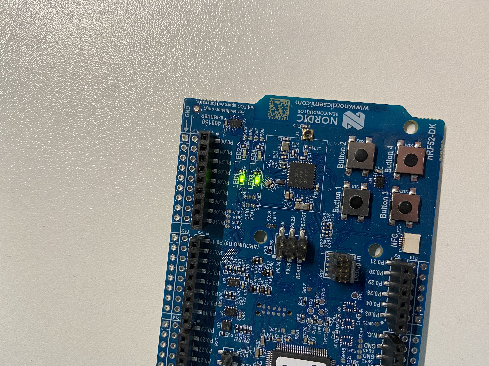

## Nordic Semiconductor 
Is a company from Norway that produces semiconductors.

### nRF51
Uses ARM-Cortex M0 as their core mcu.

### nRF52
Uses ARM-Cortex M4 as their core mcu.

### nRF53
Uses ARM-Cortex M33 as their core mcu.

### nRF91
LTE

### Development
The system-on-chip (SoC) that is on the microbit device is a nRF52833, which
contains the 64MHz Arm Cortex-M4.

[nRF52833 Product Specification](https://infocenter.nordicsemi.com/pdf/nRF52833_PS_v1.5.pdf)

I've also got a nRF52-DK which has a N52832 SoC:

[nRF52832 Product Specification](https://infocenter.nordicsemi.com/pdf/nRF52832_PS_v1.5.pdf)

The actual number can be found on the chip:




### I2C
This is called Two-Wire Inteface in nRF so the register names will be TWI1 etc.

### EasyDMA
TODO:

### Memory configuration
If an application does not use a SoftDevice or a Master Boot Record then the
Flash memory should be 0x0.

How do I know if the application uses a SoftDevice?  
For a bare-metal assembly example where I'm not using anything except a linker
script that I've written if there anything reason why I should not use 0x0 as
the origin of the Flash memory?
No, I don't think so.

When using a SoftDevice the linker would need to have access to the SoftDevice
object file during the linking, and the linker script would have to have memory
configuration and section for it.

### SoftDevice
A SoftDevice is a wireless protocol stack that complements an nRF5 Series System
on Chip (SoC).

SoftDevices are a closed source C binary written by Nordic for their
microcontrollers that sits at the bottom of flash and is called first on
startup. The softdevice then calls your application or bootloader or whatever
is sitting directly after it in flash.

So this will affect the linker-script and the origin of flash memory.

* s112 BLE protocol stack. Peripheral only
* s113 BLE protocol stack. Peripheral only
* s122 BLE protocol stack. Central only
* s132 BLE protocol stack. Peripheral and Central

### Peripherals
Each peripheral is assigned a block of 0x1000 (4096) bytes of address space. So
that gives 4096 x 8 = 32768, providing 1024, 32 bit registers. 

```
0x40000000 ID = 0   1073741824
0x40001000 ID = 1   1073741824 + 4096    = 1073745920  = 0x40001000
0x40002000 ID = 2   1073741824 + 2*4096  = 1073750016  = 0x40002000
   ...
0x4001F000 ID = 31  1073741824 + 31*4096 = 1073868800  = 0x40001F00
```
Most peripherals have an enable register that is used to enable the peripheral
in question. For example, lets take GPIO P0:
```
ID  Base Address
0   0x50000000
```
The pins available for each port are PIN0 to PIN31 and each pin can be
configured using the PIN_CNF[n].

Peripherals are controlled by the CPU writing config registers and task
registers. When a peripheral wants to signal that something has occurred it will
write to the event register.

### LED Button Service implementation (LBS)
An example of a service implementation can be found in the nrf-sdk, for example
the LED Button Service (LBS) can be found in
`/components/ble/ble_services/ble_lbs`

In nrf/ble/main.c we create use a macro:
```c
BLE_LBS_DEF(m_lbs);
```
There is a make target named 'pre' in the nrf/ble directory which will output
the code generated by the pre-processor:
```c
static ble_lbs_t m_lbs;

static nrf_sdh_ble_evt_observer_t m_lbs_obs __attribute__ ((section("." "sdh_ble_observers2"))) __attribute__((used)) = { 
  .handler = ble_lbs_on_ble_evt,
  .p_context = &m_lbs
};
```
If we start we can see that there is first a struct named `ble_lbs_t` which
is a struct for the LED Button Service:
```c
struct ble_lbs_s {
    uint16_t                    service_handle;      /**< Handle of LED Button Service (as provided by the BLE stack). */
    ble_gatts_char_handles_t    led_char_handles;    /**< Handles related to the LED Characteristic. */
    ble_gatts_char_handles_t    button_char_handles; /**< Handles related to the Button Characteristic. */
    uint8_t                     uuid_type;           /**< UUID type for the LED Button Service. */
    ble_lbs_led_write_handler_t led_write_handler;   /**< Event handler to be called when the LED Characteristic is written. */
};
```
And we also define a observer for the service:
```c
typedef struct {
    nrf_sdh_ble_evt_handler_t handler;      //!< BLE event handler.
    void *                    p_context;    //!< A parameter to the event handler.
} const nrf_sdh_ble_evt_observer_t;

typedef void (*nrf_sdh_ble_evt_handler_t)(ble_evt_t const * p_ble_evt, void * p_context);
```
Notice that there is a section specifed for this static variable which is
`sdh_ble_observers2` and this will be matched in the linker script.

In main.c we have the following call:
```c
    err_code = sd_ble_gap_device_name_set(&sec_mode,
                                          (const uint8_t *)DEVICE_NAME,
```
This function is defined in ble_gap.h as:
```c
SVCALL(SD_BLE_GAP_DEVICE_NAME_SET,
       uint32_t,
       sd_ble_gap_device_name_set(ble_gap_conn_sec_mode_t const *p_write_perm, uint8_t const *p_dev_name, uint16_t len));
```
Which will be expanded by the pre-processor into:
```c
__attribute__((naked)) __attribute__((unused))
static uint32_t sd_ble_gap_device_name_set(
    ble_gap_conn_sec_mode_t const *p_write_perm,
    uint8_t const *p_dev_name,
    uint16_t len) {
      __asm( "svc %0\n" "bx r14" : : "I" ( SD_BLE_GAP_DEVICE_NAME_SET) : "r0" );
    }
```
The `_naked` attribute means that this function is an embedded assembly function
which is a function which can be written entierly using `__asm` statements. The
compiler will not generate a prologue or epilogue for these type of functions.

The `unused` attribute just prevents the compiler from generating a warning if
this function is not referenced anywhere.

Taking a closer look at the inline assembly code we see the following code:
```
__asm("svc %0\n"
      "bx r14"
    :                                      // output operands
    : "I" (SD_BLE_GAP_DEVICE_NAME_SET)     // input operands
    : "r0" );                              // clobbered registers
```
The input operand is given the contraint `I` which specifes that an immediate
integer or string literal operand which in this case is
`SD_BLE_GAP_DEVICE_NAME_SET` and this passed as the argument to the `svc` arm
instruction. This is the supervisor instruction call. So there will be a entry
in the vector table for `SVCALL`, entry 11. This handler will use the number
to take some action. We can see the number below which is defined in
`headers/ble_gap.h`:
```c
enum BLE_GAP_SVCS
{
  ...
  SD_BLE_GAP_DEVICE_NAME_SET            = BLE_GAP_SVC_BASE + 16,  /**< Set Device Name. */
  ...
```
The supervisor call (SVC) instruction triggers an exception and takes a number
which the exception handler can extract and take different actions on depending
on this number. After returning there is a branch instruction to the address
that is in register 14.

Now, the loaded the program memory (Flash) will contain the SoftDevice in
addition to our application code:
```
 +-----------------------+ Size of Flash
 |       Application     |
 |                       |
 |                       |
 |                       |
 |                       |
 +-----------------------+
 | App Vector Table      | APP_CODE_BASE
 +-----------------------+
 |      SoftDevice       |
 |                       |
 |                       |
 +-----------------------+
 |SoftDevice Vector Table| 0x00001000
 +-----------------------+
 | Master Boot Record    |
 +-----------------------+
 |  MBR Vector Table     | 0x00000000
 +-----------------------+
```
So notice that the Application has a vector table, as does the SoftDevice, and
also the master boot record. When an exception is triggered then the mbr
boot record's SVCHandler will be called which will delegate to the softdevice
SVCHandler depending on the number passed to `svc`.

All interrupts are routed througth the MBR and the SoftDevice. The Supervisor
Call (SVC) interrupt is always intercepted by the SoftDevice regardless of
whether it is enabled or disabled. The SoftDevice inspects the SVC number, and
if it is equal or greater than 0x10, the interrupt is processed by the
SoftDevice. SVC numbers below 0x10 are forwarded to the application's SVC
interrupt handler. 

The source for the SVC_handler seems to be in
`components/libraries/svc/nrf_svc_handler.c`:
```c
void __attribute__((naked)) SVC_Handler(void)                                   
{                                                                               
    __ASM volatile                                                              
    (                                                                           
        "tst lr, #4\t\n"                // Test bit 2 of EXT_RETURN to see if MSP or PSP is used
        "ite eq\t\n"                    //                                      
        "mrseq r0, MSP\t\n"             // Move MSP into R0.                    
        "mrsne r0, PSP\t\n"             // Move PSP into R0.                    
        "b nrf_svc_handler_c\t\n"       // Call C-implementation of handler. Exception stack frame in R0
        ".align\t\n"                    // Protect with alignment               
    );                                                                          
}         
```
So this would then be set as entry `11` in the SoftDevice's interrupt vector
table and called when svc calls is issued. 
Looking at the above assembly there is first a test using `tst` using the link
(lr) register. Next we have the `it` instruction, which is like if-then and then
and can be `ITT` if then, or `ITE` if else, and the two instruction following
this instruction is the block for the if-then. So depending on the test either
MSP (Main Stack Pointer) or PSP (Processor Stack Pointer) will be placed in r0
which is the argument to `nrf_svc_handler_c`. 

```c
void nrf_svc_handler_c(uint32_t* p_svc_args) {

```
This function will iterate over all the function pointers that have been
specified using the section `.svc_data`. A function can be registered using a
macro `NRF_SVC_FUNCTION_REGISTER`:
```c
#define NRF_SVC_FUNCTION_REGISTER(svc_number, name, func)               \          
STATIC_ASSERT(svc_number != 0);                                         \          
NRF_SECTION_ITEM_REGISTER(svc_data, nrf_svc_func_reg_t const name) =    \          
{                                                                       \          
    .svc_num = svc_number,                                              \          
    .svci_num = NRF_SVCI_SVC_NUM_INVALID,                               \          
    .func_ptr = (nrf_svc_func_t)func                                    \          
}    

#define NRF_SECTION_ITEM_REGISTER(section_name, section_var) \                     
    section_var __attribute__ ((section("." STRINGIFY(section_name)))) __attribute__((used))

typedef struct                                                                  
{                                                                               
    uint32_t            svc_num;        /**< Supervisor call number (actually 8-bit, padded for alignment). */
    uint32_t            svci_num;       /**< Supervisor call indirect number. */   
    nrf_svc_func_t      func_ptr;                                               
} nrf_svc_func_reg_t
```
```console
(gdb) x/20xw 0x0
0x0:	0x20000400	0x00000a81	0x00000715	0x00000a61
0x10:	0x0000071f	0x00000729	0x00000733	0x00000000
0x20:	0x00000000	0x00000000	0x00000000	0x00000aa5
0x30:	0x0000073d	0x00000000	0x00000747	0x00000751
0x40:	0x0000075b	0x00000765	0x0000076f	0x00000779
```
And entry 11 should be the SVC_Handler.
```console
(gdb) x/xw 0x00000000 + (4*11)
0x2c:	0x00000aa5
```
```console
(gdb) x/9i 0x00000aa5
   0xaa5:	tst.w	lr, #4
   0xaa9:	ite	eq
   0xaab:	mrseq	r1, MSP
   0xaaf:	mrsne	r1, PSP
   0xab3:	ldr	r0, [r1, #24]
   0xab5:	subs	r0, #2
   0xab7:	ldrb	r0, [r0, #0]
   0xab9:	cmp	r0, #24
   0xabb:	bne.n	0xac4
```
And this matches the assembly code we saw above for the SoftDevice SVC_Handler.

Alright, so if we are interested in inspecting the code that get executed
for this function we would need to find the function that was registered
for `SD_BLE_GAP_DEVICE_NAME_SET` which would have been in a section named
.svc_data in the original object file. But this was then transformed into
softdevice/s132/hex/s132_nrf52_7.2.0_softdevice.hex so we don't have any
information about sections only addresses, and the data that goes into those
addresses.

But how about setting a break point in the SVC_Handler and trying to follow the
calls down from there:
```console
(gdb) br main.c:main
(gdb) set $primask = 1
(gdb) br *0xaa5
(gdb) c
(gdb) set $primask = 0
(gdb) c
```
Setting `primask` to 1 prevents the activation of all exceptions with a 
configurable priority. 

_work in progress_


### Logging
Logs can be viewed using JLinkRTTViewer:
```console
$ JLinkRTTViewer
```
And we can add log statement using:
```c
  NRF_LOG_INFO("main....");
```
RTT stands for Real Time Transfer.

### Task registers
Task are registers as are events. Writing to a task register will start some
task (what ever that might mean to some module in the system that is interested
(reads the task register value).

### Event registers
The events register are like status registers
and reading a `1` means that a particular event has occurred. The event can be
cleared by writing `0`.

### General Purpose I/0 Task and Events (GPIOTE)
Is a way of accessing GPIO pins using tasks and events. So a GPIOTE channel
would be associated with a pin and we can enable it so that when a state change
occurs a task will automatically created.

How this works is that we configure a register named CONFIG[n] (where n is
between 0 and 7) and specify which port/pin to connect (the channel?) to.
There are more options that can be configured and there is an example in
[led-external-gpiote.s](../nrf/led/led-external-gpiote.s) which shows the other
options available. After this we can write to this channel (I'm really not sure
if I'm using the right terminology here but hopefully this makes sense just the
same) using the register `TASKS_OUT[n]` or `TASKS_SET[n]`.

### Timers
* Real Time Counter (RTC)
Low power and low frequency
* Timer
High power and high frequency


### nrfx
These are standalone drivers for nrf peripherals which were originally in the
nRF5 SDK and have been extracted to standalone modules/libraries.
https://github.com/NordicSemiconductor/nrfx


## nrf_crypto

### RNG context cannot be allocated on the stack
```console
00> <error> app: RNG context cannot be allocated on the stack.
00> 
00> <error> nrf_ble_lesc: nrf_crypto_init() returned error 0x8515.
00> 
00> <error> peer_manager: pm_init failed because sm_init() returned Unknown error code.
00> 
00> <error> app: Fatal error
```
This is most likly due to not having enabled
`NRF_CRYPTO_RNG_STATIC_MEMORY_BUFFERS_ENABLED in config/sdk_config.h:
```c
#ifndef NRF_CRYPTO_RNG_STATIC_MEMORY_BUFFERS_ENABLED                            
#define NRF_CRYPTO_RNG_STATIC_MEMORY_BUFFERS_ENABLED 1                          
#endif
```
