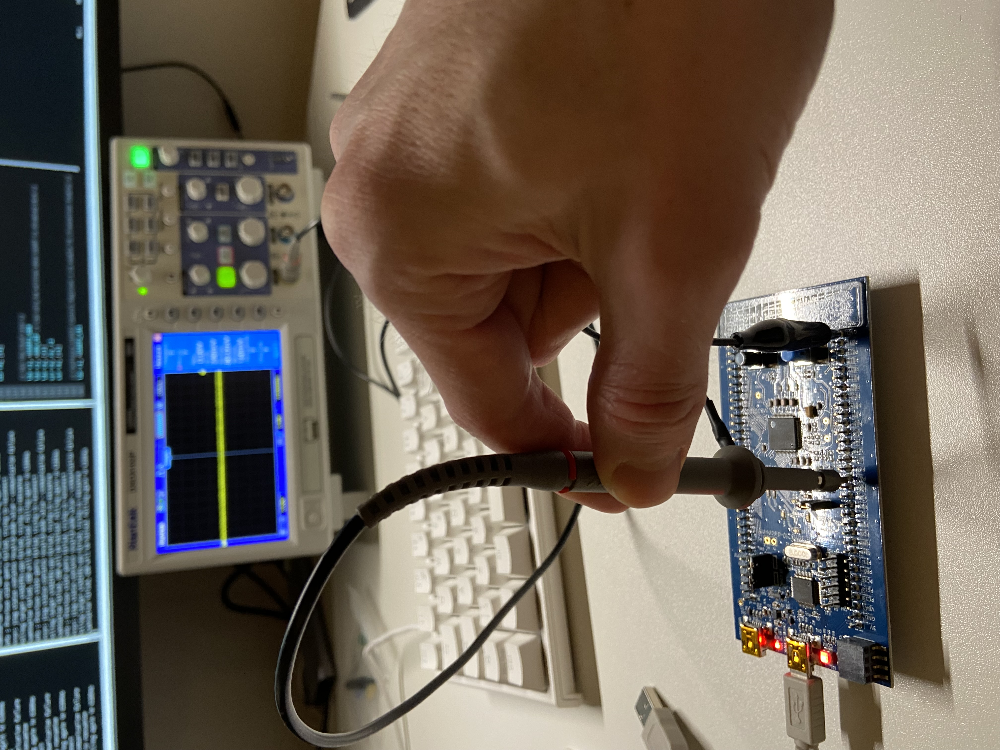

### USART2 Issue
The problem I'm having is that I can see that data is not read out of the
data register. When stepping through the code in the debugger I can see that
the second time `uart_write_char` is called the old data is still in the USART2
Transmit Data Registry (TDR). I'm assuming here that the data would be removed
when it is copied to the shift register of the USART. Hmm, that might be an
incorrect assumption, like think about a mov instruction, that will only copy
the data and not remove it from the source register. I've checked this and the
reference manual states that:
```
Clearing the TXE bit is always performed by a write to the transmit data
register. The TXE bit is set by hardware and it indicates:
• The data has been moved from the USART_TDR register to the shift register and
the data transmission has started.
• The USART_TDR register is empty.
• The next data can be written in the USART_TDR register without overwriting the
previous data.
```
So it looks like the TDR should be cleared if UART was working propertly.

There is no indications either on the serial adapter of any transmission, the rx
light is not blinking (I verfied that I could do a loop back using it by
shorting rx/tx and can see them working).

### Trouble shooting
Lets take a closer look at the RCC_CR (Clock Control) register:
```console
uart_init () at uart.s:89
89	  ldr r1, =RCC_CR
(gdb) si
(gdb) x/wt $r1
0x40021000:	00000000000000000101001010000011
```
So this is showing the default settings.
```
Bit 0 (1) is saying that HSI clock is enabled.
Bit 1 (1) is saying that the HSI oscillator is stable.
Bit 2 (0) is reserved.
Bit 3-7 (10000) is for HSI clock trimming and used in combination with (HSICAL,
the next 8 bits). These 4 bits provide a user programmable trimming value to
adjust to variations in temparature and voltage. The default value is 16
(10000b) and when this value is added to the value in HSICAL it should trim the
HSI to 8 MHz. 
Bit 8-15 (1010010) HSI clock callibration (HSICAL).
```
The rest of the bits are zero so the HSE clock is not enabled.

Next, lets inspect `RCC_CFGR` register
```console
gdb) x/wt $r1
0x40021004:	00000000000000000000000000000000
```
So nothing in this register is being set by default. A few of the interesting
bits related to HSI are:
```
Bit 0-1 (00) System clock switch (SW) 00 = HSI selected as system clock.
Bit 2-3 (00) System clock switch status (SWS) 00 = HSI oscillator used as
system clock.
Bit 4-7 (0000) HCKL prescalar. 0000 means no division factor of AHB clock.
Bit 8-10 (000) PCKL prescalar. 000 means no division factor of APB clock.
Bit 13 (0) reserved.
Bit 14 (0) ADC prescalar. Is obselete according to the manual.
Bit 15-16 (00) PLL input clock source. 00 = HSI/2 selected as PLL. PREDIV forced
to divide by 2 on STM32F07x.
Bit 17 (0) HSE divider for PLL input clock.
Bit 18-21 (0000) PLL multiplication factor (PLLMUL). 0000 = PLL input clock x 2
Bit 22 (0) reserved
Bit 23 (0) reserved
Bit 24-27 (0000) Microcontroller clock output (MCO). 000 MCO ouput disabled.
Bit 28-30 (000) Microcontroller clock ouput prescalar (MCOPRE). 000 = MCO is
divided by 1.
Bit 31 (0) PLL clock not divided (PLLNODIV). 0 = PLL is not divided by 2 for
MCO.
```
Next we have RCC_CFGR3:
```console
(gdb) x/wt $r1
0x40021030:	00000000000000000000000000000000
```
Since I'm using USART2 the only relevant value I think is bit 16-17:
```
Bit 16-17 (00) USART2 clock source selection (USART2SW). 00 = PCKL selected as
USART2 clock source (default).

`FCKL` is the clock signal provided to the CPU core.  
`HCKL` is the clock signal provided to the high-speed bus (AHB).  
`PCKL` is the clock signal provided to the low-speed bus (APB).


### PORT/Alternative Function
From the data sheet I can read the following:
```
Table 15. Alternate functions selected through GPIOA_AFR registers for port A 

                 AF1
PA2             USART2_TX
```
I'm setting AF1 using:
```assembly
.equ AFSEL2_AF1, 1 << 8                      // checked

  /* Set GPIO Port A Pin 2 to 0001 (AF1) */ 
  ldr r1, =GPIOA_AFRL
  ldr r2, =AFSEL2_AF1
  ldr r0, [r1]
  orr r0, r0, r2
  str r0, [r1]
```



I actually had the USB connected incorrectly in that picture but I changed it
to USB User with the same result.
So I'm thinking it could still be the pin that is incorrectly setup but I've
checked this multiple times now. I'm leaning towards it being and issue with
the UART configuration.

### Incorrect UART configuration
TODO:
