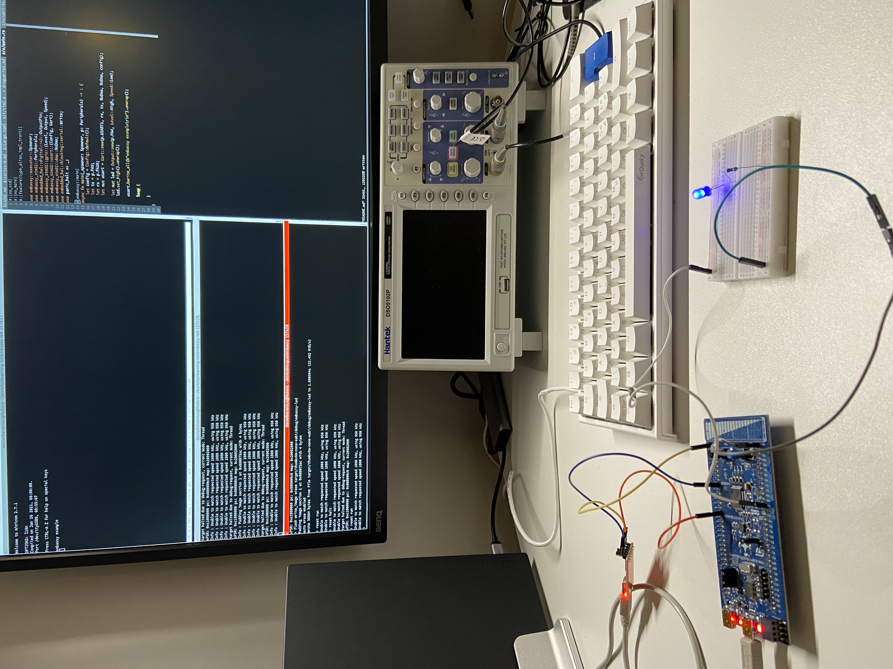

## Rust Embassy example
This example shows how using [Embassy](https://github.com/embassy-rs/embassy)
to create an example similar to [rust-low-level](../rust-low-level/README.md)
and the goal is to understand the advantages that this higher level API
provides.

### Building
```console
$ cargo build
```

### Flashing and Running
Start openocd:
```console
$ openocd -f board/stm32f0discovery.cfg
```

Start a telnet session:
```console
$ telnet localhost 4444
```

Flash the program:
```console
> reset halt
> flash write_image erase target/thumbv6m-none-eabi/debug/embassy-led
> reset run
```
Running should turn on the led:



Debug:
```console
$ arm-none-eabi-gdb target/thumbv6m-none-eabi/debug/embassy-led
```
