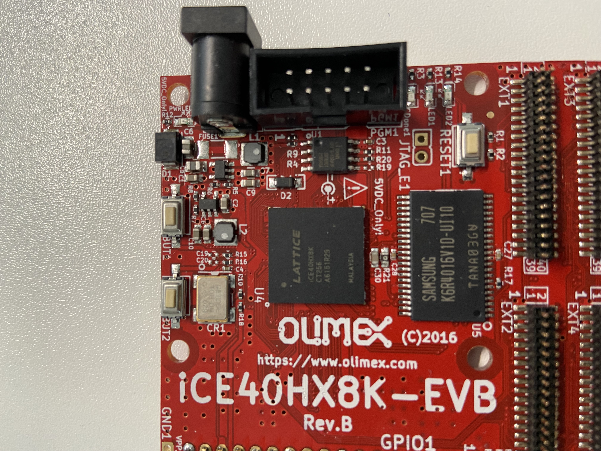
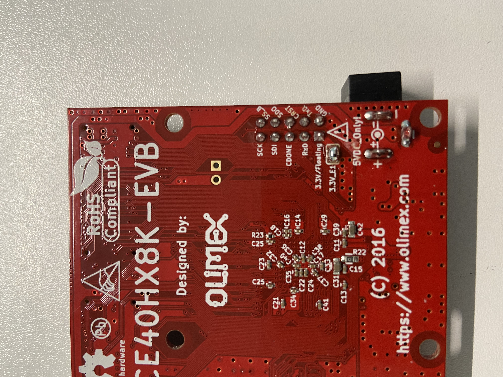
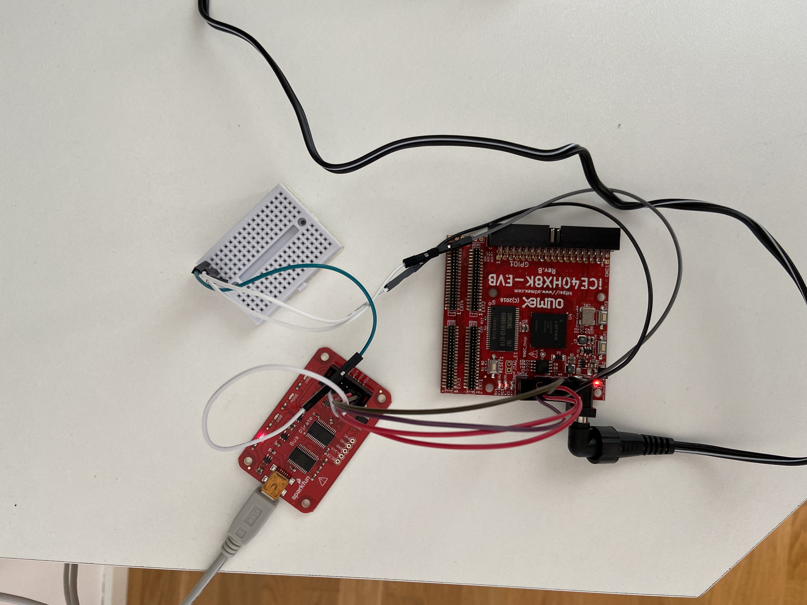

## FPGA Example
The device I'm using is an
[iCE40HX1K-EVB](https://www.olimex.com/wiki/ICE40HX1K-EVB):



This FPGA can be powers using a 5V barrel connector or it can be powered using
3.3V pin, but notice that this is only possible if enabled by soldering the
bridge on the bottom side of the board:



### Building
Synthesis, Place and Route, and build bitstream:
```console
$ make first.bin
```
This will produce first.bin which can then be used to flash the FPGA.

### Connections/Pins
I used the following connections on the Bus Pirate and iCE40HX8K-EVB:
```
                  +------------------------------------+
     Bus Pirate   |            iCE40HX8K-EVB           |
     +---------+  |            +-----------+           |
 +---|GND  3V3 |  |    +-------|SS_B  SCK  |-------+   |
 |   |+5V  ADC |  |  +-|-------|DSO   SDI  |-------|---+
 |   |VPU  AUX |  |  | | +-----|CRST  CDONE|       |
 | +-|CLK  MOSI|--|--+ | |     |TxD   RxD  |       |
 | |+|CS   MISO|--+    | |   +-|GND   3.3V |       |
 | ||+---------+       | |   | +-----------+       |
 | |+------------------+ |   |                     |
 | +---------------------|---|---------------------+
 |                +--------+ |
 +----------------|        |-+
                  |        |
                  +--------+
                  Breadboard
```
The reason for having the breadboard is that GND on Bus Pirate needs to be
connected to GND and CRST.




### Configure Bus Pirate
```console
$ minicom -b 115200 -8 -D /dev/buspirate
```
First we have to configure Bus Pirate to use SPI mode:
```console
HiZ>m
(1)> 5
...
Ready
(SPI)>
```
I've just used the defaults apart from selecting 250KHz. The MODE LED should be
on on the Bus Pirate now. Now exit minicom using CTRL+A+Q. 

### Flashing
Pad the binary file so that it is 2048 kB which is the size of the Flash:
```
$ make first_pad
```

Flash the device
```console
$ make first_flash_rom
flashrom -p buspirate_spi:dev=/dev/ttyUSB0,spispeed=1M -w first.bin
flashrom v1.2 on Linux 5.13.14-200.fc34.x86_64 (x86_64)
flashrom is free software, get the source code at https://flashrom.org

Using clock_gettime for delay loops (clk_id: 1, resolution: 1ns).
Found Eon flash chip "EN25QH16" (2048 kB, SPI) on buspirate_spi.
Reading old flash chip contents... done.
Erasing and writing flash chip... Erase/write done.
Verifying flash... VERIFIED.
```

After flashing we need can remove all the wires, or just remove the wire
connected to CRST which is the reset pin. I though that would be enough and
would work but there is something that is wrong. What I'm seeing at the moment
is that both LEDs are on which is the same state as during a reset state. I'm
currently looking into this.
For context, this same board with the blinky example shipped worked fine,
unfortunatly I read flashrom man page after erasing the board so I lost that
image. I should have read the contents of it to a file as a backup instead :( 
I've added what I think is the original
[blinky](https://github.com/OLIMEX/iCE40HX8K-EVB) and managed to flash using it
but I'm still seeing the same behaviour, that it looks like the board is still
in reset mode. I'm an idiot, I made a mistake in the padding recipe (Makefile)
which was causing the complete binary file to be filled with 0xFF. This has
now been corrected. I'm still getting a verification error though:
```console
Using clock_gettime for delay loops (clk_id: 1, resolution: 1ns).
Found Eon flash chip "EN25QH16" (2048 kB, SPI) on buspirate_spi.
Reading old flash chip contents... done.
Erasing and writing flash chip... Erase/write done.
Verifying flash... FAILED at 0x00000001! Expected=0x00, Found=0xff, failed byte count from 0x00000000-0x001fffff: 0x21172
Your flash chip is in an unknown state.
Please report this on IRC at chat.freenode.net (channel #flashrom) or
mail flashrom@flashrom.org, thanks!
make: *** [Makefile:31: first_flash_rom] Error 3
```
But atleast now I can disconnect the the `CRST` wire and see that the board is
responding and no longer "stuck" in the reset state.

So after disconnecting `CRST` LED1 should be off, and pressing BUT1 should
turn it on:

_wip_

### Troubleshooting
I'm having issues flashing the device and trying to figure out what is going
on.
I can read the flash memory using:
```console
$ flashrom -p buspirate_spi:dev=/dev/ttyUSB0,spispeed=1M -r original2.bin
flashrom v1.2 on Linux 5.13.14-200.fc34.x86_64 (x86_64)
flashrom is free software, get the source code at https://flashrom.org

Using clock_gettime for delay loops (clk_id: 1, resolution: 1ns).
Found Eon flash chip "EN25QH16" (2048 kB, SPI) on buspirate_spi.
Reading flash... done.

```
I can try to verify the read contents using:
```console
$ flashrom -p buspirate_spi:dev=/dev/ttyUSB0,spispeed=1M -v original2.bin 
flashrom v1.2 on Linux 5.13.14-200.fc34.x86_64 (x86_64)
flashrom is free software, get the source code at https://flashrom.org

Using clock_gettime for delay loops (clk_id: 1, resolution: 1ns).
Found Eon flash chip "EN25QH16" (2048 kB, SPI) on buspirate_spi.
Verifying flash... FAILED at 0x000d6803! Expected=0xfd, Found=0xff, failed byte count from 0x00000000-0x001fffff: 0xafc
```

When trying to erase the flash I get:
```console
$ flashrom -p buspirate_spi:dev=/dev/ttyUSB0,spispeed=2M -E
flashrom v1.2 on Linux 5.13.14-200.fc34.x86_64 (x86_64)
flashrom is free software, get the source code at https://flashrom.org

Using clock_gettime for delay loops (clk_id: 1, resolution: 1ns).
Found Eon flash chip "EN25QH16" (2048 kB, SPI) on buspirate_spi.
Erasing and writing flash chip... FAILED at 0x00056000! Expected=0xff, Found=0x00, failed byte count from 0x00056000-0x00056fff: 0x800
ERASE FAILED!
```

Running this multiple times I get different error messages:
```console
$ flashrom -p buspirate_spi:dev=/dev/ttyUSB0,spispeed=1M -E
flashrom v1.2 on Linux 5.13.14-200.fc34.x86_64 (x86_64)
flashrom is free software, get the source code at https://flashrom.org

Using clock_gettime for delay loops (clk_id: 1, resolution: 1ns).
Found Eon flash chip "EN25QH16" (2048 kB, SPI) on buspirate_spi.
Erasing and writing flash chip... FAILED at 0x000e4001! Expected=0xff, Found=0xfc, failed byte count from 0x000e4000-0x000e4fff: 0x7ff
ERASE FAILED!
Looking for another erase function.
```
If the error had been the same every time that could indicate an issue with
the FPGA like write-protection or something, but since the errors is different
everytime this is more likely a hardware issue. Hardware as in the connection or
the programmer (Bus Pirate). 

I finally managed to get this working and the issue was the length of the
cables I was using. I had to make extensions as I needed male connectors for
the breadboard and from there female connectors to the devices. I've takes two
of these cables and cut them and connected them so they are shorter and that
got things working as expected. 

