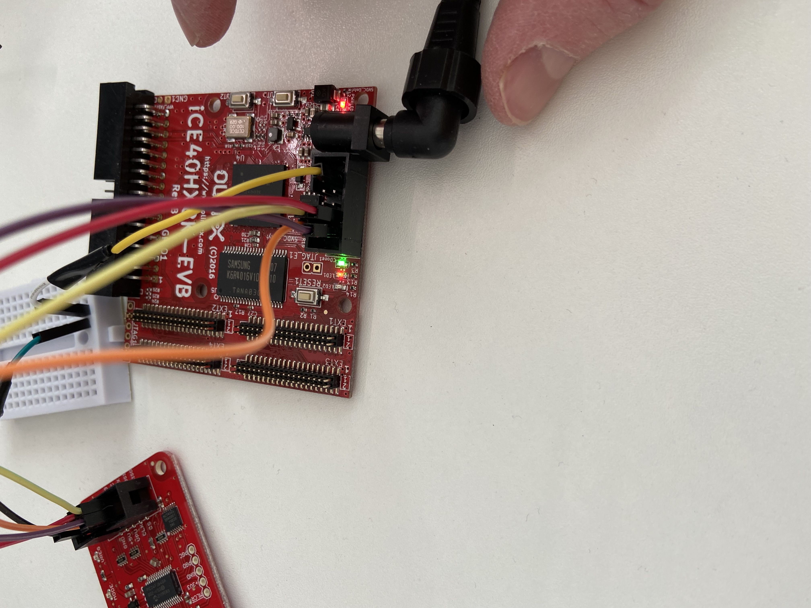
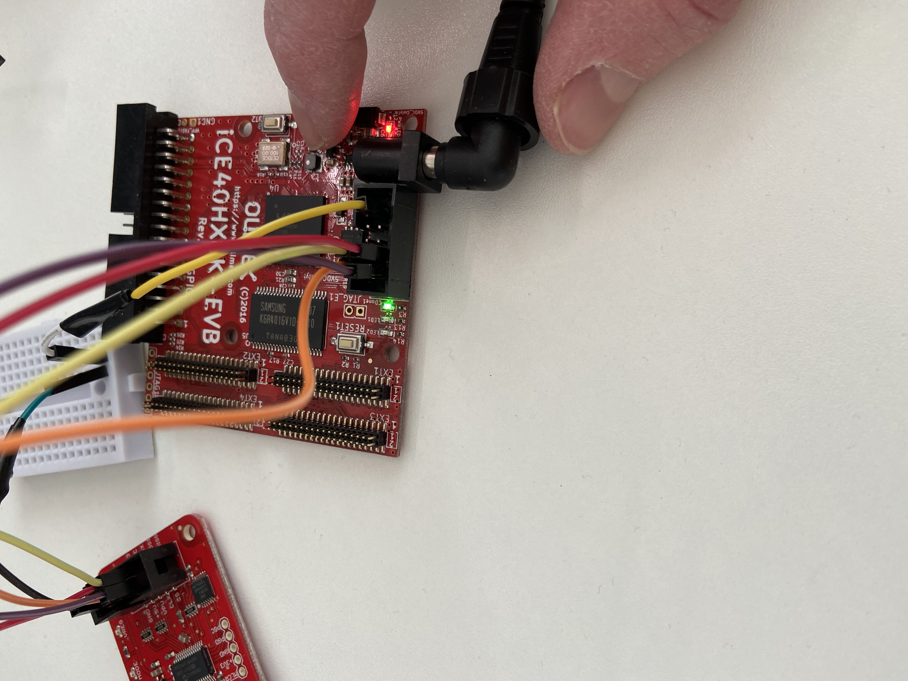

## FPGA Example
The device I'm using is an
[iCE40HX1K-EVB](https://www.olimex.com/wiki/ICE40HX1K-EVB):


This FPGA can be powers using a 5V barrel connector or it can be powered using
3.3V pin, but notice that this is only possible if enabled by soldering the
bridge on the bottom side of the board:


I actually opted to use a 5V power supply instead of this above 3.3V pin.

### Building
Synthesis, Place and Route, and build bitstream:
```console
$ make first.bin
```
This will produce first.bin which can then be used to flash the FPGA.

### Connections/Pins
I used the following connections on the Bus Pirate and iCE40HX8K-EVB:
```
                  +------------------------------------+
     Bus Pirate   |            iCE40HX8K-EVB           |
     +---------+  |            +-----------+           |
 +---|GND  3V3 |  |    +-------|SS_B  SCK  |-------+   |
 |   |+5V  ADC |  |  +-|-------|DSO   SDI  |-------|---+
 |   |VPU  AUX |  |  | | +-----|CRST  CDONE|       |
 | +-|CLK  MOSI|--|--+ | |     |TxD   RxD  |       |
 | |+|CS   MISO|--+    | |   +-|GND   3.3V |       |
 | ||+---------+       | |   | +-----------+       |
 | |+------------------+ |   |                     |
 | +---------------------|---|---------------------+
 |                +--------+ |
 +----------------|        |-+
                  |        |
                  +--------+
                  Breadboard
```
The reason for having the breadboard is that GND on Bus Pirate needs to be
connected to GND and CRST.


Notice the short wires which is required as this is using SPI and there is a
limit on the maxium length (something like 20 cm).


### Flashing
Flash the device
```console
$ make led_flash_rom
flashrom -p buspirate_spi:dev=/dev/ttyUSB0,spispeed=2M -w led_padded.bin
flashrom v1.2 on Linux 5.13.14-200.fc34.x86_64 (x86_64)
flashrom is free software, get the source code at https://flashrom.org

Using clock_gettime for delay loops (clk_id: 1, resolution: 1ns).
===
SFDP has autodetected a flash chip which is not natively supported by flashrom yet.
All standard operations (read, verify, erase and write) should work, but to support all possible features we need to add them manually.
You can help us by mailing us the output of the following command to flashrom@flashrom.org:
'flashrom -VV [plus the -p/--programmer parameter]'
Thanks for your help!
===
Found Unknown flash chip "SFDP-capable chip" (2048 kB, SPI) on buspirate_spi.
Reading old flash chip contents... done.
Erasing and writing flash chip... Erase/write done.
Verifying flash... VERIFIED.
rm led.asc
```

After flashing we can remove all the wires, or just remove the wire connected to
CRST which is the reset pin.

The first example, [led.v](./led.v) is a LED1 that is controlled but BUT1.

Now this works most of the time but there is an issue with how switches work
in reality vs how they work in theory which I've written about before in
[Mechanical bouncing](../doc/fpga.md#mechanical_bouncing).

The second example, [led_non_no_bounce.v](./led_no_bounce.v) is the same as
the previous example but takes care of the issue with mechanical bouncing.


Now, if we press button `BUT1`, LED1 will turn on:


And, if we press button `BUT1`, LED1 will turn off again (toggle):


### Troubleshooting
I'm having issues flashing the device and trying to figure out what is going
on.
I can read the flash memory using:
```console
$ flashrom -p buspirate_spi:dev=/dev/ttyUSB0,spispeed=1M -r original2.bin
flashrom v1.2 on Linux 5.13.14-200.fc34.x86_64 (x86_64)
flashrom is free software, get the source code at https://flashrom.org

Using clock_gettime for delay loops (clk_id: 1, resolution: 1ns).
Found Eon flash chip "EN25QH16" (2048 kB, SPI) on buspirate_spi.
Reading flash... done.

```
I can try to verify the read contents using:
```console
$ flashrom -p buspirate_spi:dev=/dev/ttyUSB0,spispeed=1M -v original2.bin 
flashrom v1.2 on Linux 5.13.14-200.fc34.x86_64 (x86_64)
flashrom is free software, get the source code at https://flashrom.org

Using clock_gettime for delay loops (clk_id: 1, resolution: 1ns).
Found Eon flash chip "EN25QH16" (2048 kB, SPI) on buspirate_spi.
Verifying flash... FAILED at 0x000d6803! Expected=0xfd, Found=0xff, failed byte count from 0x00000000-0x001fffff: 0xafc
```

When trying to erase the flash I get:
```console
$ flashrom -p buspirate_spi:dev=/dev/ttyUSB0,spispeed=2M -E
flashrom v1.2 on Linux 5.13.14-200.fc34.x86_64 (x86_64)
flashrom is free software, get the source code at https://flashrom.org

Using clock_gettime for delay loops (clk_id: 1, resolution: 1ns).
Found Eon flash chip "EN25QH16" (2048 kB, SPI) on buspirate_spi.
Erasing and writing flash chip... FAILED at 0x00056000! Expected=0xff, Found=0x00, failed byte count from 0x00056000-0x00056fff: 0x800
ERASE FAILED!
```

Running this multiple times I get different error messages:
```console
$ flashrom -p buspirate_spi:dev=/dev/ttyUSB0,spispeed=1M -E
flashrom v1.2 on Linux 5.13.14-200.fc34.x86_64 (x86_64)
flashrom is free software, get the source code at https://flashrom.org

Using clock_gettime for delay loops (clk_id: 1, resolution: 1ns).
Found Eon flash chip "EN25QH16" (2048 kB, SPI) on buspirate_spi.
Erasing and writing flash chip... FAILED at 0x000e4001! Expected=0xff, Found=0xfc, failed byte count from 0x000e4000-0x000e4fff: 0x7ff
ERASE FAILED!
Looking for another erase function.
```
If the error had been the same every time that could indicate an issue with
the FPGA like write-protection or something, but since the errors is different
everytime this is more likely a hardware issue. Hardware as in the connection or
the programmer (Bus Pirate). 

I finally managed to get this working and the issue was the length of the
cables I was using. I had to make extensions as I needed male connectors for
the breadboard and from there female connectors to the devices. This made the
cables too long for SPI. 
What I did to work around this was take two cables and cut them and connected
them so they are shorter and that got things working as expected. The issue her
eis that with these lengths, the usage of two connections I was getting close to
the 20cm which is getting close to the SPI max.

