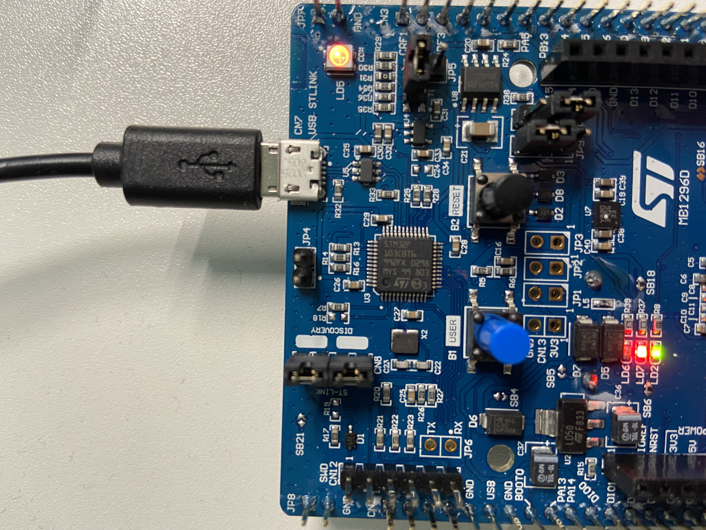
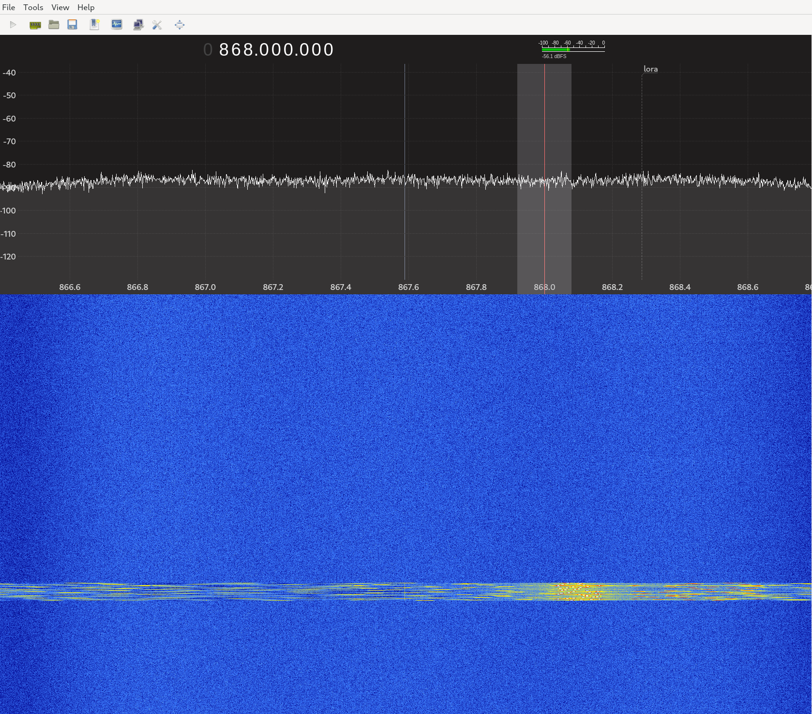

### Drogue Device

### Actor trait
An Actor has a Message type that it can handle which is specified using an 
associated type in the trait:
```rust
pub trait Actor: Sized {
    type Message<'m>: Sized
    where
        Self: 'm,                                                                  
    = ();                                                                          
```
Now, my understanding of this is that this is declaring a type named `Message`
which has a lifetime, `'m`. This type has a bound (a constraint) that it must
be of type Sized. And it also has a lifetime bound "Self: 'm" which specifies
that any reference to `Self` will live at least as long as 'm (which notice is
on the type Message and not on Self. Also is type is given a default value of
the unit type `()`. 

An Actor will also define a Future type that is returned from its `on_mount`
function:
```rust
    type OnMountFuture<'m, M>: Future<Output = ()>
    where
        Self: 'm,
        M: 'm;

    fn on_mount<'m, M>(&'m mut self, _: Address<Self>, _: &'m mut M) -> Self::OnMountFuture<'m, M>
    where
        M: Inbox<Self> + 'm;
}
```

### ActorContext


### drogue-tls logging
Logging can be enabled using
```console
$ RUST_LOG=info cargo test --verbose --  --nocapture
```

### defmt logging
Deferred formatter logging can be enabled using the `DEFMT_LOG` environment
variable:
```console
   Compiling defmt-macros v0.3.1
   Compiling defmt v0.3.0
   Compiling embassy v0.1.0 (https://github.com/embassy-rs/embassy.git?rev=c8f3ec3fba47899b123d0a146e8f9b3808ea4601#c8f3ec3f)
   Compiling panic-probe v0.3.0
   Compiling defmt-rtt v0.3.1
   Compiling embassy-hal-common v0.1.0 (https://github.com/embassy-rs/embassy.git?rev=c8f3ec3fba47899b123d0a146e8f9b3808ea4601#c8f3ec3f)
   Compiling embassy-stm32 v0.1.0 (https://github.com/embassy-rs/embassy.git?rev=c8f3ec3fba47899b123d0a146e8f9b3808ea4601#c8f3ec3f)
   Compiling drogue-device v0.1.0 (/home/danielbevenius/work/drougue/drogue-device/device)
   Compiling bsp-blinky-app v0.1.0 (/home/danielbevenius/work/drougue/drogue-device/examples/apps/blinky)
   Compiling stm32f072b-disco-blinky v0.1.0 (/home/danielbevenius/work/drougue/drogue-device/examples/stm32f0/stm32f072b-disco/blinky)
    Finished dev [optimized + debuginfo] target(s) in 6.16s
     Running `probe-run --chip STM32F072R8Tx target/thumbv6m-none-eabi/debug/stm32f072b-disco-blinky`
(HOST) INFO  flashing program (30 pages / 30.00 KiB)
(HOST) INFO  success!
────────────────────────────────────────────────────────────────────────────────
DEBUG In stm32f072b-disco main...
└─ stm32f072b_disco_blinky::__embassy_main::task::{generator#0} @ blinky/src/main.rs:35
```

I'm working on a example for drogue-device to add a board for stm32f072b-disco.

```rust
  static DEVICE: DeviceContext<BlinkyDevice<BSP>> = DeviceContext::new();

  #[embassy::main]
  async fn main(spawner: embassy::executor::Spawner, p: Peripherals) {
      defmt::debug!("In stm32f072b-disco main...");
      let board = BSP::new(p);

      let config = BlinkyConfiguration {
          led: board.0.led_blue,
          control_button: board.0.user_button,
      };
      DEVICE
          .configure(BlinkyDevice::new())
          .mount(spawner, config)
          .await;
  }
```
Now, expaning this will make it easier to understand what is happening in the
debugger:
```rust
static DEVICE: DeviceContext<BlinkyDevice<BSP>> = DeviceContext::new();

fn __embassy_main(spawner: embassy::executor::Spawner, p: Peripherals)
 -> ::embassy::executor::SpawnToken<impl ::core::future::Future + 'static> {
    use ::embassy::executor::raw::TaskStorage;
    async fn task(spawner: embassy::executor::Spawner, p: Peripherals) {
        {
            match () { _ => { } };
            let board = BSP::new(p);
            let config =
                BlinkyConfiguration{led: board.0.led_blue,
                                    control_button: board.0.user_button,};
            DEVICE.configure(BlinkyDevice::new()).mount(spawner,
                                                        config).await;
        }
    }
    type F = impl ::core::future::Future + 'static;
    #[allow(clippy :: declare_interior_mutable_const)]
    const NEW_TASK: TaskStorage<F> = TaskStorage::new();
    static POOL: [TaskStorage<F>; 1usize] = [NEW_TASK; 1usize];
    unsafe { TaskStorage::spawn_pool(&POOL, move || task(spawner, p)) }
}

#[doc(hidden)]
#[export_name = "main"]
pub unsafe extern "C" fn __cortex_m_rt_main_trampoline() {
    __cortex_m_rt_main()
}

fn __cortex_m_rt_main() -> ! {
    unsafe fn make_static<T>(t: &mut T) -> &'static mut T {
        ::core::mem::transmute(t)
    }
    let mut executor = ::embassy::executor::Executor::new();
    let executor = unsafe { make_static(&mut executor) };
    let p = ::embassy_stm32::init(Default::default());
    executor.run(|spawner|
                     { spawner.must_spawn(__embassy_main(spawner, p)); })
}
```

```console
$ arm-none-eabi-gdb ../target/thumbv6m-none-eabi/debug/stm32f072b-disco-blinky
(gdb) br main
Breakpoint 1 at 0x8001534: file blinky/src/main.rs, line 32.
```
Line 32 in the source code is `#embassy::main` which we can see the expended
version of above.

```console
$ arm-none-eabi-readelf -h  ../target/thumbv6m-none-eabi/debug/stm32f072b-disco-blinky
ELF Header:
  Magic:   7f 45 4c 46 01 01 01 00 00 00 00 00 00 00 00 00
  Class:                             ELF32
  Data:                              2's complement, little endian
  Version:                           1 (current)
  OS/ABI:                            UNIX - System V
  ABI Version:                       0
  Type:                              EXEC (Executable file)
  Machine:                           ARM
  Version:                           0x1
  Entry point address:               0x80000c1
  Start of program headers:          52 (bytes into file)
  Start of section headers:          4272792 (bytes into file)
  Flags:                             0x5000200, Version5 EABI, soft-float ABI
  Size of this header:               52 (bytes)
  Size of program headers:           32 (bytes)
  Number of program headers:         6
  Size of section headers:           40 (bytes)
  Number of section headers:         26
  Section header string table index: 24
```
Notice the entry point is 0x80000c1, which is the Reset handler which is set
by the link.x linker script:
```assembly
ENTRY(Reset);
```
We can check the this using:
```console
$ arm-none-eabi-readelf -s  ../target/thumbv6m-none-eabi/debug/stm32f072b-disco-blinky | grep Reset
   433: 080000c1    48 FUNC    GLOBAL DEFAULT    2 Reset

$ arm-none-eabi-objdump -C --disassemble=Reset  ../target/thumbv6m-none-eabi/debug/stm32f072b-disco-blinky

../target/thumbv6m-none-eabi/debug/stm32f072b-disco-blinky:     file format elf32-littlearm


Disassembly of section .text:

080000c0 <Reset>:
 80000c0:	4c0b      	ldr	r4, [pc, #44]	; (80000f0 <Reset+0x30>)
 80000c2:	46a6      	mov	lr, r4
 80000c4:	f001 fa4c 	bl	8001560 <DefaultPreInit>
 80000c8:	46a6      	mov	lr, r4
 80000ca:	480a      	ldr	r0, [pc, #40]	; (80000f4 <Reset+0x34>)
 80000cc:	490a      	ldr	r1, [pc, #40]	; (80000f8 <Reset+0x38>)
 80000ce:	2200      	movs	r2, #0
 80000d0:	4281      	cmp	r1, r0
 80000d2:	d001      	beq.n	80000d8 <Reset+0x18>
 80000d4:	c004      	stmia	r0!, {r2}
 80000d6:	e7fb      	b.n	80000d0 <Reset+0x10>
 80000d8:	4808      	ldr	r0, [pc, #32]	; (80000fc <Reset+0x3c>)
 80000da:	4909      	ldr	r1, [pc, #36]	; (8000100 <Reset+0x40>)
 80000dc:	4a09      	ldr	r2, [pc, #36]	; (8000104 <Reset+0x44>)
 80000de:	4281      	cmp	r1, r0
 80000e0:	d002      	beq.n	80000e8 <Reset+0x28>
 80000e2:	ca08      	ldmia	r2!, {r3}
 80000e4:	c008      	stmia	r0!, {r3}
 80000e6:	e7fa      	b.n	80000de <Reset+0x1e>
 80000e8:	b500      	push	{lr}
 80000ea:	f001 fa21 	bl	8001530 <main>
 80000ee:	de00      	udf	#0


$ arm-none-eabi-objdump -C --disassemble=main  ../target/thumbv6m-none-eabi/debug/stm32f072b-disco-blinky

../target/thumbv6m-none-eabi/debug/stm32f072b-disco-blinky:     file format elf32-littlearm


Disassembly of section .text:

08001530 <main>:
 8001530:	b580      	push	{r7, lr}
 8001532:	af00      	add	r7, sp, #0
 8001534:	f000 f801 	bl	800153a <stm32f072b_disco_blinky::__cortex_m_rt_main>
 8001538:	defe      	udf	#254	; 0xfe

```
```console
$ arm-none-eabi-gdb ../target/thumbv6m-none-eabi/debug/stm32f072b-disco-blinky
(gdb) br main
Breakpoint 1 at 0x8001534: file blinky/src/main.rs, line 32.
(gdb) target remote localhost:3333
(gdb) c

(gdb) disassemble
Dump of assembler code for function main:
   0x08001530 <+0>:	push	{r7, lr}
   0x08001532 <+2>:	add	r7, sp, #0
=> 0x08001534 <+4>:	bl	0x800153a <_ZN23stm32f072b_disco_blinky18__cortex_m_rt_main17h2f36cf1eaaa9743eE>
   0x08001538 <+8>:	udf	#254	; 0xfe
End of assembler dump.
```
Notice that this will break in the main function generated by embassy.k
Now in this case we are only interested in the code we have written and we
therefor to debug this function:
```rust
fn __cortex_m_rt_main() -> ! {
    unsafe fn make_static<T>(t: &mut T) -> &'static mut T {
        ::core::mem::transmute(t)
    }
    let mut executor = ::embassy::executor::Executor::new();
    let executor = unsafe { make_static(&mut executor) };
    let p = ::embassy_stm32::init(Default::default());
    executor.run(|spawner|
                     { spawner.must_spawn(__embassy_main(spawner, p)); })
}
```
Notice that a new Executor is created for us:
```rust
pub struct Executor {
    inner: raw::Executor,
    not_send: PhantomData<*mut ()>,
}

impl Executor {

    pub fn new() -> Self {
        Self {
            inner: raw::Executor::new(|_| cortex_m::asm::sev(), ptr::null_mut()),
            not_send: PhantomData,
        }
    }
```
Note that `raw::Executor::new` takes two arguments and the `not_send` is a field
of the "outer" Executor.
```rust
impl Executor {
    /// Create a new executor.
    ///
    /// When the executor has work to do, it will call `signal_fn` with
    /// `signal_ctx` as argument.
    ///
    /// See [`Executor`] docs for details on `signal_fn`.
    pub fn new(signal_fn: fn(*mut ()), signal_ctx: *mut ()) -> Self {
        #[cfg(feature = "time")]
        let alarm = unsafe { unwrap!(driver::allocate_alarm()) };
        #[cfg(feature = "time")]
        driver::set_alarm_callback(alarm, signal_fn, signal_ctx);

        Self {
            run_queue: RunQueue::new(),
            signal_fn,
            signal_ctx,

            #[cfg(feature = "time")]
            timer_queue: timer_queue::TimerQueue::new(),
            #[cfg(feature = "time")]
            alarm,
        }
    }
```
The `cortex_m::asm::sev()` function will call the assembly instruction sev:
```rust
pub fn sev() {
    call_asm!(__sev())
}
```
After the executor has been created, `embassy_stm32::init` is called which takes
a Config parameter:
```rust
pub fn init(config: Config) -> Peripherals {
    let p = Peripherals::take();

    unsafe {
        if config.enable_debug_during_sleep {
            crate::pac::DBGMCU.cr().modify(|cr| {
                crate::pac::dbgmcu! {
                    (cr, $fn_name:ident) => {
                        cr.$fn_name(true);
                    };
                }
            });
        }

        gpio::init();
        dma::init();
        #[cfg(exti)]
        exti::init();

        rcc::init(config.rcc);

        // must be after rcc init
        #[cfg(feature = "_time-driver")]
        time_driver::init();
    }

    p
}
```
After this `executor.run` will be called which takes a closure as its single
argument:
```rust
    executor.run(|spawner|
                     { spawner.must_spawn(__embassy_main(spawner, p)); })

impl Executor {
    ...
    pub fn run(&'static mut self, init: impl FnOnce(Spawner)) -> ! {
        init(self.inner.spawner());

        loop {
            unsafe { self.inner.poll() };
            cortex_m::asm::wfe();
        }
    }
}
```
`init` is passed a new instance of Spawner using `self.inner.spawner`:
```rust
pub fn spawner(&'static self) -> super::Spawner {
    super::Spawner::new(self)
}

(from src/executor/spawner):
pub struct Spawner {
    executor: &'static raw::Executor,
    not_send: PhantomData<*mut ()>,
}

impl Spawner {
    pub(crate) fn new(executor: &'static raw::Executor) -> Self {
        Self {
            executor,
            not_send: PhantomData,
        }
    }
```
So a Spawner has pointer to the inner/raw Executor. This new Spawner instance
is then passed to `Executor::init`. Below I'm showing the call to run in
addition to the call to init so that we can see the values more clearly:
```rust
    executor.run(|spawner|
                     { spawner.must_spawn(__embassy_main(spawner, p)); })

    pub fn run(&'static mut self, init: impl FnOnce(Spawner)) -> ! {
        init(self.inner.spawner());

        loop {
            unsafe { self.inner.poll() };
            cortex_m::asm::wfe();
        }
    }
```
Notice that `init` is the closure passed into `executor.run`. And this closure
takes one argument named `spawner`. And this closure is then called by
Executor::run above, and then passed in spawner is the one created by the call
to `self.inner.spawner`. So the following line will now be executed:
```rust
    spawner.must_spawn(__embassy_main(spawner, p));
```
`__embassy_main(spawner, p)` where p is the Peripheral instance that was created
above.

```rust
fn __embassy_main(spawner: embassy::executor::Spawner, p: Peripherals)
 -> ::embassy::executor::SpawnToken<impl ::core::future::Future + 'static> {

    use ::embassy::executor::raw::TaskStorage;

    async fn task(spawner: embassy::executor::Spawner, p: Peripherals) {
        {
            match () { _ => { } };
            let board = BSP::new(p);
            let config = BlinkyConfiguration{led: board.0.led_blue, control_button: board.0.user_button,};
            DEVICE.configure(BlinkyDevice::new()).mount(spawner, config).await;
        }
    }

    type F = impl ::core::future::Future + 'static;

    #[allow(clippy :: declare_interior_mutable_const)]
    const NEW_TASK: TaskStorage<F> = TaskStorage::new();

    static POOL: [TaskStorage<F>; 1usize] = [NEW_TASK; 1usize];
    unsafe {
        TaskStorage::spawn_pool(&POOL, move || task(spawner, p))
    }
}
```
First thing to note is that this function returns a SpawnToken and it is
templated with anything that implements `core::future::Future` and does not
contain any non-static references:
```rust
pub struct SpawnToken<F> {
    raw_task: Option<NonNull<raw::TaskHeader>>,
    phantom: PhantomData<*mut F>,
}
```
Next, we have the definition of a function named `task` that is async, so
actually executing this function would return a Future (which we will see
shortly). But also notice that we are creating a closure
`move || task(spawner, p)` and it is this closure that is being passed into the
`spawn_pool` function.

Next, we have the creation of a `TaskStorage` instance.
```rust
pub struct TaskStorage<F: Future + 'static> {
    raw: TaskHeader,
    future: UninitCell<F>, // Valid if STATE_SPAWNED
}
```
After this an array is allocated for the newly created TaskStorage which is only
on arch specific usize. Next, in the unsafe block `TaskStorage::spawn_pool` is
called:
```rust
pub fn spawn_pool(pool: &'static [Self], future: impl FnOnce() -> F) -> SpawnToken<F> {
        for task in pool {
            if task.spawn_allocate() {
                return unsafe {
                     task.spawn_initialize(future)
                };
            }
        }

        SpawnToken::new_failed()
    }
```
The first thing that happens is that a check is performed, spawn_allocate, using
TaskHeader and if that passes `task.spawn_initialized` will be called with our
closure passed in which returns a Future which contains the block of code that
we actually wrote:
```rust
    unsafe fn spawn_initialize(&'static self, future: impl FnOnce() -> F) -> SpawnToken<F> {
        // Initialize the task
        self.raw.poll_fn.write(Self::poll);
        self.future.write(future());

        SpawnToken::new(NonNull::new_unchecked(&self.raw as *const TaskHeader as _))
    }
```
First the `self.raw_poll_fn` is written to as it starts out uninitialized. Next
the future is written to by calling the closure passed in which as we mentioned
above returns a Future. Finally this function returns a new SpawnToken
containing the TaskHeader. And SpawnToken will be returned by the calling
function as well, and so will `__embassy_main` and we will be back in
`__cortex_m_rt_main`:
```
fn __cortex_m_rt_main() -> ! {
    unsafe fn make_static<T>(t: &mut T) -> &'static mut T {
        ::core::mem::transmute(t)
    }
    let mut executor = ::embassy::executor::Executor::new();
    let executor = unsafe { make_static(&mut executor) };
    let p = ::embassy_stm32::init(Default::default());
    executor.run(|spawner|
                     { spawner.must_spawn(__embassy_main(spawner, p)); })
}
```
So that SpawnToken returned will be passed to `spawner.must_spawn`:
```rust
pub fn must_spawn<F>(&self, token: SpawnToken<F>) {
        unwrap!(self.spawn(token));
}

pub fn spawn<F>(&self, token: SpawnToken<F>) -> Result<(), SpawnError> {
        let task = token.raw_task;
        mem::forget(token);

        match task {
            Some(task) => {
                unsafe { self.executor.spawn(task) };
                Ok(())
            }
            None => Err(SpawnError::Busy),
        }
    }
```
So we will be calling Executor::spawn (in src/executor/raw/mod.rs):
```rust
   pub(super) unsafe fn spawn(&'static self, task: NonNull<TaskHeader>) {
        let task = task.as_ref();
        task.executor.set(self);

        critical_section::with(|cs| {
            self.enqueue(cs, task as *const _ as _);
        })
    }

    unsafe fn enqueue(&self, cs: CriticalSection, task: *mut TaskHeader) {
        if self.run_queue.enqueue(cs, task) {
            (self.signal_fn)(self.signal_ctx)
        }
    }
```
The above call to `critical_section::with`  will execute the closure passed to
it but it will first aquire a critical section token, which is a section where
the code will not be preemted), then execute the closure, and afterwards
release the critical section token.

If the task was enqueued then the signal_fn function will be called with the
signal_ctx passed into it. This will then wake up any core that issued a wait
for a signal.

The `executor.run` function will never return and looks like this:
```rust
    loop {
       unsafe { self.inner.poll() };
       cortex_m::asm::wfe();
    }
```
So it will try polling and then suspend execution until an interrupt occurs
or the `sev` instruction. And we say the usage of this instruction previously
where a task was enqueued.

```console
(gdb) br stm32f072b_disco_blinky::__embassy_main
```

------------------
(work in progress)
```rust
  DEVICE.configure(BlinkyDevice::new())
        .mount(spawner, config).await;
```
The above call to `mount` will land in function below:
```rust
impl<B: BlinkyBoard> BlinkyDevice<B> {
      /// The `Device` is exactly the typical drogue-device Device.
      pub fn new() -> Self {
          BlinkyDevice {
              app: ActorContext::new(),
              led: ActorContext::new(),
              button: ActorContext::new(),
          }
      }

      /// This is exactly the same operation performed during normal mount cycles
      /// in a non-BSP example.
      pub async fn mount(&'static self, spawner: Spawner, components: BlinkyConfiguration<B>) {
          defmt::info!("BlinkyDevice mount...");
          let led_address = self
              .led
              .mount(spawner, actors::led::Led::new(components.led));

          let app = self.app.mount(spawner, BlinkyApp::new(led_address));
          self.button.mount(
              spawner,
              actors::button::Button::new(components.control_button, app.into()),
          );
      }
  }

  pub struct BlinkyConfiguration<B: BlinkyBoard> {
      pub led: B::Led,
      pub control_button: B::ControlButton,
  }
```
The first thing that happens is that the ActorContext's `mount` function for the
`led` field will be called, passing in the spawner.
```rust
pub fn mount<S: ActorSpawner>(&'static self, spawner: S, actor: A) -> Address<A> {
        // Setup message channel
        self.channel.initialize();

        // Setup signal handlers
        self.signals.initialize();

        let actor = self.actor.put(actor);
        let inbox = self.channel.inbox();
        let address = Address::new(self);
        let future = actor.on_mount(address, inbox);
        let task = &self.task;
        // TODO: Map to error?
        spawner.spawn(task, future).unwrap();
        address
    }
```
Looking at `actor.on_mount` the Actor passed in is of type `actors::led::Led` in
(drogue-device/device/src/actors/led/mod.rs):
```rust
    fn on_mount<'m, M>(
        &'m mut self,
        _: Address<Self>,
        inbox: &'m mut M,
    ) -> Self::OnMountFuture<'m, M>
    where
        M: Inbox<Self> + 'm,
    {
        async move {
            loop {
                if let Some(mut m) = inbox.next().await {
                    let new_state = match *m.message() {
                        LedMessage::On => true,
                        LedMessage::Off => false,
                        LedMessage::State(state) => state,
                        LedMessage::Toggle => !self.state,
                    };
                    if self.state != new_state {
                        match match new_state {
                            true => self.led.on(),
                            false => self.led.off(),
                        } {
                            Ok(_) => {
                                self.state = new_state;
                            }
                            Err(_) => {}
                        }
                    }
                }
            }
        }
    }
```
Notice that `on_mount` returns a future and that this future will be passed
to `spawner.span` later in `ActorSpawner'. So when this OnMountFuture is run
later it will call inbox.next().await until there is a message available in this
Actors inbox. This value will be matched against on of the LedMessage enum
values and stored in `new_state`. This will then be compared with the current
state and if they are different depending on the value the led will be turned
on or off. And notice that this is in a loop so it will again callx
 `inbox.next().await` and yield.

So note that this function returns a Future which will then be passed to
`spawner.spawn(task, future)` where spawner is of type ActorSpawner:
```rust
impl ActorSpawner for Spawner {
    fn spawn<F: Future<Output = ()> + 'static>(
        &self,
        task: &'static Task<F>,
        future: F,
    ) -> Result<(), SpawnError> {
        Spawner::spawn(self, Task::spawn(task, move || future))
    }
}
```

Notice also that `mount` returns an address.


### STM32F072 Discovery Board
To understand drogue-device better I wanted to add a board specific package
(BSP) for the board I'm using at the moment.

I started out by adding an example that uses the LEDs and the user button on the
board which was very easy,
[blinky-example](https://github.com/danbev/drogue-device/blob/stm32f072-discovery-board/examples/stm32f0/stm32f072b-disco/blinky/src/main.rs).

But when I wanted to add an example that uses USART1, [uart-example](https://github.com/danbev/drogue-device/blob/stm32f072-discovery-board/examples/stm32f0/stm32f072b-disco/uart/src/main.rs), I ran into an issue. What I wanted
to do is to pass in a configuration object to the Board so that a user can
specify which UART1 Port/Pin combinations that are available on this board that
should be used. So a user can either use `PA9` and `PA10` or `PB6` and `PB7`
when using USART1 on this board, and this was something that I thought would be
useful to be able to configure. 

Now, Embassy does have a configuration attribute that can configure the chip
and this can be specified:
```rust
#[embassy::main(config = "config()")]
```
But as far as I understand this is only to configure Embassy and not something
that is available to a Board implementation. After trying out different things I
came up with the suggestion to add an associated type to
[Board trait](https://github.com/danbev/drogue-device/blob/stm32f072-discovery-board/device/src/bsp/mod.rs#L8):
```rust
/// A board capable of creating itself using peripherals.
pub trait Board: Sized {
    type Peripherals;
    type Config;

    fn new(peripherals: Self::Peripherals, config: Option<Self::Config>) -> Self;
}
```
The `Config` type is new here and indended to allows a Board implementation to
optionally have a Configuration of a type specifically for that board, for
example 
[Stm32f072bDisco](https://github.com/danbev/drogue-device/blob/stm32f072-discovery-board/device/src/bsp/boards/stm32f0/stm32f072b_disco.rs#L53-L57):
```rust
impl Board for Stm32f072bDisco<'_> {
    type Peripherals = embassy_stm32::Peripherals;
    type Config = Stm32f072bDiscoConfig;

    fn new(p: Self::Peripherals, config: Option<Self::Config>) -> Self {
        let usart1 = match config {
            None => None,
            Some(board_config) => match board_config.uart_config {
                UartConfig::Uart1PortA => Some(Uart::new(
                    p.USART1,
                    p.PA10,
                    p.PA9,
                    NoDma,
                    NoDma,
                    Config::default(),
                )),
                UartConfig::Uart1PortB => Some(Uart::new(
                    p.USART1,
                    p.PB7,
                    p.PB6,
                    NoDma,
                    NoDma,
                    Config::default(),
                )),
            },
        };
        ...
```

This configuration can then be used by an application like this:
```rust
#[embassy::main(config = "config()")]
async fn main(_spawner: embassy::executor::Spawner, p: Peripherals) {
    let board_config = BoardConfig { uart_config: Uart1PortB};
    let mut usart1 = BSP::new(p, Some(board_config)).0.usart1.unwrap();

    usart1.bwrite_all(b"STM32F072B Discovery Board UART Example\r\n").unwrap();
    usart1.bwrite_all(Stm32f072bDisco::uart_description(&board_config.uart_config)).unwrap();
}
```

To run the uart example first start minicom in a terminal:
```console
$ minicom --baudrate 115200 --device /dev/ttyUSB0
```

Next run the uart example:
```console
$ cd drogue-device/examples/stm32f0/stm32f072b-disco/uart
$ cargo run
    Finished dev [optimized + debuginfo] target(s) in 0.12s
     Running `probe-run --chip STM32F072R8Tx /home/danielbevenius/work/drougue/drogue-device/examples/stm32f0/stm32f072b-disco/target/thumbv6m-none-eabi/debug/stm32f072b-disco-uart`
(HOST) INFO  flashing program (24 pages / 24.00 KiB)
(HOST) INFO  success!
────────────────────────────────────────────────────────────────────────────────
```

And in the minicom terminal the following output should be displayed:
```console
Welcome to minicom 2.7.1

OPTIONS: I18n 
Compiled on Jan 26 2021, 00:00:00.
Port /dev/ttyUSB0, 05:36:23

Press CTRL-A Z for help on special keys

STM32F072B Discovery Board UART Example
UART1 Tx: PB6, Rx: PB7 
```

Since this suggestion added a second parameter to Board::new all of the existing
boards would required to be updated and the examples. I've not done that in 
the above linked branch as I'm not sure if that is a valid change. I'm going to
ask the Drogue team for some feedback on this before doing anything further.
Either way it was a good excersice to go through and write these examples.

[drogue-device pull request](https://github.com/drogue-iot/drogue-device/pull/171)

### Drogue Cloud
What Drogue Cloud provides is like a "broker" of sort enabling communication
between devices and backend cloud services. It enables devices to send/publish
data that can the be routed/brokered (is that a word?) to backend cloud apps
that are listening or subscribed. It also enables these backends to send data
to the devices, but I guess data in this case would be commands for the device
to act upon.

This is a connectivity layer for `forwarding` telemetry data (like senors
reading from a remote device) from devices and sending them along to business
applications. It can also send also allow business applications to send
commands back to the devices.

Drogue Cloud does not contain a full MQTT broker, it only provides some
dedicates topics and operations.

```console
$ cargo install drg
```
Create an app:
```console
$ drg create app danbev-app
App danbev-app created.
```
Create a device for that above application:
```console
$ drg create device --app danbev-app danbev-device
Device danbev-device created.
```
If we go to https://sandbox.drogue.cloud/apps/ we can now see the application.
We can also use `drg` to get the same information from the command line:

Show all apps:
```console
$ drg get apps
NAME       AGE
danbev-app 6m
```
Show all devices for an app:
```console
$ drg get devices --app danbev-app
NAME          AGE
danbev-device 6m
```
Get details about a specific device:
```console
$ drg get device --app danbev-app danbev-device
{
  "metadata": {
    "application": "danbev-app",
    "creationTimestamp": "2022-05-24T07:11:39.992973Z",
    "generation": 1,
    "name": "danbev-device",
    "resourceVersion": "bd4502de-2f57-486b-8008-403b63027d8e",
    "uid": "a666cc1c-f3a1-49fc-92b6-79402b165472"
  },
  "spec": {
    "credentials": {}
  },
  "status": {
    "conditions": [
      {
        "lastTransitionTime": "2022-05-24T07:11:40.016849387Z",
        "status": "True",
        "type": "Ready"
      }
    ]
  }
}
```
Edit a device:
```console
$ drg edit device --app danbev-app danbev-device
```
Now, notice that in the application there is an integrations tab which
has a list of integration protocols, like Kafka, MQTT, and WebSocket.


Install websocat (websocket cat tool):
```console
$ cargo install --features=ssl websocat
```

Create new API token:
```console
$ curl -vs -H "Authorization: Bearer $(drg whoami --token)" -XPOST https://api.sandbox.drogue.cloud/api/tokens/v1alpha1 | jq
{
  "prefix": "drg_11HCSH",
  "token": "xxxxxxxxxxxxxx"
}
```
The prefix can be used later to delete the token.

Get tokens:
```console
$ curl -vs -H "Authorization: Bearer $(drg whoami --token)" https://api.sandbox.drogue.cloud/api/tokens/v1alpha1 | jq
```


### drogue-device /stm32l0xx/lora-discovery issue
This example is used as part of the
[ttn-lorawan-quarkus](https://book.drogue.io/drogue-workshops/ttn-lorawan-quarkus/firmware.html).
This example is in the `0.3.0` tag so it must be checked out before building.

The instructions in the above workshop are as follows to build:
```console
$ cargo run --release
...
Error: Found multiple chips matching 'STM32L072CZ', unable to select a single chip.
```
Note: the instructions in the README.adoc are different and will not work.

For the above error about multiple chips we can use probe-run to list all the
chips:
```console
$ probe-run --list-chips | grep STM32L072CZ
        STM32L072CZEx
        STM32L072CZTx
        STM32L072CZYx
```
So, I need to figure out which one I've got which is `STM32L072CZ` but what
about. I found these `Ex`, `Tx`, and `Yx` prefixes?



Zooming in on that I think what I can see that it ends with `T6` which I think
matches `Tx`. 

The parts of the device name are as follows:
* STM32 is the family name.
* L is for Low-Power
* 0 is for ARM Cortex M0
* 72 line (???)
* C is for the number of pins which is 48
* Z
* T is for package type (LQFP). P: TSOOP, H: BGA, U: VFQFPN, T: LQFP, Y: WLCSP
* 6 temperatur range -40..85C, 7 -40..105C

I'm not sure what type package `E` is or I've missed something here.

So to run I was expecting it to be possible to set the `PROBE_RUN_CHIP`
environment variable but I got the same error:
```console
$ env PROBE_RUN_CHIP=STM32L072CZTx cargo r --release
```

```console
$ probe-run --list-probes
the following probes were found:
[0]: STLink V2-1 (VID: 0483, PID: 374b, Serial: 0667FF505349898281143009, StLink)

```

### drogue-device stm32l0 lora-discovery issue
This example is in the main branch of drogue-device and I'm currently seeing
the folling link error:
```console
$ cargo b --release
   Compiling lora-discovery v0.1.0 (/home/danielbevenius/work/drougue/drogue-device/examples/stm32l0/lora-discovery)
error: linking with `rust-lld` failed: exit status: 1
  |
  = note: "rust-lld" "-flavor" "gnu" "/tmp/rustcE3d78f/symbols.o" "/home/danielbevenius/work/drougue/drogue-device/examples/stm32l0/lora-discovery/target/thumbv6m-none-eabi/release/deps/lora_discovery-4bea665be24bde1e.lora_discovery.ac80e2c6-cgu.0.rcgu.o" "--as-needed" "-L" "/home/danielbevenius/work/drougue/drogue-device/examples/stm32l0/lora-discovery/target/thumbv6m-none-eabi/release/deps" "-L" "/home/danielbevenius/work/drougue/drogue-device/examples/stm32l0/lora-discovery/target/release/deps" "-L" "/home/danielbevenius/work/drougue/drogue-device/examples/stm32l0/lora-discovery/target/thumbv6m-none-eabi/release/build/cortex-m-e6b764a750418f37/out" "-L" "/home/danielbevenius/work/drougue/drogue-device/examples/stm32l0/lora-discovery/target/thumbv6m-none-eabi/release/build/cortex-m-rt-25cd07c968480796/out" "-L" "/home/danielbevenius/work/drougue/drogue-device/examples/stm32l0/lora-discovery/target/thumbv6m-none-eabi/release/build/defmt-c9d88f9f0247898b/out" "-L" "/home/danielbevenius/work/drougue/drogue-device/examples/stm32l0/lora-discovery/target/thumbv6m-none-eabi/release/build/stm32-metapac-cb7b02eb7fe6652d/out/src/chips/stm32l072cz" "-L" "/home/danielbevenius/work/drougue/drogue-device/examples/stm32l0/lora-discovery/target/thumbv6m-none-eabi/release/build/stm32-metapac-cb7b02eb7fe6652d/out/src/chips/stm32l072cz/memory_x/" "-L" "/home/danielbevenius/.rustup/toolchains/nightly-2022-05-24-x86_64-unknown-linux-gnu/lib/rustlib/thumbv6m-none-eabi/lib" "-Bstatic" "/tmp/rustcE3d78f/libcortex_m_rt-3cecb41477e22dbb.rlib" "--start-group" "/tmp/rustcE3d78f/libcortex_m-99a7722181c20220.rlib" "--end-group" "/home/danielbevenius/work/drougue/drogue-device/examples/stm32l0/lora-discovery/target/thumbv6m-none-eabi/release/deps/libcompiler_builtins-6326b44316fd805a.rlib" "-Bdynamic" "--eh-frame-hdr" "-znoexecstack" "-L" "/home/danielbevenius/.rustup/toolchains/nightly-2022-05-24-x86_64-unknown-linux-gnu/lib/rustlib/thumbv6m-none-eabi/lib" "-o" "/home/danielbevenius/work/drougue/drogue-device/examples/stm32l0/lora-discovery/target/thumbv6m-none-eabi/release/deps/lora_discovery-4bea665be24bde1e" "--gc-sections" "--nmagic" "-Tlink.x" "-Tdefmt.x"
  = note: rust-lld: error: undefined symbol: core::intrinsics::const_eval_select::hbf83374ba4cb02aa
          >>> referenced by f64.rs:934 (/home/danielbevenius/.rustup/toolchains/nightly-2022-05-24-x86_64-unknown-linux-gnu/lib/rustlib/src/rust/library/core/src/num/f64.rs:934)
          >>>               compiler_builtins-6326b44316fd805a.compiler_builtins.42fdec05-cgu.0.rcgu.o:(compiler_builtins::float::cmp::cmp::hf7fe6cc7136cc059) in archive /home/danielbevenius/work/drougue/drogue-device/examples/stm32l0/lora-discovery/target/thumbv6m-none-eabi/release/deps/libcompiler_builtins-6326b44316fd805a.rlib
          >>> referenced by f64.rs:934 (/home/danielbevenius/.rustup/toolchains/nightly-2022-05-24-x86_64-unknown-linux-gnu/lib/rustlib/src/rust/library/core/src/num/f64.rs:934)
          >>>               compiler_builtins-6326b44316fd805a.compiler_builtins.42fdec05-cgu.0.rcgu.o:(compiler_builtins::float::cmp::cmp::hf7fe6cc7136cc059) in archive /home/danielbevenius/work/drougue/drogue-device/examples/stm32l0/lora-discovery/target/thumbv6m-none-eabi/release/deps/libcompiler_builtins-6326b44316fd805a.rlib
          >>> referenced by f64.rs:934 (/home/danielbevenius/.rustup/toolchains/nightly-2022-05-24-x86_64-unknown-linux-gnu/lib/rustlib/src/rust/library/core/src/num/f64.rs:934)
          >>>               compiler_builtins-6326b44316fd805a.compiler_builtins.42fdec05-cgu.0.rcgu.o:(compiler_builtins::float::cmp::cmp::hf7fe6cc7136cc059) in archive /home/danielbevenius/work/drougue/drogue-device/examples/stm32l0/lora-discovery/target/thumbv6m-none-eabi/release/deps/libcompiler_builtins-6326b44316fd805a.rlib
          >>> referenced 11 more times
          
          rust-lld: error: undefined symbol: core::intrinsics::const_eval_select::h4c3f1d9ac29a50b4
          >>> referenced by f64.rs:1027 (/home/danielbevenius/.rustup/toolchains/nightly-2022-05-24-x86_64-unknown-linux-gnu/lib/rustlib/src/rust/library/core/src/num/f64.rs:1027)
          >>>               compiler_builtins-6326b44316fd805a.compiler_builtins.42fdec05-cgu.0.rcgu.o:(compiler_builtins::float::conv::__floatunsidf::hf57927b41d126d62) in archive /home/danielbevenius/work/drougue/drogue-device/examples/stm32l0/lora-discovery/target/thumbv6m-none-eabi/release/deps/libcompiler_builtins-6326b44316fd805a.rlib
          >>> referenced by uint_macros.rs:0 (/home/danielbevenius/.rustup/toolchains/nightly-2022-05-24-x86_64-unknown-linux-gnu/lib/rustlib/src/rust/library/core/src/num/uint_macros.rs:0)
          >>>               compiler_builtins-6326b44316fd805a.compiler_builtins.42fdec05-cgu.0.rcgu.o:(compiler_builtins::float::div::__divdf3::h3f7dd1a712655361) in archive /home/danielbevenius/work/drougue/drogue-device/examples/stm32l0/lora-discovery/target/thumbv6m-none-eabi/release/deps/libcompiler_builtins-6326b44316fd805a.rlib
          

error: could not compile `lora-discovery` due to previous error
```
This project is using link time optimizations which can be seen in Cargo.toml:
```rust
  [profile.release]
  codegen-units = 1
  debug = 2
  opt-level = "s"
  lto = "fat"
  ...
```
Commenting out `lto` enables the project to build.

Running will still produce an error about multiple chips matching `STM32L072CZ`:
```console
$ cargo r --release
    Finished release [optimized + debuginfo] target(s) in 0.16s
     Running `probe-run --chip STM32L072CZ --measure-stack target/thumbv6m-none-eabi/release/lora-discovery`
Error: Found multiple chips matching 'STM32L072CZ', unable to select a single chip.
```
We can list the chips using:
```console
$ probe-run --list-chips | grep STM32L072CZ
        STM32L072CZEx
        STM32L072CZTx
        STM32L072CZYx
```
Now, we should be able to set an environment variable named `PROBE_RUN_CHIP`
with the specific chip name from the list above, which for me is `STM32L072CZTx`
, I've not been able to get that to work. Another option is to update
`./cargo/config.toml` which the specific chip.

After that I get the following error when trying to run:
```console
$ cargo r --release
    Finished release [optimized + debuginfo] target(s) in 0.17s
     Running `probe-run --chip STM32L072CZTx --measure-stack target/thumbv6m-none-eabi/release/lora-discovery`
Error: An error with the usage of the probe occured

Caused by:
    0: An error specific to a probe type occured
    1: Command failed with status SwdApWait
```
It is possible to connect if I press and hold the `Reset` button. 

I was able to get this to work using the following openocd configuration file:
```
$ cat openocd.cfg 
source [find interface/stlink.cfg]
transport select hla_swd

reset_config srst_only srst_nogate connect_assert_srst
set CONNECT_UNDER_RESET 1
set CORE_RESET 0

source [find target/stm32l0.cfg]
```
And the starting openocd using:
```console
$ openocd -f openocd.cfg 
Open On-Chip Debugger 0.11.0-g610f137 (2022-05-06-14:16)
Licensed under GNU GPL v2
For bug reports, read
	http://openocd.org/doc/doxygen/bugs.html
Info : The selected transport took over low-level target control. The results might differ compared to plain JTAG/SWD
Info : Listening on port 6666 for tcl connections
Info : Listening on port 4444 for telnet connections
Info : clock speed 300 kHz
Info : STLINK V2J28M18 (API v2) VID:PID 0483:374B
Info : Target voltage: 3.259960
Info : stm32l0.cpu: hardware has 4 breakpoints, 2 watchpoints
Info : starting gdb server for stm32l0.cpu on 3333
Info : Listening on port 3333 for gdb connection
```

To flash the device:
```console
$ telnet localhost 4444
Trying 127.0.0.1...
Connected to localhost.
Escape character is '^]'.
Open On-Chip Debugger
> reset halt
Unable to match requested speed 300 kHz, using 240 kHz
Unable to match requested speed 300 kHz, using 240 kHz
target halted due to debug-request, current mode: Thread
xPSR: 0xf1000000 pc: 0x080000d4 msp: 0x200008d8

> flash write_image erase target/thumbv6m-none-eabi/release/lora-discovery
Device: STM32L0xx (Cat.5)
STM32L flash has dual banks. Bank (0) size is 96kb, base address is 0x8000000
Padding image section 1 at 0x0800f954 with 12 bytes
Padding image section 2 at 0x08014734 with 4 bytes
auto erase enabled
wrote 86016 bytes from file target/thumbv6m-none-eabi/release/lora-discovery in 19.084391s (4.402 KiB/s)
```


### JoinError
The first time I ran the `lora-discovery` example I got the following error:
```console
$ probe-run --chip STM32L072CZTx --measure-stack target/thumbv6m-none-eabi/release/lora-discovery
(HOST) INFO  flashing program (82 pages / 82.00 KiB)
(HOST) INFO  success!
(HOST) INFO  painting 17.22 KiB of RAM for stack usage estimation
────────────────────────────────────────────────────────────────────────────────
INFO  Configuring with config LoraConfig { spreading_factor: Some(SF12), region: Some(EU868), lora_mode: Some(WAN) }
└─ lora_discovery::____embassy_main_task::{async_fn#0} @ src/main.rs:42
INFO  Joining LoRaWAN network
└─ drogue_lorawan_app::{impl#3}::on_mount::{async_block#0} @ /home/danielbevenius/work/drougue/drogue-device/examples/apps/lorawan/src/lib.rs:213
ERROR panicked at 'error joining lora network: JoinError', /home/danielbevenius/work/drougue/drogue-device/examples/apps/lorawan/src/lib.rs:217:18
└─ panic_probe::print_defmt::print @ /home/danielbevenius/.cargo/registry/src/github.com-1ecc6299db9ec823/panic-probe-0.3.0/src/lib.rs:91
────────────────────────────────────────────────────────────────────────────────
(HOST) INFO  reading 17.22 KiB of RAM for stack usage estimation
(HOST) INFO  program has used at least 3.40/17.22 KiB (19.7%) of stack space
stack backtrace:
   0: HardFaultTrampoline
      <exception entry>
   1: cortex_m::asm::inline::__udf
        at /home/danielbevenius/.cargo/registry/src/github.com-1ecc6299db9ec823/cortex-m-0.7.5/src/../asm/inline.rs:181:5
   2: cortex_m::asm::udf
        at /home/danielbevenius/.cargo/registry/src/github.com-1ecc6299db9ec823/cortex-m-0.7.5/src/asm.rs:43:5
   3: rust_begin_unwind
        at /home/danielbevenius/.cargo/registry/src/github.com-1ecc6299db9ec823/panic-probe-0.3.0/src/lib.rs:72:9
   4: core::panicking::panic_fmt
        at /home/danielbevenius/.rustup/toolchains/nightly-2022-05-24-x86_64-unknown-linux-gnu/lib/rustlib/src/rust/library/core/src/panicking.rs:142:14
   5: core::result::unwrap_failed
        at /home/danielbevenius/.rustup/toolchains/nightly-2022-05-24-x86_64-unknown-linux-gnu/lib/rustlib/src/rust/library/core/src/result.rs:1785:5
   6: <drogue_lorawan_app::App<B> as ector::actor::Actor>::on_mount::{{closure}}
   7: <core::future::from_generator::GenFuture<T> as core::future::future::Future>::poll
        at /home/danielbevenius/.rustup/toolchains/nightly-2022-05-24-x86_64-unknown-linux-gnu/lib/rustlib/src/rust/library/core/src/future/mod.rs:91:19
   8: embassy::executor::raw::TaskStorage<F>::poll
        at /home/danielbevenius/.cargo/git/checkouts/embassy-9312dcb0ed774b29/77c7d8f/embassy/src/executor/raw/mod.rs:195:15
   9: core::cell::Cell<T>::get
        at /home/danielbevenius/.rustup/toolchains/nightly-2022-05-24-x86_64-unknown-linux-gnu/lib/rustlib/src/rust/library/core/src/cell.rs:443:18
  10: embassy::executor::raw::timer_queue::TimerQueue::update
        at /home/danielbevenius/.cargo/git/checkouts/embassy-9312dcb0ed774b29/77c7d8f/embassy/src/executor/raw/timer_queue.rs:35:12
  11: embassy::executor::raw::Executor::poll::{{closure}}
        at /home/danielbevenius/.cargo/git/checkouts/embassy-9312dcb0ed774b29/77c7d8f/embassy/src/executor/raw/mod.rs:424:13
  12: embassy::executor::raw::run_queue::RunQueue::dequeue_all
        at /home/danielbevenius/.cargo/git/checkouts/embassy-9312dcb0ed774b29/77c7d8f/embassy/src/executor/raw/run_queue.rs:71:13
  13: embassy::executor::raw::Executor::poll
        at /home/danielbevenius/.cargo/git/checkouts/embassy-9312dcb0ed774b29/77c7d8f/embassy/src/executor/raw/mod.rs:403:9
  14: cortex_m::asm::inline::__wfe
        at /home/danielbevenius/.cargo/registry/src/github.com-1ecc6299db9ec823/cortex-m-0.7.5/src/../asm/inline.rs:186:5
  15: cortex_m::asm::wfe
        at /home/danielbevenius/.cargo/registry/src/github.com-1ecc6299db9ec823/cortex-m-0.7.5/src/asm.rs:49:5
  16: embassy::executor::arch::Executor::run
        at /home/danielbevenius/.cargo/git/checkouts/embassy-9312dcb0ed774b29/77c7d8f/embassy/src/executor/arch/cortex_m.rs:54:13
  17: lora_discovery::__cortex_m_rt_main
        at src/main.rs:34:1
  18: main
        at src/main.rs:34:1
  19: Reset
(HOST) ERROR the program panicked
```
From the configuration in the above log we can see that the device is using
`EU868`. Taking a look at this frequency using Gqrx I can see the following:



If I'm reading this correctly what this is showing is that the device is
transmitting but not getting anything in response. 

Looking at the [coverage map](https://www.thethingsnetwork.org/community/stockholm/)
of where I live I'm very close to the center of a coverage zone (antenna range).

I'm wondering if I might need to get a local gateway?
Just in case I've ordered an indoor TTN gateway which I should be getting
2022-06-27.

When creating the device using `drg` we specify the 
[frequency_plan_id](https://github.com/TheThingsNetwork/lorawan-frequency-plans)
which I've been using `EU_863_870_TTN`. And if we look at the specific
frequencies for [EU863-870](https://www.thethingsnetwork.org/docs/lorawan/frequency-plans/#eu863-870)
we find:
```
Uplink:

868.1 - SF7BW125 to SF12BW125
868.3 - SF7BW125 to SF12BW125 and SF7BW250
868.5 - SF7BW125 to SF12BW125
867.1 - SF7BW125 to SF12BW125
867.3 - SF7BW125 to SF12BW125
867.5 - SF7BW125 to SF12BW125
867.7 - SF7BW125 to SF12BW125
867.9 - SF7BW125 to SF12BW125
868.8 - FSK
Downlink:

Uplink channels 1-9 (RX1)
869.525 - SF9BW125 (RX2)
```
And in the code we have:
```rust
#[embassy::main(config = "LoraDiscovery::config()")]
async fn main(spawner: Spawner, p: Peripherals) {
    let board = LoraDiscovery::new(p);
    let config = LoraConfig::new()
        .region(LoraRegion::EU868)
        .lora_mode(LoraMode::WAN)
        .spreading_factor(SpreadingFactor::SF12);
```
In lorawan-device-0.7.1/src/region/eu868/mod.rs we can see the join channels
that can be used:
```rust
 const JOIN_CHANNELS: [u32; 3] = [868_100_000, 868_300_000, 868_500_000];
```
I notice that in the Drogue Cloud console I see the following message in the
yaml for the device I created:
```yaml
ttn:
    reconcile:
      observedGeneration: 4
      reason: "Request failed: 400 Bad Request: {\"code\":3,\"message\":\"unmarshal error at path \\\"end_device\\\": failed to unmarshal ttn.lorawan.v3.EndDeviceIdentifiers from JSON: error:pkg/types:invalid_eui (invalid EUI)\"}"
      state: Failed
```


Lets sample some data and store it so that we can use `inspectrum` to take a
closer look:
```console
$ rtl_sdr -f 868000000 -s 2000000  outfile.cu8
```
_work in progress_

