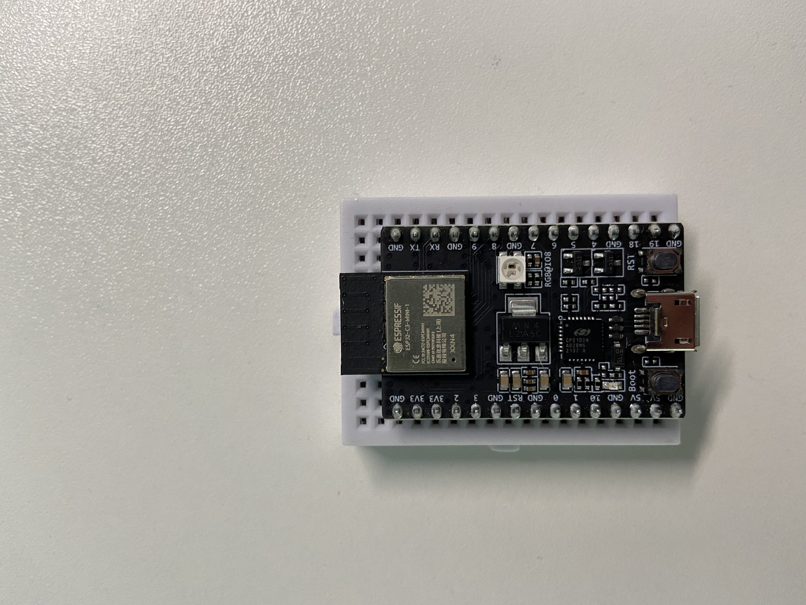
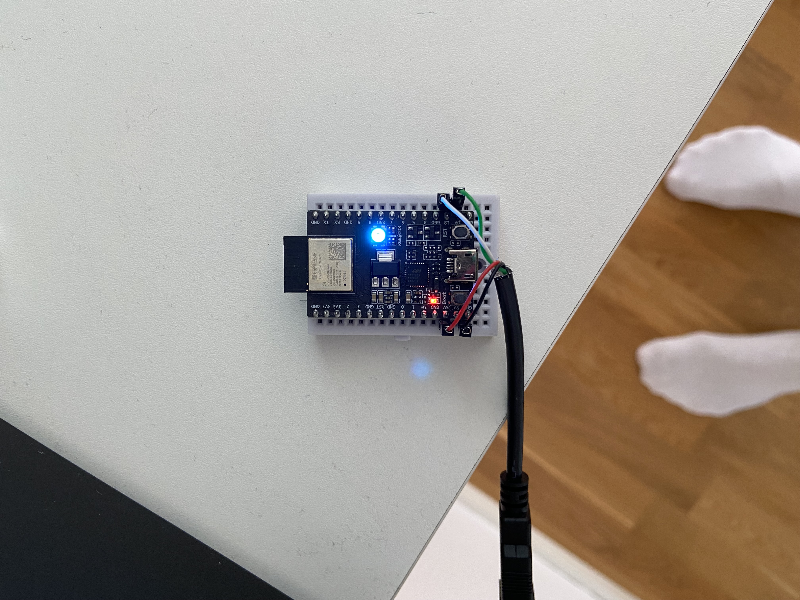

## ESP32-C3-MINI-1
This is based on a RISC-V single core processor (up to 160MHz), and has 15 GPIO
pins, 4 MB of on chip flash from Espressif Systems.



### Datasheet for ESP32-C3-MINI-1
https://www.espressif.com/sites/default/files/documentation/esp32-c3-mini-1_datasheet_en.pdf

### Technical Reference Manual ESP32-C3
https://www.espressif.com/sites/default/files/documentation/esp32-c3_technical_reference_manual_en.pdf#page33

### openocd
We need to build the fork of OpenOCD:
```console
$ git clone git@github.com:espressif/openocd-esp32.git
$ ./bootstrap.sh
$ ./configure
$ make
```
The `openocd` executable can then be found in `./src/openocd`:
```console
$ ./src/openocd -v
Open On-Chip Debugger  v0.11.0-esp32-20220706-47-g9d742a71 (2022-08-08-15:14)
Licensed under GNU GPL v2
For bug reports, read
	http://openocd.org/doc/doxygen/bugs.html
```

```console
$ ./src/openocd -s tcl -f board/esp32c3-builtin.cfg
Open On-Chip Debugger  v0.11.0-esp32-20220706-47-g9d742a71 (2022-08-08-15:14)
Licensed under GNU GPL v2
For bug reports, read
	http://openocd.org/doc/doxygen/bugs.html
Info : only one transport option; autoselect 'jtag'
Info : esp_usb_jtag: VID set to 0x303a and PID to 0x1001
Info : esp_usb_jtag: capabilities descriptor set to 0x2000
Warn : Transport "jtag" was already selected
Info : Listening on port 6666 for tcl connections
Info : Listening on port 4444 for telnet connections
Error: esp_usb_jtag: could not find or open device!

Error: Unsupported xlen: -1
Error: Unknown target arch!
```
I misunderstood things completly and thought that it would be possible to simply
connect an USB cable and be good to go. But we need an additional USB cable, or
just one if we can power the device with it as well, which should be connected
to `D-`, `D+`, `VBUS`, and `GND`. Is is also possible to use an external JTAG
adapter. 

I went with the first option of using a single USB and connected the wires like
this:



Now, if I do a `lsusb` I get:
```console
$ lsusb
...
Bus 001 Device 124: ID 303a:1001 Espressif USB JTAG/serial debug unit
```
This looks more promising. Now lets see if the openocd command works:
```console
$ ./src/openocd -d1 -f board/esp32c3-builtin.cfg 
Open On-Chip Debugger  v0.11.0-esp32-20220706-47-g9d742a71 (2022-08-08-16:46)
Licensed under GNU GPL v2
For bug reports, read
	http://openocd.org/doc/doxygen/bugs.html
debug_level: 1

Warn : Transport "jtag" was already selected
Error: libusb_open() failed with LIBUSB_ERROR_ACCESS
Error: esp_usb_jtag: could not find or open device!

Error: Unsupported xlen: -1
Error: Unknown target arch!
```
Now, this is caused by missing udev rules. On my machine I added the following
rules to `/etc/udev/rules.d/60-openocd.rules`:
```
# Espressif USB JTAG/serial debug units
ATTRS{idVendor}=="303a", ATTRS{idProduct}=="1001", MODE="660", GROUP="plugdev", TAG+="uaccess"
ATTRS{idVendor}=="303a", ATTRS{idProduct}=="1002", MODE="660", GROUP="plugdev", TAG+="uaccess"
```
And the reload the rules:
```console
$ sudo udevadm control --reload-rules && sudo udevadm trigger
```

After that I was able to start openocd:
```console
$ esp32-openocd -f board/esp32c3-builtin.cfg 
Open On-Chip Debugger  v0.11.0-esp32-20220706-47-g9d742a71 (2022-08-08-16:46)
Licensed under GNU GPL v2
For bug reports, read
	http://openocd.org/doc/doxygen/bugs.html
Info : only one transport option; autoselect 'jtag'
Info : esp_usb_jtag: VID set to 0x303a and PID to 0x1001
Info : esp_usb_jtag: capabilities descriptor set to 0x2000
Warn : Transport "jtag" was already selected
Info : Listening on port 6666 for tcl connections
Info : Listening on port 4444 for telnet connections
Info : esp_usb_jtag: serial (A0:76:4E:5A:E2:80)
Info : esp_usb_jtag: Device found. Base speed 40000KHz, div range 1 to 255
Info : clock speed 40000 kHz
Info : JTAG tap: esp32c3.cpu tap/device found: 0x00005c25 (mfg: 0x612 (Espressif Systems), part: 0x0005, ver: 0x0)
Info : datacount=2 progbufsize=16
Info : Examined RISC-V core; found 1 harts
Info :  hart 0: XLEN=32, misa=0x40101104
Info : starting gdb server for esp32c3 on 3333
Info : Listening on port 3333 for gdb connections
```

### USB Serial/JTAG Controller (USB_SERIAL_JTAG)
This can program the system of chips flash, read program output, and also attach
as a debugger to a running program. The docs say that this is prossible without
from an USB host without any additional external components.
The serial port communication is a two-wire interface which is mainly used to
flash new firmware (program the device). The USB Serial part of this controller
is what converts/transforms/translates from USB to serial format. When an error
occurs the JTAG debugging port is used which requires interfacing with the JTAG
debug port which usually requires an external JTAG adapter.

### eFuse Controller (eFuse)
This component is a 4096-bit eFuse controller for one-time programmable storage
parameters. eFuse is a microscopic fuse that is placed on a chip. This
technology was invented by IBM in 2004 and allows for dynamic reprogramming of a
chip. So instead of hard wiring this allows changes to be made during operation.
If one of these parameter are written with a 1, it can never be reverted back to
0. The values of parameters can only be read by using the eFuse Controller.


