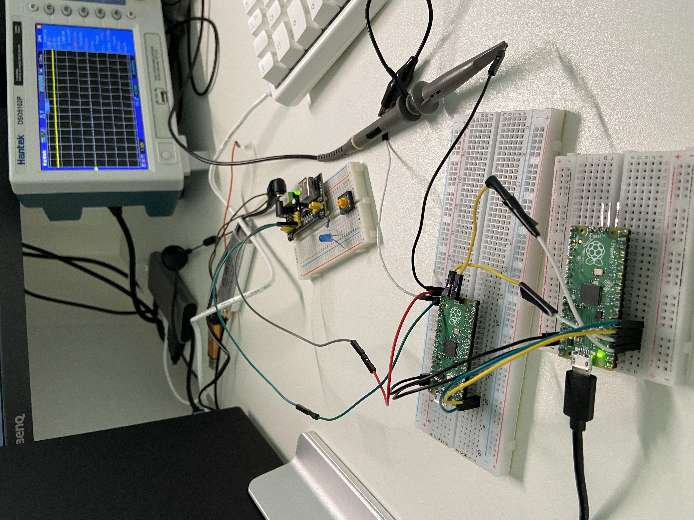
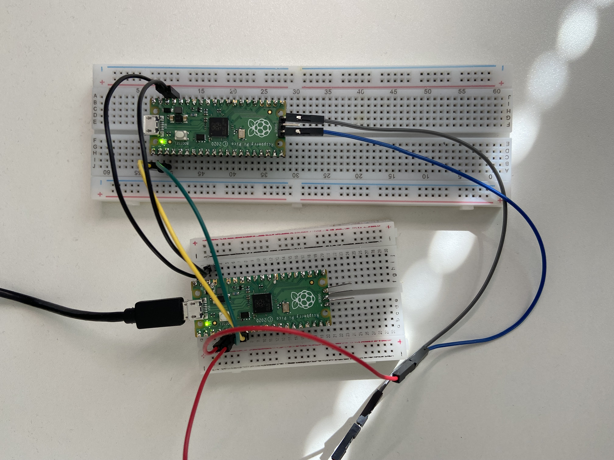

## Raspberry

### RP2040
This is a 32 bit `dual` ARM Cortex M0+ microcontroller and is the first
microcontroller designed by the Raspberry PI Foundation in 2021.
Raspberry sells this chip to other manufacturers, including Adafruit, Arduino,
Seeed Studio, SparkFun, and Pimoroni.

It is very low cost, like $1 (can this be true?) and can be programmed in
Assembly, Rust, C/C++ and MicroPython.

Datasheet: https://datasheets.raspberrypi.com/rp2040/rp2040-datasheet.pdf

RP in the name RP2040 comes from Raspberry PI, 2 is the number of cores, 0 the
type of the cores which in this case is M0+.

* Dual Cortex M0+ processor cores, up to 133 MHz
* 264 kB of embedded SRAM in 6 banks
* 30 multifunction GPIO
* 2xUART
* 2xSPI
* 2xI2C
* Programmable I/O (PIO)

### Addresses Map
Can be found in section 2.2 of the RP2040 datasheet.

APB Peripherals:
```
APB_PERIPHERALS  0x40000000
IO_BANK0_BASE    0x40014000   (GPIO_BASE)
```

### GPIO
There are to banks of 18 General Purpose Input/Ouput pins named `QSPI bank`
(Quad SPI) and `User Bank`. 

```
QSPI: QSPI_SS, QSPI_SCLK, QSPI_SD0, QSPI_SD1, SQSPI_SD2, SQPI_SD3
User Bank: GPIO0-GPIO29
```
The GPIO pins can have different functions like SPI, UART, SPI, I2C, PIO, SIO
etc.  The function of a pin is configured to getting the Function Select value
`FSEL`.
```
 +-----+   +---+
 |SPI  |---| m |
 +-----+   | u |     +-------+   output data      +----------------+
 +-----+   | x |-----|???    |------------------->|   IO PAD       |
 |PIO  |---| e |     +-------+                    |                |
 +-----+   | r |                                  |                |
 +-----+   |   |     +-------+   output enable    |                |
 |UART |---|   |-----|???    |------------------->|                |
 +-----+   |   |     +-------+                    |                |
 +-----+   |   |                                  |                |
 |I2C  |---|   |     +-------+           input    |                |
 +-----+   |   |-----|???    |<-------------------|                |
 +-----+   |   |     +-------+                    +----------------+
 |PWM  |---|   |
 +-----+   +---+
```

The IO Pad are the interface to the external circuitry. 
```
                            +----------------------------+
      Slew rate        -----|                            |
      Output Enable    -----|                            |
      Output Data      -----|                            |
      Drive Strength   -----|                            |
                            |                            |
      Input Enable     -----|                            |
      Input Data       -----|                            |
      Schmitt Trigger  -----|                            |
                            |                            |
      Pull up/ Down    -----|                            |
                            +----------------------------+
```
Notice that `Output Enable`, `Output Data`, and `Data Input` are connected to
the function controlling the pad (using FSEL).

Since there are two cores on the PI Pico there are register that perform atomic
operations. For example there is GPIO_OUT (SIO):
```
GPIO_OUT     0x010  RW  Sets the pin 0..29 to high (1) or low (0)
GPIO_OE      0x020  RW  Set output enable for pins 0..29, (1=output, 0=input)

Atomic registers:
GPIO_OUT_SET 0x014  RW  Set atomically the pin 0..29 to high (1) or low (0)
GPIO_OE_SET  0x024  RW  Set atmomically output enable for pins 0..29, (1=output, 0=input)
```
Controlling the pads is done by using the following registers:
```
User Bank Pad Control registers base address: 0x4001c000
PADS_BANK0: GPIO0, ...CPIO29
  OD       Output Enable (this overrides the output enable of the peripheral)
  IE       Input Enable
  Drive    0x0 = 2mA, 0x1 = 4mA, 0x2= 8mA, 0x3 = 12mA
  PUE      Pull up Enable
  PDE      Pull down Enable
  Schmitt  Enable schmitt trigger
  Slewfast Slew control rate. 1 = fast, 0 = slow
```

To output to a pin we will need to set the function, enable the pin as output
and write to the pins output register. Now the function select to use for to
the output pin, for example to turn on an LED which has become my first program
when encountering new hardware, we should choose Singe Cycle IO (SIO) which is
F5 in 2.19.2 Function Select table.
The following note can be found in 2.3.1.2 GPIO Control:
```
To drive a pin with the SIO’s GPIO registers, the GPIO multiplexer for this pin
must first be configured to select the SIO GPIO function.
```

Since this microcontroller has two cores it is possible for both of them to
modify a register at the same time. For this reason there are registers that
perform atomic set/clear operations.

### Reading a GPIO pin from gdb
First find the offset for the register that contains the pin.

For example, if we want to read pin 16 it is in register PROC0_INTE2:
```
IO_BANK0_BASE    0x40014000
GPIO16_STATUS    0x40014080
```
```console
(gdb) x/t 0x40014080
0x40014080:	00000111000011100000000000000000
```

### Troubleshooting interrupts
We can see if any interrupts have been triggered for a pin, in this case pin 16
which has entries in register `INTR2: 0x400140f8`. This register has four
entries for pin 16 which are bit positions 0-3.
* 0 GPIO16_LEVEL_LOG
* 1 GPIO16_LEVEL_HIGH
* 2 GPIO16_EDGE_LOW
* 3 GPIO16_LEVEL_HIGH)

We can inspect the values using:
```console
(gdb) x/t 0x400140f8
0x400140f8:	00010001000100010001000100010101
```
We can see that the last bits are `0101`.
or:
```console
(gdb) p/t *((int*)0x400140f8)
$2 = 10001000100010001000100010101
```
Just note that when running the last command it depends on the "context" you
are currently in. For example, if you have just loaded the program into
memory but not started executing the above will work just fine. But if you
have started it and stopped at a break point the above command might produce
the following error:
```console
(gdb) p/t (*0xd0000004)
Attempt to take contents of a non-pointer value.
```
Instead the we need to write it as:
```console
(gdb) p/t *(0xd0000004 as *mut &[u8])
$12 = &[*gdb*] {data_ptr: 10000000000000010, length: 110010}

(gdb) p/t (0xd0000004 as *mut &[u8]).data_ptr
$23 = 10000000000000010

(gdb) p/t (0x400140f8 as *mut &[u8]).data_ptr
```

What I've found useful is to hook up a power source with 3.3V to an input pin
and then enable interrupts for the pin. But I'm currently having issues with
the interrupt handler not getting triggered, or rather sometimes it triggers. If
I toggle the power to this pin I can see the change in this register:
```console
(gdb) x/t 0x400140f8
0x400140f8:	00010001000100010001000100010101
```
And turning on the power:
```
(gdb) x/t 0x400140f8
0x400140f8:	00010001000100010001000100011110
```
I also have a an oscilloscope connected to the breadboard for this pin and I can
see that the its working as expected. But the interrupt handler that I've
configured does not trigger.



We can also check the state of the input pins using GPIO_IN:
```
SIO_BASE: 0xd0000000
GPIO_IN:  0xd0000004
```
First when the power is off:
```console
(gdb) p/t (*0xd0000004) & (1 << 16)
$21 = 0
(gdb) p/t (*(0xd0000004 as *mut &[u8])).data_ptr
$2 = 10000000010000000000000010

(gdb) p/t (*(0xd0000004 as *mut &[u8])).data_ptr
```
And the after turning it on:
```console
(gdb) p/t (*0xd0000004) & (1 << 16)
$20 = 10000000000000000
```
So at least so far I can see that the input pin is getting changed as the scope
shows the change in voltage, the input pin changes values in the GPIO_IN
register, and I can see the interrupt registers are also getting updated.

Lets check if the `NVIC` registers are actually set or cleared.

Checking `NVIC_ISER` (interrupt set-enable):
```
Base:      0xe0000000 
NVIC_ISER: 0xe0000100 
```
```console
(gdb) x/t 0xe0000100 
0xe0000100:	00000000000000000000000000000000
```
Reading from this register should show a 1 if the interrupt is enabled, but it
is not enabled.
Lets try enabling the interrupt manually:
```console
(gdb) set (*(0xe0000100 as *mut &[u8])).data_ptr = (1 << 13)
```

Checking `NVIC_ICER` (interrupt clear-enable):
```console
(gdb) x/t 0xe0000180
0xe0000180:	00000000000000000000000000000000
```

Checking `NVIC_ISPR` (interrupt state pending):
```console
(gdb) x/t 0xe0000200
0xe0000280:	00000000000000000000000000000000
```
And we can set this if needed using:
```console
(gdb) set (*(0xe0000200 as *mut &[u8])).data_ptr = (1 << 13)
```

Checking `NVIC_ICPR` (interrupt clear pending):
```console
(gdb) x/t 0xe0000280
```
Having to check each of these individually become tedious and error prone. So
instead we can add custom command to gdb by adding a custom command to
[.gdbinit](rp_gdbinit) file

Checking PROC0_INTE2 (interrupt enable 2):
```console
(gdb) x/t 0x40014108
0x40014108:	00000000000000000000000000000010
```
And this matches the second bit in that register which is `GPIO16_LEVEL_HIGH`.
We can also set the using:
```console
(gdb) set  (*(0x40014108 as *mut &[u8])).data_ptr = (1 << 1)
(gdb) x/t 0x40014108
0x40014108:	00000000000000000000000000000010
```

The strange things is that I've got this to work a few times today and I was
not sure how or when it worked. 

Lets check that our irq handler is in the expected location and contains
what we think it should contain:
```console
(gdb) vectab
0x10000100:	0x20040000	0x100001a9	0x10002911	0x1000f3a5
0x10000110 <__EXCEPTIONS+8>:	0x00000000	0x00000000	0x00000000	0x00000000
0x10000120 <__EXCEPTIONS+24>:	0x00000000	0x00000000	0x00000000	0x10002911
0x10000130 <__EXCEPTIONS+40>:	0x00000000	0x00000000	0x10002911	0x10002911
0x10000140 <__INTERRUPTS>:	0x10006621	0x10006639	0x10006651	0x10006669
0x10000150 <__INTERRUPTS+16>:	0x10002911	0x10002911	0x10002911	0x10002911
0x10000160 <__INTERRUPTS+32>:	0x10002911	0x10002911	0x10002911	0x10002911
0x10000170 <__INTERRUPTS+48>:	0x10002911	0x10003b59
                                                     ↑
                                                 0x1003b58 + 1 (for thumb instruction)


(gdb) disassemble 0x1003b58 
Dump of assembler code for function embassy_rp::gpio::IO_IRQ_BANK0:
   0x10002d2c <+0>:	push	{r7, lr}
   0x10002d2e <+2>:	add	r7, sp, #0
   0x10002d30 <+4>:	sub	sp, #24
   0x10002d32 <+6>:	bl	0x10008190 <cortex_m_semihosting::hio::hstdout>
   0x10002d36 <+10>:	str	r0, [sp, #8]
   0x10002d38 <+12>:	str	r1, [sp, #12]
   0x10002d3a <+14>:	b.n	0x10002d3c <embassy_rp::gpio::IO_IRQ_BANK0+16>
   0x10002d3c <+16>:	ldr	r1, [sp, #12]
   0x10002d3e <+18>:	ldr	r0, [sp, #8]
   0x10002d40 <+20>:	ldr	r2, [pc, #44]	; (0x10002d70 <embassy_rp::gpio::IO_IRQ_BANK0+68>)
   0x10002d42 <+22>:	bl	0x10007cb0 <core::result::Result<cortex_m_semihosting::hio::HostStream, ()>::unwrap<cortex_m_semihosting::hio::HostStream, ()>>
   0x10002d46 <+26>:	str	r0, [sp, #16]
...
```
And from the above we can see that the interrupt request handler is there. I
just wanted to double check that it was not being removed for some reason which
was causing the behaviour that I'm seeing.

Now, the states for interrupts are as follows:
* Pending: This is where the microcontroller has detected the interrupt and
scheduled it, but not yet invoked the handler. So in my current case it has
detected the transion from low to high, but not invoked the handler.

* Active: This where the microcontroller has started running the interrupt
handler but not finished its execution yet (it might have been pre-empted by
a higher priority interrupt/exception).

* Pending & Active: Can happen when the microcontroller detects an interrupt
of the same type/number while currently executing a handler for that type. Like
the same interrupt happening while executing it's handler code.

* Inactive: Neither pending or active.

So, I can see that the interrupt is pending but the handler is not being called.
What could be the reason for this?


So what I'm seeing this this:
```console
(gdb) bt
#0  0x00000030 in ?? ()
#1  <signal handler called>
#2  0x744c2066 in ?? ()
#3  <signal handler called>
#4  lib::__wfe () at asm/lib.rs:52
#5  0x10000af4 in cortex_m::asm::wfe () at /home/danielbevenius/.cargo/registry/src/github.com-1ecc6299db9ec823/cortex-m-0.7.4/src/asm.rs:49
#6  0x10000326 in embassy::executor::arch::Executor::run<async_gpio::__cortex_m_rt_main::{closure_env#0}> (self=0x20041ed0, init=...)
    at /home/danielbevenius/work/drougue/embassy/embassy/src/executor/arch/cortex_m.rs:54
#7  0x10000882 in async_gpio::__cortex_m_rt_main () at src/bin/async_gpio.rs:17
#8  0x10000854 in async_gpio::__cortex_m_rt_main_trampoline () at src/bin/async_gpio.rs:17
```
Now, I can't tell what those signal handlers are but we can step up the frames
in gdb. Lets start by going back to the first signal handler (frame 3)
```console
(gdb) frame 3
#3  <signal handler called>
```
And lets take a look at the frame information:
```console
(gdb) info frame
Stack level 3, frame at 0x20041ea4:
 pc = 0xfffffff9; saved pc = 0x1000c50e
 called by frame at 0x20041ea4, caller of frame at 0x20041e80
 Arglist at unknown address.
 Locals at unknown address, Previous frame's sp is 0x20041ea4
 Saved registers:
  r0 at 0x20041e80, r1 at 0x20041e84, r2 at 0x20041e88, r3 at 0x20041e8c, r12 at 0x20041e90, lr at 0x20041e94, pc at 0x20041e98, xPSR at 0x20041e9c
```
Notice the saved registers and lets inspecte `xPSR`:
```console
(gdb) p/t 0x20041e9c
$1 = 100000000001000001111010011100
```
And we can mask the execption number using:
```console
(gdb) p/t 0x20041e9c & 0x1f
$10 = 11100
(gdb) p/d 0x20041e9c & 0x1f
$11 = 28
```
What is this number 28, the interrupt we have enabled in 13. Hmm, looking at
this a little close 
```console
(gdb) vectab 
"Interrupt vector:
"0x10000100:                 	0x20040000	0x100001a9	0x10001d91	0x1000ea6d
0x10000110 <__EXCEPTIONS+8>:	0x00000000	0x00000000	0x00000000	0x00000000
0x10000120 <__EXCEPTIONS+24>:	0x00000000	0x00000000	0x00000000	0x10001d91
0x10000130 <__EXCEPTIONS+40>:	0x00000000	0x00000000	0x10001d91	0x10001d91
0x10000140 <__INTERRUPTS>:	0x10005e39	0x10005e51	0x10005e69	0x10005e81
0x10000150 <__INTERRUPTS+16>:	0x10001d91	0x10001d91	0x10001d91	0x10001d91
0x10000160 <__INTERRUPTS+32>:	0x10001d91	0x10001d91	0x10001d91	0x10001d91
0x10000170 <__INTERRUPTS+48>:	0x10001d91	0x100030f9	0x10001d91	0x10001d91
0x10000180 <__INTERRUPTS+64>:	0x10001d91	0x10001d91	0x10001d91	0x10001d91
0x10000190 <__INTERRUPTS+80>:	0x10001d91	0x10001d91	0x10001d91	0x10001d91
```
First we have the stack pointer value which is `0x20040000` which does not have
an exception number, followed by the reset handler in `0x100001a9`, followed
by the NMI handler (2) which is this case is `cortex_m_rt::DefaultHandler`,
followed by the HardFault handler (3) which is this case is HardFaultTrampoline,
then we have Memory Management fault (4), bus fault (5).
If we start counting from the first handler being 0 then the 28th one is in
fact `0x100030f9` which is our interrupt handler:
```console
(gdb) disassemble 0x100030f9
Dump of assembler code for function embassy_rp::gpio::IO_IRQ_BANK0:
   0x100030f8 <+0>:	push	{r7, lr}
   0x100030fa <+2>:	add	r7, sp, #0
   0x100030fc <+4>:	sub	sp, #8
   0x100030fe <+6>:	bl	0x100046c8 <_ZN8cortex_m9interrupt4free17hfbb6b193986e31caE>
   0x10003102 <+10>:	b.n	0x10003104 <embassy_rp::gpio::IO_IRQ_BANK0+12>
   0x10003104 <+12>:	add	sp, #8
   0x10003106 <+14>:	pop	{r7, pc}
End of assembler dump.
```
But this does not look correct, in the actual handler code I am using
semihosting to print out a debug string which is not showing up in the
disassembly. This is interesting and if I comment in another line of code I
see the full source, and in this case the interrupt work!
TODO: clean up the above section as see if I can reproduce it again.


Sometimes I get the following backtrace:
```console
Thread 1 received signal SIGINT, Interrupt.
0x00000030 in ?? ()
(gdb) bt
#0  0x00000030 in ?? ()
#1  0x10000326 in embassy::executor::arch::Executor::run<async_gpio::__cortex_m_rt_main::{closure_env#0}> (self=0x20041ed0, init=...)
    at /home/danielbevenius/work/drougue/embassy/embassy/src/executor/arch/cortex_m.rs:54
#2  0x1000076a in async_gpio::__cortex_m_rt_main () at src/bin/async_gpio.rs:17
#3  0x1000073c in async_gpio::__cortex_m_rt_main_trampoline () at src/bin/async_gpio.rs:17
```

We can inspect the register `xPSR` and look at the bits 0-5 which contain the
number of the currently executing exception. This will be 0 for normal thread
mode, but if there is the interrupt service routine number of the currently
active exception.
If we check this value we find:
```console
(gdb) p/d $xPSR & 0x1f
$5 = 3
```
And 3 is the number of the `HardFault` exception. So it seems like sometimes
the interrupt occurs which awakens the the processor which was suspended
due to the `wfe` call. Or should this be a negative value for an exception?


We can also take a look at the current frame:
```console
(gdb) info frame
Stack level 0, frame at 0x20041eac:
 pc = 0x30; saved pc = 0x10000326
 called by frame at 0x20041ecc
 Arglist at 0x20041e60, args: 
 Locals at 0x20041e60, Previous frame's sp is 0x20041eac
 Saved registers:
  r7 at 0x20041ea4, lr at 0x20041ea8
```

And if we take a look at the saved program counter using:
```console
(gdb) set print asm-demangle on

(gdb) disassemble 0x10000326
Dump of assembler code for function embassy::executor::arch::Executor::run<async_gpio::__cortex_m_rt_main::{closure_env#0}>:
   0x100002fa <+0>:	push	{r7, lr}
   0x100002fc <+2>:	add	r7, sp, #0
   0x100002fe <+4>:	sub	sp, #24
   0x10000300 <+6>:	str	r0, [sp, #4]
   0x10000302 <+8>:	str	r0, [sp, #16]
   0x10000304 <+10>:	bl	0x1000a294 <embassy::executor::raw::Executor::spawner>
   0x10000308 <+14>:	str	r0, [sp, #8]
   0x1000030a <+16>:	b.n	0x1000030c <embassy::executor::arch::Executor::run<async_gpio::__cortex_m_rt_main::{closure_env#0}>+18>
   0x1000030c <+18>:	ldr	r0, [sp, #8]
   0x1000030e <+20>:	str	r0, [sp, #12]
   0x10000310 <+22>:	ldr	r0, [sp, #12]
   0x10000312 <+24>:	bl	0x10000e5a <async_gpio::__cortex_m_rt_main::{closure#0}>
   0x10000316 <+28>:	b.n	0x10000318 <embassy::executor::arch::Executor::run<async_gpio::__cortex_m_rt_main::{closure_env#0}>+30>
   0x10000318 <+30>:	b.n	0x1000031a <embassy::executor::arch::Executor::run<async_gpio::__cortex_m_rt_main::{closure_env#0}>+32>
   0x1000031a <+32>:	ldr	r0, [sp, #4]
   0x1000031c <+34>:	bl	0x1000a232 <embassy::executor::raw::Executor::poll>
   0x10000320 <+38>:	b.n	0x10000322 <embassy::executor::arch::Executor::run<async_gpio::__cortex_m_rt_main::{closure_env#0}>+40>
   0x10000322 <+40>:	bl	0x100009d4 <cortex_m::asm::wfe>
   0x10000326 <+44>:	b.n	0x1000031a <embassy::executor::arch::Executor::run<async_gpio::__cortex_m_rt_main::{closure_env#0}>+32>
End of assembler dump.
```

But sometimes it just works, there is no HardFault, and the output is:
```console
InterruptInput new
wait_for_high
InterruptInputFuture  new
IO_IRQ_BANK0 global Interrupt handler
InterruptInputFuture::poll
check is high
high so clear the interrutp flag
```
Where is this hard fault being generated?

`0x10002d2d` is the address of irq handler when and I ran the `checkint`
command to display the registers that I think might be interesting. One thing
I noticed is that VTOR (the vector table offset) is set when it works which is
not the case when it does not:
```console
"VTOR:
"0xe000ed08:	00010000000000000000000100000000

(gdb) x/t 0xe000ed08
0xe000ed08:	00010000000000000000000100000000

(gdb) x/x 0xe000ed08
0xe000ed08:	0x10000100
```
Lets try this and see if I can force a failing load to actually succeed by
setting the VTOR manually in gdb:
```console
(gdb) monitor reset halt
(gdb) flash target/thumbv6m-none-eabi/debug/async_gpio 
(gdb) load
(gdb) checkint
...
"VTOR:
"0xe000ed08:	00000000000000000000000000000000
```
And now set the VTOR register (can also use the `setvtor` command if the above
rp_gdbinit file is used):
```console
(gdb) set *0xe000ed08 = 0x10000100
(gdb) checkint 
...
"VTOR:
"0xe000ed08:	00010000000000000000000100000000

(gdb) c

openocd.log:
InterruptInput new
wait_for_high
InterruptInputFuture  new
InterruptInputFuture::poll
check is high
return Poll::Pending

(The following is printed from the interrupt handler)
IO_IRQ_BANK0 global Interrupt handler
InterruptInputFuture::poll
check is high
high so clear the interrutp flag
```
This seems to work consistently! :) 

I think this is normally set by the bootloader but I'm not sure (TODO: take a
look at the bootloader code).

The `VTOR` register contains an offset from the default address 0x00000000 to
a user-provided address:
```console
"VTOR:
"0xe000e41c:	00000000000000000000000000000000
```
Now in PICO we have a boot loader and upon startup we can see that the vector
table is loaded at:
```console
(gdb) load
Loading section .vector_table, size 0xc0 lma 0x10000100
```

The VTOR register offsets the vector table from the default 0x0000_0000 to a
user-provided address, which is required if the user's vector table is not at
the start of memory (for example, because a bootloader is present).

My theory at the moment is that for some reason the VTOR is not getting set, or
is being reset which is causing an incorrect address to be found when the
interrupt occurs, which could lead to a HardFault I guess and cause the behavour
that I'm seeing.

If we take a look in [rp2040-boot2](https://github.com/rp-rs/rp2040-boot2/blob/4691c7160ad1f5e06a7d281bdf1dcf4934e3055d/src/boot2_w25q080.S#L278-L284)
we can see that VTOR table is updated.

The boot loader used in embassy-pr is:
```rust
#[link_section = ".boot2"]
#[used]
static BOOT2: [u8; 256] = *include_bytes!("boot2.bin");
```

We can inspect the sections loaded in gdb using to verify that the .boot2
section is there:
```console
(gdb) maintenance info sections 
Exec file:
    `/home/danielbevenius/work/drougue/embassy/examples/rp/target/thumbv6m-none-eabi/debug/async_gpio', file type elf32-littlearm.
 [0]      0x10000100->0x100001a8 at 0x00000134: .vector_table ALLOC LOAD READONLY DATA HAS_CONTENTS
 [1]      0x100001a8->0x1000ec10 at 0x000001dc: .text ALLOC LOAD READONLY CODE HAS_CONTENTS
 [2]      0x1000ec10->0x100111f0 at 0x0000ec50: .rodata ALLOC LOAD READONLY DATA HAS_CONTENTS
 [3]      0x20000000->0x20000030 at 0x00011230: .data ALLOC LOAD DATA HAS_CONTENTS
 [4]      0x10011220->0x10011220 at 0x00011260: .gnu.sgstubs ALLOC LOAD DATA HAS_CONTENTS
 [5]      0x20000030->0x2000013c at 0x00011260: .bss ALLOC
 [6]      0x2000013c->0x2000053c at 0x00011260: .uninit ALLOC
 [7]      0x10000000->0x10000100 at 0x00011260: .boot2 ALLOC LOAD READONLY DATA HAS_CONTENTS
 [8]      0x0000->0x0020 at 0x00011360: .defmt READONLY HAS_CONTENTS
 [9]      0x0000->0xb828 at 0x00011380: .debug_abbrev READONLY HAS_CONTENTS
 [10]     0x0000->0xab18c at 0x0001cba8: .debug_info READONLY HAS_CONTENTS
 [11]     0x0000->0xb4b8 at 0x000c7d38: .debug_aranges READONLY HAS_CONTENTS
 [12]     0x0000->0x1e500 at 0x000d31f0: .debug_ranges READONLY HAS_CONTENTS
 [13]     0x0000->0xd38cc at 0x000f16f0: .debug_str READONLY HAS_CONTENTS
 [14]     0x0000->0x414a8 at 0x001c4fbc: .debug_pubnames READONLY HAS_CONTENTS
 [15]     0x0000->0x60055 at 0x00206464: .debug_pubtypes READONLY HAS_CONTENTS
 [16]     0x0000->0x0032 at 0x002664b9: .ARM.attributes READONLY HAS_CONTENTS
 [17]     0x0000->0x1f0c0 at 0x002664ec: .debug_frame READONLY HAS_CONTENTS
 [18]     0x0000->0x55b4f at 0x002855ac: .debug_line READONLY HAS_CONTENTS
 [19]     0x0000->0x6dfe at 0x002db0fb: .debug_loc READONLY HAS_CONTENTS
 [20]     0x0000->0x0022 at 0x002e1ef9: .debug_line_str READONLY HAS_CONTENTS
 [21]     0x0000->0x0019 at 0x002e1f1b: .debug_rnglists READONLY HAS_CONTENTS
 [22]     0x0000->0x006d at 0x002e1f34: .comment READONLY HAS_CONTENTS
```

```console
(gdb) info symbol 0x10000000
embassy_rp::BOOT2 in section .boot2
```
And we can disassemble this to see the actual code used and hopefully be able
to set a break point on an address in there.
```console
(gdb) disassemble embassy_rp::BOOT2
```
Now, that is the place of the boot loader in the image in gdb, but this will
get flashed to the device and during reset the 256kB bootloader will be copied
into SDRAM. So I think we need to set a break point in the location where these
instructions are copied into (SDRAM).
In the datasheet and the boot section we can read:
```
• Copy 256 bytes from SPI to internal SRAM (SRAM5) and check for valid CRC32 checksum
```
And if we search for `SRAM5` we find:
```
SRAM5_BASE: 0x20041000
```
So lets take a look at the instructions in that location after having loaded
the program. And instruction in thumb is 16bits long, that is 2 bytes, and
we know the program copied is 256kB
```console
(gdb) x/20i 0x20041000
   0x20041000:	lsls	r6, r3, #31
   0x20041002:	lsrs	r6, r3, #7
   0x20041004:	push	{r3, r5, r7, lr}
   0x20041006:	orr.w	pc, r2, #132120576	; 0x7e00000
   0x2004100a:	strh	r5, [r2, r2]
   0x2004100c:	ldmia	r0!, {r4, r5, r6, r7}
   0x2004100e:	str	r5, [r6, #88]	; 0x58
```

<a name="vtor_issue"></a>
This updating of the VTOR registry will happen when the devices boot sequence
is run, which it will be upon a reset. For example doing a `monitor reset init`
will do that, but using the gdb `load` command will not.

Testing this is gdb would look like:
```console
$ arm-none-eabi-gdb target/thumbv6m-none-eabi/debug/async_gpio
(gdb) flash target/thumbv6m-none-eabi/debug/async_gpio
(gdb) monitor reset init
(gdb) vtor 
"VTOR:
"0xe000ed08:	00000000000000000000000000000000
```
We can see that the VTOR register is zero. Now if we continue:
```console
(gdb) c
CTRL+C
(gdb) vtor
"VTOR:
"0xe000ed08:	00010000000000000000000100000000
``` 
We can see that it is set. If we now just do the following, which is what I've
unfortunately gotten into the habit of doing:
```console
$ arm-none-eabi-gdb target/thumbv6m-none-eabi/debug/async_gpio
(gdb) flash target/thumbv6m-none-eabi/debug/async_gpio
(gdb) load
(gdb) vtor
(gdb) c
(gdb) vtor
"VTOR:
"0xe000ed08:	00000000000000000000000000000000
```
The problem is that I've been using the `load` command to 'restart' a debugging
session but this will cause the VTOR register to be cleared and not able the
interrupts will not be handled correctly. Lesson learned here for me it don't
use the `load` command. And this was also the reason for this sometimes working
for me.


### Single Cycle IO Block
Here the processor can drive the GPIO pins.

https://datasheets.raspberrypi.com/rp2040/rp2040-datasheet.pdf#tab-registerlist_sio

Registers in 2.3.1.7. List of Registers:
```
SIO_BASE: 0xd0000000
GPIO_IN: 0x004
GPIO_OUT: 0x010
GPIO_OE: 0x020             GPIO Output Enable
```


### Programmable I/O (PIO)
Two of these PIO block are included on the PI Pico board.

Each of these contains 4 state machines:
```
  +--------------------+
  |       PIO          |
  |  +--------------+  |
  |+-| State Machine|  |
  || +--------------+  |
  || +--------------+  |
  |+-| State Machine|  |
  || +--------------+  |
  || +--------------+  |
  |+-| State Machine|  |
  || +--------------+  |
  || +--------------+  |
  |+-| State Machine|  |
  || +--------------+  |
  ||                   |
  || +---------------+ |
  |+-| Instruction   | |
  |  | Memory 32 inst| |
  |  +---------------+ |
  +--------------------+
```
Programming is done in a custom assembly language which only has 9 instructions:
* in
* out
* push
* pull
* mov
* irq
* wait
* jmp
* set

I looks like this can also be programmed using Rust with
[pio-rs](https://github.com/rp-rs/pio-rs).

### Openocd
```console
$ git clone https://github.com/raspberrypi/openocd.git --branch rp2040 --depth=1 --no-single-branch
$ cd openocd
$ ./bootstrap
$ ./configure --enable-picoprobe --enable-sysfsgpio --enable-bcm2835gpio
$ make -j8
```
The openocd binary is then located in src/openocd.
```console
$ ./src/openocd --version
Open On-Chip Debugger 0.11.0-g610f137 (2022-05-06-14:51)
Licensed under GNU GPL v2
For bug reports, read
	http://openocd.org/doc/doxygen/bugs.html
```

Update udev rules:
```console
$ sudo cp ./contrib/60-openocd.rules /etc/udev/rules.d
```
Remember that for this to take effect you'll need to disconnect the probe if
it is currently hooked in.



Using minicom:
```console
$ sudo minicom -D /dev/ttyACM0 -b 115200
```

###  rp-hal
[rp-hal](https://github.com/rp-rs/rp-hal) contains high level drivers for
RP2040 and also has board support (Supported Board Packages) for PI Pico, and
Adafruit Feather RP2040 that use the HAL but have preconfigured values for the
specific components of the board in question.

[rp2040-hal](https://github.com/rp-rs/rp-hal/tree/main/rp2040-hal) is the
hardware abstration layer for RP2040.


### USB Flashing Format (UF2)
Is a file format developed by Microsoft and can be used for flashing
microcontrollers over Mass Storage Devices (flashdrive). RP2040 contains a
bootloader that appears as a Mass Storage Device over USB which can accept UF2
format files. A UF2 file copied to the drive is downloaded and written to Flash
or RAM.

Rust produces ELF format binaries which can be converted into
[UF2](https://github.com/microsoft/uf2) using
[elf2uf2](https://github.com/JoNil/elf2uf2-rs).
```console
$ cargo install elf2uf2-rs --locked
```

### Memory
RP2040 has 16kB ROM `on-chip` at address 0x00000000 and this memory contents
(Read Only Memory remember) is fixed at manufacturing time and contains the
initial startup routine, flash boot sequence, flash programming routines, USB
mass storage support (UF2 format).

There is also 264kB `on-chip` SRAM which is divided into:
* 4 16k x 32-bit banks (64kB each, 256kB total)
* 2 1k  x 32-bits banks (4kB each, 8kB total)

SRAM is mapped to system addresses starting at 0x20000000.

There are also another 2 RAM blocks that are used for XIP caching of size
16kB starting at 0x15000000.
And 4kB for USB DPRAM at 0x50100000.

Flash is external to the chip (not on-chip) and accessed using Quad SPI (QSPI)
interface using the Execute in Place (XIP) hardware. This allows an external
flash memory hardware to be addresses/accessed by the system as though it was
internal memory. From the RP2040 datasheet:
```
Bus reads to a 16MB memory window starting at 0x10000000 are translated into a
serial flash transfer, and the result is returned to the master that initiated
the read. This process is transparent to the master, so a processor can execute
code from the external flash without first copying the code to internal memory,
 hence "execute in place"
```
Like mentioned above there is a internal cache of 16kB fr XIP caching.

### Boot
The bootrom is 16kB in size and is built into the chip and takes care of a
number of things like initializing the boot sequence for processor 0 and
processor 1 will be placed in power wait mode. It will then setup USB Mass
Storage, and set routines for programming and manipulating external flash.

Source can be found in [pico-bootrom](https://github.com/raspberrypi/pico-bootrom)

Now, with the first program I wrote which is a very basic assembly example that
turns on the onboard [LED](../rp/led).LED. My first attempt to just have a
linker-script handle the layout like I've done for `stm32` and `nrf` devices
did not work in the case of PI Pico and it instead booted into USB Mass
Storage mode when taking the device out of reset. The following section will
take a closer look at the boot sequence to understand why this was happening.

Simplified bootsequence:
```
    ...
      ↓ 
   +--------+  no     +------------------------------------------+
   |BootSel |---------| Conf. init Synopsys SSI for standard mode|
   +--------+         | QSPI pins                                |
      |               +------------------------------------------+
      |                     ↓
      |               +---------------+
      |               | Load and copy |
      |      +------->| 256kB to SDRAM|
      |      |        | from Flash    |
      |   no |        +---------------+
      |      |              ↓          
      |   +------+    +-----------------+
      |   | <0.5s|<-- | Verify checksum |
      |   +------+    +-----------------+
      |   yes|              ↓
      |<-----+        +-------------------+
      |               | Start executing at|
      |               | at start of the   |
      |               | copies 256kb in   |
      |               | SDRAM             |
      |               +-------------------+
 +------------------+
 | Enter USB device |
 | mode bootcode    |
 +------------------+
```

If we press the `BOOTSEL` button on during startup, it will enter USB Mass
Storage Mode for code upload and if not pressed the boot sequence will start
executing the program in flash memory.

If BOOTSEL was not pressed then there will be a step that configures SSI and
connects to I/O pads, and initializes it for Standard SPI mode which I think is
so that it can communicate with any type of Flash device that is in use. 

Next in the boot sequence 256 bytes will be read from Flash using the standard
SPI interface (at least that is how I understand it) and copies those bytes
into SDRAM. I've read that the reason for copying this is that the intention
of this code it to configure the external Flash device which needs to be
disabled while doing that configuration. These 256 bytes contain 252 bytes of
code and 4 bytes of checksum. This checksum will be verified, and if it passes
execution will start by jumping to the first bytes in the 256 bytes copied in
SDRAM.

Now, if the checksum check fails, it will be retried 128 times each check
taking about 4ms which in total takes about 0.5sec. After this it will boot into
USB device mode (sounds familiar? This is what I ran into with my first program).

The second stage bootloader which is normally in a section named `.boot2` and it
configures the flash chip using commands specific to the external flash chip on
the board in question. RP2040 uses an external flash chip to store program code
and different flash chips (from different manufactures) have different protocols
for configuring their chips. This is what the purpose of boot2 is. 

So to know which second stage boot loader program we need to use depends on
what kind of flash we have on our board. Lets take a look at the 
[data sheet](https://octopart.com/datasheet/w25q16jvsniq-winbond-75609620) for
 Pico:
```
External Quad-SPI Flash with eXecute In Place (XIP) and 16kByte on-chip cache.
...
Pico provides minimal (yet flexible) external circuitry to support the RP2040
chip: flash (Winbond W25Q16JV)
```
[Datasheet](https://octopart.com/datasheet/w25q16jvsniq-winbond-75609620) for
Winbond W25Q16J.
If we take a look in [boot_stage2](https://github.com/raspberrypi/pico-sdk/tree/master/src/rp2_common/boot_stage2)
we can see that there are few assembly files which have `w25q` in them, for
example [boot2_w25q080.S](https://github.com/raspberrypi/pico-sdk/blob/master/src/rp2_common/boot_stage2/boot2_w25q080.S)
and if we look in side we can see that this does in fact support W25Q16JV:
```assembly
// Device:      Winbond W25Q080
//              Also supports W25Q16JV (which has some different SR instructions)
```
Looking futher down in the comments we find that this program/functions will
configure the W25Q16JV device to run in QSPI execute in place (XIP) mode.


So the the reason for my first program not working is that bootsequence will,
after a few other things which I've not fully understood yet, read 256 bytes
from flash and store them in SDRAM. This is expected to be the second
stage bootloader as discussed above.

After loading this it will verify that the checksum is correct for these 256
bytes and if that passes it will enter the second stage of the booting, which
will start after those 256 bytes. But this is a problem for us because we want
our program to run but it will not pass this boot stage (the checksum check).
The solution is provided by a python script named `pad_checksum` which can take
our binary and pad it and adds the checksum:
```console
$ hexdump -C led.bin 
00000000  00 00 00 20 01 00 00 00  04 49 05 4a 0a 60 05 49  |... .....I.J.`.I|
00000010  05 4a 0a 60 05 49 06 4a  0a 60 fe e7 cc 40 01 40  |.J.`.I.J.`...@.@|
00000020  05 00 00 00 20 00 00 d0  00 00 00 02 10 00 00 d0  |.... ...........|
00000030  00 00 00 00                                       |....|
00000034
```

```assembly
.section .boot2, "ax"

.byte 0x00, 0x00, 0x00, 0x20, 0x01, 0x00, 0x00, 0x00, 0x04, 0x49, 0x05, 0x4a, 0x0a, 0x60, 0x05, 0x49
.byte 0x05, 0x4a, 0x0a, 0x60, 0x05, 0x49, 0x06, 0x4a, 0x0a, 0x60, 0xfe, 0xe7, 0xcc, 0x40, 0x01, 0x40
.byte 0x05, 0x00, 0x00, 0x00, 0x20, 0x00, 0x00, 0xd0, 0x00, 0x00, 0x00, 0x02, 0x10, 0x00, 0x00, 0xd0
.byte 0x00, 0x00, 0x00, 0x00, 0x00, 0x00, 0x00, 0x00, 0x00, 0x00, 0x00, 0x00, 0x00, 0x00, 0x00, 0x00
.byte 0x00, 0x00, 0x00, 0x00, 0x00, 0x00, 0x00, 0x00, 0x00, 0x00, 0x00, 0x00, 0x00, 0x00, 0x00, 0x00
.byte 0x00, 0x00, 0x00, 0x00, 0x00, 0x00, 0x00, 0x00, 0x00, 0x00, 0x00, 0x00, 0x00, 0x00, 0x00, 0x00
.byte 0x00, 0x00, 0x00, 0x00, 0x00, 0x00, 0x00, 0x00, 0x00, 0x00, 0x00, 0x00, 0x00, 0x00, 0x00, 0x00
.byte 0x00, 0x00, 0x00, 0x00, 0x00, 0x00, 0x00, 0x00, 0x00, 0x00, 0x00, 0x00, 0x00, 0x00, 0x00, 0x00
.byte 0x00, 0x00, 0x00, 0x00, 0x00, 0x00, 0x00, 0x00, 0x00, 0x00, 0x00, 0x00, 0x00, 0x00, 0x00, 0x00
.byte 0x00, 0x00, 0x00, 0x00, 0x00, 0x00, 0x00, 0x00, 0x00, 0x00, 0x00, 0x00, 0x00, 0x00, 0x00, 0x00
.byte 0x00, 0x00, 0x00, 0x00, 0x00, 0x00, 0x00, 0x00, 0x00, 0x00, 0x00, 0x00, 0x00, 0x00, 0x00, 0x00
.byte 0x00, 0x00, 0x00, 0x00, 0x00, 0x00, 0x00, 0x00, 0x00, 0x00, 0x00, 0x00, 0x00, 0x00, 0x00, 0x00
.byte 0x00, 0x00, 0x00, 0x00, 0x00, 0x00, 0x00, 0x00, 0x00, 0x00, 0x00, 0x00, 0x00, 0x00, 0x00, 0x00
.byte 0x00, 0x00, 0x00, 0x00, 0x00, 0x00, 0x00, 0x00, 0x00, 0x00, 0x00, 0x00, 0x00, 0x00, 0x00, 0x00
.byte 0x00, 0x00, 0x00, 0x00, 0x00, 0x00, 0x00, 0x00, 0x00, 0x00, 0x00, 0x00, 0x00, 0x00, 0x00, 0x00
.byte 0x00, 0x00, 0x00, 0x00, 0x00, 0x00, 0x00, 0x00, 0x00, 0x00, 0x00, 0x00, 0x4f, 0x31, 0x6b, 0xe0
```
And this assembly file can then be assembled and linked and will then work. An
example can be found in [led.s](../rp/led).


### Hook up
In my case I've got two Pico's and I'm going to use one a programmer and the
other as the target where application will be run.

```console
$ git clone https://github.com/raspberrypi/picoprobe.git
$ cd picoprobe
$ mkdir build
$ Cmake -G "Unix Makefiles" ..
$ make
```
Now press the BOOTSEL button and while pressing it connect the debugger probe
into the host using the USB cable.
Now we are going to copy the generate picoprobe.uf2 to the mounted mass storage
device named `RPI-RP2`. We can find its path by using:
```console
$ lsblk
NAME                            MAJ:MIN RM   SIZE RO TYPE MOUNTPOINTS
sda                               8:0    1     0B  0 disk 
sdb                               8:16   1     0B  0 disk 
sdc                               8:32   1     0B  0 disk 
sdd                               8:48   1   128M  0 disk 
└─sdd1                            8:49   1   128M  0 part /run/media/danielbevenius/RPI-RP2
```
```console
$ cp picoprobe.uf2 /run/media/danielbevenius/RPI-RP2/
```
The onboard LED should now be turned on.

```console
$ lsblk

$ cp blink.uf2 /run/media/danielbevenius/RPI-RP2 
```

### Synchronous Serial Interface (SSI)
This is a controller on the QSPI pins and is used to communicate with external
Flash devices. SSI is part of the Execute in Place block (XIP block).

This is covered in section 4.10 of the Peripheral section of the datasheet. It
contains the following:
```
The SSI controller is based on a configuration of the Synopsys DW_apb_ssi IP
```
DW stands for Design Ware, and apb stand for advanced peripheral bus. IP stands
for Intelectual Property (IP as in FPGA IP) which is a block of logic or data
used in making FPGAs or application specific integrated circuits. There are
three categories of IPs, hard cores, firm cores, and soft cores.  

The APB port connects the IP instance to the rest of the SoC while the bus is 
connectd to the register interface and DMA.

On RP2040 DW_abp_ssi is a component of the flash execute-in-place subsystem
and provides communication with an external SPI, dual SPI or QSPI flash device.

### Clocks


### Resus
Short for resuscitation is a curcuit that enables which will switch the clk_sys
back to a known good clock source if software for some reason has stopped the
clock (which would normally cause an unrecoverable lock-up).
The on-chip resus component restarts the system clock from a known good clock if
it is accidentally stopped. This allows the software debugger to access
registers and debug the problem.

### Single Cycle IO (SIO)
```
  +--------+                         +--------+
  | Core 0 |                         | Core 1 |
  +--------+                         +--------+
      ↑                                   ↑
    IOPort                              IOPort
      ↓                                   ↓

-----------   Single-cycle I/0 -----------------------------------------

 +---+                                         +---+
 | B |←----- CPUID 0         CPUID 1 ---------→| B |
 | u |                                         | u |
 | s |----------→ FIFO to Core 1 -------------→| u |
 |   |←---------- FIFO to Core 1 ←-------------|   |
 | I |                                         | I |
 | n |←-------→ Hardware Spinlock (32) ←------→| n |
 | t |                                         | t |
 | e |←-----→ Integer Divider                  | e |
 | r |                 Integer Divider -------→| r |
 | f |←-----→ Interpolator 0                   | f |
 | a |                 Interpolator 0  -------→| a |
 | c |←-----→ Interpolator 1                   | c |
 | e |                 Interpolator 1  -------→| e |
 +---+                                         +---+
   ↑
 +--------------------------------------------------+
 |  GPIO Registers, shared and atomic (set/clear/xor|
 +--------------------------------------------------+
                       ↑
-----------   Single-cycle I/0 -----------------------------------------
                       ↓
                    GPIO Muxing
```
Address range: 0xd0000000 to 0xd000017c.  

THE CPUID registers are the first and this value will be 0 if read from
Core 0, and 1 if read from Core 1
```console
(gdb) x/t 0xd0000000
0xd0000000:	00000000000000000000000000000000
```
So this gives us a why to know which core we are one.

There are two banks:
* Bank 0:  GPIO_0 - CPIO_29 
* QSPI: GPIO_HI_0, GPIO_HI_SCLK, GPIO_HI_SSn, GPIO_HI_SD0, GPIO_HI_SD1, GPIO_HI_SD2, GPIO_HI_SD3

These GPIO registers are shared between both cores so both can access them at
the same time.
There are registers like GPIO_OUT which is used to set the output level.
```
SIO_BASE = 0xd0000000

CPUID    = 0xd0000004

GPIO_OUT = 0xd0000010
  Reading back gives the last value written, NOT the input value from the pins.
```

SIO appears as memory mapped hardware withing the IOPort space. 

The FIFO allow for message passing between the two cores.

Spinlocks enable synchronization between the two cores.


### Turn on LED from GDB
First set function select SIO (5) for pin 25 (the PI Pico onboard LED):
```console
(gdb) set *(0x400140CC as *mut i32) = 5
(gdb) x/t 0x400140CC
0x400140cc:	00000000000000000000000000000101
```
Next, set enable output:
```console
(gdb) set *(0xd0000020 as *mut i32) = 1 << 25
(gdb) x/t $0xd0000020 
0xd0000020:	00000010000000000000000000000000
```
And finally turn on the LED:
```console
(gdb) set *(0xd0000010 as *mut i32) = 1 << 25
(gdb) x/t 0xd0000010
0xd0000010:	00000010000000000000000000000000
```
Notice that I needed to use a Rust cast in this case for the memory location
and the dereferencing it.

### embassy-rp open drain task
This section contains notes regarding implementing an Open Drain Output in
Embassy Raspberry PI.

There is a TODO in embassy-rp/src/gpio.rs:
```rust
pub struct Output<'d, T: Pin> {
      pin: T,
      phantom: PhantomData<&'d mut T>,
  }

  impl<'d, T: Pin> Output<'d, T> {
      // TODO opendrain
      pub fn new(pin: impl Unborrow<Target = T> + 'd, initial_output: Level) -> Self {
          unborrow!(pin);
```

Now, in stm32 have have the ability to configure a GPIO PIN using the
output type register (GPIOx_OTYPER)
```
  0: Output push-pull (reset state)
  1: Output open-drain
```
After reading through and searching the Pico datasheet I've not been able to
find anything obvious related to open-drain support.

In Pico there is no register like stm32's OTYPER but the the Pico does have the
pad registers which provide control over the internal circuitry of the pin.

Now, for an open-drain output we want it so that when setting it to high it
should be pulled to ground and logic zero should be the output. And otherwise
it should be floating.

In the the control registers for the GPIO pins does have the following:
```
GPIO0_CTRL

13:12 OEOVER  0x0 = Drive output enable from perhipheral signal selected by funcsel.
              0x1 = Drive output enable from inverse of signal select selected by funcsel.
              0x2 = Disable output
              0x3 = Enable output
```
Now, we have have a pin that is configured for output, and then disable the
output would this floating pin?  
I've created an example [opendrain.s](../rp/led/opendrain.s) and hooked up
an oscilloscope to check the output and it does look like disabling output
would indeed make the pin floating.

So how would this be used then. Well in the Rust code we methods like
`set_high` and `set_low`. `set_high` should in this case should pull it to
ground which is possible using  the GPIO_CTRL register OUTOVER 0x2 drive output
low.
And for `set_low` we could disable the output.


### GPIO Interrupts
```
  Core0                     Core1
+--------------+           +----------------+
| NVIC         |           | NVIC           |
|              |           |                |
|              |           |                |
|              |           |                |
|              |           |                |
+--------------+           +----------------+

```


Every GPIO pin can generate an interrupt in the following situations:
* Level High: The pin is a logical 1
* Level Low: The pin is a logical 0
* Edge High: The pin transistioned from logical 0 to 1
* Edge Low: The pin transistioned from logical 1 to 0

IOBANK : 0x40014000

IO_BANK0: INTR0 Register has entries:
Offset: 0x100
Address : 0x40014100
```
GPIO0_LEVEL_LOW              RO (Read Only)
GPIO0_LEVEL_HIGH             RO (Read Only)
GPIO0_EDGE_LOW               WC (Write Clear)
GPIO0_EDGE_HIGH              WC (Write Clear)
...
GPIO7_LEVEL_LOW
GPIO7_LEVEL_HIGH
GPIO7_EDGE_LOW
GPIO7_EDGE_HIGH
```

IO_BANK0: INTR1 Register has entries:
Offset: 0x104
Address : 0x40014104
```
GPIO8_LEVEL_LOW
GPIO8_LEVEL_HIGH
GPIO8_EDGE_LOW
GPIO8_EDGE_HIGH
...
GPIO15_LEVEL_LOW
GPIO15_LEVEL_HIGH
GPIO15_EDGE_LOW
GPIO15_EDGE_HIGH
```

IO_BANK0: INTR2 Register has entries
Offset: 0x108
Address : 0x40014108
```
GPIO16_LEVEL_LOW
GPIO16_LEVEL_HIGH
GPIO16_EDGE_LOW
GPIO16_EDGE_HIGH
...
GPIO23_LEVEL_LOW
GPIO23_LEVEL_HIGH
GPIO23_EDGE_LOW
GPIO23_EDGE_HIGH
```

IO_BANK0: INTR3 Register has entries
```
GPIO23_LEVEL_LOW
GPIO23_LEVEL_HIGH
GPIO23_EDGE_LOW
GPIO23_EDGE_HIGH
...
GPIO29_LEVEL_LOW
GPIO29_LEVEL_HIGH
GPIO29_EDGE_LOW
GPIO29_EDGE_HIGH
```

IO_BANK0: PROC0_INTE0 (Interrupt Enable 0) Register:
```
31 GPIO7_EDGE_HIGH              RW  Enable interrupt on transistion from logical 0 to 1
30 GPIO7_EDGE_LOW               RW  Enable interrupt on transistion from logical 1 to 0
29 GPIO7_LEVEL_HIGH             RW  Enable interrupt on Level high
28 GPIO7_LEVEL_LOW              RW  Enable interrupt on Level Low
...
3  GPIO0_EDGE_HIGH              RW  Enable interrupt on transistion from logical 0 to 1
2  GPIO0_EDGE_LOW               RW  Enable interrupt on transistion from logical 1 to 0
1  GPIO0_LEVEL_HIGH             RW  Enable interrupt on Level high
0  GPIO0_LEVEL_LOW              RW  Enable interrupt on Level Low
```

IO_BANK0: PROC0_INTE1 (Interrupt Enable 1) Register:
```
31 GPIO15_EDGE_HIGH             RW  Enable interrupt on transistion from logical 0 to 1
30 GPIO15_EDGE_LOW              RW  Enable interrupt on transistion from logical 1 to 0
29 GPIO15_LEVEL_HIGH            RW  Enable interrupt on Level high
28 GPIO15_LEVEL_LOW             RW  Enable interrupt on Level Low
...
3  GPIO8_EDGE_HIGH              RW  Enable interrupt on transistion from logical 0 to 1
2  GPIO8_EDGE_LOW               RW  Enable interrupt on transistion from logical 1 to 0
1  GPIO8_LEVEL_HIGH             RW  Enable interrupt on Level high
0  GPIO8_LEVEL_LOW              RW  Enable interrupt on Level Low
```

IO_BANK0: PROC0_INTE2 (Interrupt Enable 2) Register:
```
31 GPIO23_EDGE_HIGH             RW  Enable interrupt on transistion from logical 0 to 1
30 GPIO23_EDGE_LOW              RW  Enable interrupt on transistion from logical 1 to 0
29 GPIO23_LEVEL_HIGH            RW  Enable interrupt on Level high
28 GPIO23_LEVEL_LOW             RW  Enable interrupt on Level Low
...
3  GPIO16_EDGE_HIGH             RW  Enable interrupt on transistion from logical 0 to 1
2  GPIO16_EDGE_LOW              RW  Enable interrupt on transistion from logical 1 to 0
1  GPIO16_LEVEL_HIGH            RW  Enable interrupt on Level high
0  GPIO16_LEVEL_LOW             RW  Enable interrupt on Level Low
```

IO_BANK0: PROC0_INTE3 (Interrupt Enable 3) Register:
```
31 GPIO29_EDGE_HIGH             RW  Enable interrupt on transistion from logical 0 to 1
30 GPIO29_EDGE_LOW              RW  Enable interrupt on transistion from logical 1 to 0
29 GPIO29_LEVEL_HIGH            RW  Enable interrupt on Level high
28 GPIO29_LEVEL_LOW             RW  Enable interrupt on Level Low
...
3  GPIO24_EDGE_HIGH             RW  Enable interrupt on transistion from logical 0 to 1
2  GPIO24_EDGE_LOW              RW  Enable interrupt on transistion from logical 1 to 0
1  GPIO24_LEVEL_HIGH            RW  Enable interrupt on Level high
0  GPIO24_LEVEL_LOW             RW  Enable interrupt on Level Low
```
There are also PROC0_INTFx registers that force which I'm not exactly sure what
they do yet.

To register an interrupt we have to use interrupt enable PROCxINTE_x which will
be PROC0 or PROC1, and INTE0, INTE1, INTE2, or INTE3 depending on the PIN in
question.

We can get the processor use by reading the CPUID register which will be 0
if we are on CPU0 and 1 if we are on CPU1.

For the INTE register to use we can take the pin number and divide by 8.
Now, notice that for each pin there are 4 different bits that can be set, one
for EDGE_LOW, on for EDGE_HIGH, one for LEVEL_HIGH, and one for LEVEL_LOW.
To get this entry/posistion for a specific pin we can do:
```
(pin % 8) * 4 = position
```
For example, for pin 18:
```
(18 % 8) * 4 = 
      2  * 4 = 8
```
And 8 would be the start of the entries in the register, so 8 would be
GPIO18_LEVEL_LOW, 9 would be GPIO18_LEVEL_HIGH, 10 GPIO10_EDGE_LOW, and 11
GPIO18_EDGE_HIGH.

(16 % 8) * 4 = 
       0 * 4 = 0

PROC0_INTS0 is the status after masking & forcing.
And the above registers are duplicated for processor 1 (PROC1).

### Exceptions
```
  Incoming Exception        Priority             Execution Priority
1   Reset           -------> -3   ---+          +---      Base Level
2   NMI             -------> -2   ---|          |---      Active Exception
3   HardFault       -------> -1   ---|          |---      BASEPRI
4   MemManagement   -------> PPn  ---+--->  <---+---     PRIMASK
5   BusFault        -------> PPn  ---|          |---     FAULTMASK
6   UsageFault      -------> PPn  ---|          
7   Reserved        -----------------|
8   Reserved        -----------------|
9   Reserved        -----------------|
10  Reserved        -----------------|
11  SVC             -------> PPn  ---|
12  DebugMonitor    -------> PPn  ---|
13  IO_IRQ_BANK0    -------> PPn  ---|
14  PendSV          -------> PPn  ---|
15  SysTick         -------> PPn  ---|
16  TIMER_IRQ_0   (0) -----> PPn  ---|
17  TIMER_IRQ_1   (1) -----> PPn  ---|
18  TIMER_IRQ_2   (2) -----> PPn  ---|
19  TIMER_IRQ_3   (3) -----> PPn  ---|
20  PWM_IRQ_WRAP  (4) -----> PPn  ---|
21  USBCTRL_IRQ   (5) -----> PPn  ---|
22  XIP_IRQ       (6) -----> PPn  ---|
23  PIO0_IRQ_0    (7) -----> PPn  ---|
24  PIO0_IRQ_1    (8) -----> PPn  ---|
25  PIO1_IRQ_0    (9) -----> PPn  ---|
26  PIO1_IRQ_1    (10)-----> PPn  ---|
27  DMA_IRQ_0     (11)-----> PPn  ---|
28  DMA_IRQ_1     (12)-----> PPn  ---|
29  IO_IRQ_BANK0  (13)-----> PPn  ---|
30  IO_IRQ_QSPI   (14)-----> PPn  ---|
31  SIO_IRQ_PROC0 (15)-----> PPn  ---|
32  SIO_IRQ_PROC1 (16)-----> PPn  ---|
33  CLOCKS_IRQ    (17)-----> PPn  ---|
34  SPI0_IRQ      (18)-----> PPn  ---|
35  SPI1_IRQ      (19)-----> PPn  ---|
36  UART0_IRQ     (20)-----> PPn  ---|
37  UART1_IRQ     (21)-----> PPn  ---|
38  ADC_IRQ_FIFO  (22)-----> PPn  ---|
39  I2C0_IRQ      (23)-----> PPn  ---|
40  I2C1_IRQ      (24)-----> PPn  ---|
41  RTC_IRQ       (25)-----> PPn  ---|

PPn = Programmable number between 0-255
```

### gdb commands for Pico PI
[.gdbinit](rp_gdbinit) contains some user defined commands to make debugging
RP Pico a little easier. 

It contains commands like showing the contents of registries without having to
lookup the addresses. Since these are commands, tab-completion works in gdb. 
For example:
```console
(gdb) nvic_<tab>
nvic_icer  nvic_icpr  nvic_ipr0  nvic_ipr1  nvic_ipr2  nvic_ipr3  nvic_ipr4  nvic_ipr5  nvic_ipr6  nvic_ipr7  nvic_ispr  nvic_user
```

There is command named `vectab` that prints out mosts of the vector table:
```console
(gdb) vectab 
"Interrupt vector:
"0x10000100:	0x20040000	0x100001a9	0x10001da5	0x1000ebf5
0x10000110 <__EXCEPTIONS+8>:	0x00000000	0x00000000	0x00000000	0x00000000
0x10000120 <__EXCEPTIONS+24>:	0x00000000	0x00000000	0x00000000	0x10001da5
0x10000130 <__EXCEPTIONS+40>:	0x00000000	0x00000000	0x10001da5	0x10001da5
0x10000140 <__INTERRUPTS>:	0x10006559	0x10006571	0x10006589	0x100065a1
0x10000150 <__INTERRUPTS+16>:	0x10001da5	0x10001da5	0x10001da5	0x10001da5
0x10000160 <__INTERRUPTS+32>:	0x10001da5	0x10001da5	0x10001da5	0x10001da5
0x10000170 <__INTERRUPTS+48>:	0x10001da5	0x10003fe9	0x10001da5	0x10001da5
0x10000180 <__INTERRUPTS+64>:	0x10001da5	0x10001da5	0x10001da5	0x10001da5
0x10000190 <__INTERRUPTS+80>:	0x10001da5	0x10001da5	0x10001da5	0x10001da5
```

There are also some convienience variables defined:
```console
(gdb) show conv
$PROC0_NMI_MASK = 1073823744
$ICSR = 3758157060
$VTOR = 3758157064
$NVIC_IPR7 = 3758154780
$NVIC_IPR6 = 3758154776
$NVIC_IPR5 = 3758154772
$NVIC_IPR4 = 3758154768
$NVIC_IPR3 = 3758154764
$NVIC_IPR2 = 3758154760
$NVIC_IPR1 = 3758154756
$NVIC_IPR0 = 3758154752
$NVIC_ICPR = 3758154368
$NVIC_ISPR = 3758154240
$NVIC_ICER = 3758154112
$NVIC_USER = 3758153984
```
These can be used with command like the print command:
```
(gdb) p/x $NVIC_ICER
$4 = 0xe000e180
```

To show all the commands:
```console
(gdb) show user
```

The above are only ones that I used while working on a specific issue regarding
interrupt, but this could be expanded upon to add more command and perhaps share
these with others if it seems useful.

