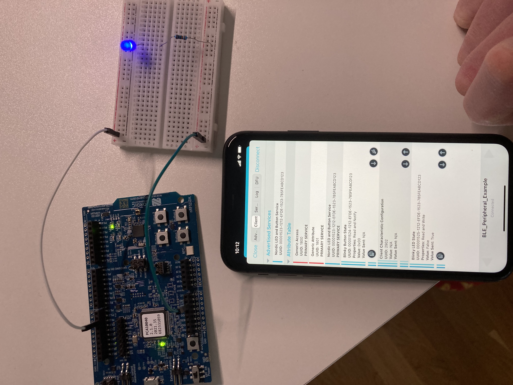

## Bluetooth Low Energy (BLE) Examples
This directory contains examples of using BLE.


### BLE Peripheral
This example is a copy of the ble_peripheral_blinky example from the nrs SDK
and modified to build from this directory. The requirement is that the
environment variable `SDK_ROOT ` be set to point to the SDK.

This example also uses an external LED which can be turned on and off using
nrf-connect.


#### Building
First the BLE protocol stack (SoftDevice s132) needs to be flashed to the device:
```console
$ make flash_device
```

Then we need to flash the application:
```console
$ make flash
```

Then we can open nrf-connect on a mobil phone and we should see a peripheral 
that is sending out advertisments with the name `BLE_Peripheral_Example` which
we should be able to connect to using nrf-connect.

Example of the advertisment send by the peripheral:


Example of the client tab in nrf-connect:


Example writing to the attribute:


The result of writing to the attribute (led turns on)



### Packet capturing with Ubertooth One and Wireshark

```console
$ ubertooth-btle -f -c /tmp/pipe 
...
ystime=1644247698 freq=2402 addr=8e89bed6 delta_t=23.874 ms rssi=-30
60 25 f6 6a 57 d2 47 ef 03 19 00 00 02 01 06 17 09 42 4c 45 5f 50 65 72 69 70 68 65 72 61 6c 5f 45 78 61 6d 70 6c 65 67 e0 9e 
Advertising / AA 8e89bed6 (valid)/ 37 bytes
    Channel Index: 37
    Type:  ADV_IND
    AdvA:  ef:47:d2:57:6a:f6 (random)
    AdvData: 03 19 00 00 02 01 06 17 09 42 4c 45 5f 50 65 72 69 70 68 65 72 61 6c 5f 45 78 61 6d 70 6c 65
        Type 19
            00 00
        Type 01 (Flags)
           00000110
               LE General Discoverable Mode
               BR/EDR Not Supported

        Type 09 (Complete Local Name)
           BLE_Peripheral_Example

    Data:  f6 6a 57 d2 47 ef 03 19 00 00 02 01 06 17 09 42 4c 45 5f 50 65 72 69 70 68 65 72 61 6c 5f 45 78 61 6d 70 6c 65
    CRC:   67 e0 9e
```
Open Wireshark, follow the instructions in
[Wireshark BlueTooth (Ubertooth One) packet capturing](wireshark-bluetooth-\(ubertooth-one\)-packet capturing)
and then use nrfConnect to connect to the peripheral and then turn on the LED
and then turn it off, followed by a disconnect. This should provide us with
some interesting packets to inspect.

Now n wireshark we can specify a display filter using the
'Access Address/AdvA' above:
```
bluetooth.dst == EF:47:D2:57:6A:F6 or bluetooth.src == EF:47:D2:57:6A:F6
```
Before we interact with the peripheral there will be a number of `AVD_IND`s
in wireshark:
```
Frame 1: 70 bytes on wire (560 bits), 70 bytes captured (560 bits) on interface /tmp/pipe, id 0
PPI version 0, 24 bytes
    Version: 0
    Flags: 0x00
    Header length: 24
    DLT: 251
    Reserved: 36750c0000620900fa63050023152200
Bluetooth
    [Source: ef:47:d2:57:6a:f6 (ef:47:d2:57:6a:f6)]
    [Destination: Broadcast (ff:ff:ff:ff:ff:ff)]
Bluetooth Low Energy Link Layer
    Access Address: 0x8e89bed6
    Packet Header: 0x2560 (PDU Type: ADV_IND, ChSel: #2, TxAdd: Random)
        .... 0000 = PDU Type: 0x0 ADV_IND
        ...0 .... = Reserved: 0
        ..1. .... = Channel Selection Algorithm: #2
        .1.. .... = Tx Address: Random
        0... .... = Reserved: 0
        Length: 37
    Advertising Address: ef:47:d2:57:6a:f6 (ef:47:d2:57:6a:f6)
    Advertising Data
        Appearance: Unknown
            Length: 3
            Type: Appearance (0x19)
            Appearance: Unknown (0x0000)
        Flags
            Length: 2
            Type: Flags (0x01)
            000. .... = Reserved: 0x0
            ...0 .... = Simultaneous LE and BR/EDR to Same Device Capable (Host): false (0x0)
            .... 0... = Simultaneous LE and BR/EDR to Same Device Capable (Controller): false (0x0)
            .... .1.. = BR/EDR Not Supported: true (0x1)
            .... ..1. = LE General Discoverable Mode: true (0x1)
            .... ...0 = LE Limited Discoverable Mode: false (0x0)
        Device Name: BLE_Peripheral_Example
            Length: 23
            Type: Device Name (0x09)
            Device Name: BLE_Peripheral_Example
    CRC: 0xe60779
```
Our phone which is running the nrfConnect app is the controller and the
periperal is our device running main.c. The peripheral is acting as a
broadcaster.

The central which again is the nrfConnect app on our phone will then issue
a connect request, `CONNECT_IND`:
```
Frame 532: 67 bytes on wire (536 bits), 67 bytes captured (536 bits) on interface /tmp/pipe, id 0
PPI version 0, 24 bytes
Bluetooth
    [Source: 5a:3e:6b:71:17:cc (5a:3e:6b:71:17:cc)]
    [Destination: ef:47:d2:57:6a:f6 (ef:47:d2:57:6a:f6)]
Bluetooth Low Energy Link Layer
    Access Address: 0x8e89bed6
    Packet Header: 0x22c5 (PDU Type: CONNECT_IND, TxAdd: Random, RxAdd: Random)
        .... 0101 = PDU Type: 0x5 CONNECT_IND
        ...0 .... = Reserved: 0
        ..0. .... = Reserved: 0
        .1.. .... = Tx Address: Random
        1... .... = Rx Address: Random
        Length: 34
    Initiator Address: 5a:3e:6b:71:17:cc (5a:3e:6b:71:17:cc)
    Advertising Address: ef:47:d2:57:6a:f6 (ef:47:d2:57:6a:f6)
    Link Layer Data
        Access Address: 0xaf9aa3a6
        CRC Init: 0x3bc312
        Window Size: 3 (3.75 msec)
        Window Offset: 13 (16.25 msec)
        Interval: 24 (30 msec)
        Latency: 0
        Timeout: 72 (720 msec)
        Channel Map: ffffffff1f
            .... ...1 = RF Channel 1 (2404 MHz - Data - 0): True
            .... ..1. = RF Channel 2 (2406 MHz - Data - 1): True
            .... .1.. = RF Channel 3 (2408 MHz - Data - 2): True
            .... 1... = RF Channel 4 (2410 MHz - Data - 3): True
            ...1 .... = RF Channel 5 (2412 MHz - Data - 4): True
            ..1. .... = RF Channel 6 (2414 MHz - Data - 5): True
            .1.. .... = RF Channel 7 (2416 MHz - Data - 6): True
            1... .... = RF Channel 8 (2418 MHz - Data - 7): True
            .... ...1 = RF Channel 9 (2420 MHz - Data - 8): True
            .... ..1. = RF Channel 10 (2422 MHz - Data - 9): True
            .... .1.. = RF Channel 11 (2424 MHz - Data - 10): True
            .... 1... = RF Channel 13 (2428 MHz - Data - 11): True
            ...1 .... = RF Channel 14 (2430 MHz - Data - 12): True
            ..1. .... = RF Channel 15 (2432 MHz - Data - 13): True
            .1.. .... = RF Channel 16 (2434 MHz - Data - 14): True
            1... .... = RF Channel 17 (2436 MHz - Data - 15): True
            .... ...1 = RF Channel 18 (2438 MHz - Data - 16): True
            .... ..1. = RF Channel 19 (2440 MHz - Data - 17): True
            .... .1.. = RF Channel 20 (2442 MHz - Data - 18): True
            .... 1... = RF Channel 21 (2444 MHz - Data - 19): True
            ...1 .... = RF Channel 22 (2446 MHz - Data - 20): True
            ..1. .... = RF Channel 23 (2448 MHz - Data - 21): True
            .1.. .... = RF Channel 24 (2450 MHz - Data - 22): True
            1... .... = RF Channel 25 (2452 MHz - Data - 23): True
            .... ...1 = RF Channel 26 (2454 MHz - Data - 24): True
            .... ..1. = RF Channel 27 (2456 MHz - Data - 25): True
            .... .1.. = RF Channel 28 (2458 MHz - Data - 26): True
            .... 1... = RF Channel 29 (2460 MHz - Data - 27): True
            ...1 .... = RF Channel 30 (2462 MHz - Data - 28): True
            ..1. .... = RF Channel 31 (2464 MHz - Data - 29): True
            .1.. .... = RF Channel 32 (2466 MHz - Data - 30): True
            1... .... = RF Channel 33 (2468 MHz - Data - 31): True
            .... ...1 = RF Channel 34 (2470 MHz - Data - 32): True
            .... ..1. = RF Channel 35 (2472 MHz - Data - 33): True
            .... .1.. = RF Channel 36 (2474 MHz - Data - 34): True
            .... 1... = RF Channel 37 (2476 MHz - Data - 35): True
            ...1 .... = RF Channel 38 (2478 MHz - Data - 36): True
            ..0. .... = Reserved: False
            .0.. .... = Reserved: False
            0... .... = Reserved: False
        ...0 1000 = Hop: 8
        001. .... = Sleep Clock Accuracy: 151 ppm to 250 ppm (1)
    CRC: 0xaa41c4
```

