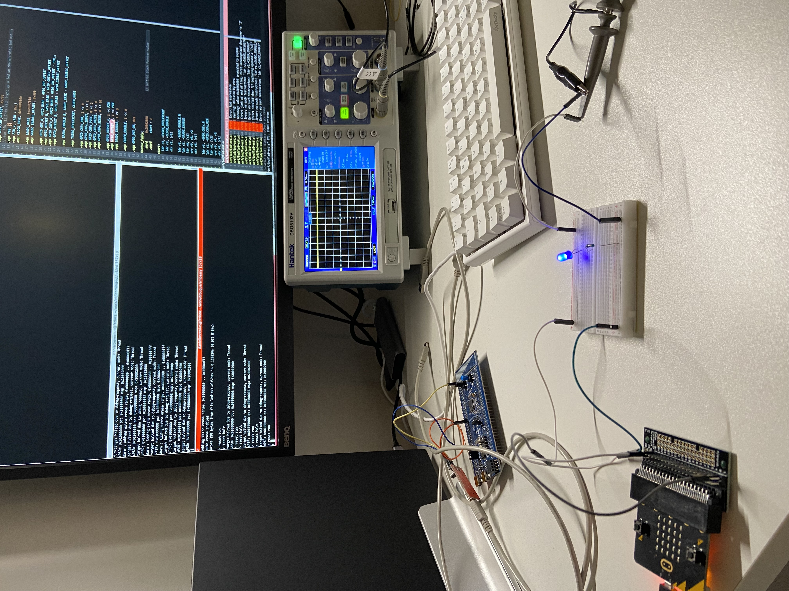
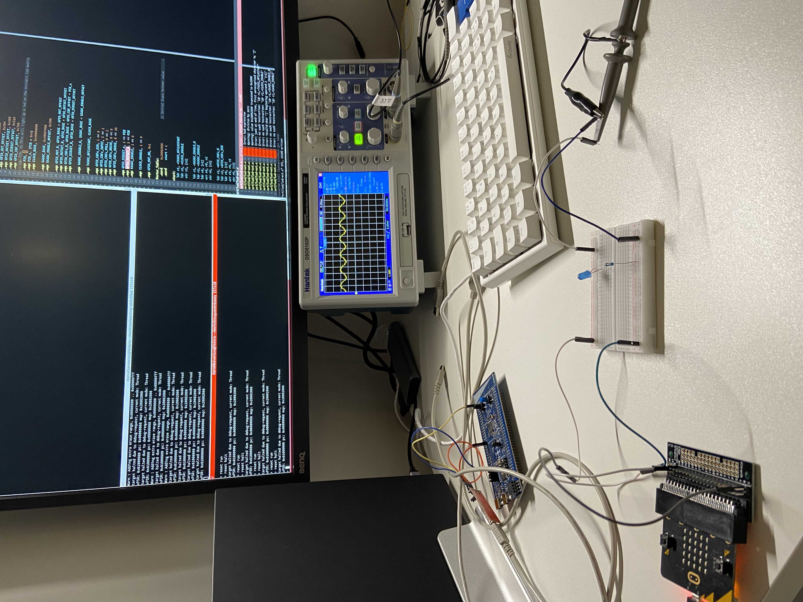
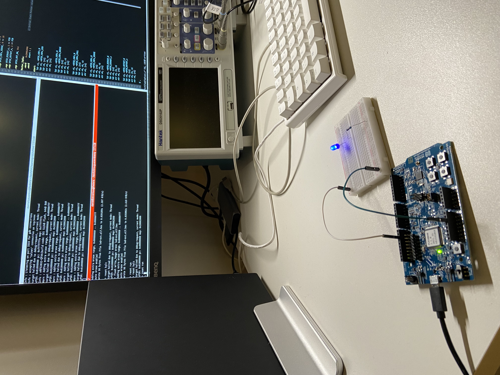

## LED examples
This directory contains assembly language examples related to LEDs.

### External LED with microbit board
This is an example of an external led blinking with a delay can be found in
[led-ext-microbit.s](./led-ext-microbid.s).

One thing that too me some time to understand was that the pins that the
microbit device uses do not directly map to the pins on the  nrf52833 MCU.
For example pin 0 on the microbit board is connected to pin P0.02.

This [link](https://tech.microbit.org/hardware/edgeconnector/) help me.

### Building
```console
$ make led-ext-microbit.elf
```

### Flashing
Start openocd:
```console
$ make openocd
```
Start a telnet session:
```console
$ telnet localhost 4444
Open On-Chip Debugger
> reset halt
> flash write_image erase led-ext-microbit.elf.hex
> reset run
```






### External LED with nrf52 development board
This is an example of an external led blinking with a delay can be found in
[led-ext.s](./led-ext.s).

### Building
```console
$ make led-ext-microbit.elf
```

### Flashing
Start openocd:
```console
$ make openocd_jlink
```

Start a telnet session:
```console
$ telnet localhost 4444
Open On-Chip Debugger
> reset halt
> flash write_image erase led-ext.elf.hex
> reset run
```


