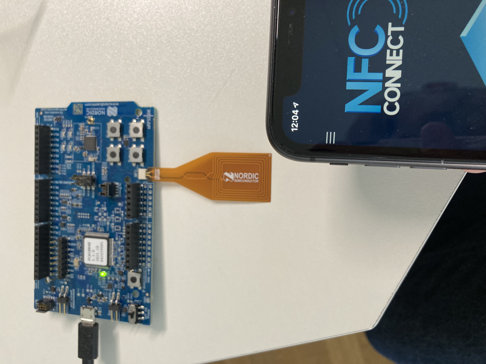
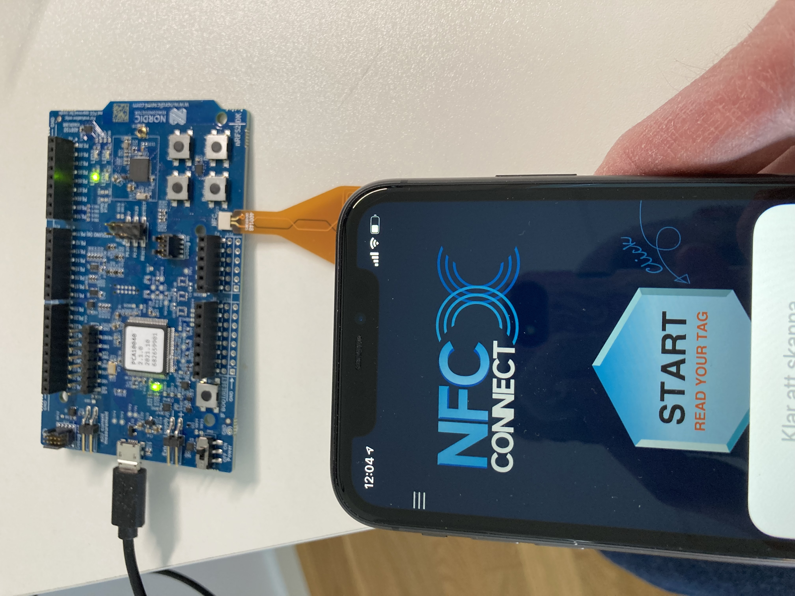
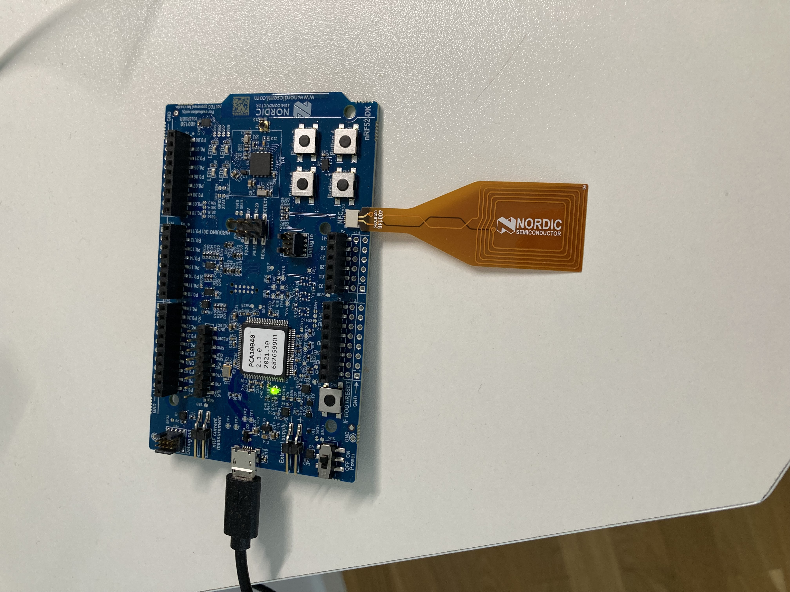

## Near Field Communication (NFC) examples
This directory contains assembly language examples related to NFC.

### NFC Reader example 
This example will turn on a LED on the development board when a NFC reader comes
into field (range) of the NRF antenna on the development board. When the reader
is move out of range the LED will turn off.

### Building
```console
$ make nfc.elf
```

### Flashing
Start openocd:
```console
$ make openocd_jlink
```
Start a telnet session:
```console
$ telnet localhost 4444
Open On-Chip Debugger
> reset halt
> flash write_image erase nfc.elf.hex
> reset run
```

Connect the NFC antenna to the NFC port as shown below:



Now use a NFC reader, I'm using NFC Connect and move the smart phone close to
NRC antenna and LED1 will turn on:



Moving the smart phone out of range will turn off LED1:

