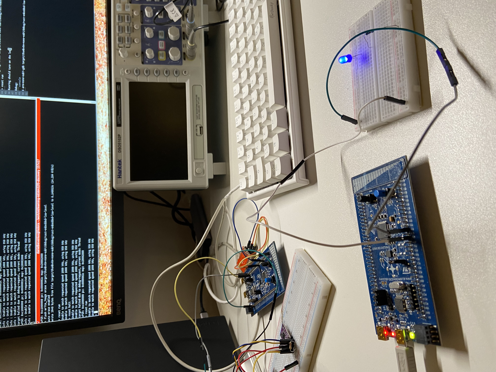

### Rust Embedded
This project's sole purpose is to understand and explore how Rust can be used
in the same way as was done in the
[led-ext.s](../stm32f0-discovery/led/led-ext.s) assembly language example. This
example intentionally does not use any external crates so that it is as close
as possible to the original example.

Like we needed with the assembly examples we have to specify a linker script:
```console
$ cargo rustc -- -C link-arg=-Tlinker-script.ld
```
This has been added to [config.toml](./cargo/config.toml) so we don't have to
type this every time we build.
We also have to set up the vector table which is done by the script and also
we have code in [main.rs](./src/main.rs) to handle this.

### Setup
The board I'm using is [STM32F0](https://www.st.com/en/microcontrollers-microprocessors/stm32f0-series.html)
which uses Cortex-M0 so we need to add this target to be able to cross compile:
```console
$ rustup target add thumbv6m-none-eabi
```

### Building
```console
$ cargo build -v
```

### Flashing and Running
Start openocd:
```console
$ openocd -f board/stm32f0discovery.cfg
```

Start a telnet session:
```console
$ telnet localhost 4444
```

Flash the program:
```console
> reset halt
> flash write_image erase target/thumbv6m-none-eabi/debug/rust-low-level
> reset run
```
Running should turn on the led:



Debug:
```console
$ arm-none-eabi-gdb target/thumbv6m-none-eabi/debug/rust-low-level
```
