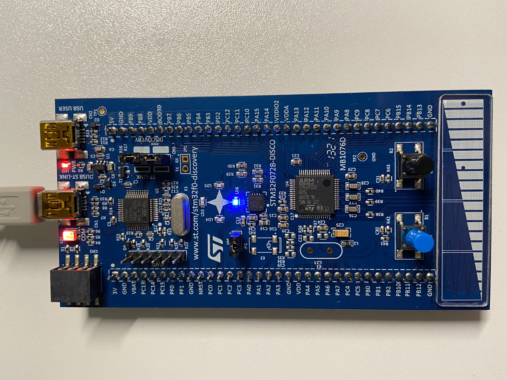

### Assembly GPIO example
So the goal of this example is to turn on a LED on the bord. The board I'm using
is stm32f0-discovery:

[Product documentation](https://www.st.com/en/evaluation-tools/32f072bdiscovery.html#documentation)  
[User Manual](https://www.st.com/resource/en/user_manual/um1690-discovery-kit-for-stm32f0-series-microcontrollers-with-stm32f072rb-stmicroelectronics.pdf)

This board is based on a STM32F072RBT6 so we will need its 
[reference manual](https://www.st.com/resource/en/reference_manual/rm0091-stm32f0x1stm32f0x2stm32f0x8-advanced-armbased-32bit-mcus-stmicroelectronics.pdf) as well.


There are four LEDs on this board which we can turn on and we can choose one.
There are details about these LEDs on page 14 of the above user manual:
```
                           LED3
                      LED4      LED5
                           LED6

* User LD3: This red user LED is connected to the I/O PC6
* User LD4: This orange user LED is connected to the I/O PC8
* User LD5: This green user LED is connected to the I/O PC9
* User LD6: This blue user LED is connected to the I/O PC7
```
So we can see that we need to access PORT C and then a PIN on that port.
So we can see that all these PINs are connected to PORT C.

The steps we need to go through to write to one of these pins are the following:
* Enable I/O PORT C clock
* Set the Mode (the direction which is output in our case) (GPIOx_MODER)
* Set the bit to be written (GPIOC_ODR)

#### AHB peripheral clock enable
This register is at an offset from RCC (think of this as if rcc is a struct and
we are accessing a member like rcc->ahbenr but instead we are using addition
explicitly where the first term is the RCC_BASE and the second term is 0x14)

```
6.4.6 AHB peripheral clock enable register (RCC_AHBENR)
Address offset: 0x14
...
Bit 19 IOPCEN: I/O port C clock enable
Set and cleared by software.
  0: I/O port C clock disabled
  1: I/O port C clock enabled
```
Notice that bit 19 is the bit for controlling PORT C clock enabling, and if we
write a 1 into that position we are enabling it. 

So we also need to find the address of the Reset and Clock Control register
(RCC) which can be found in the Memory Map section:
```
0x4002 1000 - 0x4002 13FF 1 KB RCC
...
```
So our RCC_AHB1 would be 0x4002100 + 0x14. In the [led.s](./led.s) example we
use symbolic names for these values.

So we need to find the address of PORT C. To do this we look in the reference
manual on page 38 there is a table with a Memory Map (same table as we used 
previously):
```
...
0x4800 0800 - 0x4800 0BFF 1KB GPIOC
...
```
Next we need to set the Mode to output
```
8.4.1 GPIO port mode register (GPIOx_MODER) (x =A..F)
Address offset:0x00

Bits 2y+1:2y MODERy[1:0]: Port x configuration bits (y = 0..15)
These bits are written by software to configure the I/O mode.
  00: Input mode (reset state)
  01: General purpose output mode
  10: Alternate function mode
  11: Analog mode
```
This register is at an offset of `0x00`from `CPIOC`. Using this address we can
then set the output mode `01` of the pin we are interested in. Notice that there
are two bits per PIN and the register is 32 bits, that leaves 15 pins. And we
noted above that the pins of the LEDs are 6, 7, 8, and pin 9. So if we want to
set PIN 6 to output mode we have to write a 1 in bit position 12.

With the mode set we now need to write the data using Output Data Register
(ODR):
```
8.4.6 GPIO port output data register (GPIOx_ODR) (x = A..F)
Address offset: 0x14

Bits 31:16 Reserved, must be kept at reset value.
Bits 15:0 ODRy: Port output data bit (y = 0..15)
  These bits can be read and written by software
```
Again this is a register offset from the GPIOC base register and we set the pin
that we are interested in writing, one of pin 6, 7, 8, or pin 9. Just note that
if you want to change the led or enable more we also have to set the Mode for
those or nothing will happen.


### Building
```console
$ make led.elf
```

### Flashing
```console
$ make openocd
```
From a new terminal (as the first terminal will be running the openocd server)
and it is good to keep that visible so you can see the commands being executed)

```console
$ telnet localhost 4444
Trying ::1...
telnet: connect to address ::1: Connection refused
Trying 127.0.0.1...
Connected to localhost.
Escape character is '^]'.
Open On-Chip Debugger
> reset halt
> flash write_image erase main.hex
> reset run
> CTRL+]
telnet> quit
```




### Debugging
If you don't have `arm-none-eabi-gdb` installed please follow the
[instructions](https://developer.arm.com/tools-and-software/open-source-software/developer-tools/gnu-toolchain/gnu-rm/downloads)
to install it and setup the correct PATH.

openocd need to be running:
```console
$ make openocd
openocd -f board/stm32f0discovery.cfg
Open On-Chip Debugger 0.11.0
Licensed under GNU GPL v2
For bug reports, read
	http://openocd.org/doc/doxygen/bugs.html
Info : The selected transport took over low-level target control. The results might differ compared to plain JTAG/SWD
srst_only separate srst_nogate srst_open_drain connect_deassert_srst

Info : Listening on port 6666 for tcl connections
Info : Listening on port 4444 for telnet connections
Info : clock speed 1000 kHz
Info : STLINK V2J36S0 (API v2) VID:PID 0483:3748
Info : Target voltage: 2.931101
Info : stm32f0x.cpu: hardware has 4 breakpoints, 2 watchpoints
Info : starting gdb server for stm32f0x.cpu on 3333
Info : Listening on port 3333 for gdb connections
```
And then in a new terminal run gdb:
```console
$ arm-none-eabi-gdb
GNU gdb (GNU Arm Embedded Toolchain 10.3-2021.10) 10.2.90.20210621-git
(gdb) target extended-remote 127.0.0.1:3333
(gdb) monitor reset halt
(gdb) symbol-file main.elf
(gdb) b start
```
