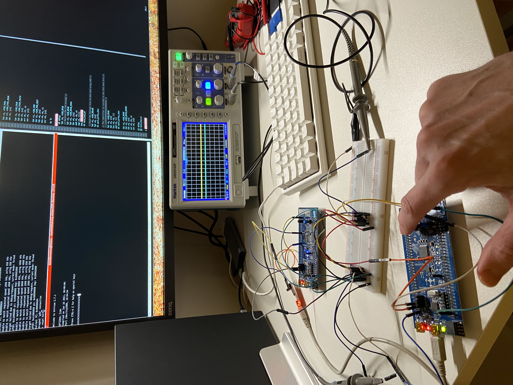
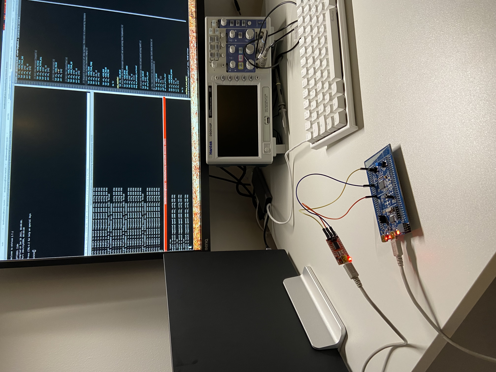

## Controller Area Network (CAN)
This directory contains assembly language examples related to CAN.


### CAN Controller/Peripheral example
This examples uses two stm32 boards and two CAN transceivers to enable the
transmission of data from the controller, [can-c.s](./can-c.s) to the
peripheral, [can-p.s](./can-p.s).

#### Building
```console
$ make can-c.elf can-p.elf
```

#### Flash and Run the peripheral
Connect the USB micro cable to the STM32 ST-LINK port on the board that is
going to be used as the peripheral.

Start openocd:
```console
$ make openocd
```

Start a telnet session:
```console
$ telnet localhost 4444
```

Flash the program:
```console
> reset halt 
> flash write_image erase can-p.elf.hex
> reset run
```

#### Flash and Run the controller
Connect the USB micro cable to the STM32 ST-LINK port on the board that is
going to be used as the controller.

Start openocd:
```console
$ make openocd
```

Start a telnet session:
```console
$ telnet localhost 4444
```

Flash the program:
```console
> reset halt
> flash write_image erase can-c.elf.hex
> reset run
```

Start `minicom`:
```console
$ minicom --baudrate 115200 --device /dev/ttyUSB0
```

Next press the reset button on the controller board and 'A7' should be displayed
in minicom. The A is the data sent to the CAN bus and 7 is the identifier of the
CAN frame.




### CAN loopback example
This example can be run without any external transceiver or wires connected
(wires for CAN that is) and use the CAN loopback to send and receive data. The
received data is then sent using UART so that it can be inspected using minicom.

#### Building
```console
$ make can-loopback.elf
```

#### Flash and Run
First start openocd:
```console
$ make openocd
```

Start a telnet session:
```console
$ telnet localhost 4444
```

Flash the program:
```console
> reset halt
> flash write_image erase can-loopback.elf.hex
```

Start `minicom`:
```console
$ minicom --baudrate 115200 --device /dev/ttyUSB0
```
Next press the reset button and 'A7' should be displayed in minicom. The A is
the data sent to the CAN bus and 7 is the identifier of the CAN frame.


