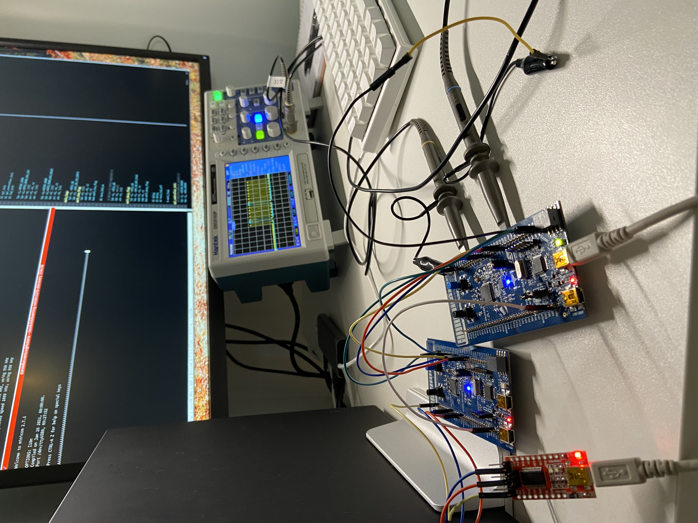

## Serial Peripheral Interface (SPI)
This directory contains assembly language examples related to SPI.


### SPI Controller/Peripheral example
This example for consists of two discovery boards connected to each other,
where [spi-c.s](./spi-c.s) is the controller which sends a character
(currently `A`) to [spi-p.s](./spi-p.s) which is the peripheral. The peripheral
then uses UART to send that character out which can be displayed using minicom.

#### Building
```console
$ make spi-c.elf spi-p.elf
```

#### Flash and Run the peripheral
Connect the USB micro cable to the STM32 ST-LINK port on the board that is
going to be used as the peripheral.

Start openocd:
```console
$ make openocd
```

Start a telnet session:
```console
$ telnet localhost 4444
```

Flash the program:
```console
> reset halt 
> flash write_image erase spi-p.elf.hex
> reset run
```

#### Flash and Run the controller
Connect the USB micro cable to the STM32 ST-LINK port on the board that is
going to be used as the controller.

Start openocd:
```console
$ make openocd
```

Start a telnet session:
```console
$ telnet localhost 4444
```

Flash the program:
```console
> reset halt
> flash write_image erase spi-c.elf.hex
> reset run
```

Start `minicom`:
```console
$ minicom --baudrate 115200 --device /dev/ttyUSB0
```

Next press the reset button on the controller board and 'A7' should be displayed
in minicom:


