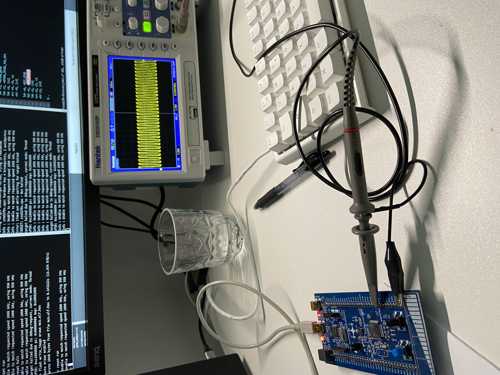
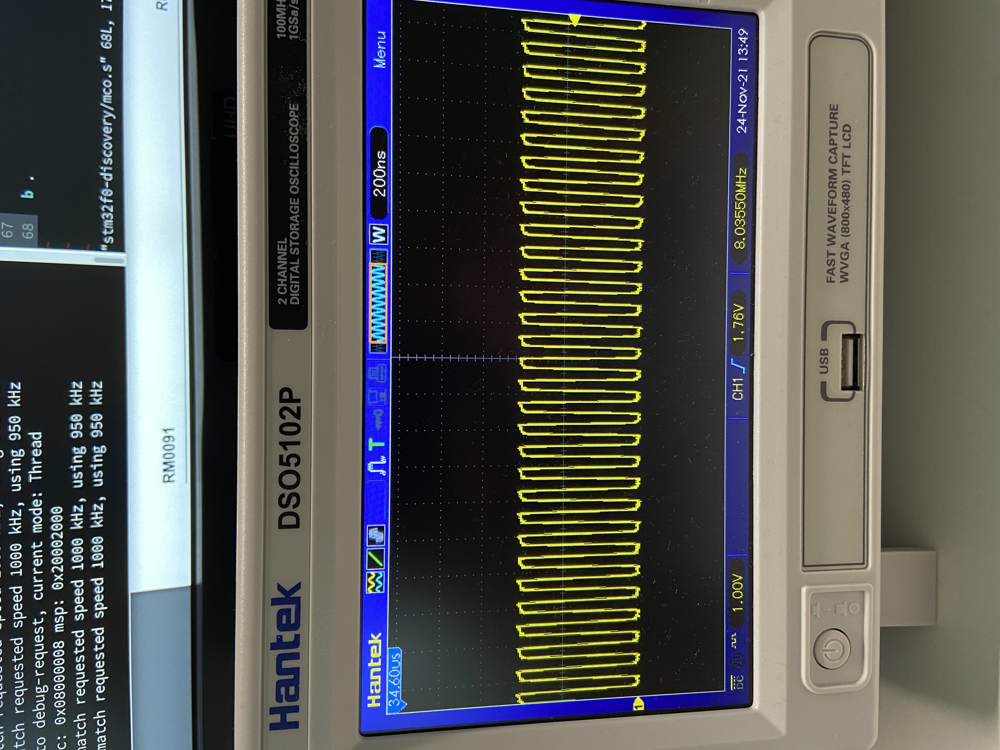

## Timer examples
This directory contains assembly language examples related to timers.

### SYSTick example
This example shows how SYTTick can be used to implement a timer.

#### Building
```console
$ make systick.elf
```

#### Flash and Run the peripheral
Start openocd:
```console
$ make openocd
```

Start a telnet session:
```console
$ telnet localhost 4444
```

Flash the program:
```console
> reset halt 
> flash write_image erase systick.elf.hex
> reset run
```
This example will blink an LED with a certain time interval.

### SYSTick interrupt example
This is similar to the above example except that used an interrupt handler to
perform the action of toggling the LED on and off.

#### Building
```console
$ make systickint.elf
```

#### Flash and Run the peripheral
Start openocd:
```console
$ make openocd
```

Start a telnet session:
```console
$ telnet localhost 4444
```

Flash the program:
```console
> reset halt 
> flash write_image erase systickint.elf.hex
> reset run
```
This example will blink an LED with a certain time interval.

### General Timer example
This is similar to the above example except that used a general purpose Timer.

#### Building
```console
$ make tim2.elf
```

#### Flash and Run the peripheral
Start openocd:
```console
$ make openocd
```

Start a telnet session:
```console
$ telnet localhost 4444
```

Flash the program:
```console
> reset halt 
> flash write_image erase tim2.elf.hex
> reset run
```
This example will blink an LED with a certain time interval.

### Micro controller Clock Output (MC0) Example
This example allows an oscilloscope to be connected to PA8 and see the
frequency of the clock:

#### Building
```console
$ make mco.elf
```

#### Flash and Run
Start openocd:
```console
$ make openocd
```

Start a telnet session:
```console
$ telnet localhost 4444
```

Flash the program:
```console
> reset halt 
> flash write_image erase mco.elf.hex
> reset run
```



Here we can see that we are running at 8Mhz:

