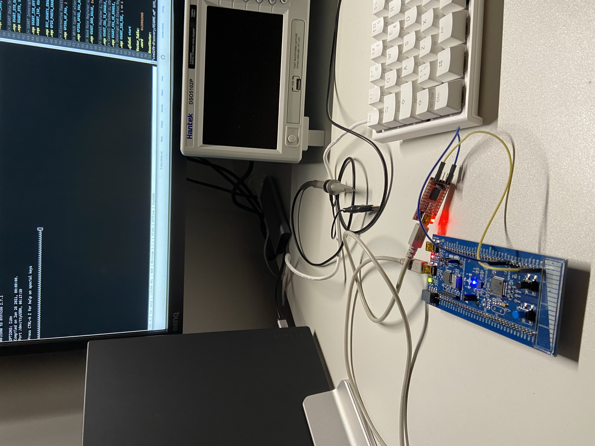
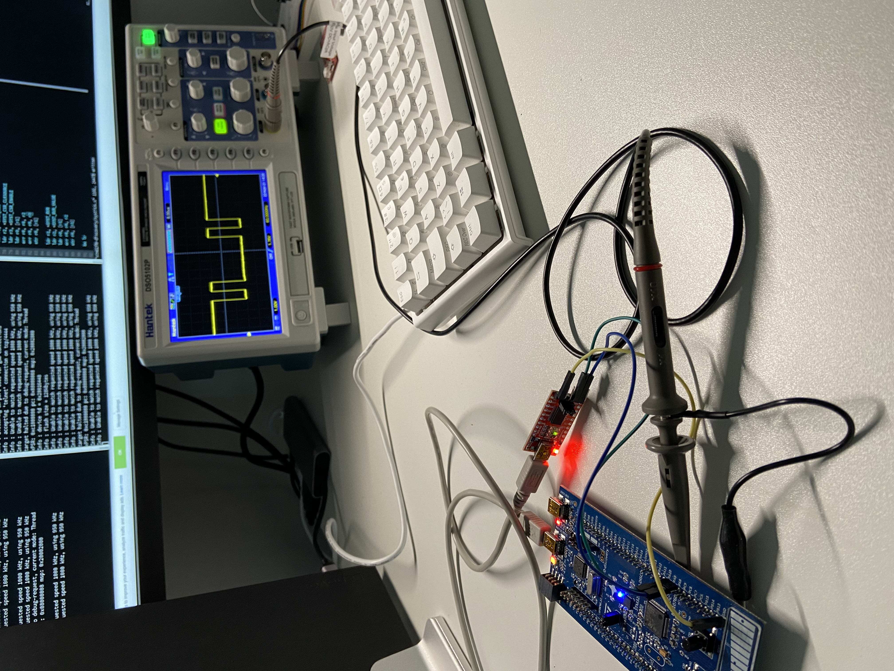
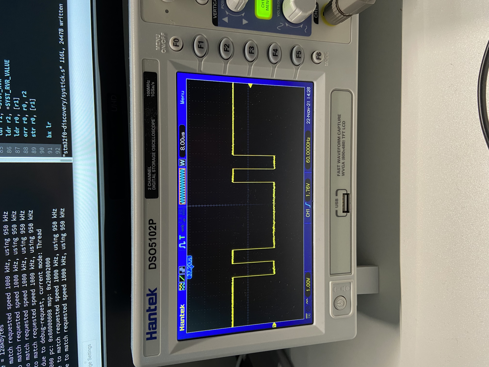

## Universal Asynchonous Receiver/Transmitter (UART)
This directory contains assembly language examples related to UART.

### UART Transmit example
This example shows how UART can be used to transmit.

#### Building
```console
$ make uart-tx-sync.elf
```

#### Flash and Run the peripheral
Start openocd:
```console
$ make openocd
```

Start a telnet session:
```console
$ telnet localhost 4444
```

Flash the program:
```console
> reset halt 
> flash write_image erase uart-tx-sync.elf.hex
> reset run
```

Start `minicom`:
```console
$ minicom -D /dev/ttyUSB0 -b 115200 -8 
```
4) Run the executable
```console
> reset run
```

This should now output a number of `A`s in the minicom terminal window:
```console
Welcome to minicom 2.7.1

OPTIONS: I18n
Compiled on Jan 26 2021, 00:00:00.
Port /dev/ttyUSB0, 05:25:03

Press CTRL-A Z for help on special keys

AAAAAAAAAAAAAAAAAAAAAAAAAAAAAAAAAAAAAAA
```



Using an oscillooscope I've been able to capture the square wave for this
transmission:


Notice that the signal is at 5V to start with when there is no trasmission and
then a start bit. The start bit is followed by the first bit of the data which
is high which represents a 1, this is then followed by 5 low signals, and
finally another high signal which produces `1000001` which is 41h, 65d, and
1000001b and the the stop bit:



### UART Receive Example
This example is similar to the previous one but instead of synchronously
transmitting we will be receiving data. 

#### Building
```console
$ make uart-rx-sync.elf
```

#### Flash and Run the peripheral
Start openocd:
```console
$ make openocd
```

Start a telnet session:
```console
$ telnet localhost 4444
```

Flash the program:
```console
> reset halt 
> flash write_image erase uart-rx-sync.elf.hex
> reset run
```

Start `minicom`:
```console
$ minicom -D /dev/ttyUSB0 -b 115200 -8 
```
4) Run the executable
```console
> reset run
```
If you type a character in the openocd terminal it will be echoed back, and the
blue led on the board will light up, plus the rx led on the serial board will
also indicate the transmission (and the sending too).
